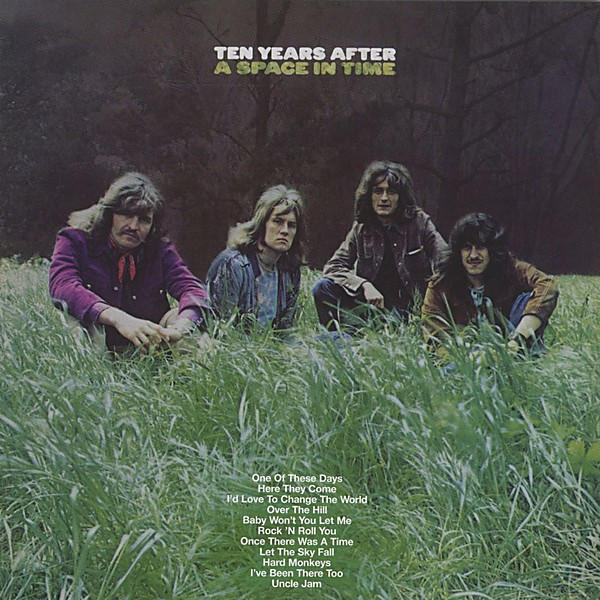

# A Space in Time

By **Ten Years After**

## Album Data

- **Catalog:** Beets
- **Format:** Digital, Album
- **Album:** A Space in Time
- **Artist:** Ten Years After
- **Albumartist:** Ten Years After
- **Genre:** Hard Rock
- **MusicBrainz Album Artist ID:** [73faa89a-ee00-4e40-b68e-80e4891dbc45](https://musicbrainz.org/artist/73faa89a-ee00-4e40-b68e-80e4891dbc45)
- **MusicBrainz Album ID:** [67eb70cc-b504-4421-bc9b-6593d26d576b](https://musicbrainz.org/release/67eb70cc-b504-4421-bc9b-6593d26d576b)
- **MusicBrainz Release Group ID:** [bb46777f-f2ab-347f-abc1-1f9cb1903882](https://musicbrainz.org/release-group/bb46777f-f2ab-347f-abc1-1f9cb1903882)
- **Year:** 1971
- **Catalog #:** 
- **Label:** Collectables
- **Total Tracks:** 08

## Album Tracks

### Track 01 - Sugar the Road

- **Artist:** Ten Years After
- **Format:** MP3
- **Genre:** British Blues
- **Length:** 4:08
- **MusicBrainz Track ID:** [c5efaff2-20eb-4381-9591-7f49110bcf33](https://musicbrainz.org/recording/c5efaff2-20eb-4381-9591-7f49110bcf33)
- **Title:** Sugar the Road
- **Track:** 01
- **Year:** 2007

### Track 02 - Working on the Road

- **Artist:** Ten Years After
- **Format:** MP3
- **Genre:** Hard Rock
- **Length:** 4:19
- **MusicBrainz Track ID:** [f3ca0bfc-dfc7-41c9-8ca3-fdcee6fa0481](https://musicbrainz.org/recording/f3ca0bfc-dfc7-41c9-8ca3-fdcee6fa0481)
- **Title:** Working on the Road
- **Track:** 02
- **Year:** 2007

### Track 03 - 50,000 Miles Beneath My Brain

- **Artist:** Ten Years After
- **Format:** MP3
- **Genre:** British Blues
- **Length:** 7:42
- **MusicBrainz Track ID:** [4541cdad-edfd-4fc6-ad23-1b669f4d15ae](https://musicbrainz.org/recording/4541cdad-edfd-4fc6-ad23-1b669f4d15ae)
- **Title:** 50,000 Miles Beneath My Brain
- **Track:** 03
- **Year:** 2007

### Track 04 - Year 3,000 Blues

- **Artist:** Ten Years After
- **Format:** MP3
- **Genre:** British Blues
- **Length:** 2:26
- **MusicBrainz Track ID:** [0188c7ce-6329-4871-9866-73fd89a05be3](https://musicbrainz.org/recording/0188c7ce-6329-4871-9866-73fd89a05be3)
- **Title:** Year 3,000 Blues
- **Track:** 04
- **Year:** 2007

### Track 05 - Me and My Baby

- **Artist:** Ten Years After
- **Format:** MP3
- **Genre:** Boogie
- **Length:** 4:09
- **MusicBrainz Track ID:** [d8a191e5-347f-438d-9622-4ee85cd589d4](https://musicbrainz.org/recording/d8a191e5-347f-438d-9622-4ee85cd589d4)
- **Title:** Me and My Baby
- **Track:** 05
- **Year:** 2007

### Track 06 - Love Like a Man

- **Artist:** Ten Years After
- **Format:** MP3
- **Genre:** Hard Rock
- **Length:** 7:41
- **MusicBrainz Track ID:** [64ff1ab2-c180-4479-81fa-29274ada640b](https://musicbrainz.org/recording/64ff1ab2-c180-4479-81fa-29274ada640b)
- **Title:** Love Like a Man
- **Track:** 06
- **Year:** 2007

### Track 07 - Circles

- **Artist:** Ten Years After
- **Format:** MP3
- **Genre:** Hard Rock
- **Length:** 4:01
- **MusicBrainz Track ID:** [70e38f62-9145-476a-9c51-fb77f70a4aab](https://musicbrainz.org/recording/70e38f62-9145-476a-9c51-fb77f70a4aab)
- **Title:** Circles
- **Track:** 07
- **Year:** 2007

### Track 08 - As the Sun Still Burns Away

- **Artist:** Ten Years After
- **Format:** MP3
- **Genre:** Psychedelic Rock
- **Length:** 4:43
- **MusicBrainz Track ID:** [be6d7e19-7df4-4931-a35f-c809a60d6d4e](https://musicbrainz.org/recording/be6d7e19-7df4-4931-a35f-c809a60d6d4e)
- **Title:** As the Sun Still Burns Away
- **Track:** 08
- **Year:** 2007

## See also

- [Cricklewood Green](Cricklewood_Green.md)
- [Rock & Roll Music to the World](Rock_and_Roll_Music_to_the_World.md)
- [Stonedhenge](Stonedhenge.md)
- [Undead](Undead.md)
- [CD: A Space In Time](../../CD/Ten_Years_After/A_Space_In_Time.md)
- [CD: ](../../CD/Ten_Years_After/Ten_Years_After.md)
- [Roon: A Space in Time (Deluxe Version)](../../Roon/Ten_Years_After/A_Space_in_Time_Deluxe_Version.md)
- [Roon: Cricklewood Green (2017 Remaster)](../../Roon/Ten_Years_After/Cricklewood_Green_2017_Remaster.md)
- [Roon: Rock & Roll Music to the World (2017 Remaster)](../../Roon/Ten_Years_After/Rock_and_Roll_Music_to_the_World_2017_Remaster.md)
- [Roon: Ten Years After (Re-Presents)](../../Roon/Ten_Years_After/Ten_Years_After_Re-Presents.md)
- [Roon: Undead (Re-Presents / Live)](../../Roon/Ten_Years_After/Undead_Re-Presents_-_Live.md)
- [Vinyl: Rock & Roll Music To The World](../../Vinyl/Ten_Years_After/Rock_and_Roll_Music_To_The_World.md)
- [Vinyl: ](../../Vinyl/Ten_Years_After/Ten_Years_After.md)
