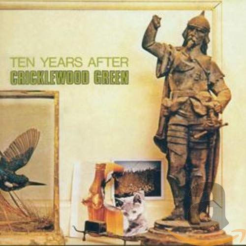

# Cricklewood Green

By **Ten Years After**

## Album Data

- **Catalog:** Beets
- **Format:** Digital, Album
- **Album:** Cricklewood Green
- **Artist:** Ten Years After
- **Albumartist:** Ten Years After
- **Genre:** Hard Rock
- **MusicBrainz Album Artist ID:** [73faa89a-ee00-4e40-b68e-80e4891dbc45](https://musicbrainz.org/artist/73faa89a-ee00-4e40-b68e-80e4891dbc45)
- **MusicBrainz Album ID:** [078ea0f6-6180-38c7-a5fd-1240987744fe](https://musicbrainz.org/release/078ea0f6-6180-38c7-a5fd-1240987744fe)
- **MusicBrainz Release Group ID:** [0a62fbfc-7f7f-3035-8108-c48e3a49466b](https://musicbrainz.org/release-group/0a62fbfc-7f7f-3035-8108-c48e3a49466b)
- **Year:** 2007
- **Catalog #:** AFZ 142
- **Label:** Audio Fidelity
- **Total Tracks:** 09

## Album Tracks

### Track 01 - You Give Me Loving

- **Artist:** Ten Years After
- **Format:** MP3
- **Genre:** Rock
- **Length:** 6:31
- **MusicBrainz Track ID:** [8fa8f6ed-4357-4fb1-a6e9-1c801660da70](https://musicbrainz.org/recording/8fa8f6ed-4357-4fb1-a6e9-1c801660da70)
- **Title:** You Give Me Loving
- **Track:** 01
- **Year:** 2012

### Track 02 - Convention Prevention

- **Artist:** Ten Years After
- **Format:** MP3
- **Genre:** Psychedelic Rock
- **Length:** 4:22
- **MusicBrainz Track ID:** [7d1a88ac-9c86-4464-9d67-8888c71f8bd5](https://musicbrainz.org/recording/7d1a88ac-9c86-4464-9d67-8888c71f8bd5)
- **Title:** Convention Prevention
- **Track:** 02
- **Year:** 2012

### Track 03 - Turned Off T.V. Blues

- **Artist:** Ten Years After
- **Format:** MP3
- **Genre:** Blues
- **Length:** 5:12
- **MusicBrainz Track ID:** [41571f57-0ef9-42ca-a8f5-608d87f333b0](https://musicbrainz.org/recording/41571f57-0ef9-42ca-a8f5-608d87f333b0)
- **Title:** Turned Off T.V. Blues
- **Track:** 03
- **Year:** 2012

### Track 04 - Standing at the Station

- **Artist:** Ten Years After
- **Format:** MP3
- **Genre:** Progressive Rock
- **Length:** 7:08
- **MusicBrainz Track ID:** [847fdb71-fbaf-46db-ab7c-23e11166e21a](https://musicbrainz.org/recording/847fdb71-fbaf-46db-ab7c-23e11166e21a)
- **Title:** Standing at the Station
- **Track:** 04
- **Year:** 2012

### Track 05 - You Can’t Win Them All

- **Artist:** Ten Years After
- **Format:** MP3
- **Genre:** Hard Rock
- **Length:** 4:05
- **MusicBrainz Track ID:** [dc5ec25b-4553-44f4-8d1c-df1ba83e52e4](https://musicbrainz.org/recording/dc5ec25b-4553-44f4-8d1c-df1ba83e52e4)
- **Title:** You Can’t Win Them All
- **Track:** 05
- **Year:** 2012

### Track 06 - Religion

- **Artist:** Ten Years After
- **Format:** MP3
- **Genre:** Blues
- **Length:** 5:50
- **MusicBrainz Track ID:** [c90345a3-d796-4ffd-aa7b-9543545ccc3c](https://musicbrainz.org/recording/c90345a3-d796-4ffd-aa7b-9543545ccc3c)
- **Title:** Religion
- **Track:** 06
- **Year:** 2012

### Track 07 - Choo Choo Mama

- **Artist:** Ten Years After
- **Format:** MP3
- **Genre:** Rock
- **Length:** 4:02
- **MusicBrainz Track ID:** [6cb35f9b-e777-4a92-8e18-3010c4e010b0](https://musicbrainz.org/recording/6cb35f9b-e777-4a92-8e18-3010c4e010b0)
- **Title:** Choo Choo Mama
- **Track:** 07
- **Year:** 2012

### Track 08 - Tomorrow I’ll Be Out of Town

- **Artist:** Ten Years After
- **Format:** MP3
- **Genre:** Hard Rock
- **Length:** 4:26
- **MusicBrainz Track ID:** [deca21bb-89ec-4670-a94a-4668a17b1bb5](https://musicbrainz.org/recording/deca21bb-89ec-4670-a94a-4668a17b1bb5)
- **Title:** Tomorrow I’ll Be Out of Town
- **Track:** 08
- **Year:** 2012

### Track 09 - Rock & Roll Music to the World

- **Artist:** Ten Years After
- **Format:** MP3
- **Genre:** Rock
- **Length:** 3:49
- **MusicBrainz Track ID:** [4174e436-e50c-493f-8c93-6ffe1591abce](https://musicbrainz.org/recording/4174e436-e50c-493f-8c93-6ffe1591abce)
- **Title:** Rock & Roll Music to the World
- **Track:** 09
- **Year:** 2012

## See also

- [A Space in Time](A_Space_in_Time.md)
- [Rock & Roll Music to the World](Rock_and_Roll_Music_to_the_World.md)
- [Stonedhenge](Stonedhenge.md)
- [Undead](Undead.md)
- [CD: A Space In Time](../../CD/Ten_Years_After/A_Space_In_Time.md)
- [CD: ](../../CD/Ten_Years_After/Ten_Years_After.md)
- [Roon: A Space in Time (Deluxe Version)](../../Roon/Ten_Years_After/A_Space_in_Time_Deluxe_Version.md)
- [Roon: Cricklewood Green (2017 Remaster)](../../Roon/Ten_Years_After/Cricklewood_Green_2017_Remaster.md)
- [Roon: Rock & Roll Music to the World (2017 Remaster)](../../Roon/Ten_Years_After/Rock_and_Roll_Music_to_the_World_2017_Remaster.md)
- [Roon: Ten Years After (Re-Presents)](../../Roon/Ten_Years_After/Ten_Years_After_Re-Presents.md)
- [Roon: Undead (Re-Presents / Live)](../../Roon/Ten_Years_After/Undead_Re-Presents_-_Live.md)
- [Vinyl: Rock & Roll Music To The World](../../Vinyl/Ten_Years_After/Rock_and_Roll_Music_To_The_World.md)
- [Vinyl: ](../../Vinyl/Ten_Years_After/Ten_Years_After.md)
