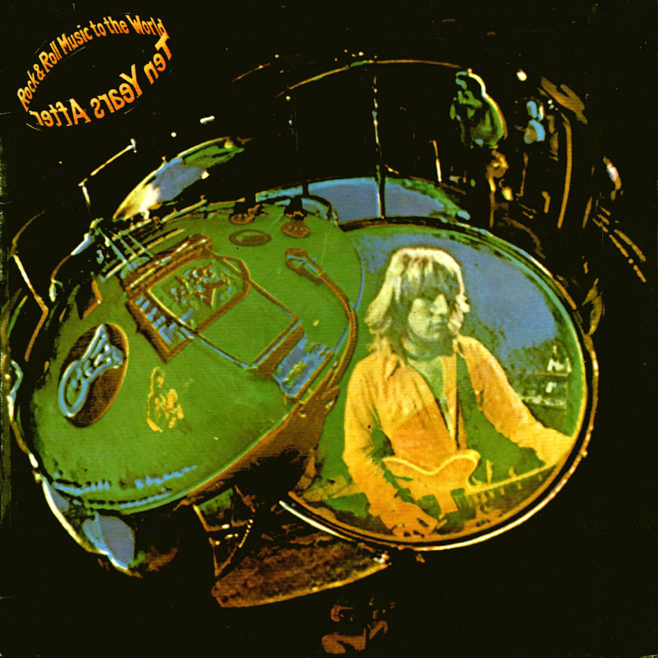

# Rock & Roll Music to the World

By **Ten Years After**

## Album Data

- **Catalog:** Beets
- **Format:** Digital, Album
- **Album:** Rock & Roll Music to the World
- **Artist:** Ten Years After
- **Albumartist:** Ten Years After
- **Genre:** Hard Rock
- **MusicBrainz Album Artist ID:** [73faa89a-ee00-4e40-b68e-80e4891dbc45](https://musicbrainz.org/artist/73faa89a-ee00-4e40-b68e-80e4891dbc45)
- **MusicBrainz Album ID:** [d7df2849-abac-4d9c-a6ee-8f92c544166b](https://musicbrainz.org/release/d7df2849-abac-4d9c-a6ee-8f92c544166b)
- **MusicBrainz Release Group ID:** [422b969e-81f1-39ab-af7a-e1e9d07a7935](https://musicbrainz.org/release-group/422b969e-81f1-39ab-af7a-e1e9d07a7935)
- **Year:** 2012
- **Catalog #:** 472 644-6
- **Label:** Deram
- **Total Tracks:** 26

## Album Tracks

### Track 01 - Going to Try

- **Artist:** Ten Years After
- **Format:** ALAC
- **Genre:** Rock
- **Length:** 4:46
- **MusicBrainz Track ID:** [78f02789-ff4b-4b7a-bf6a-677edf954199](https://musicbrainz.org/recording/78f02789-ff4b-4b7a-bf6a-677edf954199)
- **Title:** Going to Try
- **Track:** 01
- **Year:** 2015

### Track 02 - I Can’t Live Without Lydia

- **Artist:** Ten Years After
- **Format:** ALAC
- **Genre:** British Blues
- **Length:** 1:24
- **MusicBrainz Track ID:** [f971f85b-a397-494a-b518-6daf96f20ea9](https://musicbrainz.org/recording/f971f85b-a397-494a-b518-6daf96f20ea9)
- **Title:** I Can’t Live Without Lydia
- **Track:** 02
- **Year:** 2015

### Track 03 - Woman Trouble

- **Artist:** Ten Years After
- **Format:** ALAC
- **Genre:** Rock
- **Length:** 4:35
- **MusicBrainz Track ID:** [95cb43ff-c125-44ba-bbec-0737b27f18b8](https://musicbrainz.org/recording/95cb43ff-c125-44ba-bbec-0737b27f18b8)
- **Title:** Woman Trouble
- **Track:** 03
- **Year:** 2015

### Track 04 - Skoobly‐Oobly‐Doobob

- **Artist:** Ten Years After
- **Format:** ALAC
- **Genre:** Hard Rock
- **Length:** 1:36
- **MusicBrainz Track ID:** [2ed6cbaa-2edf-4312-b553-38ab1ad9b37d](https://musicbrainz.org/recording/2ed6cbaa-2edf-4312-b553-38ab1ad9b37d)
- **Title:** Skoobly‐Oobly‐Doobob
- **Track:** 04
- **Year:** 2015

### Track 05 - Hear Me Calling

- **Artist:** Ten Years After
- **Format:** ALAC
- **Genre:** Rock
- **Length:** 5:48
- **MusicBrainz Track ID:** [be224dda-55d7-4334-b0e0-83cb83ceb055](https://musicbrainz.org/recording/be224dda-55d7-4334-b0e0-83cb83ceb055)
- **Title:** Hear Me Calling
- **Track:** 05
- **Year:** 2015

### Track 06 - A Sad Song

- **Artist:** Ten Years After
- **Format:** ALAC
- **Genre:** Psychedelic Rock
- **Length:** 3:22
- **MusicBrainz Track ID:** [d5429b70-c60c-499d-8dc7-62cd96bb60c8](https://musicbrainz.org/recording/d5429b70-c60c-499d-8dc7-62cd96bb60c8)
- **Title:** A Sad Song
- **Track:** 06
- **Year:** 2015

### Track 07 - Three Blind Mice

- **Artist:** Ten Years After
- **Format:** ALAC
- **Genre:** Rock
- **Length:** 0:56
- **MusicBrainz Track ID:** [0359aab4-fbd7-4ab0-a8bf-d752a54370a8](https://musicbrainz.org/recording/0359aab4-fbd7-4ab0-a8bf-d752a54370a8)
- **Title:** Three Blind Mice
- **Track:** 07
- **Year:** 2015

### Track 08 - No Title

- **Artist:** Ten Years After
- **Format:** ALAC
- **Genre:** Hard Rock
- **Length:** 8:11
- **MusicBrainz Track ID:** [16c83d70-0721-4ae5-8a5f-4e59c06a49b5](https://musicbrainz.org/recording/16c83d70-0721-4ae5-8a5f-4e59c06a49b5)
- **Title:** No Title
- **Track:** 08
- **Year:** 2015

### Track 09 - Faro

- **Artist:** Ten Years After
- **Format:** ALAC
- **Genre:** Rock
- **Length:** 1:10
- **MusicBrainz Track ID:** [e0ed71a4-16c5-4086-8d3d-c8305f7e0246](https://musicbrainz.org/recording/e0ed71a4-16c5-4086-8d3d-c8305f7e0246)
- **Title:** Faro
- **Track:** 09
- **Year:** 2015

### Track 10 - Speed Kills

- **Artist:** Ten Years After
- **Format:** ALAC
- **Genre:** Blues
- **Length:** 3:38
- **MusicBrainz Track ID:** [bedb5d45-2242-406b-b2af-43906acd74e3](https://musicbrainz.org/recording/bedb5d45-2242-406b-b2af-43906acd74e3)
- **Title:** Speed Kills
- **Track:** 10
- **Year:** 2015

### Track 11 - Going to Try

- **Artist:** Ten Years After
- **Format:** ALAC
- **Genre:** Rock
- **Length:** 4:48
- **MusicBrainz Track ID:** [18ac43cc-a051-49f6-8a02-29b8e7411162](https://musicbrainz.org/recording/18ac43cc-a051-49f6-8a02-29b8e7411162)
- **Title:** Going to Try
- **Track:** 11
- **Year:** 2015

### Track 12 - I Can’t Live Without Lydia

- **Artist:** Ten Years After
- **Format:** ALAC
- **Genre:** British Blues
- **Length:** 1:23
- **MusicBrainz Track ID:** [13e986e4-df7a-4488-9f49-d5bfcbb8ba85](https://musicbrainz.org/recording/13e986e4-df7a-4488-9f49-d5bfcbb8ba85)
- **Title:** I Can’t Live Without Lydia
- **Track:** 12
- **Year:** 2015

### Track 13 - Woman Trouble

- **Artist:** Ten Years After
- **Format:** ALAC
- **Genre:** Rock
- **Length:** 4:37
- **MusicBrainz Track ID:** [33060b84-ab5e-4ba1-90e3-6db7b05a2f81](https://musicbrainz.org/recording/33060b84-ab5e-4ba1-90e3-6db7b05a2f81)
- **Title:** Woman Trouble
- **Track:** 13
- **Year:** 2015

### Track 14 - Skoobly‐Oobly‐Doobob

- **Artist:** Ten Years After
- **Format:** ALAC
- **Genre:** Hard Rock
- **Length:** 1:44
- **MusicBrainz Track ID:** [9dbb7b09-d1ac-42d4-aed1-90c72c519984](https://musicbrainz.org/recording/9dbb7b09-d1ac-42d4-aed1-90c72c519984)
- **Title:** Skoobly‐Oobly‐Doobob
- **Track:** 14
- **Year:** 2015

### Track 15 - Hear Me Calling

- **Artist:** Ten Years After
- **Format:** ALAC
- **Genre:** Rock
- **Length:** 5:44
- **MusicBrainz Track ID:** [778b845b-c038-422b-bf45-1e15f64b472e](https://musicbrainz.org/recording/778b845b-c038-422b-bf45-1e15f64b472e)
- **Title:** Hear Me Calling
- **Track:** 15
- **Year:** 2015

### Track 16 - A Sad Song

- **Artist:** Ten Years After
- **Format:** ALAC
- **Genre:** Psychedelic Rock
- **Length:** 3:23
- **MusicBrainz Track ID:** [a69671e1-67e3-4d33-afa7-d101b9b5bed1](https://musicbrainz.org/recording/a69671e1-67e3-4d33-afa7-d101b9b5bed1)
- **Title:** A Sad Song
- **Track:** 16
- **Year:** 2015

### Track 17 - Three Blind Mice

- **Artist:** Ten Years After
- **Format:** ALAC
- **Genre:** Rock
- **Length:** 0:56
- **MusicBrainz Track ID:** [07f53ed2-adb6-4de5-9865-94463ccda9cd](https://musicbrainz.org/recording/07f53ed2-adb6-4de5-9865-94463ccda9cd)
- **Title:** Three Blind Mice
- **Track:** 17
- **Year:** 2015

### Track 18 - No Title

- **Artist:** Ten Years After
- **Format:** ALAC
- **Genre:** Hard Rock
- **Length:** 8:12
- **MusicBrainz Track ID:** [ca2d3a72-1336-4bb5-8eac-a0825d9a09db](https://musicbrainz.org/recording/ca2d3a72-1336-4bb5-8eac-a0825d9a09db)
- **Title:** No Title
- **Track:** 18
- **Year:** 2015

### Track 19 - Faro

- **Artist:** Ten Years After
- **Format:** ALAC
- **Genre:** Rock
- **Length:** 1:10
- **MusicBrainz Track ID:** [f93b27c2-9e34-4c5c-987c-aac0d137a627](https://musicbrainz.org/recording/f93b27c2-9e34-4c5c-987c-aac0d137a627)
- **Title:** Faro
- **Track:** 19
- **Year:** 2015

### Track 20 - Speed Kills

- **Artist:** Ten Years After
- **Format:** ALAC
- **Genre:** Blues
- **Length:** 3:41
- **MusicBrainz Track ID:** [ebd9a57f-0c9e-457b-988f-2d46352f10d8](https://musicbrainz.org/recording/ebd9a57f-0c9e-457b-988f-2d46352f10d8)
- **Title:** Speed Kills
- **Track:** 20
- **Year:** 2015

### Track 21 - Hear Me Calling

- **Artist:** Ten Years After
- **Format:** ALAC
- **Genre:** Rock
- **Length:** 3:44
- **MusicBrainz Track ID:** [0c62bbf3-da8a-409b-85bd-0131d216da60](https://musicbrainz.org/recording/0c62bbf3-da8a-409b-85bd-0131d216da60)
- **Title:** Hear Me Calling
- **Track:** 21
- **Year:** 2015

### Track 22 - Woman Trouble

- **Artist:** Ten Years After
- **Format:** ALAC
- **Genre:** Rock
- **Length:** 4:50
- **MusicBrainz Track ID:** [e30c499e-63a4-4414-9e18-a16771621bfd](https://musicbrainz.org/recording/e30c499e-63a4-4414-9e18-a16771621bfd)
- **Title:** Woman Trouble
- **Track:** 22
- **Year:** 2015

### Track 23 - Boogie On

- **Artist:** Ten Years After
- **Format:** ALAC
- **Genre:** Boogie
- **Length:** 14:28
- **MusicBrainz Track ID:** [91431e4b-6bbd-4b9a-9149-65c54345f107](https://musicbrainz.org/recording/91431e4b-6bbd-4b9a-9149-65c54345f107)
- **Title:** Boogie On
- **Track:** 23
- **Year:** 2015

### Track 24 - Rock Your Mama

- **Artist:** Ten Years After
- **Format:** ALAC
- **Genre:** Hard Rock
- **Length:** 2:28
- **MusicBrainz Track ID:** [47203d60-5a9b-41d6-b546-c7a7eb836d92](https://musicbrainz.org/recording/47203d60-5a9b-41d6-b546-c7a7eb836d92)
- **Title:** Rock Your Mama
- **Track:** 24
- **Year:** 2015

### Track 25 - Portable People

- **Artist:** Ten Years After
- **Format:** ALAC
- **Genre:** Southern Rock
- **Length:** 2:04
- **MusicBrainz Track ID:** [f4c52297-31b3-444d-9743-7ec1eadae885](https://musicbrainz.org/recording/f4c52297-31b3-444d-9743-7ec1eadae885)
- **Title:** Portable People
- **Track:** 25
- **Year:** 2015

### Track 26 - I Ain’t Seen No Whisky

- **Artist:** Ten Years After
- **Format:** ALAC
- **Genre:** British Blues
- **Length:** 2:51
- **MusicBrainz Track ID:** [5f391737-315d-4a39-b775-b9e50564b73e](https://musicbrainz.org/recording/5f391737-315d-4a39-b775-b9e50564b73e)
- **Title:** I Ain’t Seen No Whisky
- **Track:** 26
- **Year:** 2015

## See also

- [A Space in Time](A_Space_in_Time.md)
- [Cricklewood Green](Cricklewood_Green.md)
- [Stonedhenge](Stonedhenge.md)
- [Undead](Undead.md)
- [CD: A Space In Time](../../CD/Ten_Years_After/A_Space_In_Time.md)
- [CD: ](../../CD/Ten_Years_After/Ten_Years_After.md)
- [Roon: A Space in Time (Deluxe Version)](../../Roon/Ten_Years_After/A_Space_in_Time_Deluxe_Version.md)
- [Roon: Cricklewood Green (2017 Remaster)](../../Roon/Ten_Years_After/Cricklewood_Green_2017_Remaster.md)
- [Roon: Rock & Roll Music to the World (2017 Remaster)](../../Roon/Ten_Years_After/Rock_and_Roll_Music_to_the_World_2017_Remaster.md)
- [Roon: Ten Years After (Re-Presents)](../../Roon/Ten_Years_After/Ten_Years_After_Re-Presents.md)
- [Roon: Undead (Re-Presents / Live)](../../Roon/Ten_Years_After/Undead_Re-Presents_-_Live.md)
- [Vinyl: Rock & Roll Music To The World](../../Vinyl/Ten_Years_After/Rock_and_Roll_Music_To_The_World.md)
- [Vinyl: ](../../Vinyl/Ten_Years_After/Ten_Years_After.md)
