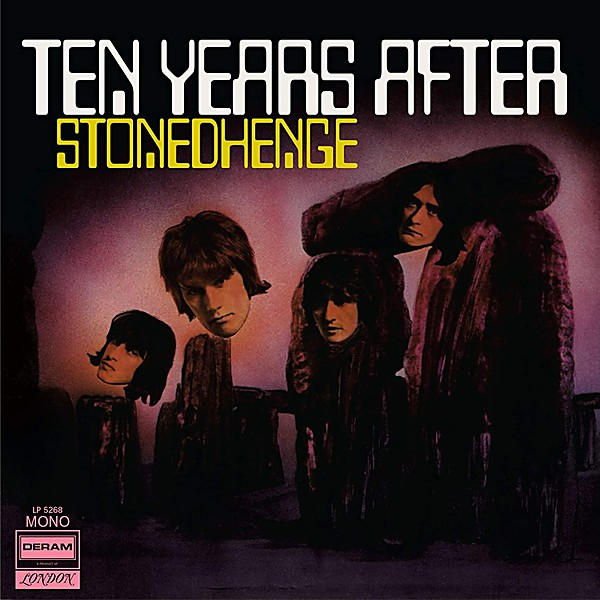

# Stonedhenge

By **Ten Years After**

## Album Data

- **Catalog:** Beets
- **Format:** Digital, Album
- **Album:** Stonedhenge
- **Artist:** Ten Years After
- **Albumartist:** Ten Years After
- **Genre:** British Blues
- **MusicBrainz Album Artist ID:** [73faa89a-ee00-4e40-b68e-80e4891dbc45](https://musicbrainz.org/artist/73faa89a-ee00-4e40-b68e-80e4891dbc45)
- **MusicBrainz Album ID:** [97b06a03-f6f5-4b84-9329-adfd790a799f](https://musicbrainz.org/release/97b06a03-f6f5-4b84-9329-adfd790a799f)
- **MusicBrainz Release Group ID:** [7f8990aa-8e98-3d91-8397-7a2e6f72725f](https://musicbrainz.org/release-group/7f8990aa-8e98-3d91-8397-7a2e6f72725f)
- **Year:** 2015
- **Catalog #:** 472644-9
- **Label:** Deram
- **Total Tracks:** 16

## Album Tracks

### Track 01 - I May Be Wrong, but I Won’t Be Wrong Always

- **Artist:** Ten Years After
- **Format:** ALAC
- **Genre:** Hard Rock
- **Length:** 10:41
- **MusicBrainz Track ID:** [ef385a15-7d72-41f0-9991-d822e03f6196](https://musicbrainz.org/recording/ef385a15-7d72-41f0-9991-d822e03f6196)
- **Title:** I May Be Wrong, but I Won’t Be Wrong Always
- **Track:** 01
- **Year:** 2016

### Track 02 - At the Woodchopper’s Ball

- **Artist:** Ten Years After
- **Format:** ALAC
- **Genre:** Hard Rock
- **Length:** 7:38
- **MusicBrainz Track ID:** [837b2e9e-7d77-4ebc-9d6e-ccd062af0267](https://musicbrainz.org/recording/837b2e9e-7d77-4ebc-9d6e-ccd062af0267)
- **Title:** At the Woodchopper’s Ball
- **Track:** 02
- **Year:** 2016

### Track 03 - Spider in My Web

- **Artist:** Ten Years After
- **Format:** ALAC
- **Genre:** Rock
- **Length:** 7:41
- **MusicBrainz Track ID:** [52265039-b62e-4bf6-8cd5-495690bd0fc2](https://musicbrainz.org/recording/52265039-b62e-4bf6-8cd5-495690bd0fc2)
- **Title:** Spider in My Web
- **Track:** 03
- **Year:** 2016

### Track 04 - Summertime / Shantung Cabbage

- **Artist:** Ten Years After
- **Format:** ALAC
- **Genre:** Jazz
- **Length:** 6:05
- **MusicBrainz Track ID:** [eebdc4b4-3039-4f4c-9aa1-f849bf561d25](https://musicbrainz.org/recording/eebdc4b4-3039-4f4c-9aa1-f849bf561d25)
- **Title:** Summertime / Shantung Cabbage
- **Track:** 04
- **Year:** 2016

### Track 05 - I’m Going Home

- **Artist:** Ten Years After
- **Format:** ALAC
- **Genre:** Hard Rock
- **Length:** 6:27
- **MusicBrainz Track ID:** [a11bde10-b965-46ce-bd46-c709a92060ac](https://musicbrainz.org/recording/a11bde10-b965-46ce-bd46-c709a92060ac)
- **Title:** I’m Going Home
- **Track:** 05
- **Year:** 2016

### Track 06 - Rock Your Mama (live at the Undead session)

- **Artist:** Ten Years After
- **Format:** ALAC
- **Genre:** Hard Rock
- **Length:** 3:47
- **MusicBrainz Track ID:** [a6b7ac4f-5db7-4ad3-8a18-cf3406a4f01e](https://musicbrainz.org/recording/a6b7ac4f-5db7-4ad3-8a18-cf3406a4f01e)
- **Title:** Rock Your Mama (live at the Undead session)
- **Track:** 06
- **Year:** 2016

### Track 07 - Spoonful (live at the Undead session)

- **Artist:** Ten Years After
- **Format:** ALAC
- **Genre:** Hard Rock
- **Length:** 6:48
- **MusicBrainz Track ID:** [6f816362-8e19-432a-8291-5411b3f6ce84](https://musicbrainz.org/recording/6f816362-8e19-432a-8291-5411b3f6ce84)
- **Title:** Spoonful (live at the Undead session)
- **Track:** 07
- **Year:** 2016

### Track 08 - Standing at the Crossroads (live at the Undead session)

- **Artist:** Ten Years After
- **Format:** ALAC
- **Genre:** Hard Rock
- **Length:** 5:07
- **MusicBrainz Track ID:** [d9b2c571-a1b0-43a5-a979-9bd85f48d718](https://musicbrainz.org/recording/d9b2c571-a1b0-43a5-a979-9bd85f48d718)
- **Title:** Standing at the Crossroads (live at the Undead session)
- **Track:** 08
- **Year:** 2016

### Track 09 - Medley (live at the Undead session)

- **Artist:** Ten Years After
- **Format:** ALAC
- **Genre:** Hard Rock
- **Length:** 17:07
- **MusicBrainz Track ID:** [4146c8a0-2fa9-4c9d-bfb2-c7a1cb2fd607](https://musicbrainz.org/recording/4146c8a0-2fa9-4c9d-bfb2-c7a1cb2fd607)
- **Title:** Medley (live at the Undead session)
- **Track:** 09
- **Year:** 2016

### Track 10 - Woman Trouble (live at the Undead session)

- **Artist:** Ten Years After
- **Format:** ALAC
- **Genre:** Hard Rock
- **Length:** 4:53
- **MusicBrainz Track ID:** [0fe85ae4-b7f8-4853-a3ad-e804320b5025](https://musicbrainz.org/recording/0fe85ae4-b7f8-4853-a3ad-e804320b5025)
- **Title:** Woman Trouble (live at the Undead session)
- **Track:** 10
- **Year:** 2016

### Track 11 - (At the) Woodchoppers Ball (BBC ‘Top Gear’ London, 1967)

- **Artist:** Ten Years After
- **Format:** ALAC
- **Genre:** Hard Rock
- **Length:** 4:29
- **MusicBrainz Track ID:** [b60769e2-41ed-40e1-9d7d-5cb4daec2001](https://musicbrainz.org/recording/b60769e2-41ed-40e1-9d7d-5cb4daec2001)
- **Title:** (At the) Woodchoppers Ball (BBC ‘Top Gear’ London, 1967)
- **Track:** 11
- **Year:** 2016

### Track 12 - No Title Blues (BBC ‘Top Gear’ London, 1967)

- **Artist:** Ten Years After
- **Format:** ALAC
- **Genre:** Hard Rock
- **Length:** 7:03
- **MusicBrainz Track ID:** [cfe53840-5f54-4d44-ac7c-abedaa244c26](https://musicbrainz.org/recording/cfe53840-5f54-4d44-ac7c-abedaa244c26)
- **Title:** No Title Blues (BBC ‘Top Gear’ London, 1967)
- **Track:** 12
- **Year:** 2016

### Track 13 - I’m Going Home (BBC ‘Top Gear’ London, 1967)

- **Artist:** Ten Years After
- **Format:** ALAC
- **Genre:** Hard Rock
- **Length:** 4:01
- **MusicBrainz Track ID:** [3ed37449-21a4-48a2-ba2f-88cf6d41cfba](https://musicbrainz.org/recording/3ed37449-21a4-48a2-ba2f-88cf6d41cfba)
- **Title:** I’m Going Home (BBC ‘Top Gear’ London, 1967)
- **Track:** 13
- **Year:** 2016

### Track 14 - Hear Me Calling (BBC ‘Top Gear’ London, 1967)

- **Artist:** Ten Years After
- **Format:** ALAC
- **Genre:** Hard Rock
- **Length:** 4:09
- **MusicBrainz Track ID:** [5c07262d-0f29-479c-849c-f22eafba9597](https://musicbrainz.org/recording/5c07262d-0f29-479c-849c-f22eafba9597)
- **Title:** Hear Me Calling (BBC ‘Top Gear’ London, 1967)
- **Track:** 14
- **Year:** 2016

### Track 15 - Woman Trouble (BBC ‘David Symonds Show’ London, 1967)

- **Artist:** Ten Years After
- **Format:** ALAC
- **Genre:** Hard Rock
- **Length:** 2:39
- **MusicBrainz Track ID:** [f9992373-7cb3-4c5b-8c88-68c5bf48db25](https://musicbrainz.org/recording/f9992373-7cb3-4c5b-8c88-68c5bf48db25)
- **Title:** Woman Trouble (BBC ‘David Symonds Show’ London, 1967)
- **Track:** 15
- **Year:** 2016

### Track 16 - Standing at the Crossroads (BBC ‘David Symonds Show’ London, 1967)

- **Artist:** Ten Years After
- **Format:** ALAC
- **Genre:** Hard Rock
- **Length:** 2:19
- **MusicBrainz Track ID:** [55d8384d-df55-42b4-9259-1f6b18141d2b](https://musicbrainz.org/recording/55d8384d-df55-42b4-9259-1f6b18141d2b)
- **Title:** Standing at the Crossroads (BBC ‘David Symonds Show’ London, 1967)
- **Track:** 16
- **Year:** 2016

## See also

- [A Space in Time](A_Space_in_Time.md)
- [Cricklewood Green](Cricklewood_Green.md)
- [Rock & Roll Music to the World](Rock_and_Roll_Music_to_the_World.md)
- [Undead](Undead.md)
- [CD: A Space In Time](../../CD/Ten_Years_After/A_Space_In_Time.md)
- [CD: ](../../CD/Ten_Years_After/Ten_Years_After.md)
- [Roon: A Space in Time (Deluxe Version)](../../Roon/Ten_Years_After/A_Space_in_Time_Deluxe_Version.md)
- [Roon: Cricklewood Green (2017 Remaster)](../../Roon/Ten_Years_After/Cricklewood_Green_2017_Remaster.md)
- [Roon: Rock & Roll Music to the World (2017 Remaster)](../../Roon/Ten_Years_After/Rock_and_Roll_Music_to_the_World_2017_Remaster.md)
- [Roon: Ten Years After (Re-Presents)](../../Roon/Ten_Years_After/Ten_Years_After_Re-Presents.md)
- [Roon: Undead (Re-Presents / Live)](../../Roon/Ten_Years_After/Undead_Re-Presents_-_Live.md)
- [Vinyl: Rock & Roll Music To The World](../../Vinyl/Ten_Years_After/Rock_and_Roll_Music_To_The_World.md)
- [Vinyl: ](../../Vinyl/Ten_Years_After/Ten_Years_After.md)
