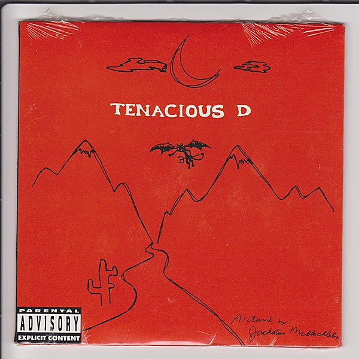

# D Fun Pak

By **Tenacious D**

## Album Data

- **Catalog:** Beets
- **Format:** Digital, Album
- **Album:** D Fun Pak
- **Artist:** Tenacious D
- **Albumartist:** Tenacious D
- **Genre:** Hard Rock
- **MusicBrainz Album Artist ID:** [148ddea2-6839-4354-8e2c-5dfadf136b7f](https://musicbrainz.org/artist/148ddea2-6839-4354-8e2c-5dfadf136b7f)
- **MusicBrainz Album ID:** [4d41d42d-56bc-42c5-a1b6-bd47b95c299e](https://musicbrainz.org/release/4d41d42d-56bc-42c5-a1b6-bd47b95c299e)
- **MusicBrainz Release Group ID:** [c5a6f97e-d420-3b1c-bd15-feeb61f7277b](https://musicbrainz.org/release-group/c5a6f97e-d420-3b1c-bd15-feeb61f7277b)
- **Year:** 2002
- **Catalog #:** 
- **Label:** Columbia
- **Total Tracks:** 13

## Album Tracks

### Track 01 - Rize of the Fenix

- **Artist:** Tenacious D
- **Format:** AAC
- **Genre:** Heavy Metal
- **Length:** 5:52
- **MusicBrainz Track ID:** [88e26189-037d-4f64-a5b9-c73d6845d6ee](https://musicbrainz.org/recording/88e26189-037d-4f64-a5b9-c73d6845d6ee)
- **Title:** Rize of the Fenix
- **Track:** 01
- **Year:** 2012

### Track 02 - Low Hangin’ Fruit

- **Artist:** Tenacious D
- **Format:** AAC
- **Genre:** Humor
- **Length:** 2:31
- **MusicBrainz Track ID:** [f15df190-7a34-4c04-a8a2-ddd10e670b85](https://musicbrainz.org/recording/f15df190-7a34-4c04-a8a2-ddd10e670b85)
- **Title:** Low Hangin’ Fruit
- **Track:** 02
- **Year:** 2012

### Track 03 - Classical Teacher

- **Artist:** Tenacious D
- **Format:** AAC
- **Genre:** Humor
- **Length:** 3:23
- **MusicBrainz Track ID:** [fc22c608-b9b5-405a-9435-3263251eea8d](https://musicbrainz.org/recording/fc22c608-b9b5-405a-9435-3263251eea8d)
- **Title:** Classical Teacher
- **Track:** 03
- **Year:** 2012

### Track 04 - Señorita

- **Artist:** Tenacious D
- **Format:** AAC
- **Genre:** Humor
- **Length:** 3:08
- **MusicBrainz Track ID:** [af052648-7a8a-4589-8f87-afcc9640a392](https://musicbrainz.org/recording/af052648-7a8a-4589-8f87-afcc9640a392)
- **Title:** Señorita
- **Track:** 04
- **Year:** 2012

### Track 05 - Deth Starr

- **Artist:** Tenacious D
- **Format:** AAC
- **Genre:** Humor
- **Length:** 4:46
- **MusicBrainz Track ID:** [a9311b98-962f-4520-b9a5-5181a2573b22](https://musicbrainz.org/recording/a9311b98-962f-4520-b9a5-5181a2573b22)
- **Title:** Deth Starr
- **Track:** 05
- **Year:** 2012

### Track 06 - Roadie

- **Artist:** Tenacious D
- **Format:** AAC
- **Genre:** Humor
- **Length:** 2:58
- **MusicBrainz Track ID:** [fc72655b-e9b1-4f24-90a3-bc99eb020c41](https://musicbrainz.org/recording/fc72655b-e9b1-4f24-90a3-bc99eb020c41)
- **Title:** Roadie
- **Track:** 06
- **Year:** 2012

### Track 07 - Flutes & Trombones

- **Artist:** Tenacious D
- **Format:** AAC
- **Genre:** Humor
- **Length:** 1:28
- **MusicBrainz Track ID:** [fce44e39-ebc4-499b-b6d0-3b712c324d7e](https://musicbrainz.org/recording/fce44e39-ebc4-499b-b6d0-3b712c324d7e)
- **Title:** Flutes & Trombones
- **Track:** 07
- **Year:** 2012

### Track 08 - The Ballad of Hollywood Jack and the Rage Kage

- **Artist:** Tenacious D
- **Format:** AAC
- **Genre:** Humor
- **Length:** 5:05
- **MusicBrainz Track ID:** [ddcfe610-0462-491c-89a8-1fbf23c47295](https://musicbrainz.org/recording/ddcfe610-0462-491c-89a8-1fbf23c47295)
- **Title:** The Ballad of Hollywood Jack and the Rage Kage
- **Track:** 08
- **Year:** 2012

### Track 09 - Throw Down

- **Artist:** Tenacious D
- **Format:** AAC
- **Genre:** Humor
- **Length:** 2:56
- **MusicBrainz Track ID:** [bb0a2b80-6f33-4ff3-98c6-5b279c005b8a](https://musicbrainz.org/recording/bb0a2b80-6f33-4ff3-98c6-5b279c005b8a)
- **Title:** Throw Down
- **Track:** 09
- **Year:** 2012

### Track 10 - Rock Is Dead

- **Artist:** Tenacious D
- **Format:** AAC
- **Genre:** Humor
- **Length:** 1:44
- **MusicBrainz Track ID:** [1004c627-0e85-432f-9b88-d2ed1541c943](https://musicbrainz.org/recording/1004c627-0e85-432f-9b88-d2ed1541c943)
- **Title:** Rock Is Dead
- **Track:** 10
- **Year:** 2012

### Track 11 - They Fucked Our Asses

- **Artist:** Tenacious D
- **Format:** AAC
- **Genre:** Humor
- **Length:** 1:08
- **MusicBrainz Track ID:** [5c1ac6f8-03fd-4d00-a36f-98e63bbd03bb](https://musicbrainz.org/recording/5c1ac6f8-03fd-4d00-a36f-98e63bbd03bb)
- **Title:** They Fucked Our Asses
- **Track:** 11
- **Year:** 2012

### Track 12 - To Be the Best

- **Artist:** Tenacious D
- **Format:** AAC
- **Genre:** Glam Metal
- **Length:** 1:00
- **MusicBrainz Track ID:** [6591bba7-1a48-4aac-8238-5164ebc19b8f](https://musicbrainz.org/recording/6591bba7-1a48-4aac-8238-5164ebc19b8f)
- **Title:** To Be the Best
- **Track:** 12
- **Year:** 2012

### Track 13 - 39

- **Artist:** Tenacious D
- **Format:** AAC
- **Genre:** Soft Rock
- **Length:** 5:16
- **MusicBrainz Track ID:** [01b7e8ce-0191-4581-a3aa-f7fd3a84ee72](https://musicbrainz.org/recording/01b7e8ce-0191-4581-a3aa-f7fd3a84ee72)
- **Title:** 39
- **Track:** 13
- **Year:** 2012

## See also

- [Rize of the Fenix](Rize_of_the_Fenix.md)
- [Tenacious D](Tenacious_D.md)
- [The Pick Of Destiny [Explicit]](The_Pick_Of_Destiny_[Explicit].md)
- [CD: ](../../CD/Tenacious_D/Tenacious_D_index.md)
- [CD: Tenacious D](../../CD/Tenacious_D/Tenacious_D.md)
- [CD: The Pick Of Destiny](../../CD/Tenacious_D/The_Pick_Of_Destiny.md)
- [Roon: Post-Apocalypto](../../Roon/Tenacious_D/Post-Apocalypto.md)
- [Roon: Rize Of The Fenix](../../Roon/Tenacious_D/Rize_Of_The_Fenix.md)
- [Roon: Tenacious D](../../Roon/Tenacious_D/Tenacious_D.md)
- [Roon: The Pick Of Destiny](../../Roon/Tenacious_D/The_Pick_Of_Destiny.md)
- [Vinyl: ](../../Vinyl/Tenacious_D/Tenacious_D_index.md)
- [Vinyl: Tenacious D](../../Vinyl/Tenacious_D/Tenacious_D.md)
- [Vinyl: The Pick Of Destiny](../../Vinyl/Tenacious_D/The_Pick_Of_Destiny.md)
