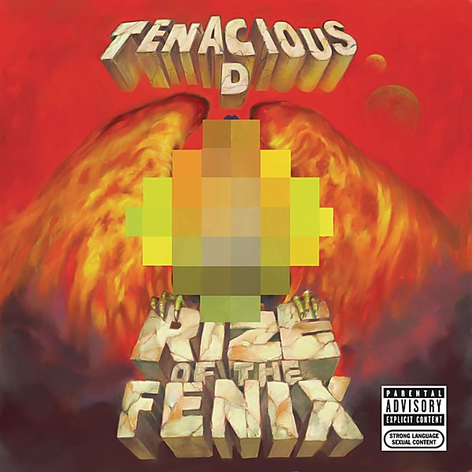

# Rize of the Fenix

By **Tenacious D**

## Album Data

- **Catalog:** Beets
- **Format:** Digital, Album
- **Album:** Rize of the Fenix
- **Artist:** Tenacious D
- **Albumartist:** Tenacious D
- **Genre:** Humor
- **MusicBrainz Album Artist ID:** [148ddea2-6839-4354-8e2c-5dfadf136b7f](https://musicbrainz.org/artist/148ddea2-6839-4354-8e2c-5dfadf136b7f)
- **MusicBrainz Album ID:** [2dbb84e5-884a-47ed-bf21-49ddc51646bd](https://musicbrainz.org/release/2dbb84e5-884a-47ed-bf21-49ddc51646bd)
- **MusicBrainz Release Group ID:** [da66aede-c3d0-405c-b632-8175c386e6c3](https://musicbrainz.org/release-group/da66aede-c3d0-405c-b632-8175c386e6c3)
- **Year:** 2012
- **Catalog #:** 
- **Label:** 
- **Total Tracks:** 21

## Album Tracks

### Track 01 - Kielbasa

- **Artist:** Tenacious D
- **Format:** ALAC
- **Genre:** Humor
- **Length:** 3:00
- **MusicBrainz Track ID:** 
- **Title:** Kielbasa
- **Track:** 01
- **Year:** 2001

### Track 02 - One Note Song

- **Artist:** Tenacious D
- **Format:** ALAC
- **Genre:** Humor
- **Length:** 1:23
- **MusicBrainz Track ID:** 
- **Title:** One Note Song
- **Track:** 02
- **Year:** 2001

### Track 03 - Tribute

- **Artist:** Tenacious D
- **Format:** ALAC
- **Genre:** Comedy Rock
- **Length:** 4:08
- **MusicBrainz Track ID:** 
- **Title:** Tribute
- **Track:** 03
- **Year:** 2001

### Track 04 - Wonderboy

- **Artist:** Tenacious D
- **Format:** ALAC
- **Genre:** Humor
- **Length:** 4:06
- **MusicBrainz Track ID:** 
- **Title:** Wonderboy
- **Track:** 04
- **Year:** 2001

### Track 05 - Hard Fucking

- **Artist:** Tenacious D
- **Format:** ALAC
- **Genre:** Humor
- **Length:** 0:35
- **MusicBrainz Track ID:** 
- **Title:** Hard Fucking
- **Track:** 05
- **Year:** 2001

### Track 06 - Fuck Her Gently

- **Artist:** Tenacious D
- **Format:** ALAC
- **Genre:** Humor
- **Length:** 2:03
- **MusicBrainz Track ID:** 
- **Title:** Fuck Her Gently
- **Track:** 06
- **Year:** 2001

### Track 07 - Explosivo

- **Artist:** Tenacious D
- **Format:** ALAC
- **Genre:** Heavy Metal
- **Length:** 1:55
- **MusicBrainz Track ID:** 
- **Title:** Explosivo
- **Track:** 07
- **Year:** 2001

### Track 08 - Dio

- **Artist:** Tenacious D
- **Format:** ALAC
- **Genre:** Heavy Metal
- **Length:** 1:41
- **MusicBrainz Track ID:** 
- **Title:** Dio
- **Track:** 08
- **Year:** 2001

### Track 09 - Inward Singing

- **Artist:** Tenacious D
- **Format:** ALAC
- **Genre:** Hard Rock
- **Length:** 2:13
- **MusicBrainz Track ID:** 
- **Title:** Inward Singing
- **Track:** 09
- **Year:** 2001

### Track 10 - Kyle Quit The Band

- **Artist:** Tenacious D
- **Format:** ALAC
- **Genre:** Hard Rock
- **Length:** 1:29
- **MusicBrainz Track ID:** 
- **Title:** Kyle Quit The Band
- **Track:** 10
- **Year:** 2001

### Track 11 - The Road

- **Artist:** Tenacious D
- **Format:** ALAC
- **Genre:** Heavy Metal
- **Length:** 2:18
- **MusicBrainz Track ID:** 
- **Title:** The Road
- **Track:** 11
- **Year:** 2001

### Track 12 - Cock Pushups

- **Artist:** Tenacious D
- **Format:** ALAC
- **Genre:** Heavy Metal
- **Length:** 0:48
- **MusicBrainz Track ID:** 
- **Title:** Cock Pushups
- **Track:** 12
- **Year:** 2001

### Track 13 - Lee

- **Artist:** Tenacious D
- **Format:** ALAC
- **Genre:** Humor
- **Length:** 1:02
- **MusicBrainz Track ID:** 
- **Title:** Lee
- **Track:** 13
- **Year:** 2001

### Track 14 - Friendship Test

- **Artist:** Tenacious D
- **Format:** ALAC
- **Genre:** Heavy Metal
- **Length:** 1:30
- **MusicBrainz Track ID:** 
- **Title:** Friendship Test
- **Track:** 14
- **Year:** 2001

### Track 15 - Friendship

- **Artist:** Tenacious D
- **Format:** ALAC
- **Genre:** Hard Rock
- **Length:** 1:59
- **MusicBrainz Track ID:** 
- **Title:** Friendship
- **Track:** 15
- **Year:** 2001

### Track 16 - Karate Schnitzel

- **Artist:** Tenacious D
- **Format:** ALAC
- **Genre:** Humor
- **Length:** 0:36
- **MusicBrainz Track ID:** 
- **Title:** Karate Schnitzel
- **Track:** 16
- **Year:** 2001

### Track 17 - Karate

- **Artist:** Tenacious D
- **Format:** ALAC
- **Genre:** Humor
- **Length:** 1:05
- **MusicBrainz Track ID:** 
- **Title:** Karate
- **Track:** 17
- **Year:** 2001

### Track 18 - Rock Your Socks

- **Artist:** Tenacious D
- **Format:** ALAC
- **Genre:** Heavy Metal
- **Length:** 3:32
- **MusicBrainz Track ID:** 
- **Title:** Rock Your Socks
- **Track:** 18
- **Year:** 2001

### Track 19 - Drive-Thru

- **Artist:** Tenacious D
- **Format:** ALAC
- **Genre:** Heavy Metal
- **Length:** 3:00
- **MusicBrainz Track ID:** 
- **Title:** Drive-Thru
- **Track:** 19
- **Year:** 2001

### Track 20 - Double Team

- **Artist:** Tenacious D
- **Format:** ALAC
- **Genre:** Hard Rock
- **Length:** 3:10
- **MusicBrainz Track ID:** 
- **Title:** Double Team
- **Track:** 20
- **Year:** 2001

### Track 21 - City Hall

- **Artist:** Tenacious D
- **Format:** ALAC
- **Genre:** Hard Rock
- **Length:** 9:02
- **MusicBrainz Track ID:** 
- **Title:** City Hall
- **Track:** 21
- **Year:** 2001

## See also

- [D Fun Pak](D_Fun_Pak.md)
- [Tenacious D](Tenacious_D.md)
- [The Pick Of Destiny [Explicit]](The_Pick_Of_Destiny_[Explicit].md)
- [CD: ](../../CD/Tenacious_D/Tenacious_D_index.md)
- [CD: Tenacious D](../../CD/Tenacious_D/Tenacious_D.md)
- [CD: The Pick Of Destiny](../../CD/Tenacious_D/The_Pick_Of_Destiny.md)
- [Roon: Post-Apocalypto](../../Roon/Tenacious_D/Post-Apocalypto.md)
- [Roon: Rize Of The Fenix](../../Roon/Tenacious_D/Rize_Of_The_Fenix.md)
- [Roon: Tenacious D](../../Roon/Tenacious_D/Tenacious_D.md)
- [Roon: The Pick Of Destiny](../../Roon/Tenacious_D/The_Pick_Of_Destiny.md)
- [Vinyl: ](../../Vinyl/Tenacious_D/Tenacious_D_index.md)
- [Vinyl: Tenacious D](../../Vinyl/Tenacious_D/Tenacious_D.md)
- [Vinyl: The Pick Of Destiny](../../Vinyl/Tenacious_D/The_Pick_Of_Destiny.md)
