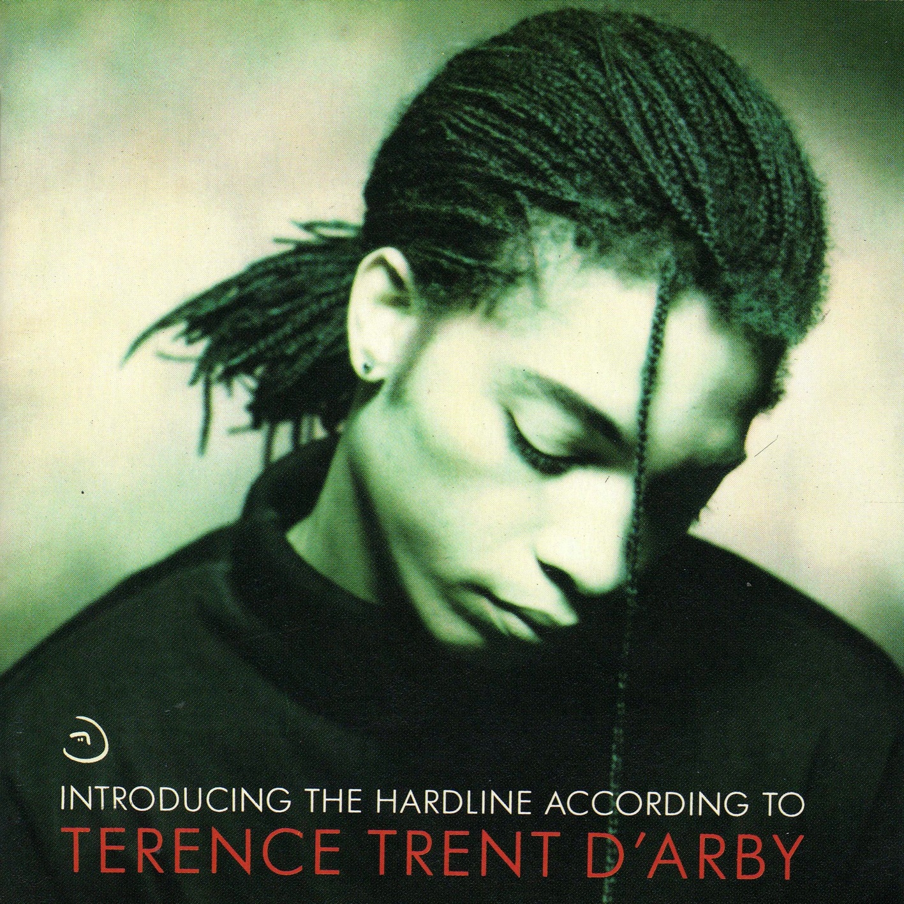

# Introducing the Hardline According to Terence Trent D’Arby

By **Terence Trent D’Arby**

## Album Data

- **Catalog:** Beets
- **Format:** Digital, Album
- **Album:** Introducing the Hardline According to Terence Trent D’Arby
- **Artist:** Terence Trent D’arby
- **Albumartist:** Terence Trent D’Arby
- **Genre:** Soul
- **MusicBrainz Album Artist ID:** [91f603ca-b126-42a2-9c29-820ca687347c](https://musicbrainz.org/artist/91f603ca-b126-42a2-9c29-820ca687347c)
- **MusicBrainz Album ID:** [96a14f5f-a31a-3fc2-a96d-0f2c18bf84fc](https://musicbrainz.org/release/96a14f5f-a31a-3fc2-a96d-0f2c18bf84fc)
- **MusicBrainz Release Group ID:** [8958b20d-ce4a-3fa3-95e3-cff2273211aa](https://musicbrainz.org/release-group/8958b20d-ce4a-3fa3-95e3-cff2273211aa)
- **Year:** 1987
- **Catalog #:** CK 40964
- **Label:** Columbia
- **Total Tracks:** 11

## Album Tracks

### Track 01 - If You All Get to Heaven

- **Artist:** Terence Trent D’Arby
- **Format:** ALAC
- **Genre:** Soul
- **Length:** 5:17
- **MusicBrainz Track ID:** [f4473bd6-0fc8-40a0-bb9d-8a9675f3d54e](https://musicbrainz.org/recording/f4473bd6-0fc8-40a0-bb9d-8a9675f3d54e)
- **Title:** If You All Get to Heaven
- **Track:** 01
- **Year:** 1987

### Track 02 - If You Let Me Stay

- **Artist:** Terence Trent D’Arby
- **Format:** ALAC
- **Genre:** Soul
- **Length:** 3:13
- **MusicBrainz Track ID:** [bfce1a40-53a1-421c-b89c-377a75796f62](https://musicbrainz.org/recording/bfce1a40-53a1-421c-b89c-377a75796f62)
- **Title:** If You Let Me Stay
- **Track:** 02
- **Year:** 1987

### Track 03 - Wishing Well

- **Artist:** Terence Trent D’Arby
- **Format:** ALAC
- **Genre:** Soul
- **Length:** 3:30
- **MusicBrainz Track ID:** [d113c7be-7440-4817-80a1-cf1f59e187ee](https://musicbrainz.org/recording/d113c7be-7440-4817-80a1-cf1f59e187ee)
- **Title:** Wishing Well
- **Track:** 03
- **Year:** 1987

### Track 04 - I’ll Never Turn My Back on You (Father’s Words)

- **Artist:** Terence Trent D’Arby
- **Format:** ALAC
- **Genre:** Soul
- **Length:** 3:36
- **MusicBrainz Track ID:** [bdc54ea1-b9e5-40e4-9633-61aefa0db6ec](https://musicbrainz.org/recording/bdc54ea1-b9e5-40e4-9633-61aefa0db6ec)
- **Title:** I’ll Never Turn My Back on You (Father’s Words)
- **Track:** 04
- **Year:** 1987

### Track 05 - Dance Little Sister

- **Artist:** Terence Trent D’Arby
- **Format:** ALAC
- **Genre:** Soul
- **Length:** 3:54
- **MusicBrainz Track ID:** [4e7d8712-2146-4502-9af5-e35a92793785](https://musicbrainz.org/recording/4e7d8712-2146-4502-9af5-e35a92793785)
- **Title:** Dance Little Sister
- **Track:** 05
- **Year:** 1987

### Track 06 - Seven More Days

- **Artist:** Terence Trent D’Arby
- **Format:** ALAC
- **Genre:** Soul
- **Length:** 4:32
- **MusicBrainz Track ID:** [ccb356b9-98ed-4e84-9ab6-5cce4132ed11](https://musicbrainz.org/recording/ccb356b9-98ed-4e84-9ab6-5cce4132ed11)
- **Title:** Seven More Days
- **Track:** 06
- **Year:** 1987

### Track 07 - Let’s Go Forward

- **Artist:** Terence Trent D’Arby
- **Format:** ALAC
- **Genre:** Soul
- **Length:** 5:32
- **MusicBrainz Track ID:** [fe09ba49-2eb5-4f68-aa61-da74b24299e6](https://musicbrainz.org/recording/fe09ba49-2eb5-4f68-aa61-da74b24299e6)
- **Title:** Let’s Go Forward
- **Track:** 07
- **Year:** 1987

### Track 08 - Rain

- **Artist:** Terence Trent D’Arby
- **Format:** ALAC
- **Genre:** Soul
- **Length:** 2:59
- **MusicBrainz Track ID:** [1cc74d57-cc33-4246-be0a-b4260d03b7c9](https://musicbrainz.org/recording/1cc74d57-cc33-4246-be0a-b4260d03b7c9)
- **Title:** Rain
- **Track:** 08
- **Year:** 1987

### Track 09 - Sign Your Name

- **Artist:** Terence Trent D’Arby
- **Format:** ALAC
- **Genre:** Pop
- **Length:** 4:38
- **MusicBrainz Track ID:** [c2154fd6-e82e-4283-b84b-cd6d72780028](https://musicbrainz.org/recording/c2154fd6-e82e-4283-b84b-cd6d72780028)
- **Title:** Sign Your Name
- **Track:** 09
- **Year:** 1987

### Track 10 - As Yet Untitled

- **Artist:** Terence Trent D’Arby
- **Format:** ALAC
- **Genre:** Soul
- **Length:** 5:33
- **MusicBrainz Track ID:** [e7091ec4-ff3f-4736-8869-f82969962f11](https://musicbrainz.org/recording/e7091ec4-ff3f-4736-8869-f82969962f11)
- **Title:** As Yet Untitled
- **Track:** 10
- **Year:** 1987

### Track 11 - Who’s Lovin’ You

- **Artist:** Terence Trent D’Arby
- **Format:** ALAC
- **Genre:** Soul
- **Length:** 4:24
- **MusicBrainz Track ID:** [9e67a6b4-8bb6-4a84-b61b-78518d653bdb](https://musicbrainz.org/recording/9e67a6b4-8bb6-4a84-b61b-78518d653bdb)
- **Title:** Who’s Lovin’ You
- **Track:** 11
- **Year:** 1987

