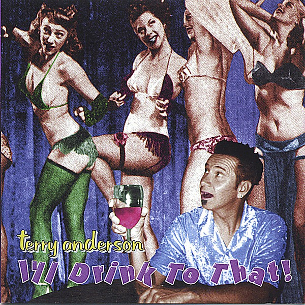

# I'll Drink to That

By **Terry Anderson**

## Album Data

- **Catalog:** Beets
- **Format:** Digital, Album
- **Album:** I'll Drink to That
- **Artist:** Terry Anderson
- **Albumartist:** Terry Anderson
- **Genre:** Unknown
- **MusicBrainz Album Artist ID:** 
- **MusicBrainz Album ID:** 
- **MusicBrainz Release Group ID:** 
- **Year:** 2001
- **Catalog #:** 
- **Label:** Not Lame Recordings
- **Total Tracks:** 13

## Album Tracks

### Track 01 - $ of an Education

- **Artist:** Terry Anderson
- **Format:** MP3
- **Genre:** Unknown
- **Length:** 2:26
- **MusicBrainz Track ID:** 
- **Title:** $ of an Education
- **Track:** 01
- **Year:** 2001

### Track 02 - Daddy Had Wreck

- **Artist:** Terry Anderson
- **Format:** MP3
- **Genre:** Unknown
- **Length:** 2:26
- **MusicBrainz Track ID:** 
- **Title:** Daddy Had Wreck
- **Track:** 02
- **Year:** 2001

### Track 03 - Killin' Down in Dillon

- **Artist:** Terry Anderson
- **Format:** MP3
- **Genre:** Unknown
- **Length:** 2:37
- **MusicBrainz Track ID:** 
- **Title:** Killin' Down in Dillon
- **Track:** 03
- **Year:** 2001

### Track 04 - Bayfriends 2

- **Artist:** Terry Anderson
- **Format:** MP3
- **Genre:** Unknown
- **Length:** 3:00
- **MusicBrainz Track ID:** 
- **Title:** Bayfriends 2
- **Track:** 04
- **Year:** 2001

### Track 05 - Bad Enuff to Crawl

- **Artist:** Terry Anderson
- **Format:** MP3
- **Genre:** Unknown
- **Length:** 3:31
- **MusicBrainz Track ID:** 
- **Title:** Bad Enuff to Crawl
- **Track:** 05
- **Year:** 2001

### Track 06 - Safety First

- **Artist:** Terry Anderson
- **Format:** MP3
- **Genre:** Unknown
- **Length:** 2:34
- **MusicBrainz Track ID:** 
- **Title:** Safety First
- **Track:** 06
- **Year:** 2001

### Track 07 - Nastiest House

- **Artist:** Terry Anderson
- **Format:** MP3
- **Genre:** Unknown
- **Length:** 4:18
- **MusicBrainz Track ID:** 
- **Title:** Nastiest House
- **Track:** 07
- **Year:** 2001

### Track 08 - Rock and Girlfriend

- **Artist:** Terry Anderson
- **Format:** MP3
- **Genre:** Unknown
- **Length:** 4:13
- **MusicBrainz Track ID:** 
- **Title:** Rock and Girlfriend
- **Track:** 08
- **Year:** 2001

### Track 09 - Nya Nya Nya

- **Artist:** Terry Anderson
- **Format:** MP3
- **Genre:** Unknown
- **Length:** 3:01
- **MusicBrainz Track ID:** 
- **Title:** Nya Nya Nya
- **Track:** 09
- **Year:** 2001

### Track 10 - 37 Miles in Reverse

- **Artist:** Terry Anderson
- **Format:** MP3
- **Genre:** Unknown
- **Length:** 3:29
- **MusicBrainz Track ID:** 
- **Title:** 37 Miles in Reverse
- **Track:** 10
- **Year:** 2001

### Track 11 - Mr. Busdriverman

- **Artist:** Terry Anderson
- **Format:** MP3
- **Genre:** Unknown
- **Length:** 2:54
- **MusicBrainz Track ID:** 
- **Title:** Mr. Busdriverman
- **Track:** 11
- **Year:** 2001

### Track 12 - Church Fols Comin'

- **Artist:** Terry Anderson
- **Format:** MP3
- **Genre:** Unknown
- **Length:** 2:37
- **MusicBrainz Track ID:** 
- **Title:** Church Fols Comin'
- **Track:** 12
- **Year:** 2001

### Track 13 - Stay Away from Your Heroes

- **Artist:** Terry Anderson
- **Format:** MP3
- **Genre:** Unknown
- **Length:** 4:26
- **MusicBrainz Track ID:** 
- **Title:** Stay Away from Your Heroes
- **Track:** 13
- **Year:** 2001

