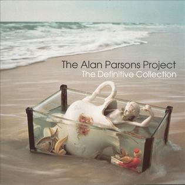

# The Definitive Collection

By **The Alan Parsons Project**

## Album Data

- **Catalog:** Beets
- **Format:** Digital, Album
- **Album:** The Definitive Collection
- **Artist:** The Alan Parsons Project
- **Albumartist:** The Alan Parsons Project
- **Genre:** Krautrock
- **MusicBrainz Album Artist ID:** [f98711e5-06f7-43ed-8239-da0f61a9c460](https://musicbrainz.org/artist/f98711e5-06f7-43ed-8239-da0f61a9c460)
- **MusicBrainz Album ID:** [4f1fa7ca-2e03-4873-bb5b-736dcd90cd6f](https://musicbrainz.org/release/4f1fa7ca-2e03-4873-bb5b-736dcd90cd6f)
- **MusicBrainz Release Group ID:** [8cffdea5-4c20-31f1-b8af-8302e99d0ced](https://musicbrainz.org/release-group/8cffdea5-4c20-31f1-b8af-8302e99d0ced)
- **Year:** 2014
- **Catalog #:** 
- **Label:** 
- **Total Tracks:** 00

## Album Tracks

### Track 00 - 00 - Tales Of Mystery And Imagination

- **Artist:** The Alan Parsons Project
- **Format:** MP3
- **Genre:** Progressive Rock
- **Length:** 40:58
- **MusicBrainz Track ID:** 
- **Title:** 00 - Tales Of Mystery And Imagination
- **Track:** 00
- **Year:** 2016

### Track 01 - A Dream Within A Dream

- **Artist:** The Alan Parsons Project
- **Format:** ALAC
- **Genre:** Psychedelic Rock
- **Length:** 4:13
- **MusicBrainz Track ID:** 
- **Title:** A Dream Within A Dream
- **Track:** 01
- **Year:** 1976

### Track 02 - The Raven

- **Artist:** The Alan Parsons Project
- **Format:** ALAC
- **Genre:** Psychedelic Rock
- **Length:** 3:57
- **MusicBrainz Track ID:** 
- **Title:** The Raven
- **Track:** 02
- **Year:** 1976

### Track 03 - The Tell-Tale Heart

- **Artist:** The Alan Parsons Project
- **Format:** ALAC
- **Genre:** Psychedelic Rock
- **Length:** 4:38
- **MusicBrainz Track ID:** 
- **Title:** The Tell-Tale Heart
- **Track:** 03
- **Year:** 1976

### Track 04 - The Cask Of Amontillado

- **Artist:** The Alan Parsons Project
- **Format:** ALAC
- **Genre:** Psychedelic Rock
- **Length:** 4:33
- **MusicBrainz Track ID:** 
- **Title:** The Cask Of Amontillado
- **Track:** 04
- **Year:** 1976

### Track 05 - (The System Of) Doctor Tarr And Professor Fether

- **Artist:** The Alan Parsons Project
- **Format:** ALAC
- **Genre:** Psychedelic Rock
- **Length:** 4:20
- **MusicBrainz Track ID:** 
- **Title:** (The System Of) Doctor Tarr And Professor Fether
- **Track:** 05
- **Year:** 1976

### Track 06 - The Fall Of The House Of Usher

- **Artist:** The Alan Parsons Project
- **Format:** ALAC
- **Genre:** Psychedelic Rock
- **Length:** 7:02
- **MusicBrainz Track ID:** 
- **Title:** The Fall Of The House Of Usher
- **Track:** 06
- **Year:** 1976

### Track 07 - The Fall Of The House Of Usher

- **Artist:** The Alan Parsons Project
- **Format:** ALAC
- **Genre:** Psychedelic Rock
- **Length:** 2:39
- **MusicBrainz Track ID:** 
- **Title:** The Fall Of The House Of Usher
- **Track:** 07
- **Year:** 1976

### Track 08 - The Fall Of The House Of Usher

- **Artist:** The Alan Parsons Project
- **Format:** ALAC
- **Genre:** Psychedelic Rock
- **Length:** 1:00
- **MusicBrainz Track ID:** 
- **Title:** The Fall Of The House Of Usher
- **Track:** 08
- **Year:** 1976

### Track 09 - The Fall Of The House Of Usher

- **Artist:** The Alan Parsons Project
- **Format:** ALAC
- **Genre:** Psychedelic Rock
- **Length:** 4:36
- **MusicBrainz Track ID:** 
- **Title:** The Fall Of The House Of Usher
- **Track:** 09
- **Year:** 1976

### Track 10 - The Fall Of The House Of Usher

- **Artist:** The Alan Parsons Project
- **Format:** ALAC
- **Genre:** Psychedelic Rock
- **Length:** 0:51
- **MusicBrainz Track ID:** 
- **Title:** The Fall Of The House Of Usher
- **Track:** 10
- **Year:** 1976

### Track 11 - To One In Paradise

- **Artist:** The Alan Parsons Project
- **Format:** ALAC
- **Genre:** Psychedelic Rock
- **Length:** 4:46
- **MusicBrainz Track ID:** 
- **Title:** To One In Paradise
- **Track:** 11
- **Year:** 1976

## See also

- [Roon: Eye In The Sky](../../Roon/The_Alan_Parsons_Project/Eye_In_The_Sky.md)
- [Roon: Pyramid (Expanded Edition)](../../Roon/The_Alan_Parsons_Project/Pyramid_Expanded_Edition.md)
- [Roon: Sirius 2017 (Disco Demolition Remix)](../../Roon/The_Alan_Parsons_Project/Sirius_2017_Disco_Demolition_Remix.md)
- [Roon: Stereotomy (Expanded Edition)](../../Roon/The_Alan_Parsons_Project/Stereotomy_Expanded_Edition.md)
- [Roon: Tales Of Mystery And Imagination - Edgar Allan Poe (1987 Remix)](../../Roon/The_Alan_Parsons_Project/Tales_Of_Mystery_And_Imagination_-_Edgar_Allan_Poe_1987_Remix.md)
- [Roon: The Best Of The Alan Parsons Project](../../Roon/The_Alan_Parsons_Project/The_Best_Of_The_Alan_Parsons_Project.md)
- [Roon: The Turn Of A Friendly Card (Expanded Edition)](../../Roon/The_Alan_Parsons_Project/The_Turn_Of_A_Friendly_Card_Expanded_Edition.md)
- [Vinyl: Eye In The Sky](../../Vinyl/The_Alan_Parsons_Project/Eye_In_The_Sky.md)
- [Vinyl: ](../../Vinyl/The_Alan_Parsons_Project/The_Alan_Parsons_Project.md)
- [Vinyl: The Turn Of A Friendly Card](../../Vinyl/The_Alan_Parsons_Project/The_Turn_Of_A_Friendly_Card.md)
