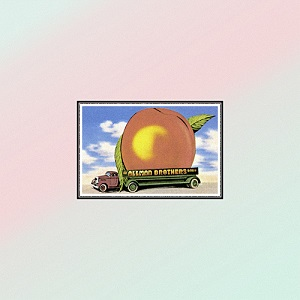

# Eat A Peach

By **The Allman Brothers Band**

## Album Data

- **Catalog:** Beets
- **Format:** Digital, Album
- **Album:** Eat A Peach
- **Artist:** The Allman Brothers Band
- **Albumartist:** The Allman Brothers Band
- **Genre:** Southern Rock
- **MusicBrainz Album Artist ID:** 
- **MusicBrainz Album ID:** 
- **MusicBrainz Release Group ID:** 
- **Year:** 1972
- **Catalog #:** 
- **Label:** 
- **Total Tracks:** 09

## Album Tracks

### Track 01 - Ain't Wastin' Time No More

- **Artist:** The Allman Brothers Band
- **Format:** ALAC
- **Genre:** Southern Rock
- **Length:** 3:42
- **MusicBrainz Track ID:** 
- **Title:** Ain't Wastin' Time No More
- **Track:** 01
- **Year:** 1972

### Track 01 - Ain't Wastin' Time No More

- **Artist:** The Allman Brothers Band
- **Format:** MP3
- **Genre:** Southern Rock
- **Length:** 3:40
- **MusicBrainz Track ID:** 
- **Title:** Ain't Wastin' Time No More
- **Track:** 01
- **Year:** 0000

### Track 02 - Les Brers In A Minor

- **Artist:** The Allman Brothers Band
- **Format:** ALAC
- **Genre:** Southern Rock
- **Length:** 9:07
- **MusicBrainz Track ID:** 
- **Title:** Les Brers In A Minor
- **Track:** 02
- **Year:** 1972

### Track 02 - Les Brers In A Minor

- **Artist:** The Allman Brothers Band
- **Format:** MP3
- **Genre:** Southern Rock
- **Length:** 9:03
- **MusicBrainz Track ID:** 
- **Title:** Les Brers In A Minor
- **Track:** 02
- **Year:** 0000

### Track 03 - Melissa

- **Artist:** The Allman Brothers Band
- **Format:** ALAC
- **Genre:** Southern Rock
- **Length:** 3:56
- **MusicBrainz Track ID:** 
- **Title:** Melissa
- **Track:** 03
- **Year:** 1972

### Track 03 - Melissa

- **Artist:** The Allman Brothers Band
- **Format:** MP3
- **Genre:** Southern Rock
- **Length:** 3:54
- **MusicBrainz Track ID:** 
- **Title:** Melissa
- **Track:** 03
- **Year:** 0000

### Track 04 - Mountain Jam

- **Artist:** The Allman Brothers Band
- **Format:** ALAC
- **Genre:** Southern Rock
- **Length:** 33:41
- **MusicBrainz Track ID:** 
- **Title:** Mountain Jam
- **Track:** 04
- **Year:** 1972

### Track 04 - Mountain Jam

- **Artist:** The Allman Brothers Band
- **Format:** MP3
- **Genre:** Southern Rock
- **Length:** 33:38
- **MusicBrainz Track ID:** 
- **Title:** Mountain Jam
- **Track:** 04
- **Year:** 0000

### Track 05 - One Way Out

- **Artist:** The Allman Brothers Band
- **Format:** ALAC
- **Genre:** Southern Rock
- **Length:** 4:58
- **MusicBrainz Track ID:** 
- **Title:** One Way Out
- **Track:** 05
- **Year:** 1972

### Track 05 - One Way Out

- **Artist:** The Allman Brothers Band
- **Format:** MP3
- **Genre:** Southern Rock
- **Length:** 4:58
- **MusicBrainz Track ID:** 
- **Title:** One Way Out
- **Track:** 05
- **Year:** 0000

### Track 06 - Trouble No More

- **Artist:** The Allman Brothers Band
- **Format:** ALAC
- **Genre:** Southern Rock
- **Length:** 3:45
- **MusicBrainz Track ID:** 
- **Title:** Trouble No More
- **Track:** 06
- **Year:** 1972

### Track 06 - Trouble No More

- **Artist:** The Allman Brothers Band
- **Format:** MP3
- **Genre:** Southern Rock
- **Length:** 3:43
- **MusicBrainz Track ID:** 
- **Title:** Trouble No More
- **Track:** 06
- **Year:** 0000

### Track 07 - Stand Back

- **Artist:** The Allman Brothers Band
- **Format:** ALAC
- **Genre:** Southern Rock
- **Length:** 3:27
- **MusicBrainz Track ID:** 
- **Title:** Stand Back
- **Track:** 07
- **Year:** 1972

### Track 07 - Stand Back

- **Artist:** The Allman Brothers Band
- **Format:** MP3
- **Genre:** Southern Rock
- **Length:** 3:25
- **MusicBrainz Track ID:** 
- **Title:** Stand Back
- **Track:** 07
- **Year:** 0000

### Track 08 - Blue Sky

- **Artist:** The Allman Brothers Band
- **Format:** ALAC
- **Genre:** Southern Rock
- **Length:** 5:10
- **MusicBrainz Track ID:** 
- **Title:** Blue Sky
- **Track:** 08
- **Year:** 1972

### Track 08 - Blue Sky

- **Artist:** The Allman Brothers Band
- **Format:** MP3
- **Genre:** Southern Rock
- **Length:** 5:09
- **MusicBrainz Track ID:** 
- **Title:** Blue Sky
- **Track:** 08
- **Year:** 0000

### Track 09 - Little Martha

- **Artist:** The Allman Brothers Band
- **Format:** ALAC
- **Genre:** Southern Rock
- **Length:** 2:07
- **MusicBrainz Track ID:** 
- **Title:** Little Martha
- **Track:** 09
- **Year:** 1972

### Track 09 - Little Martha

- **Artist:** The Allman Brothers Band
- **Format:** MP3
- **Genre:** Southern Rock
- **Length:** 2:07
- **MusicBrainz Track ID:** 
- **Title:** Little Martha
- **Track:** 09
- **Year:** 0000

## See also

- [At Fillmore East](At_Fillmore_East.md)
- [Roon: At Fillmore East](../../Roon/The_Allman_Brothers_Band/At_Fillmore_East.md)
- [Roon: Bear's Sonic Journals](../../Roon/The_Allman_Brothers_Band/Bears_Sonic_Journals-_Fillmore_East_February_1970_Live.md)
- [Roon: Eat A Peach](../../Roon/The_Allman_Brothers_Band/Eat_A_Peach.md)
- [Roon: The Allman Brothers Band (Remastered)](../../Roon/The_Allman_Brothers_Band/The_Allman_Brothers_Band_Remastered.md)
- [Vinyl: Eat A Peach](../../Vinyl/The_Allman_Brothers_Band/Eat_A_Peach.md)
- [Vinyl: ](../../Vinyl/The_Allman_Brothers_Band/The_Allman_Brothers_Band.md)
