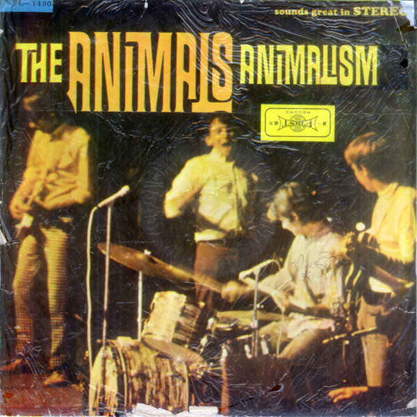

# Animalism

By **The Animals**

## Album Data

- **Catalog:** Beets
- **Format:** Digital, Album
- **Album:** Animalism
- **Artist:** The Animals
- **Albumartist:** The Animals
- **Genre:** Screamo
- **MusicBrainz Album Artist ID:** [4d8afa16-4018-4ca8-8b5e-ede8f9314562](https://musicbrainz.org/artist/4d8afa16-4018-4ca8-8b5e-ede8f9314562)
- **MusicBrainz Album ID:** [6f0a1de3-e465-4354-b895-2fc4f6391b70](https://musicbrainz.org/release/6f0a1de3-e465-4354-b895-2fc4f6391b70)
- **MusicBrainz Release Group ID:** [f2689784-8a09-34a9-b53d-e49d9c3e0f23](https://musicbrainz.org/release-group/f2689784-8a09-34a9-b53d-e49d9c3e0f23)
- **Year:** 1966
- **Catalog #:** SE-4384
- **Label:** MGM Records
- **Total Tracks:** 12

## Album Tracks

### Track 01 - Don't Bring Me Down

- **Artist:** The Animals
- **Format:** MP3
- **Genre:** Soul
- **Length:** 3:13
- **MusicBrainz Track ID:** [82ce30ce-a69a-4611-b68e-6919f59eca43](https://musicbrainz.org/recording/82ce30ce-a69a-4611-b68e-6919f59eca43)
- **Title:** Don't Bring Me Down
- **Track:** 01
- **Year:** 1966

### Track 02 - One Monkey Don't Stop No Show

- **Artist:** The Animals
- **Format:** MP3
- **Genre:** Emo
- **Length:** 3:20
- **MusicBrainz Track ID:** [6c2b1281-de05-4921-bee1-ef20da1aaece](https://musicbrainz.org/recording/6c2b1281-de05-4921-bee1-ef20da1aaece)
- **Title:** One Monkey Don't Stop No Show
- **Track:** 02
- **Year:** 1966

### Track 03 - You're on My Mind

- **Artist:** The Animals
- **Format:** MP3
- **Genre:** Hard Rock
- **Length:** 2:57
- **MusicBrainz Track ID:** [389ca052-03f8-442b-8b3b-eee39c823bef](https://musicbrainz.org/recording/389ca052-03f8-442b-8b3b-eee39c823bef)
- **Title:** You're on My Mind
- **Track:** 03
- **Year:** 1966

### Track 04 - She'll Return It

- **Artist:** The Animals
- **Format:** MP3
- **Genre:** Screamo
- **Length:** 2:49
- **MusicBrainz Track ID:** [dc1a51f3-a6c1-427f-afc6-d657c701a120](https://musicbrainz.org/recording/dc1a51f3-a6c1-427f-afc6-d657c701a120)
- **Title:** She'll Return It
- **Track:** 04
- **Year:** 1966

### Track 05 - Cheating

- **Artist:** The Animals
- **Format:** MP3
- **Genre:** Screamo
- **Length:** 2:25
- **MusicBrainz Track ID:** [0a88a9e8-69aa-4559-bd39-24ab2fe174b9](https://musicbrainz.org/recording/0a88a9e8-69aa-4559-bd39-24ab2fe174b9)
- **Title:** Cheating
- **Track:** 05
- **Year:** 1966

### Track 06 - Inside Looking Out

- **Artist:** The Animals
- **Format:** MP3
- **Genre:** Screamo
- **Length:** 3:45
- **MusicBrainz Track ID:** [cdeec17a-28a8-4bc6-8f31-dfc293244d1e](https://musicbrainz.org/recording/cdeec17a-28a8-4bc6-8f31-dfc293244d1e)
- **Title:** Inside Looking Out
- **Track:** 06
- **Year:** 1966

### Track 07 - See See Rider

- **Artist:** The Animals
- **Format:** MP3
- **Genre:** Screamo
- **Length:** 3:59
- **MusicBrainz Track ID:** [032abc10-8d6d-4db7-ad70-75fbf47eaf89](https://musicbrainz.org/recording/032abc10-8d6d-4db7-ad70-75fbf47eaf89)
- **Title:** See See Rider
- **Track:** 07
- **Year:** 1966

### Track 08 - Gin House Blues

- **Artist:** The Animals
- **Format:** MP3
- **Genre:** Rock And Roll
- **Length:** 4:39
- **MusicBrainz Track ID:** [b51efe79-0d4d-4900-ad4b-af1d6f683496](https://musicbrainz.org/recording/b51efe79-0d4d-4900-ad4b-af1d6f683496)
- **Title:** Gin House Blues
- **Track:** 08
- **Year:** 1966

### Track 09 - Maudie

- **Artist:** The Animals
- **Format:** MP3
- **Genre:** Emo
- **Length:** 4:04
- **MusicBrainz Track ID:** [2bfe04a3-e80f-4f2b-9f91-1c33696cb218](https://musicbrainz.org/recording/2bfe04a3-e80f-4f2b-9f91-1c33696cb218)
- **Title:** Maudie
- **Track:** 09
- **Year:** 1966

### Track 10 - What Am I Living For?

- **Artist:** The Animals
- **Format:** MP3
- **Genre:** Rock
- **Length:** 3:15
- **MusicBrainz Track ID:** [4fc7e78e-930e-4292-ae27-8a2b29835bda](https://musicbrainz.org/recording/4fc7e78e-930e-4292-ae27-8a2b29835bda)
- **Title:** What Am I Living For?
- **Track:** 10
- **Year:** 1966

### Track 11 - Sweet Little Sixteen

- **Artist:** The Animals
- **Format:** MP3
- **Genre:** Screamo
- **Length:** 3:09
- **MusicBrainz Track ID:** [04f78f16-2051-42ad-8e48-18c34f885e3a](https://musicbrainz.org/recording/04f78f16-2051-42ad-8e48-18c34f885e3a)
- **Title:** Sweet Little Sixteen
- **Track:** 11
- **Year:** 1966

### Track 12 - I Put a Spell on You

- **Artist:** The Animals
- **Format:** MP3
- **Genre:** Screamo
- **Length:** 2:57
- **MusicBrainz Track ID:** [8827c0e4-1abd-4b1c-9011-798fe365790f](https://musicbrainz.org/recording/8827c0e4-1abd-4b1c-9011-798fe365790f)
- **Title:** I Put a Spell on You
- **Track:** 12
- **Year:** 1966

## See also

- [Animalization](Animalization.md)
- [The Best Of The Animals Featuring Eric Burdon](The_Best_Of_The_Animals_Featuring_Eric_Burdon.md)
- [The Best of the Animals](The_Best_of_the_Animals.md)
- [Vinyl: Don't Bring Me Down](../../Vinyl/The_Animals/Dont_Bring_Me_Down.md)
- [Vinyl: ](../../Vinyl/The_Animals/The_Animals.md)
- [Vinyl: The Best Of The Animals](../../Vinyl/The_Animals/The_Best_Of_The_Animals.md)
- [Vinyl: The House Of The Rising Sun / I'm Crying](../../Vinyl/The_Animals/The_House_Of_The_Rising_Sun_-_Im_Crying.md)
