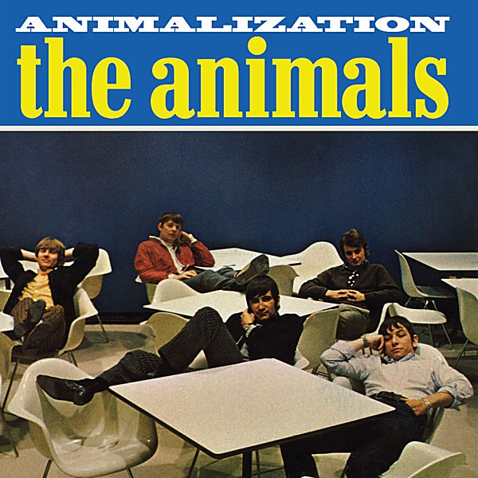

# Animalization

By **The Animals**

## Album Data

- **Catalog:** Beets
- **Format:** Digital, Album
- **Album:** Animalization
- **Artist:** The Animals
- **Albumartist:** The Animals
- **Genre:** Rock
- **MusicBrainz Album Artist ID:** [4d8afa16-4018-4ca8-8b5e-ede8f9314562](https://musicbrainz.org/artist/4d8afa16-4018-4ca8-8b5e-ede8f9314562)
- **MusicBrainz Album ID:** [99d0a2ac-1e51-42f7-b014-c360cd0c2f5e](https://musicbrainz.org/release/99d0a2ac-1e51-42f7-b014-c360cd0c2f5e)
- **MusicBrainz Release Group ID:** [76013fef-e9a1-350c-bd6c-dbbe1acb0086](https://musicbrainz.org/release-group/76013fef-e9a1-350c-bd6c-dbbe1acb0086)
- **Year:** 1966
- **Catalog #:** SE-4324
- **Label:** MGM Records
- **Total Tracks:** 11

## Album Tracks

### Track 01 - It's My Life

- **Artist:** The Animals
- **Format:** MP3
- **Genre:** Punk Rock
- **Length:** 3:09
- **MusicBrainz Track ID:** [ecbf5ffa-eb01-44a6-83e2-e35b02bff05c](https://musicbrainz.org/recording/ecbf5ffa-eb01-44a6-83e2-e35b02bff05c)
- **Title:** It's My Life
- **Track:** 01
- **Year:** 1966

### Track 02 - Gonna Send You Back to Walker

- **Artist:** The Animals
- **Format:** MP3
- **Genre:** Emo
- **Length:** 2:24
- **MusicBrainz Track ID:** [5b1fe3e6-a6d6-415d-90e5-ef4c677f5175](https://musicbrainz.org/recording/5b1fe3e6-a6d6-415d-90e5-ef4c677f5175)
- **Title:** Gonna Send You Back to Walker
- **Track:** 02
- **Year:** 1966

### Track 03 - Bring It On Home to Me

- **Artist:** The Animals
- **Format:** MP3
- **Genre:** Rock
- **Length:** 2:43
- **MusicBrainz Track ID:** [bb508158-0cfd-4f3d-9a73-ae8f010bdff2](https://musicbrainz.org/recording/bb508158-0cfd-4f3d-9a73-ae8f010bdff2)
- **Title:** Bring It On Home to Me
- **Track:** 03
- **Year:** 1966

### Track 04 - I'm Mad

- **Artist:** The Animals
- **Format:** MP3
- **Genre:** Rock And Roll
- **Length:** 4:18
- **MusicBrainz Track ID:** [a59b7459-0ea9-4ce4-a272-3bca08265651](https://musicbrainz.org/recording/a59b7459-0ea9-4ce4-a272-3bca08265651)
- **Title:** I'm Mad
- **Track:** 04
- **Year:** 1966

### Track 05 - House of the Rising Sun

- **Artist:** The Animals
- **Format:** MP3
- **Genre:** Rock
- **Length:** 4:28
- **MusicBrainz Track ID:** [1c4f7312-2f9f-4188-93c9-00971318f92c](https://musicbrainz.org/recording/1c4f7312-2f9f-4188-93c9-00971318f92c)
- **Title:** House of the Rising Sun
- **Track:** 05
- **Year:** 1966

### Track 06 - We Gotta Get Out of This Place

- **Artist:** The Animals
- **Format:** MP3
- **Genre:** Rock
- **Length:** 3:15
- **MusicBrainz Track ID:** [6120cd11-ad30-4d56-b8d3-9683f747fc50](https://musicbrainz.org/recording/6120cd11-ad30-4d56-b8d3-9683f747fc50)
- **Title:** We Gotta Get Out of This Place
- **Track:** 06
- **Year:** 1966

### Track 07 - Boom Boom

- **Artist:** The Animals
- **Format:** MP3
- **Genre:** Screamo
- **Length:** 3:00
- **MusicBrainz Track ID:** [6eb39da2-fd13-4ffb-a1cb-fa1a74b1f006](https://musicbrainz.org/recording/6eb39da2-fd13-4ffb-a1cb-fa1a74b1f006)
- **Title:** Boom Boom
- **Track:** 07
- **Year:** 1966

### Track 08 - I'm in Love Again

- **Artist:** The Animals
- **Format:** MP3
- **Genre:** Rock
- **Length:** 3:02
- **MusicBrainz Track ID:** [c0dca4c7-0ca0-4e1c-87c5-be6804d814c0](https://musicbrainz.org/recording/c0dca4c7-0ca0-4e1c-87c5-be6804d814c0)
- **Title:** I'm in Love Again
- **Track:** 08
- **Year:** 1966

### Track 09 - Roberta

- **Artist:** The Animals
- **Format:** MP3
- **Genre:** Rock And Roll
- **Length:** 2:07
- **MusicBrainz Track ID:** [28b69ec5-1e92-481e-a137-2e4a33760028](https://musicbrainz.org/recording/28b69ec5-1e92-481e-a137-2e4a33760028)
- **Title:** Roberta
- **Track:** 09
- **Year:** 1966

### Track 10 - I'm Crying

- **Artist:** The Animals
- **Format:** MP3
- **Genre:** Screamo
- **Length:** 2:46
- **MusicBrainz Track ID:** [34396b43-493e-4f2e-8407-6d57142eee3f](https://musicbrainz.org/recording/34396b43-493e-4f2e-8407-6d57142eee3f)
- **Title:** I'm Crying
- **Track:** 10
- **Year:** 1966

### Track 11 - Don't Let Me Be Misunderstood

- **Artist:** The Animals
- **Format:** MP3
- **Genre:** Rock
- **Length:** 2:26
- **MusicBrainz Track ID:** [e2db2b33-c2fa-407e-8ba5-475c1f720c9d](https://musicbrainz.org/recording/e2db2b33-c2fa-407e-8ba5-475c1f720c9d)
- **Title:** Don't Let Me Be Misunderstood
- **Track:** 11
- **Year:** 1966

## See also

- [Animalism](Animalism.md)
- [The Best Of The Animals Featuring Eric Burdon](The_Best_Of_The_Animals_Featuring_Eric_Burdon.md)
- [The Best of the Animals](The_Best_of_the_Animals.md)
- [Vinyl: Don't Bring Me Down](../../Vinyl/The_Animals/Dont_Bring_Me_Down.md)
- [Vinyl: ](../../Vinyl/The_Animals/The_Animals.md)
- [Vinyl: The Best Of The Animals](../../Vinyl/The_Animals/The_Best_Of_The_Animals.md)
- [Vinyl: The House Of The Rising Sun / I'm Crying](../../Vinyl/The_Animals/The_House_Of_The_Rising_Sun_-_Im_Crying.md)
