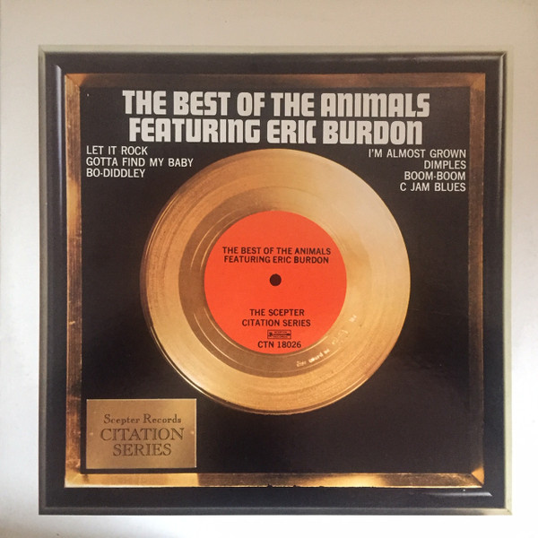

# The Best Of The Animals Featuring Eric Burdon

By **The Animals**

## Album Data

- **Catalog:** Beets
- **Format:** Digital, Album
- **Album:** The Best Of The Animals Featuring Eric Burdon
- **Artist:** The Animals
- **Albumartist:** The Animals
- **Genre:** Rock
- **MusicBrainz Album Artist ID:** 
- **MusicBrainz Album ID:** 
- **MusicBrainz Release Group ID:** 
- **Year:** 1973
- **Catalog #:** 
- **Label:** 
- **Total Tracks:** 00

## Album Tracks

### Track 01 - Let It Rock

- **Artist:** The Animals
- **Format:** MP3
- **Genre:** Hard Rock
- **Length:** 3:18
- **MusicBrainz Track ID:** 
- **Title:** Let It Rock
- **Track:** 01
- **Year:** 1973

### Track 02 - Gotta Find My Baby

- **Artist:** The Animals
- **Format:** MP3
- **Genre:** Screamo
- **Length:** 4:25
- **MusicBrainz Track ID:** 
- **Title:** Gotta Find My Baby
- **Track:** 02
- **Year:** 1973

### Track 03 - Bo Diddley

- **Artist:** The Animals
- **Format:** MP3
- **Genre:** Rock And Roll
- **Length:** 7:41
- **MusicBrainz Track ID:** 
- **Title:** Bo Diddley
- **Track:** 03
- **Year:** 1973

### Track 04 - I'm Almost Grown

- **Artist:** The Animals
- **Format:** MP3
- **Genre:** Rock
- **Length:** 4:17
- **MusicBrainz Track ID:** 
- **Title:** I'm Almost Grown
- **Track:** 04
- **Year:** 1973

### Track 05 - Dimples

- **Artist:** The Animals
- **Format:** MP3
- **Genre:** Rock And Roll
- **Length:** 3:36
- **MusicBrainz Track ID:** 
- **Title:** Dimples
- **Track:** 05
- **Year:** 1973

### Track 06 - Boom Boom

- **Artist:** The Animals
- **Format:** MP3
- **Genre:** Screamo
- **Length:** 5:00
- **MusicBrainz Track ID:** 
- **Title:** Boom Boom
- **Track:** 06
- **Year:** 1973

### Track 07 - C Jam Blues

- **Artist:** The Animals
- **Format:** MP3
- **Genre:** Rock
- **Length:** 4:26
- **MusicBrainz Track ID:** 
- **Title:** C Jam Blues
- **Track:** 07
- **Year:** 1973

## See also

- [Animalism](Animalism.md)
- [Animalization](Animalization.md)
- [The Best of the Animals](The_Best_of_the_Animals.md)
- [Vinyl: Don't Bring Me Down](../../Vinyl/The_Animals/Dont_Bring_Me_Down.md)
- [Vinyl: ](../../Vinyl/The_Animals/The_Animals.md)
- [Vinyl: The Best Of The Animals](../../Vinyl/The_Animals/The_Best_Of_The_Animals.md)
- [Vinyl: The House Of The Rising Sun / I'm Crying](../../Vinyl/The_Animals/The_House_Of_The_Rising_Sun_-_Im_Crying.md)
