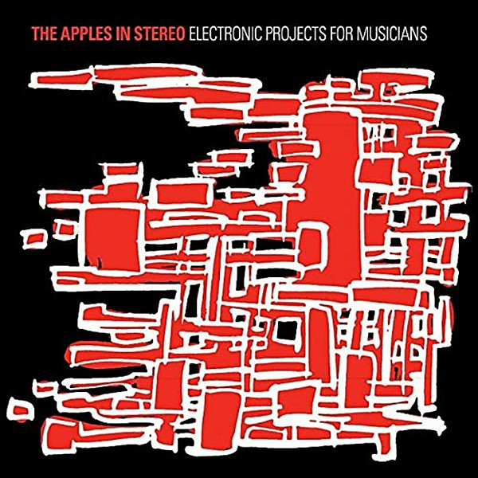

# Electronic Projects for Musicians

By **The Apples In Stereo**

## Album Data

- **Catalog:** Beets
- **Format:** Digital, Album
- **Album:** Electronic Projects for Musicians
- **Artist:** The Apples In Stereo
- **Albumartist:** The Apples In Stereo
- **Genre:** Indie Pop
- **MusicBrainz Album Artist ID:** 
- **MusicBrainz Album ID:** 
- **MusicBrainz Release Group ID:** 
- **Year:** 2008
- **Catalog #:** 
- **Label:** 
- **Total Tracks:** 00

## Album Tracks

### Track 13 - Stephen Stephen

- **Artist:** The Apples In Stereo
- **Format:** AAC
- **Genre:** Power Pop
- **Length:** 1:50
- **MusicBrainz Track ID:** 
- **Title:** Stephen Stephen
- **Track:** 13
- **Year:** 2008

## See also

- [New Magnetic Wonder](New_Magnetic_Wonder.md)
