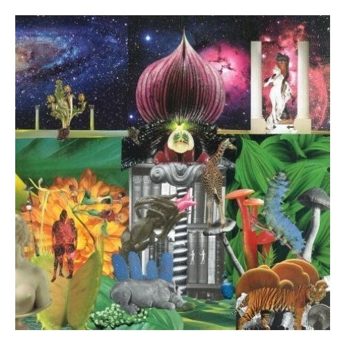

# New Magnetic Wonder

By **The Apples in Stereo**

## Album Data

- **Catalog:** Beets
- **Format:** Digital, Album
- **Album:** New Magnetic Wonder
- **Artist:** The Apples In Stereo
- **Albumartist:** The Apples in Stereo
- **Genre:** Indie Pop
- **MusicBrainz Album Artist ID:** [ea075268-e5ea-40f7-b9c3-68b039218a88](https://musicbrainz.org/artist/ea075268-e5ea-40f7-b9c3-68b039218a88)
- **MusicBrainz Album ID:** [475be3b5-e69b-389a-ac85-d320d66d542a](https://musicbrainz.org/release/475be3b5-e69b-389a-ac85-d320d66d542a)
- **MusicBrainz Release Group ID:** [a5c01129-f2f6-356c-b418-55c5500b220b](https://musicbrainz.org/release-group/a5c01129-f2f6-356c-b418-55c5500b220b)
- **Year:** 2007
- **Catalog #:** 
- **Label:** 
- **Total Tracks:** 00

## Album Tracks

### Track 13 - Stephen Stephen

- **Artist:** The Apples In Stereo
- **Format:** AAC
- **Genre:** Power Pop
- **Length:** 1:50
- **MusicBrainz Track ID:** 
- **Title:** Stephen Stephen
- **Track:** 13
- **Year:** 2008

## See also

- [Electronic Projects for Musicians](Electronic_Projects_for_Musicians.md)
