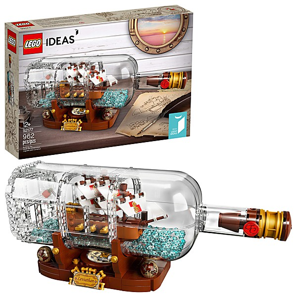

# Listen... We Are Going To Have A Conversation

By **The Arcadists**

## Album Data

- **Catalog:** Beets
- **Format:** Digital, Album
- **Album:** Listen... We Are Going To Have A Conversation
- **Artist:** The Arcadists
- **Albumartist:** The Arcadists
- **Genre:** Rock
- **MusicBrainz Album Artist ID:** 
- **MusicBrainz Album ID:** 
- **MusicBrainz Release Group ID:** 
- **Year:** 2008
- **Catalog #:** 
- **Label:** 
- **Total Tracks:** 05

## Album Tracks

### Track 01 - Way Of The Groupie

- **Artist:** The Arcadists
- **Format:** ALAC
- **Genre:** Rock
- **Length:** 2:28
- **MusicBrainz Track ID:** 
- **Title:** Way Of The Groupie
- **Track:** 01
- **Year:** 2008

### Track 02 - Faulterers Of What Really Matters

- **Artist:** The Arcadists
- **Format:** ALAC
- **Genre:** Rock
- **Length:** 4:17
- **MusicBrainz Track ID:** 
- **Title:** Faulterers Of What Really Matters
- **Track:** 02
- **Year:** 2008

### Track 03 - Josephine

- **Artist:** The Arcadists
- **Format:** ALAC
- **Genre:** Rock
- **Length:** 4:15
- **MusicBrainz Track ID:** 
- **Title:** Josephine
- **Track:** 03
- **Year:** 2008

### Track 04 - Sips Of Sin

- **Artist:** The Arcadists
- **Format:** ALAC
- **Genre:** Rock
- **Length:** 4:36
- **MusicBrainz Track ID:** 
- **Title:** Sips Of Sin
- **Track:** 04
- **Year:** 2008

### Track 05 - Lights On The Town

- **Artist:** The Arcadists
- **Format:** ALAC
- **Genre:** Rock
- **Length:** 4:23
- **MusicBrainz Track ID:** 
- **Title:** Lights On The Town
- **Track:** 05
- **Year:** 2008

