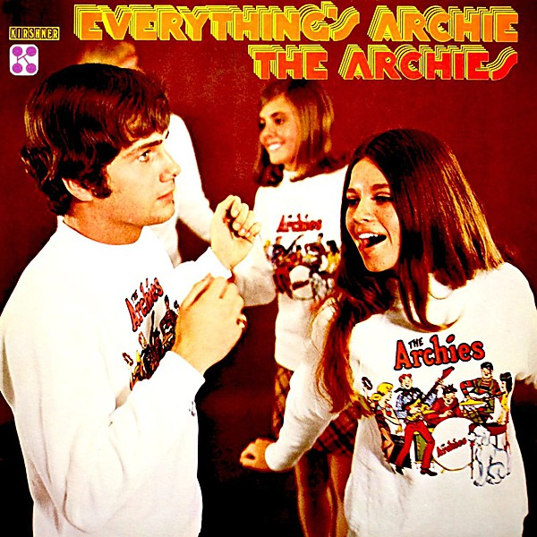

# Everything's Archie

By **The Archies**

## Album Data

- **Catalog:** Beets
- **Format:** Digital, Album
- **Album:** Everything's Archie
- **Artist:** The Archies
- **Albumartist:** The Archies
- **Genre:** Pop
- **MusicBrainz Album Artist ID:** [623d5f3f-3093-4711-881f-ed33eda10882](https://musicbrainz.org/artist/623d5f3f-3093-4711-881f-ed33eda10882)
- **MusicBrainz Album ID:** [3ab88925-92ec-4ed0-a1eb-a2bf887d162d](https://musicbrainz.org/release/3ab88925-92ec-4ed0-a1eb-a2bf887d162d)
- **MusicBrainz Release Group ID:** [d8d91e09-97ab-3f5a-a934-18c72c1273e4](https://musicbrainz.org/release-group/d8d91e09-97ab-3f5a-a934-18c72c1273e4)
- **Year:** 1969
- **Catalog #:** 
- **Label:** 
- **Total Tracks:** 00

## Album Tracks

### Track 01 - Sugar, Sugar

- **Artist:** The Archies
- **Format:** AAC
- **Genre:** Rock
- **Length:** 2:52
- **MusicBrainz Track ID:** 
- **Title:** Sugar, Sugar
- **Track:** 01
- **Year:** 1999

## See also

- [The Very Best of the Archies [Cleopatra]](The_Very_Best_of_the_Archies_[Cleopatra].md)
- [Vinyl: Everything's Archie](../../Vinyl/The_Archies/Everythings_Archie.md)
- [Vinyl: ](../../Vinyl/The_Archies/The_Archies.md)
