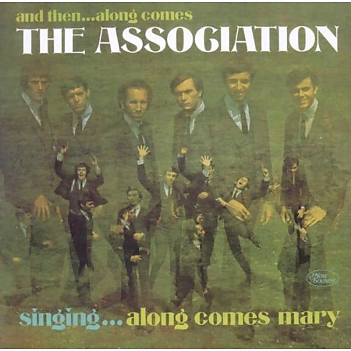

# And Then… Along Comes the Association

By **The Association**

## Album Data

- **Catalog:** Beets
- **Format:** Digital, Album
- **Album:** And Then… Along Comes the Association
- **Artist:** The Association
- **Albumartist:** The Association
- **Genre:** Sunshine Pop
- **MusicBrainz Album Artist ID:** [e1fae923-bf20-4d7b-89fb-38ecc0a8236b](https://musicbrainz.org/artist/e1fae923-bf20-4d7b-89fb-38ecc0a8236b)
- **MusicBrainz Album ID:** [37f0b806-c15a-3320-8ca3-32b35720097a](https://musicbrainz.org/release/37f0b806-c15a-3320-8ca3-32b35720097a)
- **MusicBrainz Release Group ID:** [beb35a57-ab3b-3ff8-ac2e-f2dc4600fd3e](https://musicbrainz.org/release-group/beb35a57-ab3b-3ff8-ac2e-f2dc4600fd3e)
- **Year:** 2006
- **Catalog #:** W-1702
- **Label:** Warner Bros. Records
- **Total Tracks:** 12

## Album Tracks

### Track 01 - Enter the Young

- **Artist:** The Association
- **Format:** MP3
- **Genre:** Pop Rock
- **Length:** 2:48
- **MusicBrainz Track ID:** [9ce26e0e-078f-4f1c-bcb5-79c10f5c0c6c](https://musicbrainz.org/recording/9ce26e0e-078f-4f1c-bcb5-79c10f5c0c6c)
- **Title:** Enter the Young
- **Track:** 01
- **Year:** 2006

### Track 02 - Your Own Love

- **Artist:** The Association
- **Format:** MP3
- **Genre:** Pop Rock
- **Length:** 2:24
- **MusicBrainz Track ID:** [e2946cd2-3031-4025-a14a-7b10101e7da4](https://musicbrainz.org/recording/e2946cd2-3031-4025-a14a-7b10101e7da4)
- **Title:** Your Own Love
- **Track:** 02
- **Year:** 2006

### Track 03 - Don’t Blame It On Me

- **Artist:** The Association
- **Format:** MP3
- **Genre:** Sunshine Pop
- **Length:** 2:32
- **MusicBrainz Track ID:** [8c310cc7-a308-4058-a2f9-f6891907f717](https://musicbrainz.org/recording/8c310cc7-a308-4058-a2f9-f6891907f717)
- **Title:** Don’t Blame It On Me
- **Track:** 03
- **Year:** 2006

### Track 04 - Blistered

- **Artist:** The Association
- **Format:** MP3
- **Genre:** Sunshine Pop
- **Length:** 1:54
- **MusicBrainz Track ID:** [8139ad13-96f9-462b-8d62-ad9d931f5516](https://musicbrainz.org/recording/8139ad13-96f9-462b-8d62-ad9d931f5516)
- **Title:** Blistered
- **Track:** 04
- **Year:** 2006

### Track 05 - I’ll Be Your Man

- **Artist:** The Association
- **Format:** MP3
- **Genre:** Sunshine Pop
- **Length:** 2:50
- **MusicBrainz Track ID:** [40e72c04-ce67-4647-9c13-394cb15c84e8](https://musicbrainz.org/recording/40e72c04-ce67-4647-9c13-394cb15c84e8)
- **Title:** I’ll Be Your Man
- **Track:** 05
- **Year:** 2006

### Track 06 - Along Comes Mary

- **Artist:** The Association
- **Format:** MP3
- **Genre:** Sunshine Pop
- **Length:** 2:51
- **MusicBrainz Track ID:** [7d5985cd-013e-4117-ba5d-efc3badf1f7a](https://musicbrainz.org/recording/7d5985cd-013e-4117-ba5d-efc3badf1f7a)
- **Title:** Along Comes Mary
- **Track:** 06
- **Year:** 2006

### Track 07 - Cherish

- **Artist:** The Association
- **Format:** MP3
- **Genre:** Sunshine Pop
- **Length:** 3:29
- **MusicBrainz Track ID:** [c0db7ad3-ae24-4dd2-902d-0c091a2018e6](https://musicbrainz.org/recording/c0db7ad3-ae24-4dd2-902d-0c091a2018e6)
- **Title:** Cherish
- **Track:** 07
- **Year:** 2006

### Track 08 - Standing Still

- **Artist:** The Association
- **Format:** MP3
- **Genre:** Pop Rock
- **Length:** 2:48
- **MusicBrainz Track ID:** [0ec9294c-36a5-4fcb-b0d9-7e95ba0ccbf3](https://musicbrainz.org/recording/0ec9294c-36a5-4fcb-b0d9-7e95ba0ccbf3)
- **Title:** Standing Still
- **Track:** 08
- **Year:** 2006

### Track 09 - Message of Our Love

- **Artist:** The Association
- **Format:** MP3
- **Genre:** Pop Rock
- **Length:** 3:59
- **MusicBrainz Track ID:** [975017d1-dc4f-46a5-b449-3bce15af198d](https://musicbrainz.org/recording/975017d1-dc4f-46a5-b449-3bce15af198d)
- **Title:** Message of Our Love
- **Track:** 09
- **Year:** 2006

### Track 10 - Round Again

- **Artist:** The Association
- **Format:** MP3
- **Genre:** Pop Rock
- **Length:** 1:54
- **MusicBrainz Track ID:** [7bf5902b-8386-4005-9bf0-0ed9a7c372cc](https://musicbrainz.org/recording/7bf5902b-8386-4005-9bf0-0ed9a7c372cc)
- **Title:** Round Again
- **Track:** 10
- **Year:** 2006

### Track 11 - Remember

- **Artist:** The Association
- **Format:** MP3
- **Genre:** Pop Rock
- **Length:** 2:41
- **MusicBrainz Track ID:** [4883ced5-ed43-41ab-8308-14b6f7fc6074](https://musicbrainz.org/recording/4883ced5-ed43-41ab-8308-14b6f7fc6074)
- **Title:** Remember
- **Track:** 11
- **Year:** 2006

### Track 12 - Changes

- **Artist:** The Association
- **Format:** MP3
- **Genre:** Sunshine Pop
- **Length:** 2:35
- **MusicBrainz Track ID:** [b7461418-3998-4c76-8d6f-b086da0601f5](https://musicbrainz.org/recording/b7461418-3998-4c76-8d6f-b086da0601f5)
- **Title:** Changes
- **Track:** 12
- **Year:** 2006

## See also

- [Roon: And Then... Along Comes The Association (Remastered)](../../Roon/The_Association/And_Then_Along_Comes_The_Association_Remastered.md)
- [Roon: Greatest Hits](../../Roon/The_Association/Greatest_Hits.md)
- [Roon: Renaissance (Remastered)](../../Roon/The_Association/Renaissance_Remastered.md)
- [Vinyl: And Then...Along Comes The Association](../../Vinyl/The_Association/And_ThenAlong_Comes_The_Association.md)
- [Vinyl: ](../../Vinyl/The_Association/The_Association.md)
