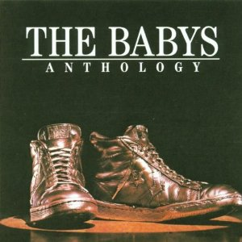

# Anthology

By **The Babys**

## Album Data

- **Catalog:** Beets
- **Format:** Digital, Album
- **Album:** Anthology
- **Artist:** The Babys
- **Albumartist:** The Babys
- **Genre:** Power Pop
- **MusicBrainz Album Artist ID:** [1a3c6e99-8dad-4302-805b-fb373ff2d5f4](https://musicbrainz.org/artist/1a3c6e99-8dad-4302-805b-fb373ff2d5f4)
- **MusicBrainz Album ID:** [08b4acc4-4fe4-4b67-bf76-11d8a846049c](https://musicbrainz.org/release/08b4acc4-4fe4-4b67-bf76-11d8a846049c)
- **MusicBrainz Release Group ID:** [857e093c-fa1e-372c-9f5c-9cbd6b98df7d](https://musicbrainz.org/release-group/857e093c-fa1e-372c-9f5c-9cbd6b98df7d)
- **Year:** 2000
- **Catalog #:** 7243 5 23106 2 3
- **Label:** Capitol Records
- **Total Tracks:** 17

## Album Tracks

### Track 01 - If You've Got the Time

- **Artist:** The Babys
- **Format:** ALAC
- **Genre:** Hard Rock
- **Length:** 2:35
- **MusicBrainz Track ID:** [dc37d640-b2b6-4b2c-b4f4-baef080bbe41](https://musicbrainz.org/recording/dc37d640-b2b6-4b2c-b4f4-baef080bbe41)
- **Title:** If You've Got the Time
- **Track:** 01
- **Year:** 2000

### Track 02 - Head Above the Waves

- **Artist:** The Babys
- **Format:** ALAC
- **Genre:** Rock
- **Length:** 2:50
- **MusicBrainz Track ID:** [77e57aea-d9de-4dee-9f2f-3de00d06c876](https://musicbrainz.org/recording/77e57aea-d9de-4dee-9f2f-3de00d06c876)
- **Title:** Head Above the Waves
- **Track:** 02
- **Year:** 2000

### Track 03 - I Love How You Love Me

- **Artist:** The Babys
- **Format:** ALAC
- **Genre:** Rock
- **Length:** 2:25
- **MusicBrainz Track ID:** [8eabf5a2-e975-4b9b-a994-93944be655ff](https://musicbrainz.org/recording/8eabf5a2-e975-4b9b-a994-93944be655ff)
- **Title:** I Love How You Love Me
- **Track:** 03
- **Year:** 2000

### Track 04 - Looking for Love (live)

- **Artist:** The Babys
- **Format:** ALAC
- **Genre:** Power Pop
- **Length:** 5:23
- **MusicBrainz Track ID:** [1696116a-ca93-485e-ac6f-c87c6159b3a8](https://musicbrainz.org/recording/1696116a-ca93-485e-ac6f-c87c6159b3a8)
- **Title:** Looking for Love (live)
- **Track:** 04
- **Year:** 2000

### Track 05 - Isn't It Time

- **Artist:** The Babys
- **Format:** ALAC
- **Genre:** Soft Rock
- **Length:** 4:04
- **MusicBrainz Track ID:** [7f8e980c-c386-4d5e-8dee-caa5f851a14a](https://musicbrainz.org/recording/7f8e980c-c386-4d5e-8dee-caa5f851a14a)
- **Title:** Isn't It Time
- **Track:** 05
- **Year:** 2000

### Track 06 - Give Me Your Love

- **Artist:** The Babys
- **Format:** ALAC
- **Genre:** Hard Rock
- **Length:** 3:36
- **MusicBrainz Track ID:** [f232cb6a-94ab-47c4-9c99-cdbfd43f3f96](https://musicbrainz.org/recording/f232cb6a-94ab-47c4-9c99-cdbfd43f3f96)
- **Title:** Give Me Your Love
- **Track:** 06
- **Year:** 2000

### Track 07 - Silver Dreams

- **Artist:** The Babys
- **Format:** ALAC
- **Genre:** Soft Rock
- **Length:** 3:02
- **MusicBrainz Track ID:** [ff72182e-7bf6-465f-a2e6-b447e5cc720b](https://musicbrainz.org/recording/ff72182e-7bf6-465f-a2e6-b447e5cc720b)
- **Title:** Silver Dreams
- **Track:** 07
- **Year:** 2000

### Track 08 - Money

- **Artist:** The Babys
- **Format:** ALAC
- **Genre:** Power Pop
- **Length:** 2:57
- **MusicBrainz Track ID:** [95d28c42-9d98-48e5-948f-5c13edbb9271](https://musicbrainz.org/recording/95d28c42-9d98-48e5-948f-5c13edbb9271)
- **Title:** Money
- **Track:** 08
- **Year:** 2000

### Track 09 - Every Time I Think of You

- **Artist:** The Babys
- **Format:** ALAC
- **Genre:** Soft Rock
- **Length:** 4:03
- **MusicBrainz Track ID:** [f1f5b249-3678-462b-ae26-742bb097969c](https://musicbrainz.org/recording/f1f5b249-3678-462b-ae26-742bb097969c)
- **Title:** Every Time I Think of You
- **Track:** 09
- **Year:** 2000

### Track 10 - Head First

- **Artist:** The Babys
- **Format:** ALAC
- **Genre:** Power Pop
- **Length:** 3:58
- **MusicBrainz Track ID:** [8ca2443a-b0cd-45ee-8013-33bc86502d9e](https://musicbrainz.org/recording/8ca2443a-b0cd-45ee-8013-33bc86502d9e)
- **Title:** Head First
- **Track:** 10
- **Year:** 2000

### Track 11 - Love Don't Prove I'm Right

- **Artist:** The Babys
- **Format:** ALAC
- **Genre:** Hard Rock
- **Length:** 2:45
- **MusicBrainz Track ID:** [cbb6e214-44c4-4816-be5a-014272ec36ac](https://musicbrainz.org/recording/cbb6e214-44c4-4816-be5a-014272ec36ac)
- **Title:** Love Don't Prove I'm Right
- **Track:** 11
- **Year:** 2000

### Track 12 - Back on My Feet Again

- **Artist:** The Babys
- **Format:** ALAC
- **Genre:** Soft Rock
- **Length:** 3:18
- **MusicBrainz Track ID:** [b8574b12-8e52-4880-9393-adf6d1b2cc26](https://musicbrainz.org/recording/b8574b12-8e52-4880-9393-adf6d1b2cc26)
- **Title:** Back on My Feet Again
- **Track:** 12
- **Year:** 2000

### Track 13 - Midnight Rendezvous

- **Artist:** The Babys
- **Format:** ALAC
- **Genre:** Hard Rock
- **Length:** 3:36
- **MusicBrainz Track ID:** [30efa2d6-166b-4326-8124-a1bdd1737506](https://musicbrainz.org/recording/30efa2d6-166b-4326-8124-a1bdd1737506)
- **Title:** Midnight Rendezvous
- **Track:** 13
- **Year:** 2000

### Track 14 - Anytime

- **Artist:** The Babys
- **Format:** ALAC
- **Genre:** Hard Rock
- **Length:** 3:22
- **MusicBrainz Track ID:** [23ab687b-daac-4459-aa21-2522ba38a1aa](https://musicbrainz.org/recording/23ab687b-daac-4459-aa21-2522ba38a1aa)
- **Title:** Anytime
- **Track:** 14
- **Year:** 2000

### Track 15 - Turn and Walk Away

- **Artist:** The Babys
- **Format:** ALAC
- **Genre:** Hard Rock
- **Length:** 3:10
- **MusicBrainz Track ID:** [0308a755-24b5-4fe0-bde7-b01ad819def8](https://musicbrainz.org/recording/0308a755-24b5-4fe0-bde7-b01ad819def8)
- **Title:** Turn and Walk Away
- **Track:** 15
- **Year:** 2000

### Track 16 - Sweet 17

- **Artist:** The Babys
- **Format:** ALAC
- **Genre:** Hard Rock
- **Length:** 2:47
- **MusicBrainz Track ID:** [b2d709ff-6fa4-4b1e-b486-a6952e19ee49](https://musicbrainz.org/recording/b2d709ff-6fa4-4b1e-b486-a6952e19ee49)
- **Title:** Sweet 17
- **Track:** 16
- **Year:** 2000

### Track 17 - Gonna Be Somebody

- **Artist:** The Babys
- **Format:** ALAC
- **Genre:** Rock
- **Length:** 2:59
- **MusicBrainz Track ID:** [e59c6257-5a5a-459a-86f2-da4b4c05d9f5](https://musicbrainz.org/recording/e59c6257-5a5a-459a-86f2-da4b4c05d9f5)
- **Title:** Gonna Be Somebody
- **Track:** 17
- **Year:** 2000

