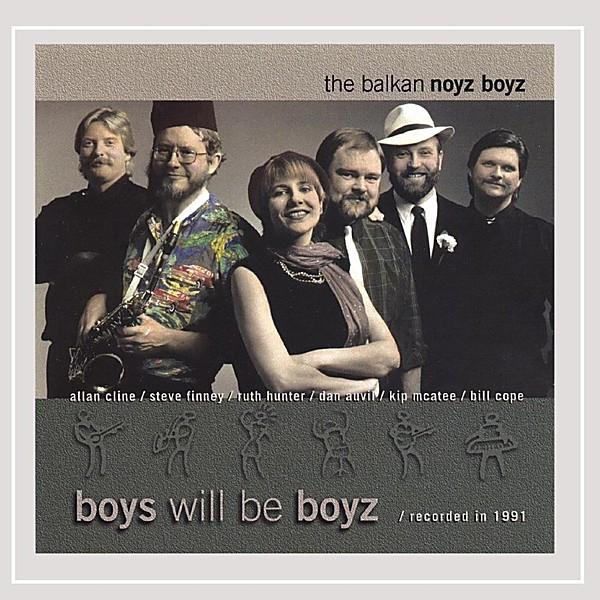

# Boyz Will Be Boyz

By **The Balkan Noyz Boyz**

## Album Data

- **Catalog:** Beets
- **Format:** Digital, Album
- **Album:** Boyz Will Be Boyz
- **Artist:** The Balkan Noyz Boyz
- **Albumartist:** The Balkan Noyz Boyz
- **Genre:** Jazz
- **MusicBrainz Album Artist ID:** 
- **MusicBrainz Album ID:** 
- **MusicBrainz Release Group ID:** 
- **Year:** 1991
- **Catalog #:** 
- **Label:** 
- **Total Tracks:** 00

## Album Tracks

### Track 01 - Čoček Mambo

- **Artist:** The Balkan Noyz Boyz
- **Format:** MP3
- **Genre:** Jazz
- **Length:** 4:38
- **MusicBrainz Track ID:** 
- **Title:** Čoček Mambo
- **Track:** 01
- **Year:** 1991

### Track 02 - O Male

- **Artist:** The Balkan Noyz Boyz
- **Format:** MP3
- **Genre:** Jazz
- **Length:** 4:34
- **MusicBrainz Track ID:** 
- **Title:** O Male
- **Track:** 02
- **Year:** 1991

### Track 03 - Pamela's Ručenica

- **Artist:** The Balkan Noyz Boyz
- **Format:** MP3
- **Genre:** Jazz
- **Length:** 3:30
- **MusicBrainz Track ID:** 
- **Title:** Pamela's Ručenica
- **Track:** 03
- **Year:** 1991

### Track 04 - Katerino Mome

- **Artist:** The Balkan Noyz Boyz
- **Format:** MP3
- **Genre:** Jazz
- **Length:** 5:03
- **MusicBrainz Track ID:** 
- **Title:** Katerino Mome
- **Track:** 04
- **Year:** 1991

### Track 05 - Pleasant Peasant

- **Artist:** The Balkan Noyz Boyz
- **Format:** MP3
- **Genre:** Jazz
- **Length:** 3:13
- **MusicBrainz Track ID:** 
- **Title:** Pleasant Peasant
- **Track:** 05
- **Year:** 1991

### Track 06 - Jano Janke

- **Artist:** The Balkan Noyz Boyz
- **Format:** MP3
- **Genre:** Jazz
- **Length:** 5:04
- **MusicBrainz Track ID:** 
- **Title:** Jano Janke
- **Track:** 06
- **Year:** 1991

### Track 07 - Trugnali Mome Nevesti

- **Artist:** The Balkan Noyz Boyz
- **Format:** MP3
- **Genre:** Jazz
- **Length:** 6:50
- **MusicBrainz Track ID:** 
- **Title:** Trugnali Mome Nevesti
- **Track:** 07
- **Year:** 1991

### Track 08 - Malko Pajduško

- **Artist:** The Balkan Noyz Boyz
- **Format:** MP3
- **Genre:** Jazz
- **Length:** 4:26
- **MusicBrainz Track ID:** 
- **Title:** Malko Pajduško
- **Track:** 08
- **Year:** 1991

### Track 09 - Čoček '80

- **Artist:** The Balkan Noyz Boyz
- **Format:** MP3
- **Genre:** Jazz
- **Length:** 5:50
- **MusicBrainz Track ID:** 
- **Title:** Čoček '80
- **Track:** 09
- **Year:** 1991

### Track 10 - Mori Mare

- **Artist:** The Balkan Noyz Boyz
- **Format:** MP3
- **Genre:** Jazz
- **Length:** 4:52
- **MusicBrainz Track ID:** 
- **Title:** Mori Mare
- **Track:** 10
- **Year:** 1991

### Track 11 - Levendikos

- **Artist:** The Balkan Noyz Boyz
- **Format:** MP3
- **Genre:** Jazz
- **Length:** 4:37
- **MusicBrainz Track ID:** 
- **Title:** Levendikos
- **Track:** 11
- **Year:** 1991

## See also

- [Roon: Boys Will Be Boyz](../../Roon/The_Balkan_Noyz_Boyz/Boys_Will_Be_Boyz.md)
