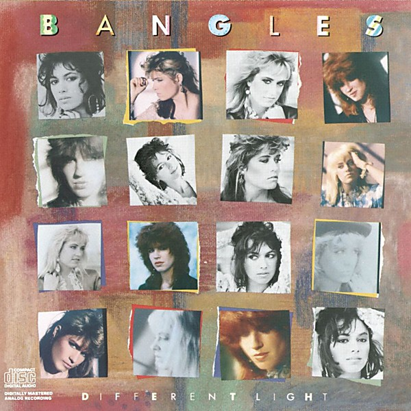

# Different Light

By **The Bangles**

## Album Data

- **Catalog:** Beets
- **Format:** Digital, Album
- **Album:** Different Light
- **Artist:** The Bangles
- **Albumartist:** The Bangles
- **Genre:** Pop Rock
- **MusicBrainz Album Artist ID:** [f31ec2ac-9071-4306-acd1-d2c8321033b5](https://musicbrainz.org/artist/f31ec2ac-9071-4306-acd1-d2c8321033b5)
- **MusicBrainz Album ID:** [88395238-d787-41ee-bfd5-134e4bf31475](https://musicbrainz.org/release/88395238-d787-41ee-bfd5-134e4bf31475)
- **MusicBrainz Release Group ID:** [d583565f-0cb4-324d-86f4-79bd44f40039](https://musicbrainz.org/release-group/d583565f-0cb4-324d-86f4-79bd44f40039)
- **Year:** 1986
- **Catalog #:** 
- **Label:** Down Kiddie Records
- **Total Tracks:** 16

## Album Tracks

### Track 01 - Bitchen Summer / Speedway

- **Artist:** The Bangles
- **Format:** ALAC
- **Genre:** New Wave
- **Length:** 2:49
- **MusicBrainz Track ID:** [4a93852a-c486-4f33-96fe-44f4982cf7cb](https://musicbrainz.org/recording/4a93852a-c486-4f33-96fe-44f4982cf7cb)
- **Title:** Bitchen Summer / Speedway
- **Track:** 01
- **Year:** 2014

### Track 02 - Getting Out of Hand

- **Artist:** The Bangles
- **Format:** ALAC
- **Genre:** Pop Rock
- **Length:** 2:15
- **MusicBrainz Track ID:** [83eeb9be-462c-43d9-ae1a-4593932c4660](https://musicbrainz.org/recording/83eeb9be-462c-43d9-ae1a-4593932c4660)
- **Title:** Getting Out of Hand
- **Track:** 02
- **Year:** 2014

### Track 03 - Call on Me

- **Artist:** The Bangles
- **Format:** ALAC
- **Genre:** New Wave
- **Length:** 1:33
- **MusicBrainz Track ID:** [cc297876-468f-4302-9ed0-52bf188b2720](https://musicbrainz.org/recording/cc297876-468f-4302-9ed0-52bf188b2720)
- **Title:** Call on Me
- **Track:** 03
- **Year:** 2014

### Track 04 - The Real World

- **Artist:** The Bangles
- **Format:** ALAC
- **Genre:** Psychedelic Rock
- **Length:** 2:35
- **MusicBrainz Track ID:** [b19bc9ce-423f-476c-9393-69cce86cc68f](https://musicbrainz.org/recording/b19bc9ce-423f-476c-9393-69cce86cc68f)
- **Title:** The Real World
- **Track:** 04
- **Year:** 2014

### Track 05 - I’m in Line

- **Artist:** The Bangles
- **Format:** ALAC
- **Genre:** New Wave
- **Length:** 3:04
- **MusicBrainz Track ID:** [375c6780-de43-4b38-9e9c-40bcbb89480e](https://musicbrainz.org/recording/375c6780-de43-4b38-9e9c-40bcbb89480e)
- **Title:** I’m in Line
- **Track:** 05
- **Year:** 2014

### Track 06 - Want You

- **Artist:** The Bangles
- **Format:** ALAC
- **Genre:** New Wave
- **Length:** 2:18
- **MusicBrainz Track ID:** [3a5e0e6d-d5ea-403c-904b-ffb1e359396e](https://musicbrainz.org/recording/3a5e0e6d-d5ea-403c-904b-ffb1e359396e)
- **Title:** Want You
- **Track:** 06
- **Year:** 2014

### Track 07 - Mary Street

- **Artist:** The Bangles
- **Format:** ALAC
- **Genre:** New Wave
- **Length:** 2:41
- **MusicBrainz Track ID:** [88758504-9f97-47f5-b4c2-e5413b0a22ab](https://musicbrainz.org/recording/88758504-9f97-47f5-b4c2-e5413b0a22ab)
- **Title:** Mary Street
- **Track:** 07
- **Year:** 2014

### Track 08 - How Is the Air Up There?

- **Artist:** The Bangles
- **Format:** ALAC
- **Genre:** New Wave
- **Length:** 2:56
- **MusicBrainz Track ID:** [4450eaef-c81a-4c38-8c45-6c5d9b685139](https://musicbrainz.org/recording/4450eaef-c81a-4c38-8c45-6c5d9b685139)
- **Title:** How Is the Air Up There?
- **Track:** 08
- **Year:** 2014

### Track 09 - Outside Chance (demo version)

- **Artist:** The Bangles
- **Format:** ALAC
- **Genre:** New Wave
- **Length:** 1:54
- **MusicBrainz Track ID:** [5ad82afa-06ce-49fe-96a3-a6f2ba47f0c2](https://musicbrainz.org/recording/5ad82afa-06ce-49fe-96a3-a6f2ba47f0c2)
- **Title:** Outside Chance (demo version)
- **Track:** 09
- **Year:** 2014

### Track 10 - Steppin’ Out (demo version)

- **Artist:** The Bangles
- **Format:** ALAC
- **Genre:** New Wave
- **Length:** 2:15
- **MusicBrainz Track ID:** [45a5270a-3899-44c9-aaa4-dcb46304fb9d](https://musicbrainz.org/recording/45a5270a-3899-44c9-aaa4-dcb46304fb9d)
- **Title:** Steppin’ Out (demo version)
- **Track:** 10
- **Year:** 2014

### Track 11 - The Real World (demo version)

- **Artist:** The Bangles
- **Format:** ALAC
- **Genre:** New Wave
- **Length:** 1:57
- **MusicBrainz Track ID:** [25267f6c-7cf8-4daa-a508-b36350ea4332](https://musicbrainz.org/recording/25267f6c-7cf8-4daa-a508-b36350ea4332)
- **Title:** The Real World (demo version)
- **Track:** 11
- **Year:** 2014

### Track 12 - Call On Me (demo version)

- **Artist:** The Bangles
- **Format:** ALAC
- **Genre:** New Wave
- **Length:** 1:41
- **MusicBrainz Track ID:** [29adb42b-a22b-4b09-8d5b-19ff153ba6da](https://musicbrainz.org/recording/29adb42b-a22b-4b09-8d5b-19ff153ba6da)
- **Title:** Call On Me (demo version)
- **Track:** 12
- **Year:** 2014

### Track 13 - Tell Me (live)

- **Artist:** The Bangles
- **Format:** ALAC
- **Genre:** New Wave
- **Length:** 2:14
- **MusicBrainz Track ID:** [665ea678-b13f-4a89-a88c-198d93cc249c](https://musicbrainz.org/recording/665ea678-b13f-4a89-a88c-198d93cc249c)
- **Title:** Tell Me (live)
- **Track:** 13
- **Year:** 2014

### Track 14 - 7 & 7 Is (live)

- **Artist:** The Bangles
- **Format:** ALAC
- **Genre:** New Wave
- **Length:** 2:04
- **MusicBrainz Track ID:** [024e7732-1c5d-4330-9869-b1975dbe4f1a](https://musicbrainz.org/recording/024e7732-1c5d-4330-9869-b1975dbe4f1a)
- **Title:** 7 & 7 Is (live)
- **Track:** 14
- **Year:** 2014

### Track 15 - No Mag Commercial

- **Artist:** The Bangles
- **Format:** ALAC
- **Genre:** New Wave
- **Length:** 0:39
- **MusicBrainz Track ID:** [7cefa7f1-5111-4c85-8972-861e04094ab9](https://musicbrainz.org/recording/7cefa7f1-5111-4c85-8972-861e04094ab9)
- **Title:** No Mag Commercial
- **Track:** 15
- **Year:** 2014

### Track 16 - The Rock & Roll Alternative Theme Song

- **Artist:** The Bangles
- **Format:** ALAC
- **Genre:** New Wave
- **Length:** 2:17
- **MusicBrainz Track ID:** [6a57d5fd-fbbc-4f31-84f8-deafb0724438](https://musicbrainz.org/recording/6a57d5fd-fbbc-4f31-84f8-deafb0724438)
- **Title:** The Rock & Roll Alternative Theme Song
- **Track:** 16
- **Year:** 2014

## See also

- [Ladies and Gentlemen…The Bangles!](Ladies_and_Gentlemen…The_Bangles!.md)
