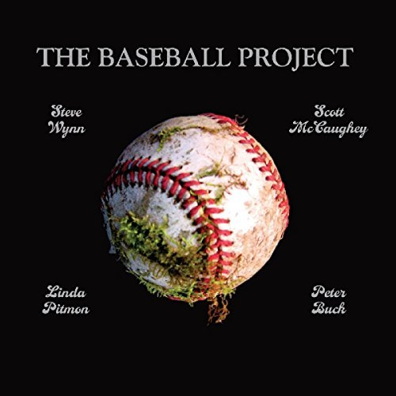

# Volume 1

By **The Baseball Project**

## Album Data

- **Catalog:** Beets
- **Format:** Digital, Album
- **Album:** Volume 1
- **Artist:** The Baseball Project
- **Albumartist:** The Baseball Project
- **Genre:** Power Pop
- **MusicBrainz Album Artist ID:** [fbc4d88b-ee30-4cb8-b102-37826d88206b](https://musicbrainz.org/artist/fbc4d88b-ee30-4cb8-b102-37826d88206b)
- **MusicBrainz Album ID:** [41f31cea-5808-4a99-b399-b74acbfea2a1](https://musicbrainz.org/release/41f31cea-5808-4a99-b399-b74acbfea2a1)
- **MusicBrainz Release Group ID:** [65a1e933-9550-3d34-8f77-a55dec65cd54](https://musicbrainz.org/release-group/65a1e933-9550-3d34-8f77-a55dec65cd54)
- **Year:** 2008
- **Catalog #:** YEP 2178
- **Label:** Yep Roc Records
- **Total Tracks:** 13

## Album Tracks

### Track 01 - Past Time

- **Artist:** The Baseball Project
- **Format:** ALAC
- **Genre:** Pop
- **Length:** 2:57
- **MusicBrainz Track ID:** [a42292cc-c938-4add-b976-bbdb400c132d](https://musicbrainz.org/recording/a42292cc-c938-4add-b976-bbdb400c132d)
- **Title:** Past Time
- **Track:** 01
- **Year:** 2008

### Track 02 - Ted Fucking Williams

- **Artist:** The Baseball Project
- **Format:** ALAC
- **Genre:** Power Pop
- **Length:** 3:04
- **MusicBrainz Track ID:** [3ca5c5eb-d2ad-45f1-a964-8da57358b0e9](https://musicbrainz.org/recording/3ca5c5eb-d2ad-45f1-a964-8da57358b0e9)
- **Title:** Ted Fucking Williams
- **Track:** 02
- **Year:** 2008

### Track 03 - Gratitude (for Curt Flood)

- **Artist:** The Baseball Project
- **Format:** ALAC
- **Genre:** Power Pop
- **Length:** 3:23
- **MusicBrainz Track ID:** [9c74f3a3-bfa0-4cb9-b039-43bad14061f7](https://musicbrainz.org/recording/9c74f3a3-bfa0-4cb9-b039-43bad14061f7)
- **Title:** Gratitude (for Curt Flood)
- **Track:** 03
- **Year:** 2008

### Track 04 - Broken Man

- **Artist:** The Baseball Project
- **Format:** ALAC
- **Genre:** Power Pop
- **Length:** 2:52
- **MusicBrainz Track ID:** [817bcb2a-44d3-43a0-bf9f-46c10a3090a4](https://musicbrainz.org/recording/817bcb2a-44d3-43a0-bf9f-46c10a3090a4)
- **Title:** Broken Man
- **Track:** 04
- **Year:** 2008

### Track 05 - Satchel Paige Said

- **Artist:** The Baseball Project
- **Format:** ALAC
- **Genre:** Power Pop
- **Length:** 2:25
- **MusicBrainz Track ID:** [98df4c90-ee95-4e06-9833-fdf6d083ffdd](https://musicbrainz.org/recording/98df4c90-ee95-4e06-9833-fdf6d083ffdd)
- **Title:** Satchel Paige Said
- **Track:** 05
- **Year:** 2008

### Track 06 - Fernando

- **Artist:** The Baseball Project
- **Format:** ALAC
- **Genre:** Power Pop
- **Length:** 3:47
- **MusicBrainz Track ID:** [4f879233-5a54-47f4-a483-259b746d8dbe](https://musicbrainz.org/recording/4f879233-5a54-47f4-a483-259b746d8dbe)
- **Title:** Fernando
- **Track:** 06
- **Year:** 2008

### Track 07 - Long Before My Time

- **Artist:** The Baseball Project
- **Format:** ALAC
- **Genre:** Power Pop
- **Length:** 3:14
- **MusicBrainz Track ID:** [39d4a3bc-b5f2-4cc4-976d-c3a46fd1156b](https://musicbrainz.org/recording/39d4a3bc-b5f2-4cc4-976d-c3a46fd1156b)
- **Title:** Long Before My Time
- **Track:** 07
- **Year:** 2008

### Track 08 - Jackie’s Lament

- **Artist:** The Baseball Project
- **Format:** ALAC
- **Genre:** Power Pop
- **Length:** 3:25
- **MusicBrainz Track ID:** [01c51962-bd80-4924-8aea-0689acf49cfd](https://musicbrainz.org/recording/01c51962-bd80-4924-8aea-0689acf49cfd)
- **Title:** Jackie’s Lament
- **Track:** 08
- **Year:** 2008

### Track 09 - Sometimes I Dream of Willie Mays

- **Artist:** The Baseball Project
- **Format:** ALAC
- **Genre:** Power Pop
- **Length:** 3:33
- **MusicBrainz Track ID:** [a306eb53-2680-44b3-a05a-bfaf0b7abd4d](https://musicbrainz.org/recording/a306eb53-2680-44b3-a05a-bfaf0b7abd4d)
- **Title:** Sometimes I Dream of Willie Mays
- **Track:** 09
- **Year:** 2008

### Track 10 - The Death of Big Ed Delahanty

- **Artist:** The Baseball Project
- **Format:** ALAC
- **Genre:** Power Pop
- **Length:** 3:35
- **MusicBrainz Track ID:** [c34fa144-c943-4736-bab3-7b6567713335](https://musicbrainz.org/recording/c34fa144-c943-4736-bab3-7b6567713335)
- **Title:** The Death of Big Ed Delahanty
- **Track:** 10
- **Year:** 2008

### Track 11 - Harvey Haddix

- **Artist:** The Baseball Project
- **Format:** ALAC
- **Genre:** Power Pop
- **Length:** 4:25
- **MusicBrainz Track ID:** [ac8338e4-1f9f-466b-81d0-de14a4bb5684](https://musicbrainz.org/recording/ac8338e4-1f9f-466b-81d0-de14a4bb5684)
- **Title:** Harvey Haddix
- **Track:** 11
- **Year:** 2008

### Track 12 - The Yankee Flipper

- **Artist:** The Baseball Project
- **Format:** ALAC
- **Genre:** Power Pop
- **Length:** 3:40
- **MusicBrainz Track ID:** [1d58b340-c867-48a4-9590-10e5a1473f72](https://musicbrainz.org/recording/1d58b340-c867-48a4-9590-10e5a1473f72)
- **Title:** The Yankee Flipper
- **Track:** 12
- **Year:** 2008

### Track 13 - The Closer

- **Artist:** The Baseball Project
- **Format:** ALAC
- **Genre:** Power Pop
- **Length:** 4:24
- **MusicBrainz Track ID:** [b3e29083-84a0-4131-8049-418d12b9623a](https://musicbrainz.org/recording/b3e29083-84a0-4131-8049-418d12b9623a)
- **Title:** The Closer
- **Track:** 13
- **Year:** 2008

## See also

- [Roon: The Baseball Project, Vol. 1](../../Roon/The_Baseball_Project/The_Baseball_Project__Vol_1-_Frozen_Ropes_and_Dying_Quails.md)
- [Roon: Volume 2](../../Roon/The_Baseball_Project/Volume_2-_High_and_Inside.md)
