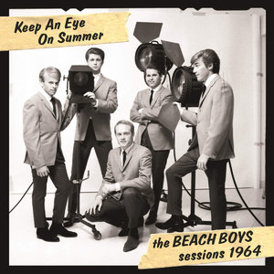

# 1964

By **The Beach Boys**

## Album Data

- **Catalog:** Beets
- **Format:** Digital, Album
- **Album:** 1964
- **Artist:** The Beach Boys
- **Albumartist:** The Beach Boys
- **Genre:** Surf Rock
- **MusicBrainz Album Artist ID:** 
- **MusicBrainz Album ID:** 
- **MusicBrainz Release Group ID:** 
- **Year:** 0000
- **Catalog #:** 
- **Label:** 
- **Total Tracks:** 09

## Album Tracks

### Track 01 - Sail On, Sailor

- **Artist:** The Beach Boys
- **Format:** MP3
- **Genre:** Surf Rock
- **Length:** 3:21
- **MusicBrainz Track ID:** 
- **Title:** Sail On, Sailor
- **Track:** 01
- **Year:** 1973

### Track 02 - Steamboat

- **Artist:** The Beach Boys
- **Format:** MP3
- **Genre:** Sunshine Pop
- **Length:** 4:37
- **MusicBrainz Track ID:** 
- **Title:** Steamboat
- **Track:** 02
- **Year:** 1973

### Track 03 - California Saga

- **Artist:** The Beach Boys
- **Format:** MP3
- **Genre:** Psychedelic Pop
- **Length:** 3:01
- **MusicBrainz Track ID:** 
- **Title:** California Saga
- **Track:** 03
- **Year:** 1973

### Track 04 - California Saga

- **Artist:** The Beach Boys
- **Format:** MP3
- **Genre:** Sunshine Pop
- **Length:** 3:49
- **MusicBrainz Track ID:** 
- **Title:** California Saga
- **Track:** 04
- **Year:** 1973

### Track 05 - California Saga

- **Artist:** The Beach Boys
- **Format:** MP3
- **Genre:** Sunshine Pop
- **Length:** 3:21
- **MusicBrainz Track ID:** 
- **Title:** California Saga
- **Track:** 05
- **Year:** 1973

### Track 06 - The Trader

- **Artist:** The Beach Boys
- **Format:** MP3
- **Genre:** Rock
- **Length:** 5:07
- **MusicBrainz Track ID:** 
- **Title:** The Trader
- **Track:** 06
- **Year:** 1973

### Track 07 - Leaving This Town

- **Artist:** The Beach Boys
- **Format:** MP3
- **Genre:** Rock
- **Length:** 5:48
- **MusicBrainz Track ID:** 
- **Title:** Leaving This Town
- **Track:** 07
- **Year:** 1973

### Track 08 - Only With You

- **Artist:** The Beach Boys
- **Format:** MP3
- **Genre:** Soft Rock
- **Length:** 3:04
- **MusicBrainz Track ID:** 
- **Title:** Only With You
- **Track:** 08
- **Year:** 1973

### Track 09 - Funky Pretty

- **Artist:** The Beach Boys
- **Format:** MP3
- **Genre:** Rock
- **Length:** 4:10
- **MusicBrainz Track ID:** 
- **Title:** Funky Pretty
- **Track:** 09
- **Year:** 1973

## See also

- [Holland](Holland.md)
- [Pet Sounds](Pet_Sounds.md)
- [Smile (TSV6-1967)](Smile_TSV6-1967.md)
- [Sounds Of Summer](Sounds_Of_Summer.md)
- [Summer Days (and Summer Nights!!)](Summer_Days_and_Summer_Nights!!.md)
- [Summer Days (and Summer Nights) (Mono & Stereo Remaster)](Summer_Days_and_Summer_Nights_Mono_and_Stereo_Remaster.md)
- [The Beach Boys Love You](The_Beach_Boys_Love_You.md)
- [The Very Best Of The Beach Boys](The_Very_Best_Of_The_Beach_Boys.md)
- [CD: Pet Sounds](../../CD/The_Beach_Boys/Pet_Sounds.md)
- [CD: ](../../CD/The_Beach_Boys/The_Beach_Boys.md)
- [Roon: All Summer Long (Mono)](../../Roon/The_Beach_Boys/All_Summer_Long_Mono.md)
- [Roon: Endless Summer](../../Roon/The_Beach_Boys/Endless_Summer.md)
- [Roon: Pet Sounds (Mono & Stereo)](../../Roon/The_Beach_Boys/Pet_Sounds_Mono_and_Stereo.md)
- [Roon: Smiley Smile (Mono)](../../Roon/The_Beach_Boys/Smiley_Smile_Mono.md)
- [Roon: Sounds of Summer](../../Roon/The_Beach_Boys/Sounds_of_Summer-_The_Very_Best_of_the_Beach_Boys.md)
- [Roon: Summer Days (And Summer Nights) (Mono & Stereo)](../../Roon/The_Beach_Boys/Summer_Days_And_Summer_Nights_Mono_and_Stereo.md)
- [Roon: Surf's Up](../../Roon/The_Beach_Boys/Surfs_Up.md)
- [Roon: The Beach Boys Today! (Mono & Stereo)](../../Roon/The_Beach_Boys/The_Beach_Boys_Today!_Mono_and_Stereo.md)
- [Roon: The Beach Boys With The Royal Philharmonic Orchestra](../../Roon/The_Beach_Boys/The_Beach_Boys_With_The_Royal_Philharmonic_Orchestra.md)
- [Roon: The Very Best Of The Beach Boys](../../Roon/The_Beach_Boys/The_Very_Best_Of_The_Beach_Boys-_Sounds_Of_Summer_Expanded_Edition_Super_Deluxe.md)
- [Roon: The Very Best Of The Beach Boys](../../Roon/The_Beach_Boys/The_Very_Best_Of_The_Beach_Boys-_Sounds_Of_Summer.md)
- [Vinyl: "Dance, Dance, Dance"](../../Vinyl/The_Beach_Boys/Dance__Dance__Dance.md)
- [Vinyl: Darlin' / Here Today](../../Vinyl/The_Beach_Boys/Darlin_-_Here_Today.md)
- [Vinyl: Good Vibrations](../../Vinyl/The_Beach_Boys/Good_Vibrations.md)
- [Vinyl: Holland](../../Vinyl/The_Beach_Boys/Holland.md)
- [Vinyl: Love You](../../Vinyl/The_Beach_Boys/Love_You.md)
- [Vinyl: Pet Sounds](../../Vinyl/The_Beach_Boys/Pet_Sounds.md)
- [Vinyl: Summer Days (And Summer Nights!!)](../../Vinyl/The_Beach_Boys/Summer_Days_And_Summer_Nights!!.md)
- [Vinyl: ](../../Vinyl/The_Beach_Boys/The_Beach_Boys.md)
