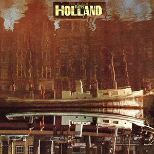

# Holland

By **The Beach Boys**

## Album Data

- **Catalog:** Beets
- **Format:** Digital, Album
- **Album:** Holland
- **Artist:** The Beach Boys
- **Albumartist:** The Beach Boys
- **Genre:** Sunshine Pop
- **MusicBrainz Album Artist ID:** 
- **MusicBrainz Album ID:** 
- **MusicBrainz Release Group ID:** 
- **Year:** 1973
- **Catalog #:** 
- **Label:** 
- **Total Tracks:** 00

## Album Tracks

### Track 01 - Americana

- **Artist:** The Beach Boys
- **Format:** MP3
- **Genre:** Surf Rock
- **Length:** 19:11
- **MusicBrainz Track ID:** 
- **Title:** Americana
- **Track:** 01
- **Year:** 1967

### Track 01 - Our Prayer

- **Artist:** The Beach Boys
- **Format:** AAC
- **Genre:** Post-Rock
- **Length:** 1:09
- **MusicBrainz Track ID:** 
- **Title:** Our Prayer
- **Track:** 01
- **Year:** 0000

### Track 02 - One Wonderful

- **Artist:** The Beach Boys
- **Format:** MP3
- **Genre:** Surf Rock
- **Length:** 7:30
- **MusicBrainz Track ID:** 
- **Title:** One Wonderful
- **Track:** 02
- **Year:** 0000

### Track 03 - The Elements

- **Artist:** The Beach Boys
- **Format:** MP3
- **Genre:** Psychedelic Rock
- **Length:** 21:14
- **MusicBrainz Track ID:** 
- **Title:** The Elements
- **Track:** 03
- **Year:** 1967

## See also

- [1964](1964.md)
- [Pet Sounds](Pet_Sounds.md)
- [Smile (TSV6-1967)](Smile_TSV6-1967.md)
- [Sounds Of Summer](Sounds_Of_Summer.md)
- [Summer Days (and Summer Nights!!)](Summer_Days_and_Summer_Nights!!.md)
- [Summer Days (and Summer Nights) (Mono & Stereo Remaster)](Summer_Days_and_Summer_Nights_Mono_and_Stereo_Remaster.md)
- [The Beach Boys Love You](The_Beach_Boys_Love_You.md)
- [The Very Best Of The Beach Boys](The_Very_Best_Of_The_Beach_Boys.md)
- [CD: Pet Sounds](../../CD/The_Beach_Boys/Pet_Sounds.md)
- [CD: ](../../CD/The_Beach_Boys/The_Beach_Boys.md)
- [Roon: All Summer Long (Mono)](../../Roon/The_Beach_Boys/All_Summer_Long_Mono.md)
- [Roon: Endless Summer](../../Roon/The_Beach_Boys/Endless_Summer.md)
- [Roon: Pet Sounds (Mono & Stereo)](../../Roon/The_Beach_Boys/Pet_Sounds_Mono_and_Stereo.md)
- [Roon: Smiley Smile (Mono)](../../Roon/The_Beach_Boys/Smiley_Smile_Mono.md)
- [Roon: Sounds of Summer](../../Roon/The_Beach_Boys/Sounds_of_Summer-_The_Very_Best_of_the_Beach_Boys.md)
- [Roon: Summer Days (And Summer Nights) (Mono & Stereo)](../../Roon/The_Beach_Boys/Summer_Days_And_Summer_Nights_Mono_and_Stereo.md)
- [Roon: Surf's Up](../../Roon/The_Beach_Boys/Surfs_Up.md)
- [Roon: The Beach Boys Today! (Mono & Stereo)](../../Roon/The_Beach_Boys/The_Beach_Boys_Today!_Mono_and_Stereo.md)
- [Roon: The Beach Boys With The Royal Philharmonic Orchestra](../../Roon/The_Beach_Boys/The_Beach_Boys_With_The_Royal_Philharmonic_Orchestra.md)
- [Roon: The Very Best Of The Beach Boys](../../Roon/The_Beach_Boys/The_Very_Best_Of_The_Beach_Boys-_Sounds_Of_Summer_Expanded_Edition_Super_Deluxe.md)
- [Roon: The Very Best Of The Beach Boys](../../Roon/The_Beach_Boys/The_Very_Best_Of_The_Beach_Boys-_Sounds_Of_Summer.md)
- [Vinyl: "Dance, Dance, Dance"](../../Vinyl/The_Beach_Boys/Dance__Dance__Dance.md)
- [Vinyl: Darlin' / Here Today](../../Vinyl/The_Beach_Boys/Darlin_-_Here_Today.md)
- [Vinyl: Good Vibrations](../../Vinyl/The_Beach_Boys/Good_Vibrations.md)
- [Vinyl: Holland](../../Vinyl/The_Beach_Boys/Holland.md)
- [Vinyl: Love You](../../Vinyl/The_Beach_Boys/Love_You.md)
- [Vinyl: Pet Sounds](../../Vinyl/The_Beach_Boys/Pet_Sounds.md)
- [Vinyl: Summer Days (And Summer Nights!!)](../../Vinyl/The_Beach_Boys/Summer_Days_And_Summer_Nights!!.md)
- [Vinyl: ](../../Vinyl/The_Beach_Boys/The_Beach_Boys.md)
