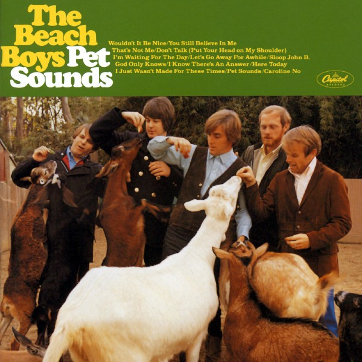

# Pet Sounds

By **The Beach Boys**

## Album Data

- **Catalog:** Beets
- **Format:** Digital, Album
- **Album:** Pet Sounds
- **Artist:** The Beach Boys
- **Albumartist:** The Beach Boys
- **Genre:** Sunshine Pop
- **MusicBrainz Album Artist ID:** [ebfc1398-8d96-47e3-82c3-f782abcdb13d](https://musicbrainz.org/artist/ebfc1398-8d96-47e3-82c3-f782abcdb13d)
- **MusicBrainz Album ID:** [ca313bbe-e82d-44ac-9aa9-33e45f415310](https://musicbrainz.org/release/ca313bbe-e82d-44ac-9aa9-33e45f415310)
- **MusicBrainz Release Group ID:** [fdd96703-7b21-365e-bdea-38029fbeb84e](https://musicbrainz.org/release-group/fdd96703-7b21-365e-bdea-38029fbeb84e)
- **Year:** 2001
- **Catalog #:** T 2354
- **Label:** Capitol Records
- **Total Tracks:** 12

## Album Tracks

### Track 01 - The Girl From New York City

- **Artist:** The Beach Boys
- **Format:** MP3
- **Genre:** Rock
- **Length:** 1:57
- **MusicBrainz Track ID:** [1abdb0f2-89d5-4b04-9c59-4ace2d8a15ed](https://musicbrainz.org/recording/1abdb0f2-89d5-4b04-9c59-4ace2d8a15ed)
- **Title:** The Girl From New York City
- **Track:** 01
- **Year:** 1965

### Track 02 - Amusement Parks U.S.A.

- **Artist:** The Beach Boys
- **Format:** MP3
- **Genre:** Pop
- **Length:** 2:32
- **MusicBrainz Track ID:** [c321a17b-6aaf-46a8-b06a-b2523a39ca62](https://musicbrainz.org/recording/c321a17b-6aaf-46a8-b06a-b2523a39ca62)
- **Title:** Amusement Parks U.S.A.
- **Track:** 02
- **Year:** 1965

### Track 03 - Then I Kissed Her

- **Artist:** The Beach Boys
- **Format:** MP3
- **Genre:** Surf Rock
- **Length:** 2:17
- **MusicBrainz Track ID:** [246edf4d-be6b-46f4-9c4c-886b1ce3a5f6](https://musicbrainz.org/recording/246edf4d-be6b-46f4-9c4c-886b1ce3a5f6)
- **Title:** Then I Kissed Her
- **Track:** 03
- **Year:** 1965

### Track 04 - Salt Lake City

- **Artist:** The Beach Boys
- **Format:** MP3
- **Genre:** Pop
- **Length:** 2:04
- **MusicBrainz Track ID:** [d133d7d1-baf0-405a-b378-9e81ba010878](https://musicbrainz.org/recording/d133d7d1-baf0-405a-b378-9e81ba010878)
- **Title:** Salt Lake City
- **Track:** 04
- **Year:** 1965

### Track 05 - Girl Don't Tell Me

- **Artist:** The Beach Boys
- **Format:** MP3
- **Genre:** Baroque
- **Length:** 2:21
- **MusicBrainz Track ID:** [d248c16b-534d-4d3e-8be7-e4c0aada8c55](https://musicbrainz.org/recording/d248c16b-534d-4d3e-8be7-e4c0aada8c55)
- **Title:** Girl Don't Tell Me
- **Track:** 05
- **Year:** 1965

### Track 06 - Help Me, Rhonda

- **Artist:** The Beach Boys
- **Format:** MP3
- **Genre:** Surf Rock
- **Length:** 2:50
- **MusicBrainz Track ID:** [de6dd011-c90b-4746-8be5-de5ebf0133e1](https://musicbrainz.org/recording/de6dd011-c90b-4746-8be5-de5ebf0133e1)
- **Title:** Help Me, Rhonda
- **Track:** 06
- **Year:** 1965

### Track 07 - California Girls

- **Artist:** The Beach Boys
- **Format:** MP3
- **Genre:** Surf Rock
- **Length:** 2:41
- **MusicBrainz Track ID:** [a246698b-add1-4b9e-91ce-c596e80e6d85](https://musicbrainz.org/recording/a246698b-add1-4b9e-91ce-c596e80e6d85)
- **Title:** California Girls
- **Track:** 07
- **Year:** 1965

### Track 08 - Let Him Run Wild

- **Artist:** The Beach Boys
- **Format:** MP3
- **Genre:** Pop
- **Length:** 2:23
- **MusicBrainz Track ID:** [09f43d1f-24fb-4f98-83a7-d1d4c3f349f4](https://musicbrainz.org/recording/09f43d1f-24fb-4f98-83a7-d1d4c3f349f4)
- **Title:** Let Him Run Wild
- **Track:** 08
- **Year:** 1965

### Track 09 - You're So Good to Me

- **Artist:** The Beach Boys
- **Format:** MP3
- **Genre:** Surf Rock
- **Length:** 2:18
- **MusicBrainz Track ID:** [9d2601dc-1c06-48ac-b7fc-48b9eac50f70](https://musicbrainz.org/recording/9d2601dc-1c06-48ac-b7fc-48b9eac50f70)
- **Title:** You're So Good to Me
- **Track:** 09
- **Year:** 1965

### Track 10 - Summer Means New Love

- **Artist:** The Beach Boys
- **Format:** MP3
- **Genre:** Surf Rock
- **Length:** 2:02
- **MusicBrainz Track ID:** [f1a965bc-4d78-43ce-93ee-d5e755ed0070](https://musicbrainz.org/recording/f1a965bc-4d78-43ce-93ee-d5e755ed0070)
- **Title:** Summer Means New Love
- **Track:** 10
- **Year:** 1965

### Track 11 - I'm Bugged at My Ol' Man

- **Artist:** The Beach Boys
- **Format:** MP3
- **Genre:** Pop
- **Length:** 2:20
- **MusicBrainz Track ID:** [40f89d4b-119b-443f-a527-accad71602fc](https://musicbrainz.org/recording/40f89d4b-119b-443f-a527-accad71602fc)
- **Title:** I'm Bugged at My Ol' Man
- **Track:** 11
- **Year:** 1965

### Track 12 - And Your Dream Comes True

- **Artist:** The Beach Boys
- **Format:** MP3
- **Genre:** Pop
- **Length:** 1:06
- **MusicBrainz Track ID:** [a2e57042-e634-4323-bb18-da61c72dfc6c](https://musicbrainz.org/recording/a2e57042-e634-4323-bb18-da61c72dfc6c)
- **Title:** And Your Dream Comes True
- **Track:** 12
- **Year:** 1965

## See also

- [1964](1964.md)
- [Holland](Holland.md)
- [Smile (TSV6-1967)](Smile_TSV6-1967.md)
- [Sounds Of Summer](Sounds_Of_Summer.md)
- [Summer Days (and Summer Nights!!)](Summer_Days_and_Summer_Nights!!.md)
- [Summer Days (and Summer Nights) (Mono & Stereo Remaster)](Summer_Days_and_Summer_Nights_Mono_and_Stereo_Remaster.md)
- [The Beach Boys Love You](The_Beach_Boys_Love_You.md)
- [The Very Best Of The Beach Boys](The_Very_Best_Of_The_Beach_Boys.md)
- [CD: Pet Sounds](../../CD/The_Beach_Boys/Pet_Sounds.md)
- [CD: ](../../CD/The_Beach_Boys/The_Beach_Boys.md)
- [Roon: All Summer Long (Mono)](../../Roon/The_Beach_Boys/All_Summer_Long_Mono.md)
- [Roon: Endless Summer](../../Roon/The_Beach_Boys/Endless_Summer.md)
- [Roon: Pet Sounds (Mono & Stereo)](../../Roon/The_Beach_Boys/Pet_Sounds_Mono_and_Stereo.md)
- [Roon: Smiley Smile (Mono)](../../Roon/The_Beach_Boys/Smiley_Smile_Mono.md)
- [Roon: Sounds of Summer](../../Roon/The_Beach_Boys/Sounds_of_Summer-_The_Very_Best_of_the_Beach_Boys.md)
- [Roon: Summer Days (And Summer Nights) (Mono & Stereo)](../../Roon/The_Beach_Boys/Summer_Days_And_Summer_Nights_Mono_and_Stereo.md)
- [Roon: Surf's Up](../../Roon/The_Beach_Boys/Surfs_Up.md)
- [Roon: The Beach Boys Today! (Mono & Stereo)](../../Roon/The_Beach_Boys/The_Beach_Boys_Today!_Mono_and_Stereo.md)
- [Roon: The Beach Boys With The Royal Philharmonic Orchestra](../../Roon/The_Beach_Boys/The_Beach_Boys_With_The_Royal_Philharmonic_Orchestra.md)
- [Roon: The Very Best Of The Beach Boys](../../Roon/The_Beach_Boys/The_Very_Best_Of_The_Beach_Boys-_Sounds_Of_Summer_Expanded_Edition_Super_Deluxe.md)
- [Roon: The Very Best Of The Beach Boys](../../Roon/The_Beach_Boys/The_Very_Best_Of_The_Beach_Boys-_Sounds_Of_Summer.md)
- [Vinyl: "Dance, Dance, Dance"](../../Vinyl/The_Beach_Boys/Dance__Dance__Dance.md)
- [Vinyl: Darlin' / Here Today](../../Vinyl/The_Beach_Boys/Darlin_-_Here_Today.md)
- [Vinyl: Good Vibrations](../../Vinyl/The_Beach_Boys/Good_Vibrations.md)
- [Vinyl: Holland](../../Vinyl/The_Beach_Boys/Holland.md)
- [Vinyl: Love You](../../Vinyl/The_Beach_Boys/Love_You.md)
- [Vinyl: Pet Sounds](../../Vinyl/The_Beach_Boys/Pet_Sounds.md)
- [Vinyl: Summer Days (And Summer Nights!!)](../../Vinyl/The_Beach_Boys/Summer_Days_And_Summer_Nights!!.md)
- [Vinyl: ](../../Vinyl/The_Beach_Boys/The_Beach_Boys.md)
