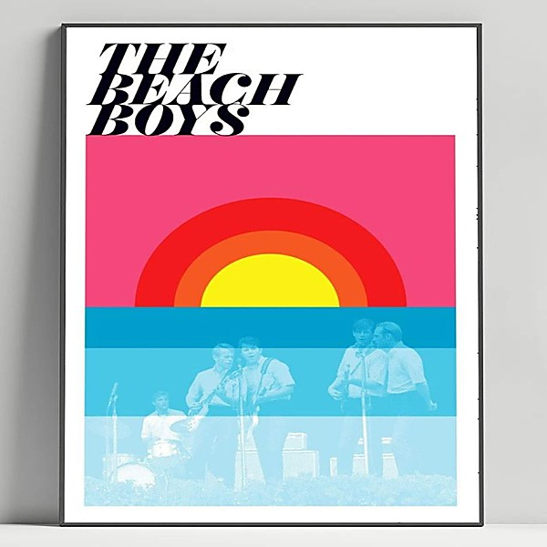

# Smile (TSV6-1967)

By **The Beach Boys**

## Album Data

- **Catalog:** Beets
- **Format:** Digital, Album
- **Album:** Smile (TSV6-1967)
- **Artist:** The Beach Boys
- **Albumartist:** The Beach Boys
- **Genre:** Surf Rock
- **MusicBrainz Album Artist ID:** 
- **MusicBrainz Album ID:** 
- **MusicBrainz Release Group ID:** 
- **Year:** 1967
- **Catalog #:** 
- **Label:** 
- **Total Tracks:** 22

## Album Tracks

### Track 13 - Be True To Your School (Single Version)

- **Artist:** The Beach Boys
- **Format:** ALAC
- **Genre:** Surf Rock
- **Length:** 2:10
- **MusicBrainz Track ID:** 
- **Title:** Be True To Your School (Single Version)
- **Track:** 13
- **Year:** 2003

### Track 01 - California Girls

- **Artist:** The Beach Boys
- **Format:** ALAC
- **Genre:** Surf Rock
- **Length:** 2:46
- **MusicBrainz Track ID:** 
- **Title:** California Girls
- **Track:** 01
- **Year:** 2003

### Track 02 - I Get Around

- **Artist:** The Beach Boys
- **Format:** ALAC
- **Genre:** Surf Rock
- **Length:** 2:14
- **MusicBrainz Track ID:** 
- **Title:** I Get Around
- **Track:** 02
- **Year:** 1964

### Track 03 - Surfin' Safari

- **Artist:** The Beach Boys
- **Format:** ALAC
- **Genre:** Surf Rock
- **Length:** 2:07
- **MusicBrainz Track ID:** 
- **Title:** Surfin' Safari
- **Track:** 03
- **Year:** 1962

### Track 04 - Surfin' U.S.A.

- **Artist:** The Beach Boys
- **Format:** ALAC
- **Genre:** Surf Rock
- **Length:** 2:28
- **MusicBrainz Track ID:** 
- **Title:** Surfin' U.S.A.
- **Track:** 04
- **Year:** 1963

### Track 05 - Fun, Fun, Fun

- **Artist:** The Beach Boys
- **Format:** ALAC
- **Genre:** Surf Rock
- **Length:** 1:49
- **MusicBrainz Track ID:** 
- **Title:** Fun, Fun, Fun
- **Track:** 05
- **Year:** 1964

### Track 06 - Surfer Girl

- **Artist:** The Beach Boys
- **Format:** ALAC
- **Genre:** Surf Rock
- **Length:** 2:28
- **MusicBrainz Track ID:** 
- **Title:** Surfer Girl
- **Track:** 06
- **Year:** 1963

### Track 07 - Don't Worry Baby (Single Version)

- **Artist:** The Beach Boys
- **Format:** ALAC
- **Genre:** Surf Rock
- **Length:** 2:49
- **MusicBrainz Track ID:** 
- **Title:** Don't Worry Baby (Single Version)
- **Track:** 07
- **Year:** 2003

### Track 08 - Little Deuce Coupe

- **Artist:** The Beach Boys
- **Format:** ALAC
- **Genre:** Surf Rock
- **Length:** 1:41
- **MusicBrainz Track ID:** 
- **Title:** Little Deuce Coupe
- **Track:** 08
- **Year:** 1963

### Track 09 - Shut Down

- **Artist:** The Beach Boys
- **Format:** ALAC
- **Genre:** Surf Rock
- **Length:** 1:50
- **MusicBrainz Track ID:** 
- **Title:** Shut Down
- **Track:** 09
- **Year:** 2003

### Track 10 - Help Me, Rhonda (Single Version)

- **Artist:** The Beach Boys
- **Format:** ALAC
- **Genre:** Pop
- **Length:** 2:47
- **MusicBrainz Track ID:** 
- **Title:** Help Me, Rhonda (Single Version)
- **Track:** 10
- **Year:** 2003

### Track 11 - Be True To Your School (Single Version)

- **Artist:** The Beach Boys
- **Format:** ALAC
- **Genre:** Surf Rock
- **Length:** 2:10
- **MusicBrainz Track ID:** 
- **Title:** Be True To Your School (Single Version)
- **Track:** 11
- **Year:** 2003

### Track 12 - When I Grow Up (To Be A Man)

- **Artist:** The Beach Boys
- **Format:** ALAC
- **Genre:** Surf Rock
- **Length:** 2:03
- **MusicBrainz Track ID:** 
- **Title:** When I Grow Up (To Be A Man)
- **Track:** 12
- **Year:** 1964

### Track 13 - In My Room

- **Artist:** The Beach Boys
- **Format:** ALAC
- **Genre:** Surf Rock
- **Length:** 2:13
- **MusicBrainz Track ID:** 
- **Title:** In My Room
- **Track:** 13
- **Year:** 1963

### Track 14 - God Only Knows

- **Artist:** The Beach Boys
- **Format:** ALAC
- **Genre:** Surf Rock
- **Length:** 2:53
- **MusicBrainz Track ID:** 
- **Title:** God Only Knows
- **Track:** 14
- **Year:** 1966

### Track 15 - Sloop John B

- **Artist:** The Beach Boys
- **Format:** ALAC
- **Genre:** Surf Rock
- **Length:** 2:59
- **MusicBrainz Track ID:** 
- **Title:** Sloop John B
- **Track:** 15
- **Year:** 1966

### Track 16 - Wouldn't It Be Nice

- **Artist:** The Beach Boys
- **Format:** ALAC
- **Genre:** Surf Rock
- **Length:** 2:33
- **MusicBrainz Track ID:** 
- **Title:** Wouldn't It Be Nice
- **Track:** 16
- **Year:** 1966

### Track 17 - Getcha Back

- **Artist:** The Beach Boys
- **Format:** ALAC
- **Genre:** Surf Rock
- **Length:** 3:01
- **MusicBrainz Track ID:** 
- **Title:** Getcha Back
- **Track:** 17
- **Year:** 1985

### Track 18 - Come Go With Me

- **Artist:** The Beach Boys
- **Format:** ALAC
- **Genre:** Surf Rock
- **Length:** 2:07
- **MusicBrainz Track ID:** 
- **Title:** Come Go With Me
- **Track:** 18
- **Year:** 1978

### Track 19 - Rock And Roll Music

- **Artist:** The Beach Boys
- **Format:** ALAC
- **Genre:** Surf Rock
- **Length:** 2:30
- **MusicBrainz Track ID:** 
- **Title:** Rock And Roll Music
- **Track:** 19
- **Year:** 2003

### Track 20 - Dance, Dance, Dance

- **Artist:** The Beach Boys
- **Format:** ALAC
- **Genre:** Surf Rock
- **Length:** 2:03
- **MusicBrainz Track ID:** 
- **Title:** Dance, Dance, Dance
- **Track:** 20
- **Year:** 2003

### Track 21 - Barbara Ann (Single Version)

- **Artist:** The Beach Boys
- **Format:** ALAC
- **Genre:** Pop
- **Length:** 2:13
- **MusicBrainz Track ID:** 
- **Title:** Barbara Ann (Single Version)
- **Track:** 21
- **Year:** 1966

### Track 22 - Do You Wanna Dance

- **Artist:** The Beach Boys
- **Format:** ALAC
- **Genre:** Surf Rock
- **Length:** 2:20
- **MusicBrainz Track ID:** 
- **Title:** Do You Wanna Dance
- **Track:** 22
- **Year:** 1965

### Track 23 - Heroes And Villains

- **Artist:** The Beach Boys
- **Format:** ALAC
- **Genre:** Surf Rock
- **Length:** 3:40
- **MusicBrainz Track ID:** 
- **Title:** Heroes And Villains
- **Track:** 23
- **Year:** 2003

### Track 24 - Good Timin'

- **Artist:** The Beach Boys
- **Format:** ALAC
- **Genre:** Surf Rock
- **Length:** 2:14
- **MusicBrainz Track ID:** 
- **Title:** Good Timin'
- **Track:** 24
- **Year:** 1979

### Track 25 - Kokomo

- **Artist:** The Beach Boys
- **Format:** ALAC
- **Genre:** Surf Rock
- **Length:** 3:38
- **MusicBrainz Track ID:** 
- **Title:** Kokomo
- **Track:** 25
- **Year:** 1988

### Track 26 - Do It Again

- **Artist:** The Beach Boys
- **Format:** ALAC
- **Genre:** Surf Rock
- **Length:** 2:21
- **MusicBrainz Track ID:** 
- **Title:** Do It Again
- **Track:** 26
- **Year:** 2003

### Track 27 - Wild Honey

- **Artist:** The Beach Boys
- **Format:** ALAC
- **Genre:** Surf Rock
- **Length:** 2:40
- **MusicBrainz Track ID:** 
- **Title:** Wild Honey
- **Track:** 27
- **Year:** 2003

### Track 28 - Darlin'

- **Artist:** The Beach Boys
- **Format:** ALAC
- **Genre:** Surf Rock
- **Length:** 2:14
- **MusicBrainz Track ID:** 
- **Title:** Darlin'
- **Track:** 28
- **Year:** 2003

### Track 29 - I Can Hear Music

- **Artist:** The Beach Boys
- **Format:** ALAC
- **Genre:** Surf Rock
- **Length:** 2:39
- **MusicBrainz Track ID:** 
- **Title:** I Can Hear Music
- **Track:** 29
- **Year:** 2003

### Track 30 - Good Vibrations

- **Artist:** The Beach Boys
- **Format:** ALAC
- **Genre:** Surf Rock
- **Length:** 3:37
- **MusicBrainz Track ID:** 
- **Title:** Good Vibrations
- **Track:** 30
- **Year:** 1966

## See also

- [1964](1964.md)
- [Holland](Holland.md)
- [Pet Sounds](Pet_Sounds.md)
- [Sounds Of Summer](Sounds_Of_Summer.md)
- [Summer Days (and Summer Nights!!)](Summer_Days_and_Summer_Nights!!.md)
- [Summer Days (and Summer Nights) (Mono & Stereo Remaster)](Summer_Days_and_Summer_Nights_Mono_and_Stereo_Remaster.md)
- [The Beach Boys Love You](The_Beach_Boys_Love_You.md)
- [The Very Best Of The Beach Boys](The_Very_Best_Of_The_Beach_Boys.md)
- [CD: Pet Sounds](../../CD/The_Beach_Boys/Pet_Sounds.md)
- [CD: ](../../CD/The_Beach_Boys/The_Beach_Boys.md)
- [Roon: All Summer Long (Mono)](../../Roon/The_Beach_Boys/All_Summer_Long_Mono.md)
- [Roon: Endless Summer](../../Roon/The_Beach_Boys/Endless_Summer.md)
- [Roon: Pet Sounds (Mono & Stereo)](../../Roon/The_Beach_Boys/Pet_Sounds_Mono_and_Stereo.md)
- [Roon: Smiley Smile (Mono)](../../Roon/The_Beach_Boys/Smiley_Smile_Mono.md)
- [Roon: Sounds of Summer](../../Roon/The_Beach_Boys/Sounds_of_Summer-_The_Very_Best_of_the_Beach_Boys.md)
- [Roon: Summer Days (And Summer Nights) (Mono & Stereo)](../../Roon/The_Beach_Boys/Summer_Days_And_Summer_Nights_Mono_and_Stereo.md)
- [Roon: Surf's Up](../../Roon/The_Beach_Boys/Surfs_Up.md)
- [Roon: The Beach Boys Today! (Mono & Stereo)](../../Roon/The_Beach_Boys/The_Beach_Boys_Today!_Mono_and_Stereo.md)
- [Roon: The Beach Boys With The Royal Philharmonic Orchestra](../../Roon/The_Beach_Boys/The_Beach_Boys_With_The_Royal_Philharmonic_Orchestra.md)
- [Roon: The Very Best Of The Beach Boys](../../Roon/The_Beach_Boys/The_Very_Best_Of_The_Beach_Boys-_Sounds_Of_Summer_Expanded_Edition_Super_Deluxe.md)
- [Roon: The Very Best Of The Beach Boys](../../Roon/The_Beach_Boys/The_Very_Best_Of_The_Beach_Boys-_Sounds_Of_Summer.md)
- [Vinyl: "Dance, Dance, Dance"](../../Vinyl/The_Beach_Boys/Dance__Dance__Dance.md)
- [Vinyl: Darlin' / Here Today](../../Vinyl/The_Beach_Boys/Darlin_-_Here_Today.md)
- [Vinyl: Good Vibrations](../../Vinyl/The_Beach_Boys/Good_Vibrations.md)
- [Vinyl: Holland](../../Vinyl/The_Beach_Boys/Holland.md)
- [Vinyl: Love You](../../Vinyl/The_Beach_Boys/Love_You.md)
- [Vinyl: Pet Sounds](../../Vinyl/The_Beach_Boys/Pet_Sounds.md)
- [Vinyl: Summer Days (And Summer Nights!!)](../../Vinyl/The_Beach_Boys/Summer_Days_And_Summer_Nights!!.md)
- [Vinyl: ](../../Vinyl/The_Beach_Boys/The_Beach_Boys.md)
