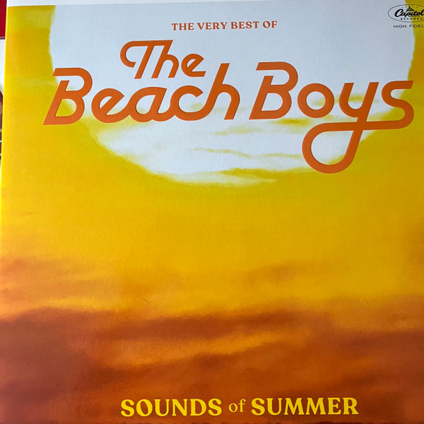

# Sounds Of Summer

By **The Beach Boys**

## Album Data

- **Catalog:** Beets
- **Format:** Digital, Album
- **Album:** Sounds Of Summer
- **Artist:** The Beach Boys
- **Albumartist:** The Beach Boys
- **Genre:** Sunshine Pop
- **MusicBrainz Album Artist ID:** 
- **MusicBrainz Album ID:** 
- **MusicBrainz Release Group ID:** 
- **Year:** 2003
- **Catalog #:** 
- **Label:** 
- **Total Tracks:** 24

## Album Tracks

### Track 05 - Girl Don’t Tell Me

- **Artist:** The Beach Boys
- **Format:** MP3
- **Genre:** Surf Rock
- **Length:** 2:21
- **MusicBrainz Track ID:** [bd83becb-74d2-4b4a-8f6d-12024f39e43c](https://musicbrainz.org/recording/bd83becb-74d2-4b4a-8f6d-12024f39e43c)
- **Title:** Girl Don’t Tell Me
- **Track:** 05
- **Year:** 2012

### Track 06 - Help Me, Rhonda (mono)

- **Artist:** The Beach Boys
- **Format:** MP3
- **Genre:** Surf Rock
- **Length:** 2:48
- **MusicBrainz Track ID:** [836c9f23-b2d1-40ad-928a-34762b433796](https://musicbrainz.org/recording/836c9f23-b2d1-40ad-928a-34762b433796)
- **Title:** Help Me, Rhonda (mono)
- **Track:** 06
- **Year:** 2012

### Track 07 - California Girls (mono)

- **Artist:** The Beach Boys
- **Format:** MP3
- **Genre:** Surf Rock
- **Length:** 2:40
- **MusicBrainz Track ID:** [4c9df449-5cf7-4138-adc0-934c70349ad5](https://musicbrainz.org/recording/4c9df449-5cf7-4138-adc0-934c70349ad5)
- **Title:** California Girls (mono)
- **Track:** 07
- **Year:** 2012

### Track 08 - Let Him Run Wild (mono)

- **Artist:** The Beach Boys
- **Format:** MP3
- **Genre:** Surf Rock
- **Length:** 2:22
- **MusicBrainz Track ID:** [4a34a7e4-6970-49ba-85f0-fe809fe61ec1](https://musicbrainz.org/recording/4a34a7e4-6970-49ba-85f0-fe809fe61ec1)
- **Title:** Let Him Run Wild (mono)
- **Track:** 08
- **Year:** 2012

### Track 09 - You’re So Good to Me

- **Artist:** The Beach Boys
- **Format:** MP3
- **Genre:** Surf Rock
- **Length:** 2:16
- **MusicBrainz Track ID:** [03d0b739-8bd1-4575-872b-b3242217d9c6](https://musicbrainz.org/recording/03d0b739-8bd1-4575-872b-b3242217d9c6)
- **Title:** You’re So Good to Me
- **Track:** 09
- **Year:** 2012

### Track 11 - I’m Bugged at My Ol’ Man

- **Artist:** The Beach Boys
- **Format:** MP3
- **Genre:** Surf Rock
- **Length:** 2:19
- **MusicBrainz Track ID:** [8da36a9f-33ad-4df3-849b-30ec92b92014](https://musicbrainz.org/recording/8da36a9f-33ad-4df3-849b-30ec92b92014)
- **Title:** I’m Bugged at My Ol’ Man
- **Track:** 11
- **Year:** 2012

### Track 16 - Salt Lake City (stereo remix)

- **Artist:** The Beach Boys
- **Format:** MP3
- **Genre:** Surf Rock
- **Length:** 2:03
- **MusicBrainz Track ID:** [2230985f-86ce-4c42-80c6-8d15d64e3da2](https://musicbrainz.org/recording/2230985f-86ce-4c42-80c6-8d15d64e3da2)
- **Title:** Salt Lake City (stereo remix)
- **Track:** 16
- **Year:** 2012

### Track 18 - Help Me Rhonda

- **Artist:** The Beach Boys
- **Format:** MP3
- **Genre:** Surf Rock
- **Length:** 2:48
- **MusicBrainz Track ID:** [ab68cbc6-f6e9-43a3-bd81-55e27baab6b3](https://musicbrainz.org/recording/ab68cbc6-f6e9-43a3-bd81-55e27baab6b3)
- **Title:** Help Me Rhonda
- **Track:** 18
- **Year:** 2012

### Track 19 - California Girls (stereo)

- **Artist:** The Beach Boys
- **Format:** MP3
- **Genre:** Pop
- **Length:** 2:47
- **MusicBrainz Track ID:** [af4d9554-9d07-4ca6-9239-87e0eb06465d](https://musicbrainz.org/recording/af4d9554-9d07-4ca6-9239-87e0eb06465d)
- **Title:** California Girls (stereo)
- **Track:** 19
- **Year:** 2012

### Track 20 - Let Him Run Wild (stereo)

- **Artist:** The Beach Boys
- **Format:** MP3
- **Genre:** Surf Rock
- **Length:** 2:22
- **MusicBrainz Track ID:** [984e4434-1600-4cf9-8b6b-515e34845ba1](https://musicbrainz.org/recording/984e4434-1600-4cf9-8b6b-515e34845ba1)
- **Title:** Let Him Run Wild (stereo)
- **Track:** 20
- **Year:** 2012

### Track 21 - You're So Good to Me (new stereo mix)

- **Artist:** The Beach Boys
- **Format:** MP3
- **Genre:** Surf Rock
- **Length:** 2:16
- **MusicBrainz Track ID:** [333a80ad-6a0c-4128-883a-99f7a3673ffa](https://musicbrainz.org/recording/333a80ad-6a0c-4128-883a-99f7a3673ffa)
- **Title:** You're So Good to Me (new stereo mix)
- **Track:** 21
- **Year:** 2012

### Track 22 - Summer Means New Love (Stereo)

- **Artist:** The Beach Boys
- **Format:** MP3
- **Genre:** Surf Rock
- **Length:** 2:03
- **MusicBrainz Track ID:** [67249c93-c43e-45bb-a455-7109f28c9d92](https://musicbrainz.org/recording/67249c93-c43e-45bb-a455-7109f28c9d92)
- **Title:** Summer Means New Love (Stereo)
- **Track:** 22
- **Year:** 2012

### Track 24 - And Your Dream Comes True (stereo remix)

- **Artist:** The Beach Boys
- **Format:** MP3
- **Genre:** Surf Rock
- **Length:** 1:05
- **MusicBrainz Track ID:** [baf9ad2a-4270-46b4-a8b6-bc11fe7798c2](https://musicbrainz.org/recording/baf9ad2a-4270-46b4-a8b6-bc11fe7798c2)
- **Title:** And Your Dream Comes True (stereo remix)
- **Track:** 24
- **Year:** 2012

## See also

- [1964](1964.md)
- [Holland](Holland.md)
- [Pet Sounds](Pet_Sounds.md)
- [Smile (TSV6-1967)](Smile_TSV6-1967.md)
- [Summer Days (and Summer Nights!!)](Summer_Days_and_Summer_Nights!!.md)
- [Summer Days (and Summer Nights) (Mono & Stereo Remaster)](Summer_Days_and_Summer_Nights_Mono_and_Stereo_Remaster.md)
- [The Beach Boys Love You](The_Beach_Boys_Love_You.md)
- [The Very Best Of The Beach Boys](The_Very_Best_Of_The_Beach_Boys.md)
- [CD: Pet Sounds](../../CD/The_Beach_Boys/Pet_Sounds.md)
- [CD: ](../../CD/The_Beach_Boys/The_Beach_Boys.md)
- [Roon: All Summer Long (Mono)](../../Roon/The_Beach_Boys/All_Summer_Long_Mono.md)
- [Roon: Endless Summer](../../Roon/The_Beach_Boys/Endless_Summer.md)
- [Roon: Pet Sounds (Mono & Stereo)](../../Roon/The_Beach_Boys/Pet_Sounds_Mono_and_Stereo.md)
- [Roon: Smiley Smile (Mono)](../../Roon/The_Beach_Boys/Smiley_Smile_Mono.md)
- [Roon: Sounds of Summer](../../Roon/The_Beach_Boys/Sounds_of_Summer-_The_Very_Best_of_the_Beach_Boys.md)
- [Roon: Summer Days (And Summer Nights) (Mono & Stereo)](../../Roon/The_Beach_Boys/Summer_Days_And_Summer_Nights_Mono_and_Stereo.md)
- [Roon: Surf's Up](../../Roon/The_Beach_Boys/Surfs_Up.md)
- [Roon: The Beach Boys Today! (Mono & Stereo)](../../Roon/The_Beach_Boys/The_Beach_Boys_Today!_Mono_and_Stereo.md)
- [Roon: The Beach Boys With The Royal Philharmonic Orchestra](../../Roon/The_Beach_Boys/The_Beach_Boys_With_The_Royal_Philharmonic_Orchestra.md)
- [Roon: The Very Best Of The Beach Boys](../../Roon/The_Beach_Boys/The_Very_Best_Of_The_Beach_Boys-_Sounds_Of_Summer_Expanded_Edition_Super_Deluxe.md)
- [Roon: The Very Best Of The Beach Boys](../../Roon/The_Beach_Boys/The_Very_Best_Of_The_Beach_Boys-_Sounds_Of_Summer.md)
- [Vinyl: "Dance, Dance, Dance"](../../Vinyl/The_Beach_Boys/Dance__Dance__Dance.md)
- [Vinyl: Darlin' / Here Today](../../Vinyl/The_Beach_Boys/Darlin_-_Here_Today.md)
- [Vinyl: Good Vibrations](../../Vinyl/The_Beach_Boys/Good_Vibrations.md)
- [Vinyl: Holland](../../Vinyl/The_Beach_Boys/Holland.md)
- [Vinyl: Love You](../../Vinyl/The_Beach_Boys/Love_You.md)
- [Vinyl: Pet Sounds](../../Vinyl/The_Beach_Boys/Pet_Sounds.md)
- [Vinyl: Summer Days (And Summer Nights!!)](../../Vinyl/The_Beach_Boys/Summer_Days_And_Summer_Nights!!.md)
- [Vinyl: ](../../Vinyl/The_Beach_Boys/The_Beach_Boys.md)
