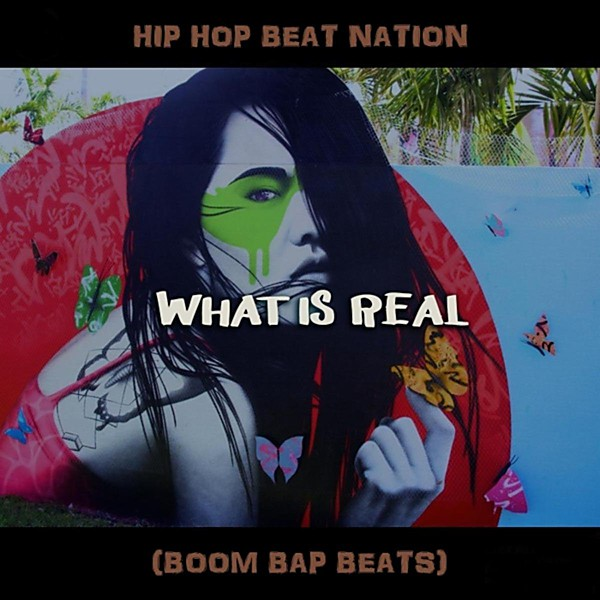

# What Is Beat?

By **The Beat**

## Album Data

- **Catalog:** Beets
- **Format:** Digital, Album
- **Album:** What Is Beat?
- **Artist:** The Beat
- **Albumartist:** The Beat
- **Genre:** New Wave
- **MusicBrainz Album Artist ID:** [9727e632-c228-47f8-a7ae-398df94f00c7](https://musicbrainz.org/artist/9727e632-c228-47f8-a7ae-398df94f00c7)
- **MusicBrainz Album ID:** [ad21bf05-8ea1-4401-8ca7-110ec2ccf2aa](https://musicbrainz.org/release/ad21bf05-8ea1-4401-8ca7-110ec2ccf2aa)
- **MusicBrainz Release Group ID:** [6bfa78c1-398b-3766-8547-b32294b13d3e](https://musicbrainz.org/release-group/6bfa78c1-398b-3766-8547-b32294b13d3e)
- **Year:** 1993
- **Catalog #:** CD70040
- **Label:** I.R.S. Records
- **Total Tracks:** 12

## Album Tracks

### Track 01 - Mirror in the Bathroom

- **Artist:** The Beat
- **Format:** ALAC
- **Genre:** Ska
- **Length:** 3:08
- **MusicBrainz Track ID:** [0abd2d6a-300b-4810-b24b-0829c4ddeec0](https://musicbrainz.org/recording/0abd2d6a-300b-4810-b24b-0829c4ddeec0)
- **Title:** Mirror in the Bathroom
- **Track:** 01
- **Year:** 1993

### Track 02 - Twist & Crawl

- **Artist:** The Beat
- **Format:** ALAC
- **Genre:** 2 Tone
- **Length:** 2:33
- **MusicBrainz Track ID:** [5ae66ee3-76ee-48be-8c69-861f0c5d0c3e](https://musicbrainz.org/recording/5ae66ee3-76ee-48be-8c69-861f0c5d0c3e)
- **Title:** Twist & Crawl
- **Track:** 02
- **Year:** 1993

### Track 03 - Tears of a Clown

- **Artist:** The Beat
- **Format:** ALAC
- **Genre:** Ska
- **Length:** 2:42
- **MusicBrainz Track ID:** [a6d4a027-36b3-49be-8ae2-3cf3820a2e52](https://musicbrainz.org/recording/a6d4a027-36b3-49be-8ae2-3cf3820a2e52)
- **Title:** Tears of a Clown
- **Track:** 03
- **Year:** 1993

### Track 04 - Can't Get Used to Losing You (remix)

- **Artist:** The Beat
- **Format:** ALAC
- **Genre:** New Wave
- **Length:** 3:26
- **MusicBrainz Track ID:** [424d8731-584d-4796-ab4b-a5969983248f](https://musicbrainz.org/recording/424d8731-584d-4796-ab4b-a5969983248f)
- **Title:** Can't Get Used to Losing You (remix)
- **Track:** 04
- **Year:** 1993

### Track 05 - Doors of Your Heart

- **Artist:** The Beat
- **Format:** ALAC
- **Genre:** Dub
- **Length:** 3:12
- **MusicBrainz Track ID:** [849b7a6d-d0ef-43fa-a694-b1488690a471](https://musicbrainz.org/recording/849b7a6d-d0ef-43fa-a694-b1488690a471)
- **Title:** Doors of Your Heart
- **Track:** 05
- **Year:** 1993

### Track 06 - What's Your Best Thing?

- **Artist:** The Beat
- **Format:** ALAC
- **Genre:** New Wave
- **Length:** 3:49
- **MusicBrainz Track ID:** [adbe85fc-d1c4-426a-ae0f-bd1b513b4945](https://musicbrainz.org/recording/adbe85fc-d1c4-426a-ae0f-bd1b513b4945)
- **Title:** What's Your Best Thing?
- **Track:** 06
- **Year:** 1993

### Track 07 - Hit It

- **Artist:** The Beat
- **Format:** ALAC
- **Genre:** Ska
- **Length:** 3:32
- **MusicBrainz Track ID:** [52508b02-aff8-428b-9722-7c4a6cd58f83](https://musicbrainz.org/recording/52508b02-aff8-428b-9722-7c4a6cd58f83)
- **Title:** Hit It
- **Track:** 07
- **Year:** 1993

### Track 08 - Save It for Later (12" mix)

- **Artist:** The Beat
- **Format:** ALAC
- **Genre:** New Wave
- **Length:** 4:56
- **MusicBrainz Track ID:** [4bb38829-e10b-4ba8-9f72-6b566e1f7d50](https://musicbrainz.org/recording/4bb38829-e10b-4ba8-9f72-6b566e1f7d50)
- **Title:** Save It for Later (12" mix)
- **Track:** 08
- **Year:** 1993

### Track 09 - Best Friend

- **Artist:** The Beat
- **Format:** ALAC
- **Genre:** Ska
- **Length:** 3:04
- **MusicBrainz Track ID:** [7eb1fe8e-5b9d-4bc8-96fe-e3fccad88d5a](https://musicbrainz.org/recording/7eb1fe8e-5b9d-4bc8-96fe-e3fccad88d5a)
- **Title:** Best Friend
- **Track:** 09
- **Year:** 1993

### Track 10 - I Confess (12" mix)

- **Artist:** The Beat
- **Format:** ALAC
- **Genre:** New Wave
- **Length:** 5:47
- **MusicBrainz Track ID:** [66caf163-2546-4113-b3ce-51843aa80a8f](https://musicbrainz.org/recording/66caf163-2546-4113-b3ce-51843aa80a8f)
- **Title:** I Confess (12" mix)
- **Track:** 10
- **Year:** 1993

### Track 11 - Too Nice to Talk To

- **Artist:** The Beat
- **Format:** ALAC
- **Genre:** 2 Tone
- **Length:** 3:07
- **MusicBrainz Track ID:** [c22e5366-0e2e-4e74-aa24-c5d40fe6e7b8](https://musicbrainz.org/recording/c22e5366-0e2e-4e74-aa24-c5d40fe6e7b8)
- **Title:** Too Nice to Talk To
- **Track:** 11
- **Year:** 1993

### Track 12 - Get a Job / Stand Down Margaret (live at the Boston Opera House)

- **Artist:** The Beat
- **Format:** ALAC
- **Genre:** New Wave
- **Length:** 6:45
- **MusicBrainz Track ID:** [ee10871f-53eb-412b-a233-d9560eb4a3c3](https://musicbrainz.org/recording/ee10871f-53eb-412b-a233-d9560eb4a3c3)
- **Title:** Get a Job / Stand Down Margaret (live at the Boston Opera House)
- **Track:** 12
- **Year:** 1993

