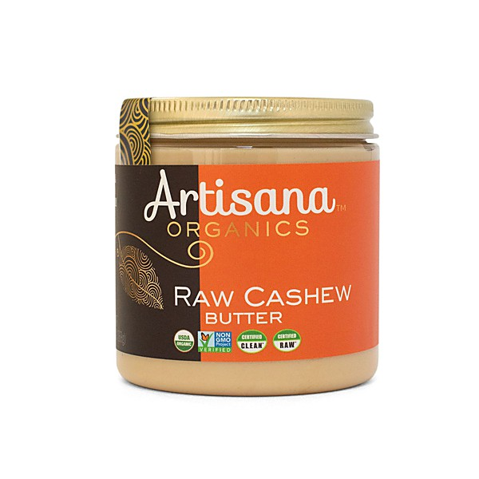

# Glad 'n' Greasy

By **The Beat Farmers**

## Album Data

- **Catalog:** Beets
- **Format:** Digital, Album
- **Album:** Glad 'n' Greasy
- **Artist:** The Beat Farmers
- **Albumartist:** The Beat Farmers
- **Genre:** Cowpunk
- **MusicBrainz Album Artist ID:** [fa5d4d6f-bfca-4412-869e-def05b4974bb](https://musicbrainz.org/artist/fa5d4d6f-bfca-4412-869e-def05b4974bb)
- **MusicBrainz Album ID:** [3f03b021-c02d-40d9-b9ec-54a535d307d2](https://musicbrainz.org/release/3f03b021-c02d-40d9-b9ec-54a535d307d2)
- **MusicBrainz Release Group ID:** [0f202eb8-c4a9-3334-bd5c-fff8bb580757](https://musicbrainz.org/release-group/0f202eb8-c4a9-3334-bd5c-fff8bb580757)
- **Year:** 2000
- **Catalog #:** CCDBF104
- **Label:** Clarence Records
- **Total Tracks:** 21

## Album Tracks

### Track 01 - Never Going Back

- **Artist:** The Beat Farmers
- **Format:** ALAC
- **Genre:** Cowpunk
- **Length:** 3:53
- **MusicBrainz Track ID:** [81b6a5e6-037d-4446-9353-9eebf6143ae1](https://musicbrainz.org/recording/81b6a5e6-037d-4446-9353-9eebf6143ae1)
- **Title:** Never Going Back
- **Track:** 01
- **Year:** 2003

### Track 02 - Trying to Get to You

- **Artist:** The Beat Farmers
- **Format:** ALAC
- **Genre:** Cowpunk
- **Length:** 2:51
- **MusicBrainz Track ID:** [321cd95f-d0f5-488c-84b6-1741695db4f9](https://musicbrainz.org/recording/321cd95f-d0f5-488c-84b6-1741695db4f9)
- **Title:** Trying to Get to You
- **Track:** 02
- **Year:** 2003

### Track 03 - Jump Right Back

- **Artist:** The Beat Farmers
- **Format:** ALAC
- **Genre:** Cowpunk
- **Length:** 1:48
- **MusicBrainz Track ID:** [aaaf2938-1bcf-4bca-a904-1e5945d8eed3](https://musicbrainz.org/recording/aaaf2938-1bcf-4bca-a904-1e5945d8eed3)
- **Title:** Jump Right Back
- **Track:** 03
- **Year:** 2003

### Track 04 - Lonely Blue Boy

- **Artist:** The Beat Farmers
- **Format:** ALAC
- **Genre:** Rock
- **Length:** 3:05
- **MusicBrainz Track ID:** [b9305753-663e-4b8f-828f-e0915848eb64](https://musicbrainz.org/recording/b9305753-663e-4b8f-828f-e0915848eb64)
- **Title:** Lonely Blue Boy
- **Track:** 04
- **Year:** 2003

### Track 05 - Beat Generation

- **Artist:** The Beat Farmers
- **Format:** ALAC
- **Genre:** Cowpunk
- **Length:** 2:47
- **MusicBrainz Track ID:** [867342d3-01de-4510-8487-8463e56e94e5](https://musicbrainz.org/recording/867342d3-01de-4510-8487-8463e56e94e5)
- **Title:** Beat Generation
- **Track:** 05
- **Year:** 2003

### Track 06 - Selfish Heart

- **Artist:** The Beat Farmers
- **Format:** ALAC
- **Genre:** Cowpunk
- **Length:** 2:57
- **MusicBrainz Track ID:** [bbb62c43-c106-4c91-9bc0-c7c394c20c3e](https://musicbrainz.org/recording/bbb62c43-c106-4c91-9bc0-c7c394c20c3e)
- **Title:** Selfish Heart
- **Track:** 06
- **Year:** 2003

### Track 07 - Assembly Line Rock

- **Artist:** The Beat Farmers
- **Format:** ALAC
- **Genre:** Cowpunk
- **Length:** 1:48
- **MusicBrainz Track ID:** [dc9be095-d5f8-40f6-8c6e-5561ccd3b509](https://musicbrainz.org/recording/dc9be095-d5f8-40f6-8c6e-5561ccd3b509)
- **Title:** Assembly Line Rock
- **Track:** 07
- **Year:** 2003

### Track 08 - Lonesome Hound

- **Artist:** The Beat Farmers
- **Format:** ALAC
- **Genre:** Cowpunk
- **Length:** 2:46
- **MusicBrainz Track ID:** [e157b2b8-f062-4620-aca9-20953eed1701](https://musicbrainz.org/recording/e157b2b8-f062-4620-aca9-20953eed1701)
- **Title:** Lonesome Hound
- **Track:** 08
- **Year:** 2003

### Track 09 - Dim Lights, Thick Smoke and Loud, Loud Music

- **Artist:** The Beat Farmers
- **Format:** ALAC
- **Genre:** Cowpunk
- **Length:** 4:47
- **MusicBrainz Track ID:** [765558d9-95c3-476d-9d03-006cc47815c0](https://musicbrainz.org/recording/765558d9-95c3-476d-9d03-006cc47815c0)
- **Title:** Dim Lights, Thick Smoke and Loud, Loud Music
- **Track:** 09
- **Year:** 2003

### Track 10 - Big River

- **Artist:** The Beat Farmers
- **Format:** ALAC
- **Genre:** Cowpunk
- **Length:** 3:21
- **MusicBrainz Track ID:** [63fc2779-f198-4aac-9319-1e63d36a02b2](https://musicbrainz.org/recording/63fc2779-f198-4aac-9319-1e63d36a02b2)
- **Title:** Big River
- **Track:** 10
- **Year:** 2003

### Track 11 - Showbiz

- **Artist:** The Beat Farmers
- **Format:** ALAC
- **Genre:** Cowpunk
- **Length:** 2:28
- **MusicBrainz Track ID:** [c3e68e21-3565-4f9a-a0cf-2eb95ac4dcd5](https://musicbrainz.org/recording/c3e68e21-3565-4f9a-a0cf-2eb95ac4dcd5)
- **Title:** Showbiz
- **Track:** 11
- **Year:** 2003

### Track 12 - Sloppy Drunk

- **Artist:** The Beat Farmers
- **Format:** ALAC
- **Genre:** Cowpunk
- **Length:** 3:15
- **MusicBrainz Track ID:** [4afefbb4-658d-4130-8856-063ab52ad81b](https://musicbrainz.org/recording/4afefbb4-658d-4130-8856-063ab52ad81b)
- **Title:** Sloppy Drunk
- **Track:** 12
- **Year:** 2003

### Track 13 - Sunday Morning

- **Artist:** The Beat Farmers
- **Format:** ALAC
- **Genre:** Cowpunk
- **Length:** 5:35
- **MusicBrainz Track ID:** [04be8f25-5b4d-4938-898f-8a3af189ad56](https://musicbrainz.org/recording/04be8f25-5b4d-4938-898f-8a3af189ad56)
- **Title:** Sunday Morning
- **Track:** 13
- **Year:** 2003

### Track 14 - Reason to Believe

- **Artist:** The Beat Farmers
- **Format:** ALAC
- **Genre:** Americana
- **Length:** 3:06
- **MusicBrainz Track ID:** [d61048e7-0c7e-4db5-b0eb-68455aa67628](https://musicbrainz.org/recording/d61048e7-0c7e-4db5-b0eb-68455aa67628)
- **Title:** Reason to Believe
- **Track:** 14
- **Year:** 2003

### Track 15 - Big Rock Candy Mountain

- **Artist:** The Beat Farmers
- **Format:** ALAC
- **Genre:** Rock
- **Length:** 2:16
- **MusicBrainz Track ID:** [130684e5-021a-4871-9a45-bcb13a966c2e](https://musicbrainz.org/recording/130684e5-021a-4871-9a45-bcb13a966c2e)
- **Title:** Big Rock Candy Mountain
- **Track:** 15
- **Year:** 2003

### Track 16 - Big Ugly Wheels

- **Artist:** The Beat Farmers
- **Format:** ALAC
- **Genre:** Cowpunk
- **Length:** 2:28
- **MusicBrainz Track ID:** [13266806-ae91-401b-9246-8cbf63c53995](https://musicbrainz.org/recording/13266806-ae91-401b-9246-8cbf63c53995)
- **Title:** Big Ugly Wheels
- **Track:** 16
- **Year:** 2003

### Track 17 - Upsettin' Me

- **Artist:** The Beat Farmers
- **Format:** ALAC
- **Genre:** Cowpunk
- **Length:** 3:15
- **MusicBrainz Track ID:** [ef6ced8c-373a-495c-a063-cb749dc2600a](https://musicbrainz.org/recording/ef6ced8c-373a-495c-a063-cb749dc2600a)
- **Title:** Upsettin' Me
- **Track:** 17
- **Year:** 2003

### Track 18 - I Still Miss Someone

- **Artist:** The Beat Farmers
- **Format:** ALAC
- **Genre:** Cowpunk
- **Length:** 2:20
- **MusicBrainz Track ID:** [4a30830d-092c-440d-85a6-5b69e3a87042](https://musicbrainz.org/recording/4a30830d-092c-440d-85a6-5b69e3a87042)
- **Title:** I Still Miss Someone
- **Track:** 18
- **Year:** 2003

### Track 19 - Lost Weekend

- **Artist:** The Beat Farmers
- **Format:** ALAC
- **Genre:** Cowpunk
- **Length:** 3:00
- **MusicBrainz Track ID:** [12403a4c-23c0-4b46-ba80-a5b6f146804c](https://musicbrainz.org/recording/12403a4c-23c0-4b46-ba80-a5b6f146804c)
- **Title:** Lost Weekend
- **Track:** 19
- **Year:** 2003

### Track 20 - You Can't Judge a Book by It's Cover

- **Artist:** The Beat Farmers
- **Format:** ALAC
- **Genre:** Cowpunk
- **Length:** 5:35
- **MusicBrainz Track ID:** [8f83a593-da84-4d03-b626-dd543e500133](https://musicbrainz.org/recording/8f83a593-da84-4d03-b626-dd543e500133)
- **Title:** You Can't Judge a Book by It's Cover
- **Track:** 20
- **Year:** 2003

### Track 21 - Mondo

- **Artist:** The Beat Farmers
- **Format:** ALAC
- **Genre:** Cowpunk
- **Length:** 3:44
- **MusicBrainz Track ID:** [fd71d00a-c158-4635-8781-8f886377714a](https://musicbrainz.org/recording/fd71d00a-c158-4635-8781-8f886377714a)
- **Title:** Mondo
- **Track:** 21
- **Year:** 2003

## See also

- [Live at the Spring Valley Inn, 1983](Live_at_the_Spring_Valley_Inn__1983.md)
- [Loud and Plowed and... LIVE!!](Loud_and_Plowed_and_LIVE!!.md)
- [Manifold](Manifold.md)
- [Poor and Famous](Poor_and_Famous.md)
- [Tales of the New West](Tales_of_the_New_West.md)
- [The Pursuit of Happiness](The_Pursuit_of_Happiness.md)
- [Van Go](Van_Go.md)
- [CD: Loud And Plowed And ... Live!!](../../CD/The_Beat_Farmers/Loud_And_Plowed_And__Live!!.md)
- [CD: ](../../CD/The_Beat_Farmers/The_Beat_Farmers.md)
