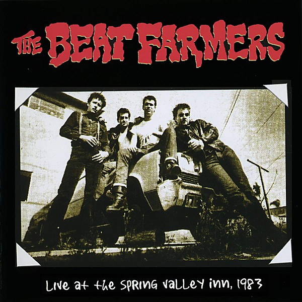

# Live at the Spring Valley Inn, 1983

By **The Beat Farmers**

## Album Data

- **Catalog:** Beets
- **Format:** Digital, Album
- **Album:** Live at the Spring Valley Inn, 1983
- **Artist:** The Beat Farmers
- **Albumartist:** The Beat Farmers
- **Genre:** Cowpunk
- **MusicBrainz Album Artist ID:** [fa5d4d6f-bfca-4412-869e-def05b4974bb](https://musicbrainz.org/artist/fa5d4d6f-bfca-4412-869e-def05b4974bb)
- **MusicBrainz Album ID:** [b67fc995-4307-4533-8668-d91ee490bc32](https://musicbrainz.org/release/b67fc995-4307-4533-8668-d91ee490bc32)
- **MusicBrainz Release Group ID:** [ee5074aa-e79c-4eeb-aa36-b8a355d8314f](https://musicbrainz.org/release-group/ee5074aa-e79c-4eeb-aa36-b8a355d8314f)
- **Year:** 2003
- **Catalog #:** D2-77265
- **Label:** Curb Records
- **Total Tracks:** 21

## Album Tracks

### Track 01 - Introduction

- **Artist:** The Beat Farmers
- **Format:** ALAC
- **Genre:** Cowpunk
- **Length:** 0:29
- **MusicBrainz Track ID:** [04d3b794-4c75-46d4-85f9-6f94f6f7d08e](https://musicbrainz.org/recording/04d3b794-4c75-46d4-85f9-6f94f6f7d08e)
- **Title:** Introduction
- **Track:** 01
- **Year:** 1990

### Track 02 - California Kid

- **Artist:** The Beat Farmers
- **Format:** ALAC
- **Genre:** Cowpunk
- **Length:** 3:38
- **MusicBrainz Track ID:** [bebdd7b5-c6a2-4352-8d2b-813b4a929878](https://musicbrainz.org/recording/bebdd7b5-c6a2-4352-8d2b-813b4a929878)
- **Title:** California Kid
- **Track:** 02
- **Year:** 1990

### Track 03 - Socialite

- **Artist:** The Beat Farmers
- **Format:** ALAC
- **Genre:** Cowpunk
- **Length:** 3:49
- **MusicBrainz Track ID:** [6005f0de-60ce-4d49-9088-97836f4d6c5e](https://musicbrainz.org/recording/6005f0de-60ce-4d49-9088-97836f4d6c5e)
- **Title:** Socialite
- **Track:** 03
- **Year:** 1990

### Track 04 - Texas

- **Artist:** The Beat Farmers
- **Format:** ALAC
- **Genre:** Cowpunk
- **Length:** 3:29
- **MusicBrainz Track ID:** [f81bc908-03cd-4407-b3a7-c3d055fb9b6f](https://musicbrainz.org/recording/f81bc908-03cd-4407-b3a7-c3d055fb9b6f)
- **Title:** Texas
- **Track:** 04
- **Year:** 1990

### Track 05 - Maureen

- **Artist:** The Beat Farmers
- **Format:** ALAC
- **Genre:** Cowpunk
- **Length:** 3:53
- **MusicBrainz Track ID:** [c370730a-e0a7-4eb4-8941-5a6128e2f0de](https://musicbrainz.org/recording/c370730a-e0a7-4eb4-8941-5a6128e2f0de)
- **Title:** Maureen
- **Track:** 05
- **Year:** 1990

### Track 06 - Revenooer Man

- **Artist:** The Beat Farmers
- **Format:** ALAC
- **Genre:** Cowpunk
- **Length:** 3:03
- **MusicBrainz Track ID:** [e1ac29e2-5ff0-4c6c-997c-403d142551e0](https://musicbrainz.org/recording/e1ac29e2-5ff0-4c6c-997c-403d142551e0)
- **Title:** Revenooer Man
- **Track:** 06
- **Year:** 1990

### Track 07 - Lucille

- **Artist:** The Beat Farmers
- **Format:** ALAC
- **Genre:** Cowpunk
- **Length:** 5:20
- **MusicBrainz Track ID:** [d0a3a95e-6716-43ed-8f8f-ff63db05a1c4](https://musicbrainz.org/recording/d0a3a95e-6716-43ed-8f8f-ff63db05a1c4)
- **Title:** Lucille
- **Track:** 07
- **Year:** 1990

### Track 08 - Happy Boy

- **Artist:** The Beat Farmers
- **Format:** ALAC
- **Genre:** Americana
- **Length:** 2:18
- **MusicBrainz Track ID:** [d3f74861-8a84-4446-81ff-b6aa220c7b08](https://musicbrainz.org/recording/d3f74861-8a84-4446-81ff-b6aa220c7b08)
- **Title:** Happy Boy
- **Track:** 08
- **Year:** 1990

### Track 09 - 20th Century Man

- **Artist:** The Beat Farmers
- **Format:** ALAC
- **Genre:** Cowpunk
- **Length:** 4:43
- **MusicBrainz Track ID:** [e40b92b9-8bdd-4103-abb3-eef7c8a6c583](https://musicbrainz.org/recording/e40b92b9-8bdd-4103-abb3-eef7c8a6c583)
- **Title:** 20th Century Man
- **Track:** 09
- **Year:** 1990

### Track 10 - Blue Chevrolet

- **Artist:** The Beat Farmers
- **Format:** ALAC
- **Genre:** Rock
- **Length:** 3:06
- **MusicBrainz Track ID:** [c3bed1db-2a11-41f0-b73f-2835389e6cb8](https://musicbrainz.org/recording/c3bed1db-2a11-41f0-b73f-2835389e6cb8)
- **Title:** Blue Chevrolet
- **Track:** 10
- **Year:** 1990

### Track 11 - Big Big Man

- **Artist:** The Beat Farmers
- **Format:** ALAC
- **Genre:** Cowpunk
- **Length:** 4:32
- **MusicBrainz Track ID:** [f811245a-953f-451d-98e5-e7f0115d7b9e](https://musicbrainz.org/recording/f811245a-953f-451d-98e5-e7f0115d7b9e)
- **Title:** Big Big Man
- **Track:** 11
- **Year:** 1990

### Track 12 - Ridin'

- **Artist:** The Beat Farmers
- **Format:** ALAC
- **Genre:** Cowpunk
- **Length:** 5:11
- **MusicBrainz Track ID:** [331e81ab-fe06-4714-88e5-9976bfd55ef6](https://musicbrainz.org/recording/331e81ab-fe06-4714-88e5-9976bfd55ef6)
- **Title:** Ridin'
- **Track:** 12
- **Year:** 1990

### Track 13 - Hideaway

- **Artist:** The Beat Farmers
- **Format:** ALAC
- **Genre:** Cowpunk
- **Length:** 5:13
- **MusicBrainz Track ID:** [aad8a987-9ac6-45ba-bb33-35d0bce3e8bd](https://musicbrainz.org/recording/aad8a987-9ac6-45ba-bb33-35d0bce3e8bd)
- **Title:** Hideaway
- **Track:** 13
- **Year:** 1990

### Track 14 - Selfish Heart

- **Artist:** The Beat Farmers
- **Format:** ALAC
- **Genre:** Cowpunk
- **Length:** 2:51
- **MusicBrainz Track ID:** [86e078ae-a7a6-483c-8032-9a356ab3a788](https://musicbrainz.org/recording/86e078ae-a7a6-483c-8032-9a356ab3a788)
- **Title:** Selfish Heart
- **Track:** 14
- **Year:** 1990

### Track 15 - Big Ugly Wheels

- **Artist:** The Beat Farmers
- **Format:** ALAC
- **Genre:** Cowpunk
- **Length:** 2:36
- **MusicBrainz Track ID:** [3d55737c-488d-4fb5-bf9e-a37329279b94](https://musicbrainz.org/recording/3d55737c-488d-4fb5-bf9e-a37329279b94)
- **Title:** Big Ugly Wheels
- **Track:** 15
- **Year:** 1990

### Track 16 - Roll Another Number (For the Road)

- **Artist:** The Beat Farmers
- **Format:** ALAC
- **Genre:** Cowpunk
- **Length:** 2:51
- **MusicBrainz Track ID:** [4618ece0-6a48-419f-b87e-ecd08be58d1e](https://musicbrainz.org/recording/4618ece0-6a48-419f-b87e-ecd08be58d1e)
- **Title:** Roll Another Number (For the Road)
- **Track:** 16
- **Year:** 1990

### Track 17 - Hollywood Hills

- **Artist:** The Beat Farmers
- **Format:** ALAC
- **Genre:** Cowpunk
- **Length:** 4:31
- **MusicBrainz Track ID:** [4558ac1b-f55f-421b-b4fa-6cbe8ab6d56d](https://musicbrainz.org/recording/4558ac1b-f55f-421b-b4fa-6cbe8ab6d56d)
- **Title:** Hollywood Hills
- **Track:** 17
- **Year:** 1990

### Track 18 - If I Were a Carpenter

- **Artist:** The Beat Farmers
- **Format:** ALAC
- **Genre:** Cowpunk
- **Length:** 0:34
- **MusicBrainz Track ID:** [5f4f7254-3185-4e64-b46c-43f6313a4ebe](https://musicbrainz.org/recording/5f4f7254-3185-4e64-b46c-43f6313a4ebe)
- **Title:** If I Were a Carpenter
- **Track:** 18
- **Year:** 1990

### Track 19 - God Is Here Tonight

- **Artist:** The Beat Farmers
- **Format:** ALAC
- **Genre:** Southern Rock
- **Length:** 3:41
- **MusicBrainz Track ID:** [cee5ea08-a584-4a80-9852-77837ba3afb0](https://musicbrainz.org/recording/cee5ea08-a584-4a80-9852-77837ba3afb0)
- **Title:** God Is Here Tonight
- **Track:** 19
- **Year:** 1990

### Track 20 - Riverside

- **Artist:** The Beat Farmers
- **Format:** ALAC
- **Genre:** Americana
- **Length:** 3:58
- **MusicBrainz Track ID:** [fea6497d-fd21-481e-b4ea-bba14c06e03b](https://musicbrainz.org/recording/fea6497d-fd21-481e-b4ea-bba14c06e03b)
- **Title:** Riverside
- **Track:** 20
- **Year:** 1990

### Track 21 - King of Sleaze

- **Artist:** The Beat Farmers
- **Format:** ALAC
- **Genre:** Cowpunk
- **Length:** 3:38
- **MusicBrainz Track ID:** [4ba5d2f7-fe95-424e-8ec3-a432d0bd9da4](https://musicbrainz.org/recording/4ba5d2f7-fe95-424e-8ec3-a432d0bd9da4)
- **Title:** King of Sleaze
- **Track:** 21
- **Year:** 1990

## See also

- [Glad 'n' Greasy](Glad_n_Greasy.md)
- [Loud and Plowed and... LIVE!!](Loud_and_Plowed_and_LIVE!!.md)
- [Manifold](Manifold.md)
- [Poor and Famous](Poor_and_Famous.md)
- [Tales of the New West](Tales_of_the_New_West.md)
- [The Pursuit of Happiness](The_Pursuit_of_Happiness.md)
- [Van Go](Van_Go.md)
- [CD: Loud And Plowed And ... Live!!](../../CD/The_Beat_Farmers/Loud_And_Plowed_And__Live!!.md)
- [CD: ](../../CD/The_Beat_Farmers/The_Beat_Farmers.md)
