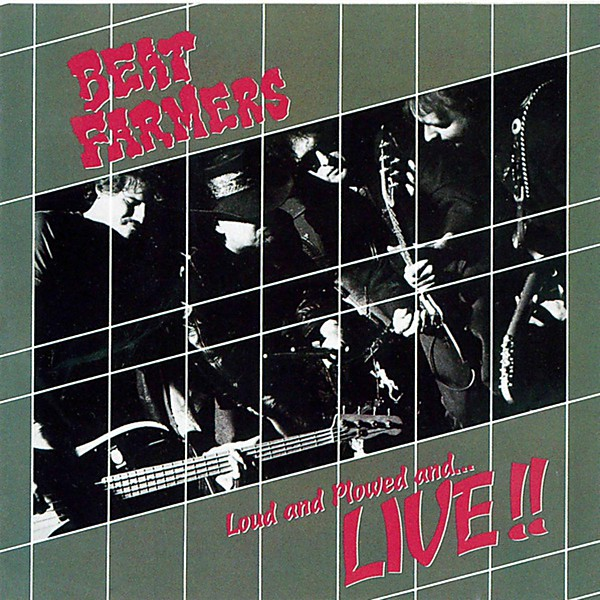

# Loud and Plowed and... LIVE!!

By **The Beat Farmers**

## Album Data

- **Catalog:** Beets
- **Format:** Digital, Album
- **Album:** Loud and Plowed and... LIVE!!
- **Artist:** The Beat Farmers
- **Albumartist:** The Beat Farmers
- **Genre:** Cowpunk
- **MusicBrainz Album Artist ID:** [fa5d4d6f-bfca-4412-869e-def05b4974bb](https://musicbrainz.org/artist/fa5d4d6f-bfca-4412-869e-def05b4974bb)
- **MusicBrainz Album ID:** [8ea95945-252f-481d-a914-d5d54de5a9e1](https://musicbrainz.org/release/8ea95945-252f-481d-a914-d5d54de5a9e1)
- **MusicBrainz Release Group ID:** [6f3cd8fb-93f1-3c46-aa48-654e93edb986](https://musicbrainz.org/release-group/6f3cd8fb-93f1-3c46-aa48-654e93edb986)
- **Year:** 1990
- **Catalog #:** 10019-2
- **Label:** Sector 2 Records
- **Total Tracks:** 15

## Album Tracks

### Track 01 - Memphis to Nixon

- **Artist:** The Beat Farmers
- **Format:** ALAC
- **Genre:** Cowpunk
- **Length:** 2:24
- **MusicBrainz Track ID:** [3cbb3609-fed2-4e4e-81cc-f3d65a87e856](https://musicbrainz.org/recording/3cbb3609-fed2-4e4e-81cc-f3d65a87e856)
- **Title:** Memphis to Nixon
- **Track:** 01
- **Year:** 1995

### Track 02 - Doubts About Love

- **Artist:** The Beat Farmers
- **Format:** ALAC
- **Genre:** Cowpunk
- **Length:** 2:38
- **MusicBrainz Track ID:** [ee2b7eea-c836-406a-8a8d-c8ca58bf8a06](https://musicbrainz.org/recording/ee2b7eea-c836-406a-8a8d-c8ca58bf8a06)
- **Title:** Doubts About Love
- **Track:** 02
- **Year:** 1995

### Track 03 - Mystery

- **Artist:** The Beat Farmers
- **Format:** ALAC
- **Genre:** Cowpunk
- **Length:** 4:01
- **MusicBrainz Track ID:** [b27f759f-d9b8-437e-a3ef-a7a10b919512](https://musicbrainz.org/recording/b27f759f-d9b8-437e-a3ef-a7a10b919512)
- **Title:** Mystery
- **Track:** 03
- **Year:** 1995

### Track 04 - Country Western Song

- **Artist:** The Beat Farmers
- **Format:** ALAC
- **Genre:** Cowpunk
- **Length:** 2:59
- **MusicBrainz Track ID:** [94fdc3dd-7815-4909-a0c3-152e53a3c822](https://musicbrainz.org/recording/94fdc3dd-7815-4909-a0c3-152e53a3c822)
- **Title:** Country Western Song
- **Track:** 04
- **Year:** 1995

### Track 05 - Blue Radio

- **Artist:** The Beat Farmers
- **Format:** ALAC
- **Genre:** Cowpunk
- **Length:** 4:47
- **MusicBrainz Track ID:** [b70b8e7d-8c8d-4e58-aef2-1abd4c95819c](https://musicbrainz.org/recording/b70b8e7d-8c8d-4e58-aef2-1abd4c95819c)
- **Title:** Blue Radio
- **Track:** 05
- **Year:** 1995

### Track 06 - Got It Bad

- **Artist:** The Beat Farmers
- **Format:** ALAC
- **Genre:** Cowpunk
- **Length:** 3:44
- **MusicBrainz Track ID:** [d01f6ed5-4f6f-4430-9f42-627a2a12a730](https://musicbrainz.org/recording/d01f6ed5-4f6f-4430-9f42-627a2a12a730)
- **Title:** Got It Bad
- **Track:** 06
- **Year:** 1995

### Track 07 - Whale Oil Beef Hooked

- **Artist:** The Beat Farmers
- **Format:** ALAC
- **Genre:** Cowpunk
- **Length:** 2:42
- **MusicBrainz Track ID:** [a7108af6-22c9-4d77-a342-366fd2cd2463](https://musicbrainz.org/recording/a7108af6-22c9-4d77-a342-366fd2cd2463)
- **Title:** Whale Oil Beef Hooked
- **Track:** 07
- **Year:** 1995

### Track 08 - Texas Heat

- **Artist:** The Beat Farmers
- **Format:** ALAC
- **Genre:** Cowpunk
- **Length:** 2:31
- **MusicBrainz Track ID:** [da180d32-12f2-497a-bc21-a488ecae3f7c](https://musicbrainz.org/recording/da180d32-12f2-497a-bc21-a488ecae3f7c)
- **Title:** Texas Heat
- **Track:** 08
- **Year:** 1995

### Track 09 - Good for You

- **Artist:** The Beat Farmers
- **Format:** ALAC
- **Genre:** Cowpunk
- **Length:** 3:02
- **MusicBrainz Track ID:** [2d995d6e-77e0-4daa-8382-c163bd47848b](https://musicbrainz.org/recording/2d995d6e-77e0-4daa-8382-c163bd47848b)
- **Title:** Good for You
- **Track:** 09
- **Year:** 1995

### Track 10 - White Veil

- **Artist:** The Beat Farmers
- **Format:** ALAC
- **Genre:** Cowpunk
- **Length:** 3:05
- **MusicBrainz Track ID:** [919825e8-ec3a-4c9b-87dd-178a2831c8da](https://musicbrainz.org/recording/919825e8-ec3a-4c9b-87dd-178a2831c8da)
- **Title:** White Veil
- **Track:** 10
- **Year:** 1995

### Track 11 - Beer Ain't Drinkin'

- **Artist:** The Beat Farmers
- **Format:** ALAC
- **Genre:** Cowpunk
- **Length:** 4:28
- **MusicBrainz Track ID:** [39eb2efa-5733-4555-b086-d889102e8de2](https://musicbrainz.org/recording/39eb2efa-5733-4555-b086-d889102e8de2)
- **Title:** Beer Ain't Drinkin'
- **Track:** 11
- **Year:** 1995

### Track 12 - I Could Be Anything

- **Artist:** The Beat Farmers
- **Format:** ALAC
- **Genre:** Cowpunk
- **Length:** 3:15
- **MusicBrainz Track ID:** [db0ec2e4-cb5a-4b4b-80b1-c3d3c9c8a210](https://musicbrainz.org/recording/db0ec2e4-cb5a-4b4b-80b1-c3d3c9c8a210)
- **Title:** I Could Be Anything
- **Track:** 12
- **Year:** 1995

### Track 13 - Can't Remember

- **Artist:** The Beat Farmers
- **Format:** ALAC
- **Genre:** Cowpunk
- **Length:** 4:29
- **MusicBrainz Track ID:** [37904d2d-8b0b-438b-a64b-e8efdb1b9c2b](https://musicbrainz.org/recording/37904d2d-8b0b-438b-a64b-e8efdb1b9c2b)
- **Title:** Can't Remember
- **Track:** 13
- **Year:** 1995

### Track 14 - Positively 4th Street

- **Artist:** The Beat Farmers
- **Format:** ALAC
- **Genre:** Cowpunk
- **Length:** 4:05
- **MusicBrainz Track ID:** [3a46f0ca-59d4-426e-94b5-fff4a5237a7e](https://musicbrainz.org/recording/3a46f0ca-59d4-426e-94b5-fff4a5237a7e)
- **Title:** Positively 4th Street
- **Track:** 14
- **Year:** 1995

### Track 15 - Distant Horizon

- **Artist:** The Beat Farmers
- **Format:** ALAC
- **Genre:** Cowpunk
- **Length:** 2:49
- **MusicBrainz Track ID:** [ac9e7712-175e-456a-9529-262655af3310](https://musicbrainz.org/recording/ac9e7712-175e-456a-9529-262655af3310)
- **Title:** Distant Horizon
- **Track:** 15
- **Year:** 1995

## See also

- [Glad 'n' Greasy](Glad_n_Greasy.md)
- [Live at the Spring Valley Inn, 1983](Live_at_the_Spring_Valley_Inn__1983.md)
- [Manifold](Manifold.md)
- [Poor and Famous](Poor_and_Famous.md)
- [Tales of the New West](Tales_of_the_New_West.md)
- [The Pursuit of Happiness](The_Pursuit_of_Happiness.md)
- [Van Go](Van_Go.md)
- [CD: Loud And Plowed And ... Live!!](../../CD/The_Beat_Farmers/Loud_And_Plowed_And__Live!!.md)
- [CD: ](../../CD/The_Beat_Farmers/The_Beat_Farmers.md)
