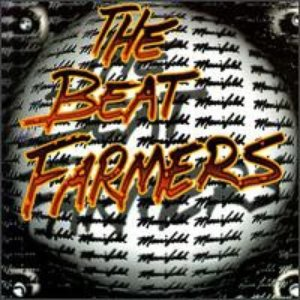

# Manifold

By **The Beat Farmers**

## Album Data

- **Catalog:** Beets
- **Format:** Digital, Album
- **Album:** Manifold
- **Artist:** The Beat Farmers
- **Albumartist:** The Beat Farmers
- **Genre:** Cowpunk
- **MusicBrainz Album Artist ID:** [fa5d4d6f-bfca-4412-869e-def05b4974bb](https://musicbrainz.org/artist/fa5d4d6f-bfca-4412-869e-def05b4974bb)
- **MusicBrainz Album ID:** [57df3412-99e4-479b-a8df-5bada7c48926](https://musicbrainz.org/release/57df3412-99e4-479b-a8df-5bada7c48926)
- **MusicBrainz Release Group ID:** [900c5af4-ced7-33eb-a8c4-dc2573537aa9](https://musicbrainz.org/release-group/900c5af4-ced7-33eb-a8c4-dc2573537aa9)
- **Year:** 1995
- **Catalog #:** MCAD-6296
- **Label:** MCA Records
- **Total Tracks:** 10

## Album Tracks

### Track 01 - Socialite

- **Artist:** The Beat Farmers
- **Format:** MP3
- **Genre:** Cowpunk
- **Length:** 3:40
- **MusicBrainz Track ID:** [9de01207-a6ce-49ea-8b23-e7c431b76faa](https://musicbrainz.org/recording/9de01207-a6ce-49ea-8b23-e7c431b76faa)
- **Title:** Socialite
- **Track:** 01
- **Year:** 1989

### Track 02 - Hideaway

- **Artist:** The Beat Farmers
- **Format:** MP3
- **Genre:** Cowpunk
- **Length:** 5:12
- **MusicBrainz Track ID:** [48f43c9e-755c-4790-8f93-bc852d67718a](https://musicbrainz.org/recording/48f43c9e-755c-4790-8f93-bc852d67718a)
- **Title:** Hideaway
- **Track:** 02
- **Year:** 1989

### Track 03 - What I Mean to Say

- **Artist:** The Beat Farmers
- **Format:** MP3
- **Genre:** Cowpunk
- **Length:** 3:38
- **MusicBrainz Track ID:** [4867f45b-62c9-4fe1-b65b-f83d1ea0da7a](https://musicbrainz.org/recording/4867f45b-62c9-4fe1-b65b-f83d1ea0da7a)
- **Title:** What I Mean to Say
- **Track:** 03
- **Year:** 1989

### Track 04 - Wait So Long

- **Artist:** The Beat Farmers
- **Format:** MP3
- **Genre:** Cowpunk
- **Length:** 4:10
- **MusicBrainz Track ID:** [4e795301-c1ad-4977-9d3c-c82e445bc9c9](https://musicbrainz.org/recording/4e795301-c1ad-4977-9d3c-c82e445bc9c9)
- **Title:** Wait So Long
- **Track:** 04
- **Year:** 1989

### Track 05 - Wheels

- **Artist:** The Beat Farmers
- **Format:** MP3
- **Genre:** Cowpunk
- **Length:** 2:35
- **MusicBrainz Track ID:** [0ac90e49-a6c0-4b69-88d5-2c5bca195ba7](https://musicbrainz.org/recording/0ac90e49-a6c0-4b69-88d5-2c5bca195ba7)
- **Title:** Wheels
- **Track:** 05
- **Year:** 1989

### Track 06 - Girl I Almost Married

- **Artist:** The Beat Farmers
- **Format:** MP3
- **Genre:** Cowpunk
- **Length:** 3:10
- **MusicBrainz Track ID:** [05f1e941-6373-4bf5-bf39-7e82935185db](https://musicbrainz.org/recording/05f1e941-6373-4bf5-bf39-7e82935185db)
- **Title:** Girl I Almost Married
- **Track:** 06
- **Year:** 1989

### Track 07 - If I Can Hold

- **Artist:** The Beat Farmers
- **Format:** MP3
- **Genre:** Cowpunk
- **Length:** 3:41
- **MusicBrainz Track ID:** [f422f65e-dc8f-49f8-9c0c-ebee44e7e0e8](https://musicbrainz.org/recording/f422f65e-dc8f-49f8-9c0c-ebee44e7e0e8)
- **Title:** If I Can Hold
- **Track:** 07
- **Year:** 1989

### Track 08 - King of Sleaze

- **Artist:** The Beat Farmers
- **Format:** MP3
- **Genre:** Cowpunk
- **Length:** 3:12
- **MusicBrainz Track ID:** [1b2e368e-a8fe-4e9e-b696-b79c9ed5f139](https://musicbrainz.org/recording/1b2e368e-a8fe-4e9e-b696-b79c9ed5f139)
- **Title:** King of Sleaze
- **Track:** 08
- **Year:** 1989

### Track 09 - The Trouble With You

- **Artist:** The Beat Farmers
- **Format:** MP3
- **Genre:** Cowpunk
- **Length:** 2:55
- **MusicBrainz Track ID:** [5815b4a1-857d-4031-9bef-2122806d763f](https://musicbrainz.org/recording/5815b4a1-857d-4031-9bef-2122806d763f)
- **Title:** The Trouble With You
- **Track:** 09
- **Year:** 1989

### Track 10 - Time in Between

- **Artist:** The Beat Farmers
- **Format:** MP3
- **Genre:** Cowpunk
- **Length:** 4:35
- **MusicBrainz Track ID:** [54abdff5-d70c-48ea-878b-eb9660f14625](https://musicbrainz.org/recording/54abdff5-d70c-48ea-878b-eb9660f14625)
- **Title:** Time in Between
- **Track:** 10
- **Year:** 1989

## See also

- [Glad 'n' Greasy](Glad_n_Greasy.md)
- [Live at the Spring Valley Inn, 1983](Live_at_the_Spring_Valley_Inn__1983.md)
- [Loud and Plowed and... LIVE!!](Loud_and_Plowed_and_LIVE!!.md)
- [Poor and Famous](Poor_and_Famous.md)
- [Tales of the New West](Tales_of_the_New_West.md)
- [The Pursuit of Happiness](The_Pursuit_of_Happiness.md)
- [Van Go](Van_Go.md)
- [CD: Loud And Plowed And ... Live!!](../../CD/The_Beat_Farmers/Loud_And_Plowed_And__Live!!.md)
- [CD: ](../../CD/The_Beat_Farmers/The_Beat_Farmers.md)
