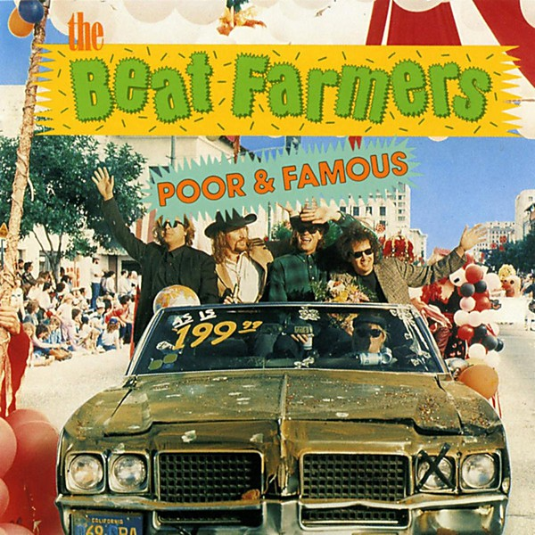

# Poor and Famous

By **The Beat Farmers**

## Album Data

- **Catalog:** Beets
- **Format:** Digital, Album
- **Album:** Poor and Famous
- **Artist:** The Beat Farmers
- **Albumartist:** The Beat Farmers
- **Genre:** Cowpunk
- **MusicBrainz Album Artist ID:** [fa5d4d6f-bfca-4412-869e-def05b4974bb](https://musicbrainz.org/artist/fa5d4d6f-bfca-4412-869e-def05b4974bb)
- **MusicBrainz Album ID:** [a7ed8e5e-2aa5-4acd-9116-de50f2c31d59](https://musicbrainz.org/release/a7ed8e5e-2aa5-4acd-9116-de50f2c31d59)
- **MusicBrainz Release Group ID:** [9cf9ccbf-d611-35bf-ad69-120da100858f](https://musicbrainz.org/release-group/9cf9ccbf-d611-35bf-ad69-120da100858f)
- **Year:** 1989
- **Catalog #:** RNLP 853
- **Label:** Rhino
- **Total Tracks:** 12

## Album Tracks

### Track 01 - Bigger Stones

- **Artist:** The Beat Farmers
- **Format:** AAC
- **Genre:** Cowpunk
- **Length:** 2:22
- **MusicBrainz Track ID:** [07923e66-6e5d-416d-a137-9d6ffe144624](https://musicbrainz.org/recording/07923e66-6e5d-416d-a137-9d6ffe144624)
- **Title:** Bigger Stones
- **Track:** 01
- **Year:** 1985

### Track 02 - There She Goes Again

- **Artist:** The Beat Farmers
- **Format:** AAC
- **Genre:** Southern Rock
- **Length:** 2:44
- **MusicBrainz Track ID:** [651a4f2e-907c-4b40-82f5-04cbe5c2603d](https://musicbrainz.org/recording/651a4f2e-907c-4b40-82f5-04cbe5c2603d)
- **Title:** There She Goes Again
- **Track:** 02
- **Year:** 1985

### Track 03 - Reason to Believe

- **Artist:** The Beat Farmers
- **Format:** AAC
- **Genre:** Americana
- **Length:** 2:40
- **MusicBrainz Track ID:** [ce394921-4993-4e2e-9b92-78376b29f9a5](https://musicbrainz.org/recording/ce394921-4993-4e2e-9b92-78376b29f9a5)
- **Title:** Reason to Believe
- **Track:** 03
- **Year:** 1985

### Track 04 - Lost Weekend

- **Artist:** The Beat Farmers
- **Format:** AAC
- **Genre:** Cowpunk
- **Length:** 2:54
- **MusicBrainz Track ID:** [314b73f0-5f48-429a-998c-b57d2bfca7a5](https://musicbrainz.org/recording/314b73f0-5f48-429a-998c-b57d2bfca7a5)
- **Title:** Lost Weekend
- **Track:** 04
- **Year:** 1985

### Track 05 - California Kid

- **Artist:** The Beat Farmers
- **Format:** AAC
- **Genre:** Cowpunk
- **Length:** 2:43
- **MusicBrainz Track ID:** [89ce5669-31fc-4533-96e0-fc8b8fd0d3b0](https://musicbrainz.org/recording/89ce5669-31fc-4533-96e0-fc8b8fd0d3b0)
- **Title:** California Kid
- **Track:** 05
- **Year:** 1985

### Track 06 - Never Goin' Back

- **Artist:** The Beat Farmers
- **Format:** AAC
- **Genre:** Cowpunk
- **Length:** 3:53
- **MusicBrainz Track ID:** [c2d05f2a-0921-4dbe-a04c-d5478bf3af63](https://musicbrainz.org/recording/c2d05f2a-0921-4dbe-a04c-d5478bf3af63)
- **Title:** Never Goin' Back
- **Track:** 06
- **Year:** 1985

### Track 07 - Goldmine

- **Artist:** The Beat Farmers
- **Format:** AAC
- **Genre:** Cowpunk
- **Length:** 2:54
- **MusicBrainz Track ID:** [f70f01c8-8d34-495d-a9a0-67ffdf47bac3](https://musicbrainz.org/recording/f70f01c8-8d34-495d-a9a0-67ffdf47bac3)
- **Title:** Goldmine
- **Track:** 07
- **Year:** 1985

### Track 08 - Showbiz

- **Artist:** The Beat Farmers
- **Format:** AAC
- **Genre:** Cowpunk
- **Length:** 2:15
- **MusicBrainz Track ID:** [6f1b6c6b-5d66-4f7d-9f3a-f7b90588833e](https://musicbrainz.org/recording/6f1b6c6b-5d66-4f7d-9f3a-f7b90588833e)
- **Title:** Showbiz
- **Track:** 08
- **Year:** 1985

### Track 09 - Lonesome Hound

- **Artist:** The Beat Farmers
- **Format:** AAC
- **Genre:** Cowpunk
- **Length:** 2:41
- **MusicBrainz Track ID:** [e4c05bb3-0285-41e0-873a-f2c4c00f5f42](https://musicbrainz.org/recording/e4c05bb3-0285-41e0-873a-f2c4c00f5f42)
- **Title:** Lonesome Hound
- **Track:** 09
- **Year:** 1985

### Track 10 - Where Do They Go

- **Artist:** The Beat Farmers
- **Format:** AAC
- **Genre:** Cowpunk
- **Length:** 3:03
- **MusicBrainz Track ID:** [db4ab96d-b059-4125-8bda-3985e4601012](https://musicbrainz.org/recording/db4ab96d-b059-4125-8bda-3985e4601012)
- **Title:** Where Do They Go
- **Track:** 10
- **Year:** 1985

### Track 11 - Selfish Heart

- **Artist:** The Beat Farmers
- **Format:** AAC
- **Genre:** Cowpunk
- **Length:** 2:42
- **MusicBrainz Track ID:** [ac57d7bf-7102-41ed-816f-f10666b671e2](https://musicbrainz.org/recording/ac57d7bf-7102-41ed-816f-f10666b671e2)
- **Title:** Selfish Heart
- **Track:** 11
- **Year:** 1985

### Track 12 - Happy Boy

- **Artist:** The Beat Farmers
- **Format:** AAC
- **Genre:** Americana
- **Length:** 1:22
- **MusicBrainz Track ID:** [44e59c8b-17ac-4a42-a285-fa594b28307c](https://musicbrainz.org/recording/44e59c8b-17ac-4a42-a285-fa594b28307c)
- **Title:** Happy Boy
- **Track:** 12
- **Year:** 1985

## See also

- [Glad 'n' Greasy](Glad_n_Greasy.md)
- [Live at the Spring Valley Inn, 1983](Live_at_the_Spring_Valley_Inn__1983.md)
- [Loud and Plowed and... LIVE!!](Loud_and_Plowed_and_LIVE!!.md)
- [Manifold](Manifold.md)
- [Tales of the New West](Tales_of_the_New_West.md)
- [The Pursuit of Happiness](The_Pursuit_of_Happiness.md)
- [Van Go](Van_Go.md)
- [CD: Loud And Plowed And ... Live!!](../../CD/The_Beat_Farmers/Loud_And_Plowed_And__Live!!.md)
- [CD: ](../../CD/The_Beat_Farmers/The_Beat_Farmers.md)
