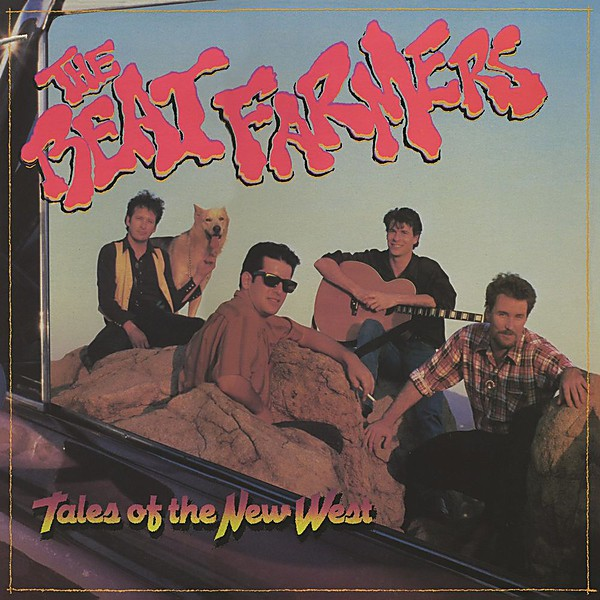

# Tales of the New West

By **The Beat Farmers**

## Album Data

- **Catalog:** Beets
- **Format:** Digital, Album
- **Album:** Tales of the New West
- **Artist:** The Beat Farmers
- **Albumartist:** The Beat Farmers
- **Genre:** Cowpunk
- **MusicBrainz Album Artist ID:** [fa5d4d6f-bfca-4412-869e-def05b4974bb](https://musicbrainz.org/artist/fa5d4d6f-bfca-4412-869e-def05b4974bb)
- **MusicBrainz Album ID:** [b96f0657-6e5d-467d-a453-d7a3310d4ed2](https://musicbrainz.org/release/b96f0657-6e5d-467d-a453-d7a3310d4ed2)
- **MusicBrainz Release Group ID:** [7a643460-ffe1-3c86-b9c9-78c592d03f15](https://musicbrainz.org/release-group/7a643460-ffe1-3c86-b9c9-78c592d03f15)
- **Year:** 1985
- **Catalog #:** MCAD-5993
- **Label:** Curb Records
- **Total Tracks:** 11

## Album Tracks

### Track 01 - Hollywood Hills

- **Artist:** The Beat Farmers
- **Format:** ALAC
- **Genre:** Cowpunk
- **Length:** 4:21
- **MusicBrainz Track ID:** [54a6046e-65f3-4e44-a22d-f52ff02dbdd9](https://musicbrainz.org/recording/54a6046e-65f3-4e44-a22d-f52ff02dbdd9)
- **Title:** Hollywood Hills
- **Track:** 01
- **Year:** 1987

### Track 02 - Ridin'

- **Artist:** The Beat Farmers
- **Format:** ALAC
- **Genre:** Cowpunk
- **Length:** 4:08
- **MusicBrainz Track ID:** [83deb76e-e266-46a5-a965-9f882cdf2d26](https://musicbrainz.org/recording/83deb76e-e266-46a5-a965-9f882cdf2d26)
- **Title:** Ridin'
- **Track:** 02
- **Year:** 1987

### Track 03 - Dark Light

- **Artist:** The Beat Farmers
- **Format:** ALAC
- **Genre:** Cowpunk
- **Length:** 4:08
- **MusicBrainz Track ID:** [061b23c0-478e-45f4-9616-d319edb6a5b1](https://musicbrainz.org/recording/061b23c0-478e-45f4-9616-d319edb6a5b1)
- **Title:** Dark Light
- **Track:** 03
- **Year:** 1987

### Track 04 - Make It Last

- **Artist:** The Beat Farmers
- **Format:** ALAC
- **Genre:** Cowpunk
- **Length:** 4:04
- **MusicBrainz Track ID:** [86724c66-c8ad-4b4e-b3bf-330c406fd711](https://musicbrainz.org/recording/86724c66-c8ad-4b4e-b3bf-330c406fd711)
- **Title:** Make It Last
- **Track:** 04
- **Year:** 1987

### Track 05 - Key to the World

- **Artist:** The Beat Farmers
- **Format:** ALAC
- **Genre:** Cowpunk
- **Length:** 3:25
- **MusicBrainz Track ID:** [b623bd4b-2578-4a6e-9dba-fc23a35b86ec](https://musicbrainz.org/recording/b623bd4b-2578-4a6e-9dba-fc23a35b86ec)
- **Title:** Key to the World
- **Track:** 05
- **Year:** 1987

### Track 06 - God Is Here Tonight

- **Artist:** The Beat Farmers
- **Format:** ALAC
- **Genre:** Southern Rock
- **Length:** 3:40
- **MusicBrainz Track ID:** [40fde0c8-9db3-4dc3-bcbb-edf436c48b3f](https://musicbrainz.org/recording/40fde0c8-9db3-4dc3-bcbb-edf436c48b3f)
- **Title:** God Is Here Tonight
- **Track:** 06
- **Year:** 1987

### Track 07 - Big Big Man

- **Artist:** The Beat Farmers
- **Format:** ALAC
- **Genre:** Cowpunk
- **Length:** 3:58
- **MusicBrainz Track ID:** [b3912e55-69d5-464d-b265-bed017bd1041](https://musicbrainz.org/recording/b3912e55-69d5-464d-b265-bed017bd1041)
- **Title:** Big Big Man
- **Track:** 07
- **Year:** 1987

### Track 08 - Elephant Day Parade

- **Artist:** The Beat Farmers
- **Format:** ALAC
- **Genre:** Cowpunk
- **Length:** 2:44
- **MusicBrainz Track ID:** [52db5f97-4bd6-4d28-8586-0dd06314281f](https://musicbrainz.org/recording/52db5f97-4bd6-4d28-8586-0dd06314281f)
- **Title:** Elephant Day Parade
- **Track:** 08
- **Year:** 1987

### Track 09 - Rosie

- **Artist:** The Beat Farmers
- **Format:** ALAC
- **Genre:** Cowpunk
- **Length:** 2:23
- **MusicBrainz Track ID:** [109f5c9b-0eff-4097-aa6c-346b789b72c6](https://musicbrainz.org/recording/109f5c9b-0eff-4097-aa6c-346b789b72c6)
- **Title:** Rosie
- **Track:** 09
- **Year:** 1987

### Track 10 - Texas

- **Artist:** The Beat Farmers
- **Format:** ALAC
- **Genre:** Cowpunk
- **Length:** 3:26
- **MusicBrainz Track ID:** [dc186fd2-b0b3-48d1-b2c8-bfff27ba0a4d](https://musicbrainz.org/recording/dc186fd2-b0b3-48d1-b2c8-bfff27ba0a4d)
- **Title:** Texas
- **Track:** 10
- **Year:** 1987

### Track 11 - Big River

- **Artist:** The Beat Farmers
- **Format:** ALAC
- **Genre:** Cowpunk
- **Length:** 2:36
- **MusicBrainz Track ID:** [7efd02af-c1ff-423d-8bb9-d3522d61ba58](https://musicbrainz.org/recording/7efd02af-c1ff-423d-8bb9-d3522d61ba58)
- **Title:** Big River
- **Track:** 11
- **Year:** 1987

## See also

- [Glad 'n' Greasy](Glad_n_Greasy.md)
- [Live at the Spring Valley Inn, 1983](Live_at_the_Spring_Valley_Inn__1983.md)
- [Loud and Plowed and... LIVE!!](Loud_and_Plowed_and_LIVE!!.md)
- [Manifold](Manifold.md)
- [Poor and Famous](Poor_and_Famous.md)
- [The Pursuit of Happiness](The_Pursuit_of_Happiness.md)
- [Van Go](Van_Go.md)
- [CD: Loud And Plowed And ... Live!!](../../CD/The_Beat_Farmers/Loud_And_Plowed_And__Live!!.md)
- [CD: ](../../CD/The_Beat_Farmers/The_Beat_Farmers.md)
