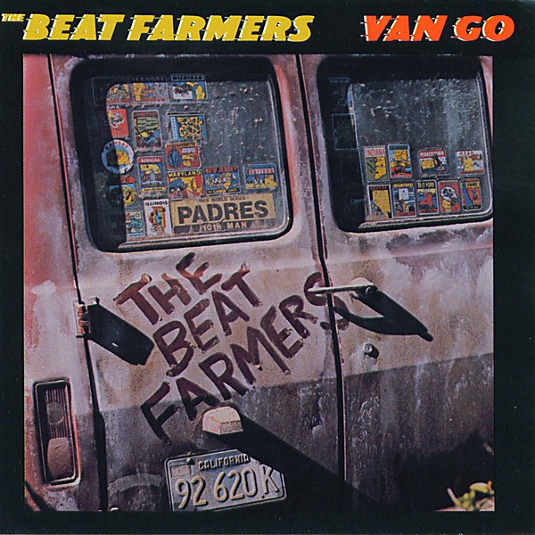

# Van Go

By **The Beat Farmers**

## Album Data

- **Catalog:** Beets
- **Format:** Digital, Album
- **Album:** Van Go
- **Artist:** The Beat Farmers
- **Albumartist:** The Beat Farmers
- **Genre:** Americana
- **MusicBrainz Album Artist ID:** [fa5d4d6f-bfca-4412-869e-def05b4974bb](https://musicbrainz.org/artist/fa5d4d6f-bfca-4412-869e-def05b4974bb)
- **MusicBrainz Album ID:** [c8f368a3-158b-47e0-a471-d6cdcace834d](https://musicbrainz.org/release/c8f368a3-158b-47e0-a471-d6cdcace834d)
- **MusicBrainz Release Group ID:** [4113ee97-7623-3c49-8754-aa372265c7c4](https://musicbrainz.org/release-group/4113ee97-7623-3c49-8754-aa372265c7c4)
- **Year:** 1991
- **Catalog #:** D2-77504
- **Label:** Curb Records
- **Total Tracks:** 11

## Album Tracks

### Track 01 - Riverside

- **Artist:** The Beat Farmers
- **Format:** AAC
- **Genre:** Americana
- **Length:** 3:35
- **MusicBrainz Track ID:** [965e9620-19c7-4798-b1b7-cd414cb5b19e](https://musicbrainz.org/recording/965e9620-19c7-4798-b1b7-cd414cb5b19e)
- **Title:** Riverside
- **Track:** 01
- **Year:** 1991

### Track 02 - Deceiver

- **Artist:** The Beat Farmers
- **Format:** AAC
- **Genre:** Americana
- **Length:** 2:53
- **MusicBrainz Track ID:** [624a441c-97db-487e-9ee5-71a3b0cf38aa](https://musicbrainz.org/recording/624a441c-97db-487e-9ee5-71a3b0cf38aa)
- **Title:** Deceiver
- **Track:** 02
- **Year:** 1991

### Track 03 - Powderfinger

- **Artist:** The Beat Farmers
- **Format:** AAC
- **Genre:** Psychobilly
- **Length:** 3:53
- **MusicBrainz Track ID:** [06ebf8d2-93b7-4ea3-aedf-d7d8c0958e82](https://musicbrainz.org/recording/06ebf8d2-93b7-4ea3-aedf-d7d8c0958e82)
- **Title:** Powderfinger
- **Track:** 03
- **Year:** 1991

### Track 04 - Seven Year Blues

- **Artist:** The Beat Farmers
- **Format:** AAC
- **Genre:** Americana
- **Length:** 2:37
- **MusicBrainz Track ID:** [51ba933a-5cdd-4c36-b596-b69d1c2af688](https://musicbrainz.org/recording/51ba933a-5cdd-4c36-b596-b69d1c2af688)
- **Title:** Seven Year Blues
- **Track:** 04
- **Year:** 1991

### Track 05 - Blue Chevrolet

- **Artist:** The Beat Farmers
- **Format:** AAC
- **Genre:** Rock
- **Length:** 2:58
- **MusicBrainz Track ID:** [547c7db1-948e-408a-b0e9-59d2acd73b28](https://musicbrainz.org/recording/547c7db1-948e-408a-b0e9-59d2acd73b28)
- **Title:** Blue Chevrolet
- **Track:** 05
- **Year:** 1991

### Track 06 - I Want You, Too

- **Artist:** The Beat Farmers
- **Format:** AAC
- **Genre:** Americana
- **Length:** 2:00
- **MusicBrainz Track ID:** [c8d200dd-d289-473b-af36-eb70db31f643](https://musicbrainz.org/recording/c8d200dd-d289-473b-af36-eb70db31f643)
- **Title:** I Want You, Too
- **Track:** 06
- **Year:** 1991

### Track 07 - Road of Ruin

- **Artist:** The Beat Farmers
- **Format:** AAC
- **Genre:** Americana
- **Length:** 2:32
- **MusicBrainz Track ID:** [cd20fac5-7880-46fd-88c5-b1261dc61bb1](https://musicbrainz.org/recording/cd20fac5-7880-46fd-88c5-b1261dc61bb1)
- **Title:** Road of Ruin
- **Track:** 07
- **Year:** 1991

### Track 08 - Buy Me a Car

- **Artist:** The Beat Farmers
- **Format:** AAC
- **Genre:** Americana
- **Length:** 2:53
- **MusicBrainz Track ID:** [01cbbf8e-add6-4594-a2ce-ca12970fcf30](https://musicbrainz.org/recording/01cbbf8e-add6-4594-a2ce-ca12970fcf30)
- **Title:** Buy Me a Car
- **Track:** 08
- **Year:** 1991

### Track 09 - Gun Sale at the Church

- **Artist:** The Beat Farmers
- **Format:** AAC
- **Genre:** Americana
- **Length:** 3:02
- **MusicBrainz Track ID:** [75d68ca0-e357-4f0c-912d-7d3ef676c268](https://musicbrainz.org/recording/75d68ca0-e357-4f0c-912d-7d3ef676c268)
- **Title:** Gun Sale at the Church
- **Track:** 09
- **Year:** 1991

### Track 10 - Bigger Fool Than Me

- **Artist:** The Beat Farmers
- **Format:** AAC
- **Genre:** Americana
- **Length:** 2:55
- **MusicBrainz Track ID:** [b2130cdb-6d17-48c5-8ffb-296568daa3af](https://musicbrainz.org/recording/b2130cdb-6d17-48c5-8ffb-296568daa3af)
- **Title:** Bigger Fool Than Me
- **Track:** 10
- **Year:** 1991

### Track 11 - Big Ugly Wheels

- **Artist:** The Beat Farmers
- **Format:** AAC
- **Genre:** Americana
- **Length:** 2:26
- **MusicBrainz Track ID:** [117ab277-f862-4b3d-889c-29b3f68deccb](https://musicbrainz.org/recording/117ab277-f862-4b3d-889c-29b3f68deccb)
- **Title:** Big Ugly Wheels
- **Track:** 11
- **Year:** 1991

## See also

- [Glad 'n' Greasy](Glad_n_Greasy.md)
- [Live at the Spring Valley Inn, 1983](Live_at_the_Spring_Valley_Inn__1983.md)
- [Loud and Plowed and... LIVE!!](Loud_and_Plowed_and_LIVE!!.md)
- [Manifold](Manifold.md)
- [Poor and Famous](Poor_and_Famous.md)
- [Tales of the New West](Tales_of_the_New_West.md)
- [The Pursuit of Happiness](The_Pursuit_of_Happiness.md)
- [CD: Loud And Plowed And ... Live!!](../../CD/The_Beat_Farmers/Loud_And_Plowed_And__Live!!.md)
- [CD: ](../../CD/The_Beat_Farmers/The_Beat_Farmers.md)
