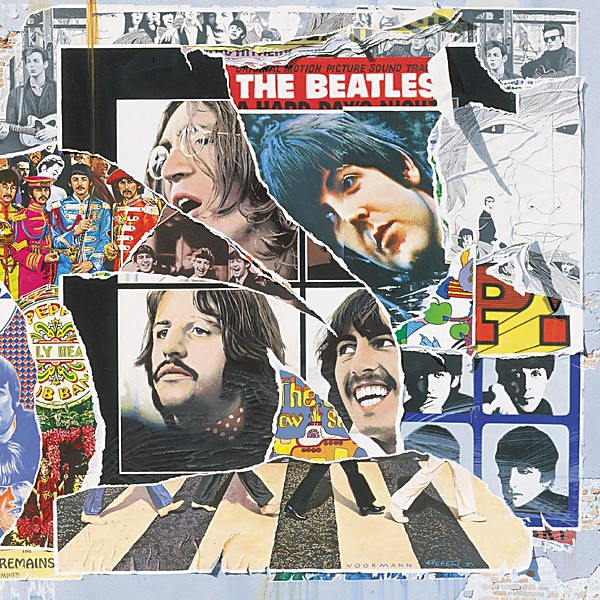

# Anthology 1 [Disc 2]

By **The Beatles**

## Album Data

- **Catalog:** Beets
- **Format:** Digital, Album
- **Album:** Anthology 1 [Disc 2]
- **Artist:** The Beatles
- **Albumartist:** The Beatles
- **Genre:** Close Harmony
- **MusicBrainz Album Artist ID:** 
- **MusicBrainz Album ID:** 
- **MusicBrainz Release Group ID:** 
- **Year:** 1963
- **Catalog #:** 
- **Label:** 
- **Total Tracks:** 20

## Album Tracks

### Track 01 - Strawberry Fields Forever [Demo Sequence]

- **Artist:** The Beatles
- **Format:** ALAC
- **Genre:** Hard Rock
- **Length:** 1:42
- **MusicBrainz Track ID:** 
- **Title:** Strawberry Fields Forever [Demo Sequence]
- **Track:** 01
- **Year:** 1966

### Track 02 - Strawberry Fields Forever [Take 1]

- **Artist:** The Beatles
- **Format:** ALAC
- **Genre:** Hard Rock
- **Length:** 2:34
- **MusicBrainz Track ID:** 
- **Title:** Strawberry Fields Forever [Take 1]
- **Track:** 02
- **Year:** 1966

### Track 03 - Strawberry Fields Forever [Take 7 & Edit Piece]

- **Artist:** The Beatles
- **Format:** ALAC
- **Genre:** Psychedelic Rock
- **Length:** 4:13
- **MusicBrainz Track ID:** 
- **Title:** Strawberry Fields Forever [Take 7 & Edit Piece]
- **Track:** 03
- **Year:** 1966

### Track 04 - Penny Lane

- **Artist:** The Beatles
- **Format:** ALAC
- **Genre:** Rock
- **Length:** 3:12
- **MusicBrainz Track ID:** 
- **Title:** Penny Lane
- **Track:** 04
- **Year:** 1967

### Track 05 - A Day In The Life

- **Artist:** The Beatles
- **Format:** ALAC
- **Genre:** Psychedelic Rock
- **Length:** 5:04
- **MusicBrainz Track ID:** 
- **Title:** A Day In The Life
- **Track:** 05
- **Year:** 1967

### Track 06 - Good Morning Good Morning

- **Artist:** The Beatles
- **Format:** ALAC
- **Genre:** Psychedelic Rock
- **Length:** 2:40
- **MusicBrainz Track ID:** 
- **Title:** Good Morning Good Morning
- **Track:** 06
- **Year:** 1967

### Track 07 - Only A Northern Song

- **Artist:** The Beatles
- **Format:** ALAC
- **Genre:** Psychedelic Rock
- **Length:** 2:43
- **MusicBrainz Track ID:** 
- **Title:** Only A Northern Song
- **Track:** 07
- **Year:** 1967

### Track 08 - Being For The Benefit Of Mr. Kite! [Takes 1 And 2]

- **Artist:** The Beatles
- **Format:** ALAC
- **Genre:** Hard Rock
- **Length:** 1:05
- **MusicBrainz Track ID:** 
- **Title:** Being For The Benefit Of Mr. Kite! [Takes 1 And 2]
- **Track:** 08
- **Year:** 1967

### Track 09 - Being For The Benefit Of Mr. Kite! [Take 7]

- **Artist:** The Beatles
- **Format:** ALAC
- **Genre:** Psychedelic Rock
- **Length:** 2:33
- **MusicBrainz Track ID:** 
- **Title:** Being For The Benefit Of Mr. Kite! [Take 7]
- **Track:** 09
- **Year:** 1967

### Track 10 - Lucy In The Sky With Diamonds

- **Artist:** The Beatles
- **Format:** ALAC
- **Genre:** Psychedelic Rock
- **Length:** 3:05
- **MusicBrainz Track ID:** 
- **Title:** Lucy In The Sky With Diamonds
- **Track:** 10
- **Year:** 1967

### Track 11 - Within You, Without You [Instrumental]

- **Artist:** The Beatles
- **Format:** ALAC
- **Genre:** Rock
- **Length:** 5:27
- **MusicBrainz Track ID:** 
- **Title:** Within You, Without You [Instrumental]
- **Track:** 11
- **Year:** 1967

### Track 12 - Sgt. Pepper's Lonely Hearts Club Band (Reprise)

- **Artist:** The Beatles
- **Format:** ALAC
- **Genre:** Rock And Roll
- **Length:** 1:27
- **MusicBrainz Track ID:** 
- **Title:** Sgt. Pepper's Lonely Hearts Club Band (Reprise)
- **Track:** 12
- **Year:** 1967

### Track 13 - You Know My Name (Look Up The Number)

- **Artist:** The Beatles
- **Format:** ALAC
- **Genre:** Rock
- **Length:** 5:43
- **MusicBrainz Track ID:** 
- **Title:** You Know My Name (Look Up The Number)
- **Track:** 13
- **Year:** 1969

### Track 14 - I Am The Walrus

- **Artist:** The Beatles
- **Format:** ALAC
- **Genre:** Rock And Roll
- **Length:** 4:01
- **MusicBrainz Track ID:** 
- **Title:** I Am The Walrus
- **Track:** 14
- **Year:** 1967

### Track 15 - The Fool On The Hill [Demo]

- **Artist:** The Beatles
- **Format:** ALAC
- **Genre:** Rock
- **Length:** 2:48
- **MusicBrainz Track ID:** 
- **Title:** The Fool On The Hill [Demo]
- **Track:** 15
- **Year:** 1967

### Track 16 - Your Mother Should Know

- **Artist:** The Beatles
- **Format:** ALAC
- **Genre:** Britpop
- **Length:** 3:02
- **MusicBrainz Track ID:** 
- **Title:** Your Mother Should Know
- **Track:** 16
- **Year:** 1967

### Track 17 - The Fool On The Hill [Take 4]

- **Artist:** The Beatles
- **Format:** ALAC
- **Genre:** Hard Rock
- **Length:** 3:44
- **MusicBrainz Track ID:** 
- **Title:** The Fool On The Hill [Take 4]
- **Track:** 17
- **Year:** 1967

### Track 18 - Hello, Goodbye

- **Artist:** The Beatles
- **Format:** ALAC
- **Genre:** Rock
- **Length:** 3:17
- **MusicBrainz Track ID:** 
- **Title:** Hello, Goodbye
- **Track:** 18
- **Year:** 1967

### Track 19 - Lady Madonna

- **Artist:** The Beatles
- **Format:** ALAC
- **Genre:** Rock And Roll
- **Length:** 2:22
- **MusicBrainz Track ID:** 
- **Title:** Lady Madonna
- **Track:** 19
- **Year:** 1968

### Track 20 - Across The Universe

- **Artist:** The Beatles
- **Format:** ALAC
- **Genre:** Psychedelic Rock
- **Length:** 3:28
- **MusicBrainz Track ID:** 
- **Title:** Across The Universe
- **Track:** 20
- **Year:** 1968

