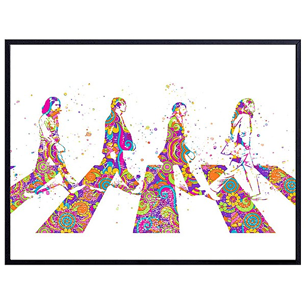

# Australia And Japan

By **The Beatles**

## Album Data

- **Catalog:** Beets
- **Format:** Digital, Album
- **Album:** Australia And Japan
- **Artist:** The Beatles
- **Albumartist:** The Beatles
- **Genre:** Rock
- **MusicBrainz Album Artist ID:** 
- **MusicBrainz Album ID:** 
- **MusicBrainz Release Group ID:** 
- **Year:** 2016
- **Catalog #:** 
- **Label:** 
- **Total Tracks:** 22

## Album Tracks

### Track 01 - A Hard Day's Night [Live At ABC Theatre, Blackpool, 19th. July, 1964]

- **Artist:** The Beatles
- **Format:** ALAC
- **Genre:** Rock
- **Length:** 2:29
- **MusicBrainz Track ID:** 
- **Title:** A Hard Day's Night [Live At ABC Theatre, Blackpool, 19th. July, 1964]
- **Track:** 01
- **Year:** 2016

### Track 02 - Things We Said Today [Live At ABC Theatre, Blackpool, 19th. July, 1964]

- **Artist:** The Beatles
- **Format:** ALAC
- **Genre:** Rock
- **Length:** 3:01
- **MusicBrainz Track ID:** 
- **Title:** Things We Said Today [Live At ABC Theatre, Blackpool, 19th. July, 1964]
- **Track:** 02
- **Year:** 2016

### Track 03 - You Can`t Do That [Live At ABC Theatre, Blackpool, 19th. July, 1964]

- **Artist:** The Beatles
- **Format:** ALAC
- **Genre:** Rock
- **Length:** 2:55
- **MusicBrainz Track ID:** 
- **Title:** You Can`t Do That [Live At ABC Theatre, Blackpool, 19th. July, 1964]
- **Track:** 03
- **Year:** 2016

### Track 04 - If I Fell [Live At ABC Theatre, Blackpool, 19th. July, 1964]

- **Artist:** The Beatles
- **Format:** ALAC
- **Genre:** Rock
- **Length:** 2:17
- **MusicBrainz Track ID:** 
- **Title:** If I Fell [Live At ABC Theatre, Blackpool, 19th. July, 1964]
- **Track:** 04
- **Year:** 2016

### Track 05 - Long Tall Sally [Live At ABC Theatre, Blackpool, 19th. July, 1964]

- **Artist:** The Beatles
- **Format:** ALAC
- **Genre:** Rock
- **Length:** 1:59
- **MusicBrainz Track ID:** 
- **Title:** Long Tall Sally [Live At ABC Theatre, Blackpool, 19th. July, 1964]
- **Track:** 05
- **Year:** 2016

### Track 06 - I Feel Fine [Live At ABC Theatre, Blackpool, 1st. August, 1965]

- **Artist:** The Beatles
- **Format:** ALAC
- **Genre:** Rock
- **Length:** 2:12
- **MusicBrainz Track ID:** 
- **Title:** I Feel Fine [Live At ABC Theatre, Blackpool, 1st. August, 1965]
- **Track:** 06
- **Year:** 2016

### Track 07 - I'm Down [Live At ABC Theatre, Blackpool, 1st. August, 1965]

- **Artist:** The Beatles
- **Format:** ALAC
- **Genre:** Rock
- **Length:** 2:26
- **MusicBrainz Track ID:** 
- **Title:** I'm Down [Live At ABC Theatre, Blackpool, 1st. August, 1965]
- **Track:** 07
- **Year:** 2016

### Track 08 - Act Naturally [Live At ABC Theatre, Blackpool, 1st. August, 1965]

- **Artist:** The Beatles
- **Format:** ALAC
- **Genre:** Rock
- **Length:** 2:36
- **MusicBrainz Track ID:** 
- **Title:** Act Naturally [Live At ABC Theatre, Blackpool, 1st. August, 1965]
- **Track:** 08
- **Year:** 2016

### Track 09 - Ticket To Ride [Live At ABC Theatre, Blackpool, 1st. August, 1965]

- **Artist:** The Beatles
- **Format:** ALAC
- **Genre:** Rock
- **Length:** 2:43
- **MusicBrainz Track ID:** 
- **Title:** Ticket To Ride [Live At ABC Theatre, Blackpool, 1st. August, 1965]
- **Track:** 09
- **Year:** 2016

### Track 10 - Yesterday [Live At ABC Theatre, Blackpool, 1st. August, 1965]

- **Artist:** The Beatles
- **Format:** ALAC
- **Genre:** Rock
- **Length:** 3:10
- **MusicBrainz Track ID:** 
- **Title:** Yesterday [Live At ABC Theatre, Blackpool, 1st. August, 1965]
- **Track:** 10
- **Year:** 2016

### Track 11 - Help! [Live At ABC Theatre, Blackpool, 1st. August, 1965]

- **Artist:** The Beatles
- **Format:** ALAC
- **Genre:** Rock
- **Length:** 2:20
- **MusicBrainz Track ID:** 
- **Title:** Help! [Live At ABC Theatre, Blackpool, 1st. August, 1965]
- **Track:** 11
- **Year:** 2016

### Track 12 - Twist And Shout [Live At Palais Des Sports, Paris, 20th. June, 1965]

- **Artist:** The Beatles
- **Format:** ALAC
- **Genre:** Rock
- **Length:** 1:40
- **MusicBrainz Track ID:** 
- **Title:** Twist And Shout [Live At Palais Des Sports, Paris, 20th. June, 1965]
- **Track:** 12
- **Year:** 2016

### Track 13 - She's A Woman [Live At Palais Des Sports, Paris, 20th. June, 1965]

- **Artist:** The Beatles
- **Format:** ALAC
- **Genre:** Rock
- **Length:** 3:18
- **MusicBrainz Track ID:** 
- **Title:** She's A Woman [Live At Palais Des Sports, Paris, 20th. June, 1965]
- **Track:** 13
- **Year:** 2016

### Track 14 - I'm A Loser [Live At Palais Des Sports, Paris, 20th. June, 1965]

- **Artist:** The Beatles
- **Format:** ALAC
- **Genre:** Rock
- **Length:** 2:36
- **MusicBrainz Track ID:** 
- **Title:** I'm A Loser [Live At Palais Des Sports, Paris, 20th. June, 1965]
- **Track:** 14
- **Year:** 2016

### Track 15 - Can`t Buy Me Love [Live At Palais Des Sports, Paris, 20th. June, 1965]

- **Artist:** The Beatles
- **Format:** ALAC
- **Genre:** Rock
- **Length:** 2:23
- **MusicBrainz Track ID:** 
- **Title:** Can`t Buy Me Love [Live At Palais Des Sports, Paris, 20th. June, 1965]
- **Track:** 15
- **Year:** 2016

### Track 16 - Baby's In Black [Live At Palais Des Sports, Paris, 20th. June, 1965]

- **Artist:** The Beatles
- **Format:** ALAC
- **Genre:** Rock
- **Length:** 2:38
- **MusicBrainz Track ID:** 
- **Title:** Baby's In Black [Live At Palais Des Sports, Paris, 20th. June, 1965]
- **Track:** 16
- **Year:** 2016

### Track 17 - I Wanna Be Your Man [Live At Palais Des Sports, Paris, 20th. June, 1965]

- **Artist:** The Beatles
- **Format:** ALAC
- **Genre:** Rock
- **Length:** 2:09
- **MusicBrainz Track ID:** 
- **Title:** I Wanna Be Your Man [Live At Palais Des Sports, Paris, 20th. June, 1965]
- **Track:** 17
- **Year:** 2016

### Track 18 - A Hard Day`s Night [Live At Palais Des Sports, Paris, 20th. June, 1965]

- **Artist:** The Beatles
- **Format:** ALAC
- **Genre:** Rock
- **Length:** 2:46
- **MusicBrainz Track ID:** 
- **Title:** A Hard Day`s Night [Live At Palais Des Sports, Paris, 20th. June, 1965]
- **Track:** 18
- **Year:** 2016

### Track 19 - Everybody's Trying To Be My Baby [Live At Palais Des Sports, Paris, 20th. June, 1965]

- **Artist:** The Beatles
- **Format:** ALAC
- **Genre:** Rock
- **Length:** 2:37
- **MusicBrainz Track ID:** 
- **Title:** Everybody's Trying To Be My Baby [Live At Palais Des Sports, Paris, 20th. June, 1965]
- **Track:** 19
- **Year:** 2016

### Track 20 - Rock `n` Roll Music [Live At Palais Des Sports, Paris, 20th. June, 1965]

- **Artist:** The Beatles
- **Format:** ALAC
- **Genre:** Rock
- **Length:** 2:16
- **MusicBrainz Track ID:** 
- **Title:** Rock `n` Roll Music [Live At Palais Des Sports, Paris, 20th. June, 1965]
- **Track:** 20
- **Year:** 2016

### Track 21 - Ticket To Ride [Live At Palais Des Sports, Paris, 20th. June, 1965]

- **Artist:** The Beatles
- **Format:** ALAC
- **Genre:** Rock
- **Length:** 4:03
- **MusicBrainz Track ID:** 
- **Title:** Ticket To Ride [Live At Palais Des Sports, Paris, 20th. June, 1965]
- **Track:** 21
- **Year:** 2016

### Track 22 - Long Tall Sally [Live At Palais Des Sports, Paris, 20th. June, 1965]

- **Artist:** The Beatles
- **Format:** ALAC
- **Genre:** Rock
- **Length:** 2:15
- **MusicBrainz Track ID:** 
- **Title:** Long Tall Sally [Live At Palais Des Sports, Paris, 20th. June, 1965]
- **Track:** 22
- **Year:** 2016

## See also

- [1 [2015 Version]](1_[2015_Version].md)
- [1](1.md)
- [Abbey Road](Abbey_Road.md)
- [Anthology 1 [Disc 1]](Anthology_1_[Disc_1].md)
- [Anthology 1 [Disc 2]](Anthology_1_[Disc_2].md)
- [Anthology 2 [Disc 2]](Anthology_2_[Disc_2].md)
- [Beatles for Sale](Beatles_for_Sale.md)
- [Blackpool And Paris 1964-`65](Blackpool_And_Paris_1964-`65.md)
- [Help](Help.md)
- [Let It Be](Let_It_Be.md)
- [Live at the BBC](Live_at_the_BBC.md)
- [Love](Love.md)
- [New York, Miami And Philadelphia - The First And Second U.S. Tours](New_York__Miami_And_Philadelphia_-_The_First_And_Second_US_Tours.md)
- [Past Masters](Past_Masters.md)
- [Past Masters, Vol. 1](Past_Masters__Vol_1.md)
- [Past Masters Volume One](Past_Masters_Volume_One.md)
- [Please Please Me](Please_Please_Me.md)
- [Real Love [US Single]](Real_Love_[US_Single].md)
- [Revolver](Revolver.md)
- [Rubber Soul](Rubber_Soul.md)
- [Sgt. Pepper’s Lonely Hearts Club Band](Sgt_Pepper’s_Lonely_Hearts_Club_Band.md)
- [The Beatles 1](The_Beatles_1.md)
- [The Beatles (White Album)](The_Beatles_White_Album.md)
- [The Lost Abbey Road Tapes 1962-'64](The_Lost_Abbey_Road_Tapes_1962-64.md)
- [The Lost BBC Tapes and Much More...](The_Lost_BBC_Tapes_and_Much_More.md)
- [The Lost Decca Audition Tapes](The_Lost_Decca_Audition_Tapes.md)
- [With The Beatles [2009 Stereo Remaster]](With_The_Beatles_[2009_Stereo_Remaster].md)
- [With The Beatles](With_The_Beatles.md)
- [CD: 1 (Cd & 2 Bluray Edition) (Disc 1)](../../CD/The_Beatles/1_Cd_and_2_Bluray_Edition_Disc_1.md)
- [CD: ](../../CD/The_Beatles/The_Beatles.md)
- [Roon: 1 (Remastered)](../../Roon/The_Beatles/1_Remastered.md)
- [Roon: Abbey Road (Super Deluxe Edition)](../../Roon/The_Beatles/Abbey_Road_Super_Deluxe_Edition.md)
- [Roon: A Hard Day's Night](../../Roon/The_Beatles/A_Hard_Days_Night.md)
- [Roon: Anthology 1](../../Roon/The_Beatles/Anthology_1.md)
- [Roon: Anthology 2](../../Roon/The_Beatles/Anthology_2.md)
- [Roon: Anthology 3](../../Roon/The_Beatles/Anthology_3.md)
- [Roon: Beatles for Sale](../../Roon/The_Beatles/Beatles_for_Sale.md)
- [Roon: Help!](../../Roon/The_Beatles/Help!.md)
- [Roon: Let It Be (Super Deluxe)](../../Roon/The_Beatles/Let_It_Be_Super_Deluxe.md)
- [Roon: Love](../../Roon/The_Beatles/Love.md)
- [Roon: Magical Mystery Tour (Remastered)](../../Roon/The_Beatles/Magical_Mystery_Tour_Remastered.md)
- [Roon: Past Masters](../../Roon/The_Beatles/Past_Masters.md)
- [Roon: Please Please Me](../../Roon/The_Beatles/Please_Please_Me.md)
- [Roon: Revolver (Remastered)](../../Roon/The_Beatles/Revolver_Remastered.md)
- [Roon: Revolver (Super Deluxe)](../../Roon/The_Beatles/Revolver_Super_Deluxe.md)
- [Roon: Rubber Soul (Remastered)](../../Roon/The_Beatles/Rubber_Soul_Remastered.md)
- [Roon: Sgt. Pepper's Lonely Hearts Club Band (Deluxe Anniversary Edition)](../../Roon/The_Beatles/Sgt_Peppers_Lonely_Hearts_Club_Band_Deluxe_Anniversary_Edition.md)
- [Roon: Sgt. Pepper's Lonely Hearts Club Band (Super Deluxe Edition)](../../Roon/The_Beatles/Sgt_Peppers_Lonely_Hearts_Club_Band_Super_Deluxe_Edition.md)
- [Roon: The Beatles 1962 - 1966 (Remastered)](../../Roon/The_Beatles/The_Beatles_1962_-_1966_Remastered.md)
- [Roon: The Beatles 1967 - 1970 (Remastered)](../../Roon/The_Beatles/The_Beatles_1967_-_1970_Remastered.md)
- [Roon: The Beatles (White Album) [Super Deluxe] (White Album / Super Deluxe)](../../Roon/The_Beatles/The_Beatles_White_Album_[Super_Deluxe]_White_Album_-_Super_Deluxe.md)
- [Roon: With The Beatles (Remastered)](../../Roon/The_Beatles/With_The_Beatles_Remastered.md)
- [Vinyl: Beatles '65](../../Vinyl/The_Beatles/Beatles_65.md)
- [Vinyl: Help! In Concert](../../Vinyl/The_Beatles/Help!_In_Concert.md)
- [Vinyl: Help! (Original Motion Picture Soundtrack)](../../Vinyl/The_Beatles/Help!_Original_Motion_Picture_Soundtrack.md)
- [Vinyl: Hey Jude](../../Vinyl/The_Beatles/Hey_Jude.md)
- [Vinyl: Introducing... The Beatles](../../Vinyl/The_Beatles/Introducing_The_Beatles.md)
- [Vinyl: Let It Be](../../Vinyl/The_Beatles/Let_It_Be.md)
- [Vinyl: Live In Paris '65](../../Vinyl/The_Beatles/Live_In_Paris_65.md)
- [Vinyl: Magical Mystery Tour](../../Vinyl/The_Beatles/Magical_Mystery_Tour.md)
- [Vinyl: Something New](../../Vinyl/The_Beatles/Something_New.md)
- [Vinyl: ](../../Vinyl/The_Beatles/The_Beatles_index.md)
- [Vinyl: The Beatles](../../Vinyl/The_Beatles/The_Beatles.md)
- [Vinyl: The Beatles' Second Album](../../Vinyl/The_Beatles/The_Beatles_Second_Album.md)
