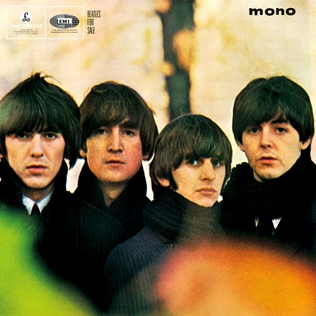

# Beatles for Sale

By **The Beatles**

## Album Data

- **Catalog:** Beets
- **Format:** Digital, Album
- **Album:** Beatles for Sale
- **Artist:** The Beatles
- **Albumartist:** The Beatles
- **Genre:** Rock And Roll
- **MusicBrainz Album Artist ID:** [b10bbbfc-cf9e-42e0-be17-e2c3e1d2600d](https://musicbrainz.org/artist/b10bbbfc-cf9e-42e0-be17-e2c3e1d2600d)
- **MusicBrainz Album ID:** [f8235662-5cc6-4636-b074-7e4a6878d281](https://musicbrainz.org/release/f8235662-5cc6-4636-b074-7e4a6878d281)
- **MusicBrainz Release Group ID:** [f50a3b6f-27f0-3832-bd3f-3568dc557d95](https://musicbrainz.org/release-group/f50a3b6f-27f0-3832-bd3f-3568dc557d95)
- **Year:** 1992
- **Catalog #:** 094638247210
- **Label:** Apple Records
- **Total Tracks:** 12

## Album Tracks

### Track 01 - Two of Us

- **Artist:** The Beatles
- **Format:** MP3
- **Genre:** Britpop
- **Length:** 3:45
- **MusicBrainz Track ID:** [4576371a-a0d6-4dbf-b3b7-8f1e1b58ec43](https://musicbrainz.org/recording/4576371a-a0d6-4dbf-b3b7-8f1e1b58ec43)
- **Title:** Two of Us
- **Track:** 01
- **Year:** 2012

### Track 02 - Dig a Pony

- **Artist:** The Beatles
- **Format:** MP3
- **Genre:** Rock
- **Length:** 3:54
- **MusicBrainz Track ID:** [4131e00c-13c5-4f92-a2ff-73c2edaf420c](https://musicbrainz.org/recording/4131e00c-13c5-4f92-a2ff-73c2edaf420c)
- **Title:** Dig a Pony
- **Track:** 02
- **Year:** 2012

### Track 03 - Across the Universe

- **Artist:** The Beatles
- **Format:** MP3
- **Genre:** Psychedelic Rock
- **Length:** 3:48
- **MusicBrainz Track ID:** [90aa777f-5c69-4ed6-8ef9-6a576423e6a2](https://musicbrainz.org/recording/90aa777f-5c69-4ed6-8ef9-6a576423e6a2)
- **Title:** Across the Universe
- **Track:** 03
- **Year:** 2012

### Track 04 - I Me Mine

- **Artist:** The Beatles
- **Format:** MP3
- **Genre:** Hard Rock
- **Length:** 2:27
- **MusicBrainz Track ID:** [b62ccbb7-bd69-468f-a95f-2f6a4604cc26](https://musicbrainz.org/recording/b62ccbb7-bd69-468f-a95f-2f6a4604cc26)
- **Title:** I Me Mine
- **Track:** 04
- **Year:** 2012

### Track 05 - Dig It

- **Artist:** The Beatles
- **Format:** MP3
- **Genre:** Rock
- **Length:** 0:50
- **MusicBrainz Track ID:** [906836d9-b363-405d-a52c-e780a6cb5f24](https://musicbrainz.org/recording/906836d9-b363-405d-a52c-e780a6cb5f24)
- **Title:** Dig It
- **Track:** 05
- **Year:** 2012

### Track 06 - Let It Be

- **Artist:** The Beatles
- **Format:** MP3
- **Genre:** Rock
- **Length:** 4:02
- **MusicBrainz Track ID:** [0cdc9b5b-b16b-4ff1-9f16-5b4ba76f1c17](https://musicbrainz.org/recording/0cdc9b5b-b16b-4ff1-9f16-5b4ba76f1c17)
- **Title:** Let It Be
- **Track:** 06
- **Year:** 2012

### Track 07 - Maggie Mae

- **Artist:** The Beatles
- **Format:** MP3
- **Genre:** Rock
- **Length:** 0:40
- **MusicBrainz Track ID:** [342a7655-887f-4e3f-95a1-d45f8e2df166](https://musicbrainz.org/recording/342a7655-887f-4e3f-95a1-d45f8e2df166)
- **Title:** Maggie Mae
- **Track:** 07
- **Year:** 2012

### Track 08 - I’ve Got a Feeling

- **Artist:** The Beatles
- **Format:** MP3
- **Genre:** Pop Rock
- **Length:** 3:39
- **MusicBrainz Track ID:** [30b9d279-e8aa-499d-aa89-130fba800696](https://musicbrainz.org/recording/30b9d279-e8aa-499d-aa89-130fba800696)
- **Title:** I’ve Got a Feeling
- **Track:** 08
- **Year:** 2012

### Track 09 - One After 909

- **Artist:** The Beatles
- **Format:** MP3
- **Genre:** Rock And Roll
- **Length:** 2:55
- **MusicBrainz Track ID:** [e1f05d06-06ad-4f22-9c81-c94c0f44fe41](https://musicbrainz.org/recording/e1f05d06-06ad-4f22-9c81-c94c0f44fe41)
- **Title:** One After 909
- **Track:** 09
- **Year:** 2012

### Track 10 - The Long and Winding Road

- **Artist:** The Beatles
- **Format:** MP3
- **Genre:** Pop Rock
- **Length:** 3:41
- **MusicBrainz Track ID:** [2df46dec-b453-4444-91b9-5fa5d7515fd9](https://musicbrainz.org/recording/2df46dec-b453-4444-91b9-5fa5d7515fd9)
- **Title:** The Long and Winding Road
- **Track:** 10
- **Year:** 2012

### Track 11 - For You Blue

- **Artist:** The Beatles
- **Format:** MP3
- **Genre:** Rock And Roll
- **Length:** 2:30
- **MusicBrainz Track ID:** [e3f3b880-32e7-401c-8879-9e477b1a6d73](https://musicbrainz.org/recording/e3f3b880-32e7-401c-8879-9e477b1a6d73)
- **Title:** For You Blue
- **Track:** 11
- **Year:** 2012

### Track 12 - Get Back

- **Artist:** The Beatles
- **Format:** MP3
- **Genre:** Rock
- **Length:** 3:10
- **MusicBrainz Track ID:** [a52c2553-1670-4262-9193-6ecd6713741a](https://musicbrainz.org/recording/a52c2553-1670-4262-9193-6ecd6713741a)
- **Title:** Get Back
- **Track:** 12
- **Year:** 2012

## See also

- [1 [2015 Version]](1_[2015_Version].md)
- [1](1.md)
- [Abbey Road](Abbey_Road.md)
- [Anthology 1 [Disc 1]](Anthology_1_[Disc_1].md)
- [Anthology 1 [Disc 2]](Anthology_1_[Disc_2].md)
- [Anthology 2 [Disc 2]](Anthology_2_[Disc_2].md)
- [Australia And Japan](Australia_And_Japan.md)
- [Blackpool And Paris 1964-`65](Blackpool_And_Paris_1964-`65.md)
- [Help](Help.md)
- [Let It Be](Let_It_Be.md)
- [Live at the BBC](Live_at_the_BBC.md)
- [Love](Love.md)
- [New York, Miami And Philadelphia - The First And Second U.S. Tours](New_York__Miami_And_Philadelphia_-_The_First_And_Second_US_Tours.md)
- [Past Masters](Past_Masters.md)
- [Past Masters, Vol. 1](Past_Masters__Vol_1.md)
- [Past Masters Volume One](Past_Masters_Volume_One.md)
- [Please Please Me](Please_Please_Me.md)
- [Real Love [US Single]](Real_Love_[US_Single].md)
- [Revolver](Revolver.md)
- [Rubber Soul](Rubber_Soul.md)
- [Sgt. Pepper’s Lonely Hearts Club Band](Sgt_Pepper’s_Lonely_Hearts_Club_Band.md)
- [The Beatles 1](The_Beatles_1.md)
- [The Beatles (White Album)](The_Beatles_White_Album.md)
- [The Lost Abbey Road Tapes 1962-'64](The_Lost_Abbey_Road_Tapes_1962-64.md)
- [The Lost BBC Tapes and Much More...](The_Lost_BBC_Tapes_and_Much_More.md)
- [The Lost Decca Audition Tapes](The_Lost_Decca_Audition_Tapes.md)
- [With The Beatles [2009 Stereo Remaster]](With_The_Beatles_[2009_Stereo_Remaster].md)
- [With The Beatles](With_The_Beatles.md)
- [CD: 1 (Cd & 2 Bluray Edition) (Disc 1)](../../CD/The_Beatles/1_Cd_and_2_Bluray_Edition_Disc_1.md)
- [CD: ](../../CD/The_Beatles/The_Beatles.md)
- [Roon: 1 (Remastered)](../../Roon/The_Beatles/1_Remastered.md)
- [Roon: Abbey Road (Super Deluxe Edition)](../../Roon/The_Beatles/Abbey_Road_Super_Deluxe_Edition.md)
- [Roon: A Hard Day's Night](../../Roon/The_Beatles/A_Hard_Days_Night.md)
- [Roon: Anthology 1](../../Roon/The_Beatles/Anthology_1.md)
- [Roon: Anthology 2](../../Roon/The_Beatles/Anthology_2.md)
- [Roon: Anthology 3](../../Roon/The_Beatles/Anthology_3.md)
- [Roon: Beatles for Sale](../../Roon/The_Beatles/Beatles_for_Sale.md)
- [Roon: Help!](../../Roon/The_Beatles/Help!.md)
- [Roon: Let It Be (Super Deluxe)](../../Roon/The_Beatles/Let_It_Be_Super_Deluxe.md)
- [Roon: Love](../../Roon/The_Beatles/Love.md)
- [Roon: Magical Mystery Tour (Remastered)](../../Roon/The_Beatles/Magical_Mystery_Tour_Remastered.md)
- [Roon: Past Masters](../../Roon/The_Beatles/Past_Masters.md)
- [Roon: Please Please Me](../../Roon/The_Beatles/Please_Please_Me.md)
- [Roon: Revolver (Remastered)](../../Roon/The_Beatles/Revolver_Remastered.md)
- [Roon: Revolver (Super Deluxe)](../../Roon/The_Beatles/Revolver_Super_Deluxe.md)
- [Roon: Rubber Soul (Remastered)](../../Roon/The_Beatles/Rubber_Soul_Remastered.md)
- [Roon: Sgt. Pepper's Lonely Hearts Club Band (Deluxe Anniversary Edition)](../../Roon/The_Beatles/Sgt_Peppers_Lonely_Hearts_Club_Band_Deluxe_Anniversary_Edition.md)
- [Roon: Sgt. Pepper's Lonely Hearts Club Band (Super Deluxe Edition)](../../Roon/The_Beatles/Sgt_Peppers_Lonely_Hearts_Club_Band_Super_Deluxe_Edition.md)
- [Roon: The Beatles 1962 - 1966 (Remastered)](../../Roon/The_Beatles/The_Beatles_1962_-_1966_Remastered.md)
- [Roon: The Beatles 1967 - 1970 (Remastered)](../../Roon/The_Beatles/The_Beatles_1967_-_1970_Remastered.md)
- [Roon: The Beatles (White Album) [Super Deluxe] (White Album / Super Deluxe)](../../Roon/The_Beatles/The_Beatles_White_Album_[Super_Deluxe]_White_Album_-_Super_Deluxe.md)
- [Roon: With The Beatles (Remastered)](../../Roon/The_Beatles/With_The_Beatles_Remastered.md)
- [Vinyl: Beatles '65](../../Vinyl/The_Beatles/Beatles_65.md)
- [Vinyl: Help! In Concert](../../Vinyl/The_Beatles/Help!_In_Concert.md)
- [Vinyl: Help! (Original Motion Picture Soundtrack)](../../Vinyl/The_Beatles/Help!_Original_Motion_Picture_Soundtrack.md)
- [Vinyl: Hey Jude](../../Vinyl/The_Beatles/Hey_Jude.md)
- [Vinyl: Introducing... The Beatles](../../Vinyl/The_Beatles/Introducing_The_Beatles.md)
- [Vinyl: Let It Be](../../Vinyl/The_Beatles/Let_It_Be.md)
- [Vinyl: Live In Paris '65](../../Vinyl/The_Beatles/Live_In_Paris_65.md)
- [Vinyl: Magical Mystery Tour](../../Vinyl/The_Beatles/Magical_Mystery_Tour.md)
- [Vinyl: Something New](../../Vinyl/The_Beatles/Something_New.md)
- [Vinyl: ](../../Vinyl/The_Beatles/The_Beatles_index.md)
- [Vinyl: The Beatles](../../Vinyl/The_Beatles/The_Beatles.md)
- [Vinyl: The Beatles' Second Album](../../Vinyl/The_Beatles/The_Beatles_Second_Album.md)
