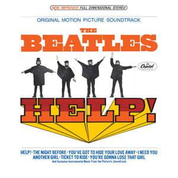

# Help

By **The Beatles**

## Album Data

- **Catalog:** Beets
- **Format:** Digital, Album
- **Album:** Help
- **Artist:** The Beatles
- **Albumartist:** The Beatles
- **Genre:** Rock
- **MusicBrainz Album Artist ID:** 
- **MusicBrainz Album ID:** 
- **MusicBrainz Release Group ID:** 
- **Year:** 1965
- **Catalog #:** 
- **Label:** 
- **Total Tracks:** 22

## Album Tracks

### Track 05 - Drive My Car/The Word/What You're Doing

- **Artist:** The Beatles
- **Format:** ALAC
- **Genre:** Rock
- **Length:** 1:54
- **MusicBrainz Track ID:** 
- **Title:** Drive My Car/The Word/What You're Doing
- **Track:** 05
- **Year:** 2006

### Track 01 - Because

- **Artist:** The Beatles
- **Format:** ALAC
- **Genre:** Rock
- **Length:** 2:44
- **MusicBrainz Track ID:** 
- **Title:** Because
- **Track:** 01
- **Year:** 2006

### Track 02 - Get Back

- **Artist:** The Beatles
- **Format:** ALAC
- **Genre:** Rock
- **Length:** 2:05
- **MusicBrainz Track ID:** 
- **Title:** Get Back
- **Track:** 02
- **Year:** 2006

### Track 03 - Glass Onion

- **Artist:** The Beatles
- **Format:** ALAC
- **Genre:** Psychedelic Rock
- **Length:** 1:20
- **MusicBrainz Track ID:** 
- **Title:** Glass Onion
- **Track:** 03
- **Year:** 2006

### Track 04 - Eleanor Rigby/Julia [Transition]

- **Artist:** The Beatles
- **Format:** ALAC
- **Genre:** Rock
- **Length:** 3:05
- **MusicBrainz Track ID:** 
- **Title:** Eleanor Rigby/Julia [Transition]
- **Track:** 04
- **Year:** 2006

### Track 05 - I Am The Walrus

- **Artist:** The Beatles
- **Format:** ALAC
- **Genre:** Rock And Roll
- **Length:** 4:28
- **MusicBrainz Track ID:** 
- **Title:** I Am The Walrus
- **Track:** 05
- **Year:** 2006

### Track 06 - I Want To Hold Your Hand

- **Artist:** The Beatles
- **Format:** ALAC
- **Genre:** Rock And Roll
- **Length:** 1:22
- **MusicBrainz Track ID:** 
- **Title:** I Want To Hold Your Hand
- **Track:** 06
- **Year:** 2006

### Track 07 - Drive My Car/The Word/What You're Doing

- **Artist:** The Beatles
- **Format:** ALAC
- **Genre:** Rock
- **Length:** 1:54
- **MusicBrainz Track ID:** 
- **Title:** Drive My Car/The Word/What You're Doing
- **Track:** 07
- **Year:** 2006

### Track 08 - Gnik Nus

- **Artist:** The Beatles
- **Format:** ALAC
- **Genre:** Psychedelic Rock
- **Length:** 0:55
- **MusicBrainz Track ID:** 
- **Title:** Gnik Nus
- **Track:** 08
- **Year:** 2006

### Track 09 - Something/Blue Jay Way [Transition]

- **Artist:** The Beatles
- **Format:** ALAC
- **Genre:** Pop Rock
- **Length:** 3:29
- **MusicBrainz Track ID:** 
- **Title:** Something/Blue Jay Way [Transition]
- **Track:** 09
- **Year:** 2006

### Track 10 - Being For The Benefit Of Mr. Kite!/I Want You (She's So Heavy)/Helter Skelter

- **Artist:** The Beatles
- **Format:** ALAC
- **Genre:** Psychedelic Rock
- **Length:** 3:22
- **MusicBrainz Track ID:** 
- **Title:** Being For The Benefit Of Mr. Kite!/I Want You (She's So Heavy)/Helter Skelter
- **Track:** 10
- **Year:** 2006

### Track 11 - Help!

- **Artist:** The Beatles
- **Format:** ALAC
- **Genre:** Rock
- **Length:** 2:18
- **MusicBrainz Track ID:** 
- **Title:** Help!
- **Track:** 11
- **Year:** 2006

### Track 12 - Blackbird/Yesterday

- **Artist:** The Beatles
- **Format:** ALAC
- **Genre:** Hard Rock
- **Length:** 2:31
- **MusicBrainz Track ID:** 
- **Title:** Blackbird/Yesterday
- **Track:** 12
- **Year:** 2006

### Track 13 - Strawberry Fields Forever

- **Artist:** The Beatles
- **Format:** ALAC
- **Genre:** Psychedelic Rock
- **Length:** 4:31
- **MusicBrainz Track ID:** 
- **Title:** Strawberry Fields Forever
- **Track:** 13
- **Year:** 2006

### Track 14 - Within You Without You/Tomorrow Never Knows

- **Artist:** The Beatles
- **Format:** ALAC
- **Genre:** Psychedelic Rock
- **Length:** 3:07
- **MusicBrainz Track ID:** 
- **Title:** Within You Without You/Tomorrow Never Knows
- **Track:** 14
- **Year:** 2006

### Track 15 - Lucy In The Sky With Diamonds

- **Artist:** The Beatles
- **Format:** ALAC
- **Genre:** Psychedelic Rock
- **Length:** 4:10
- **MusicBrainz Track ID:** 
- **Title:** Lucy In The Sky With Diamonds
- **Track:** 15
- **Year:** 2006

### Track 16 - Octopus's Garden/Sun King [Transition]

- **Artist:** The Beatles
- **Format:** ALAC
- **Genre:** Hard Rock
- **Length:** 3:18
- **MusicBrainz Track ID:** 
- **Title:** Octopus's Garden/Sun King [Transition]
- **Track:** 16
- **Year:** 2006

### Track 17 - Lady Madonna

- **Artist:** The Beatles
- **Format:** ALAC
- **Genre:** Rock And Roll
- **Length:** 2:56
- **MusicBrainz Track ID:** 
- **Title:** Lady Madonna
- **Track:** 17
- **Year:** 2006

### Track 18 - Here Comes The Sun/The Inner Light [Transition]

- **Artist:** The Beatles
- **Format:** ALAC
- **Genre:** Hard Rock
- **Length:** 4:18
- **MusicBrainz Track ID:** 
- **Title:** Here Comes The Sun/The Inner Light [Transition]
- **Track:** 18
- **Year:** 2006

### Track 19 - Come Together/Dear Prudence/Cry Baby Cry [Transition]

- **Artist:** The Beatles
- **Format:** ALAC
- **Genre:** Hard Rock
- **Length:** 4:45
- **MusicBrainz Track ID:** 
- **Title:** Come Together/Dear Prudence/Cry Baby Cry [Transition]
- **Track:** 19
- **Year:** 2006

### Track 20 - Revolution

- **Artist:** The Beatles
- **Format:** ALAC
- **Genre:** Rock And Roll
- **Length:** 2:14
- **MusicBrainz Track ID:** 
- **Title:** Revolution
- **Track:** 20
- **Year:** 2006

### Track 21 - Back In The U.S.S.R.

- **Artist:** The Beatles
- **Format:** ALAC
- **Genre:** Rock And Roll
- **Length:** 1:53
- **MusicBrainz Track ID:** 
- **Title:** Back In The U.S.S.R.
- **Track:** 21
- **Year:** 2006

### Track 22 - While My Guitar Gently Weeps

- **Artist:** The Beatles
- **Format:** ALAC
- **Genre:** Rock
- **Length:** 3:46
- **MusicBrainz Track ID:** 
- **Title:** While My Guitar Gently Weeps
- **Track:** 22
- **Year:** 2006

### Track 23 - A Day In The Life

- **Artist:** The Beatles
- **Format:** ALAC
- **Genre:** Psychedelic Rock
- **Length:** 5:08
- **MusicBrainz Track ID:** 
- **Title:** A Day In The Life
- **Track:** 23
- **Year:** 2006

### Track 24 - Hey Jude

- **Artist:** The Beatles
- **Format:** ALAC
- **Genre:** Rock
- **Length:** 3:58
- **MusicBrainz Track ID:** 
- **Title:** Hey Jude
- **Track:** 24
- **Year:** 2006

### Track 25 - Sgt. Pepper's Lonely Hearts Club Band (Reprise)

- **Artist:** The Beatles
- **Format:** ALAC
- **Genre:** Rock And Roll
- **Length:** 1:22
- **MusicBrainz Track ID:** 
- **Title:** Sgt. Pepper's Lonely Hearts Club Band (Reprise)
- **Track:** 25
- **Year:** 2006

### Track 26 - All You Need Is Love

- **Artist:** The Beatles
- **Format:** ALAC
- **Genre:** Rock
- **Length:** 3:38
- **MusicBrainz Track ID:** 
- **Title:** All You Need Is Love
- **Track:** 26
- **Year:** 2006

