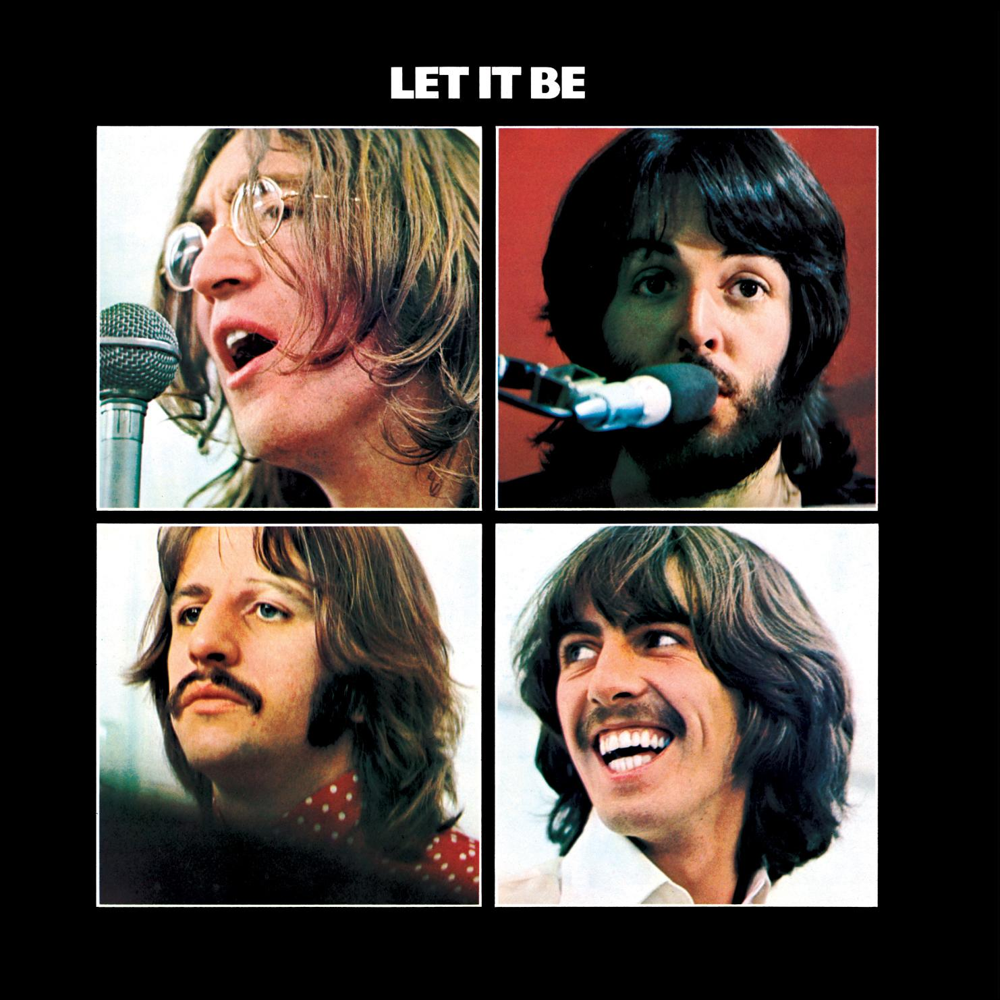

# Let It Be

By **The Beatles**

## Album Data

- **Catalog:** Beets
- **Format:** Digital, Album
- **Album:** Let It Be
- **Artist:** The Beatles
- **Albumartist:** The Beatles
- **Genre:** Pop Rock
- **MusicBrainz Album Artist ID:** [b10bbbfc-cf9e-42e0-be17-e2c3e1d2600d](https://musicbrainz.org/artist/b10bbbfc-cf9e-42e0-be17-e2c3e1d2600d)
- **MusicBrainz Album ID:** [f2687628-fc73-4351-9fe6-1ae66beadd17](https://musicbrainz.org/release/f2687628-fc73-4351-9fe6-1ae66beadd17)
- **MusicBrainz Release Group ID:** [bff544a7-56e0-3ed6-9e0f-3b676cca9111](https://musicbrainz.org/release-group/bff544a7-56e0-3ed6-9e0f-3b676cca9111)
- **Year:** 2012
- **Catalog #:** CDP 7243 8 31796 2 6
- **Label:** Apple Records
- **Total Tracks:** 69

## Album Tracks

### Track 01 - Beatle Greetings

- **Artist:** The Beatles
- **Format:** ALAC
- **Genre:** Rock And Roll
- **Length:** 0:13
- **MusicBrainz Track ID:** [d745ddbd-b4c4-49bd-af6a-e0b4cc3ed695](https://musicbrainz.org/recording/d745ddbd-b4c4-49bd-af6a-e0b4cc3ed695)
- **Title:** Beatle Greetings
- **Track:** 01
- **Year:** 1994

### Track 02 - From Us to You

- **Artist:** The Beatles
- **Format:** ALAC
- **Genre:** Rock
- **Length:** 0:27
- **MusicBrainz Track ID:** [c09a279c-7e6b-4f2a-a878-a66cd40bf857](https://musicbrainz.org/recording/c09a279c-7e6b-4f2a-a878-a66cd40bf857)
- **Title:** From Us to You
- **Track:** 02
- **Year:** 1994

### Track 04 - I Got a Woman

- **Artist:** The Beatles
- **Format:** ALAC
- **Genre:** Rock And Roll
- **Length:** 2:48
- **MusicBrainz Track ID:** [cdc231b1-1a18-4383-ba60-228321ed5d09](https://musicbrainz.org/recording/cdc231b1-1a18-4383-ba60-228321ed5d09)
- **Title:** I Got a Woman
- **Track:** 04
- **Year:** 1994

### Track 05 - Too Much Monkey Business

- **Artist:** The Beatles
- **Format:** ALAC
- **Genre:** Rock And Roll
- **Length:** 2:05
- **MusicBrainz Track ID:** [88dbf325-455e-49d4-98d0-fe935739aa0a](https://musicbrainz.org/recording/88dbf325-455e-49d4-98d0-fe935739aa0a)
- **Title:** Too Much Monkey Business
- **Track:** 05
- **Year:** 1994

### Track 06 - Keep Your Hands Off My Baby

- **Artist:** The Beatles
- **Format:** ALAC
- **Genre:** Rock
- **Length:** 2:30
- **MusicBrainz Track ID:** [108d4c06-fd62-4671-bf75-9538a1852d9d](https://musicbrainz.org/recording/108d4c06-fd62-4671-bf75-9538a1852d9d)
- **Title:** Keep Your Hands Off My Baby
- **Track:** 06
- **Year:** 1994

### Track 07 - I’ll Be on My Way

- **Artist:** The Beatles
- **Format:** ALAC
- **Genre:** Rock And Roll
- **Length:** 1:57
- **MusicBrainz Track ID:** [7d2fc60b-a11f-4c1e-8a06-f91170dcc85b](https://musicbrainz.org/recording/7d2fc60b-a11f-4c1e-8a06-f91170dcc85b)
- **Title:** I’ll Be on My Way
- **Track:** 07
- **Year:** 1994

### Track 08 - Young Blood

- **Artist:** The Beatles
- **Format:** ALAC
- **Genre:** Rockabilly
- **Length:** 1:56
- **MusicBrainz Track ID:** [5f20ba8c-52d5-4519-8db1-c330d8282880](https://musicbrainz.org/recording/5f20ba8c-52d5-4519-8db1-c330d8282880)
- **Title:** Young Blood
- **Track:** 08
- **Year:** 1994

### Track 09 - A Shot of Rhythm and Blues

- **Artist:** The Beatles
- **Format:** ALAC
- **Genre:** Rock And Roll
- **Length:** 2:14
- **MusicBrainz Track ID:** [60103fd9-e487-4220-829f-25e75c200022](https://musicbrainz.org/recording/60103fd9-e487-4220-829f-25e75c200022)
- **Title:** A Shot of Rhythm and Blues
- **Track:** 09
- **Year:** 1994

### Track 10 - Sure to Fall (in Love With You)

- **Artist:** The Beatles
- **Format:** ALAC
- **Genre:** Rock
- **Length:** 2:07
- **MusicBrainz Track ID:** [0eb6f6eb-c99b-4b6d-a63e-88bd3989644e](https://musicbrainz.org/recording/0eb6f6eb-c99b-4b6d-a63e-88bd3989644e)
- **Title:** Sure to Fall (in Love With You)
- **Track:** 10
- **Year:** 1994

### Track 11 - Some Other Guy

- **Artist:** The Beatles
- **Format:** ALAC
- **Genre:** Rock And Roll
- **Length:** 2:00
- **MusicBrainz Track ID:** [18e2e00f-5946-4353-a7fa-fac8cd7b1f45](https://musicbrainz.org/recording/18e2e00f-5946-4353-a7fa-fac8cd7b1f45)
- **Title:** Some Other Guy
- **Track:** 11
- **Year:** 1994

### Track 12 - Thank You Girl

- **Artist:** The Beatles
- **Format:** ALAC
- **Genre:** Rock And Roll
- **Length:** 2:01
- **MusicBrainz Track ID:** [3766b344-febd-493f-ba7e-ea69475e7ce9](https://musicbrainz.org/recording/3766b344-febd-493f-ba7e-ea69475e7ce9)
- **Title:** Thank You Girl
- **Track:** 12
- **Year:** 1994

### Track 13 - Sha La La La La!

- **Artist:** The Beatles
- **Format:** ALAC
- **Genre:** Rock
- **Length:** 0:27
- **MusicBrainz Track ID:** [068ef9d1-d10c-434e-a8f7-5a0f67dfd294](https://musicbrainz.org/recording/068ef9d1-d10c-434e-a8f7-5a0f67dfd294)
- **Title:** Sha La La La La!
- **Track:** 13
- **Year:** 1994

### Track 14 - Baby It’s You

- **Artist:** The Beatles
- **Format:** ALAC
- **Genre:** Rock And Roll
- **Length:** 2:43
- **MusicBrainz Track ID:** [e4743b7a-ba90-4eb2-81f3-dbc8fbd2b8b3](https://musicbrainz.org/recording/e4743b7a-ba90-4eb2-81f3-dbc8fbd2b8b3)
- **Title:** Baby It’s You
- **Track:** 14
- **Year:** 1994

### Track 15 - That’s All Right (Mama)

- **Artist:** The Beatles
- **Format:** ALAC
- **Genre:** Rock And Roll
- **Length:** 2:53
- **MusicBrainz Track ID:** [9278785f-d5d7-4c76-ad4e-c1a1b8d5b984](https://musicbrainz.org/recording/9278785f-d5d7-4c76-ad4e-c1a1b8d5b984)
- **Title:** That’s All Right (Mama)
- **Track:** 15
- **Year:** 1994

### Track 16 - Carol

- **Artist:** The Beatles
- **Format:** ALAC
- **Genre:** Britpop
- **Length:** 2:34
- **MusicBrainz Track ID:** [7d7bd680-f4a6-40e6-a5a1-3d8c4f13d7b6](https://musicbrainz.org/recording/7d7bd680-f4a6-40e6-a5a1-3d8c4f13d7b6)
- **Title:** Carol
- **Track:** 16
- **Year:** 1994

### Track 17 - Soldier of Love

- **Artist:** The Beatles
- **Format:** ALAC
- **Genre:** Rock
- **Length:** 1:59
- **MusicBrainz Track ID:** [44ce4973-29fd-40bc-84bf-d66b5d1b56fc](https://musicbrainz.org/recording/44ce4973-29fd-40bc-84bf-d66b5d1b56fc)
- **Title:** Soldier of Love
- **Track:** 17
- **Year:** 1994

### Track 18 - A Little Rhyme

- **Artist:** The Beatles
- **Format:** ALAC
- **Genre:** Rock And Roll
- **Length:** 0:25
- **MusicBrainz Track ID:** [ac917be4-d9d2-423b-a3c1-9170cf2daa59](https://musicbrainz.org/recording/ac917be4-d9d2-423b-a3c1-9170cf2daa59)
- **Title:** A Little Rhyme
- **Track:** 18
- **Year:** 1994

### Track 19 - Clarabella

- **Artist:** The Beatles
- **Format:** ALAC
- **Genre:** Rock And Roll
- **Length:** 2:39
- **MusicBrainz Track ID:** [7f456917-a3dd-4afd-bf1b-59c3b084ce1c](https://musicbrainz.org/recording/7f456917-a3dd-4afd-bf1b-59c3b084ce1c)
- **Title:** Clarabella
- **Track:** 19
- **Year:** 1994

### Track 20 - I’m Gonna Sit Right Down and Cry (Over You)

- **Artist:** The Beatles
- **Format:** ALAC
- **Genre:** Rock And Roll
- **Length:** 2:01
- **MusicBrainz Track ID:** [4d63f8c3-e9d0-46c9-be7b-cfef86f17309](https://musicbrainz.org/recording/4d63f8c3-e9d0-46c9-be7b-cfef86f17309)
- **Title:** I’m Gonna Sit Right Down and Cry (Over You)
- **Track:** 20
- **Year:** 1994

### Track 21 - Crying, Waiting, Hoping

- **Artist:** The Beatles
- **Format:** ALAC
- **Genre:** Rock And Roll
- **Length:** 2:09
- **MusicBrainz Track ID:** [ad15fbd4-3a4c-470e-9e8f-7ef7d9f2373e](https://musicbrainz.org/recording/ad15fbd4-3a4c-470e-9e8f-7ef7d9f2373e)
- **Title:** Crying, Waiting, Hoping
- **Track:** 21
- **Year:** 1994

### Track 23 - You Really Got a Hold on Me

- **Artist:** The Beatles
- **Format:** ALAC
- **Genre:** Rock
- **Length:** 2:37
- **MusicBrainz Track ID:** [903ab8b3-8c3c-4cee-8004-c109d3af5e38](https://musicbrainz.org/recording/903ab8b3-8c3c-4cee-8004-c109d3af5e38)
- **Title:** You Really Got a Hold on Me
- **Track:** 23
- **Year:** 1994

### Track 24 - To Know Her Is to Love Her

- **Artist:** The Beatles
- **Format:** ALAC
- **Genre:** Rock
- **Length:** 2:49
- **MusicBrainz Track ID:** [1775afd8-f021-4589-aa6f-bad8dd36bcce](https://musicbrainz.org/recording/1775afd8-f021-4589-aa6f-bad8dd36bcce)
- **Title:** To Know Her Is to Love Her
- **Track:** 24
- **Year:** 1994

### Track 25 - A Taste of Honey

- **Artist:** The Beatles
- **Format:** ALAC
- **Genre:** Rock And Roll
- **Length:** 1:57
- **MusicBrainz Track ID:** [7f762953-2926-4026-99e8-0c0246c9704d](https://musicbrainz.org/recording/7f762953-2926-4026-99e8-0c0246c9704d)
- **Title:** A Taste of Honey
- **Track:** 25
- **Year:** 1994

### Track 26 - Long Tall Sally

- **Artist:** The Beatles
- **Format:** ALAC
- **Genre:** Rock And Roll
- **Length:** 1:52
- **MusicBrainz Track ID:** [26419d8c-d492-4728-ba1e-a14ae8034dc2](https://musicbrainz.org/recording/26419d8c-d492-4728-ba1e-a14ae8034dc2)
- **Title:** Long Tall Sally
- **Track:** 26
- **Year:** 1994

### Track 27 - I Saw Her Standing There

- **Artist:** The Beatles
- **Format:** ALAC
- **Genre:** Rock And Roll
- **Length:** 2:31
- **MusicBrainz Track ID:** [1f4d51a5-c871-4bab-b21d-b5ef682d7b5f](https://musicbrainz.org/recording/1f4d51a5-c871-4bab-b21d-b5ef682d7b5f)
- **Title:** I Saw Her Standing There
- **Track:** 27
- **Year:** 1994

### Track 28 - The Honeymoon Song

- **Artist:** The Beatles
- **Format:** ALAC
- **Genre:** Rockabilly
- **Length:** 1:39
- **MusicBrainz Track ID:** [b6c8df03-01d4-43a3-9fbf-28f675ae2f12](https://musicbrainz.org/recording/b6c8df03-01d4-43a3-9fbf-28f675ae2f12)
- **Title:** The Honeymoon Song
- **Track:** 28
- **Year:** 1994

### Track 29 - Johnny B. Goode

- **Artist:** The Beatles
- **Format:** ALAC
- **Genre:** Rock And Roll
- **Length:** 2:51
- **MusicBrainz Track ID:** [3a359971-0486-411b-bc4a-3fd8ec5c00c8](https://musicbrainz.org/recording/3a359971-0486-411b-bc4a-3fd8ec5c00c8)
- **Title:** Johnny B. Goode
- **Track:** 29
- **Year:** 1994

### Track 30 - Memphis, Tennessee

- **Artist:** The Beatles
- **Format:** ALAC
- **Genre:** Rock And Roll
- **Length:** 2:12
- **MusicBrainz Track ID:** [eea138f1-3405-4c65-ab2b-23ca2c9a0615](https://musicbrainz.org/recording/eea138f1-3405-4c65-ab2b-23ca2c9a0615)
- **Title:** Memphis, Tennessee
- **Track:** 30
- **Year:** 1994

### Track 31 - Lucille

- **Artist:** The Beatles
- **Format:** ALAC
- **Genre:** Rock And Roll
- **Length:** 1:49
- **MusicBrainz Track ID:** [4601e896-1355-4f7a-9d3d-9225cb5a49e2](https://musicbrainz.org/recording/4601e896-1355-4f7a-9d3d-9225cb5a49e2)
- **Title:** Lucille
- **Track:** 31
- **Year:** 1994

### Track 32 - Can’t Buy Me Love

- **Artist:** The Beatles
- **Format:** ALAC
- **Genre:** Rock And Roll
- **Length:** 2:06
- **MusicBrainz Track ID:** [0d48b5c8-616d-44c5-a267-5228b0a80af7](https://musicbrainz.org/recording/0d48b5c8-616d-44c5-a267-5228b0a80af7)
- **Title:** Can’t Buy Me Love
- **Track:** 32
- **Year:** 1994

### Track 34 - Till There Was You

- **Artist:** The Beatles
- **Format:** ALAC
- **Genre:** Rock And Roll
- **Length:** 2:13
- **MusicBrainz Track ID:** [671209d5-0ec9-4c93-8de0-3eb3aa79ec71](https://musicbrainz.org/recording/671209d5-0ec9-4c93-8de0-3eb3aa79ec71)
- **Title:** Till There Was You
- **Track:** 34
- **Year:** 1994

### Track 36 - A Hard Day’s Night

- **Artist:** The Beatles
- **Format:** ALAC
- **Genre:** Rock
- **Length:** 2:24
- **MusicBrainz Track ID:** [89941f48-e2e5-4a9e-8a4d-e28ca1d5241f](https://musicbrainz.org/recording/89941f48-e2e5-4a9e-8a4d-e28ca1d5241f)
- **Title:** A Hard Day’s Night
- **Track:** 36
- **Year:** 1994

### Track 38 - I Wanna Be Your Man

- **Artist:** The Beatles
- **Format:** ALAC
- **Genre:** Pop Rock
- **Length:** 2:09
- **MusicBrainz Track ID:** [9af46e31-329d-4fac-a6ab-043ed07730a5](https://musicbrainz.org/recording/9af46e31-329d-4fac-a6ab-043ed07730a5)
- **Title:** I Wanna Be Your Man
- **Track:** 38
- **Year:** 1994

### Track 40 - Roll Over Beethoven

- **Artist:** The Beatles
- **Format:** ALAC
- **Genre:** Rock And Roll
- **Length:** 2:15
- **MusicBrainz Track ID:** [f987ada4-625e-41e4-9381-947825004b70](https://musicbrainz.org/recording/f987ada4-625e-41e4-9381-947825004b70)
- **Title:** Roll Over Beethoven
- **Track:** 40
- **Year:** 1994

### Track 41 - All My Loving

- **Artist:** The Beatles
- **Format:** ALAC
- **Genre:** Rock
- **Length:** 2:04
- **MusicBrainz Track ID:** [3e466487-6b9e-490e-803d-33cd9eab72d2](https://musicbrainz.org/recording/3e466487-6b9e-490e-803d-33cd9eab72d2)
- **Title:** All My Loving
- **Track:** 41
- **Year:** 1994

### Track 42 - Things We Said Today

- **Artist:** The Beatles
- **Format:** ALAC
- **Genre:** Rock And Roll
- **Length:** 2:18
- **MusicBrainz Track ID:** [b7be5a12-f812-43f3-bc63-cc9ad19d5910](https://musicbrainz.org/recording/b7be5a12-f812-43f3-bc63-cc9ad19d5910)
- **Title:** Things We Said Today
- **Track:** 42
- **Year:** 1994

### Track 43 - She’s a Woman

- **Artist:** The Beatles
- **Format:** ALAC
- **Genre:** Rock And Roll
- **Length:** 3:14
- **MusicBrainz Track ID:** [a2a405d2-c372-488d-8d49-c571e03dc31c](https://musicbrainz.org/recording/a2a405d2-c372-488d-8d49-c571e03dc31c)
- **Title:** She’s a Woman
- **Track:** 43
- **Year:** 1994

### Track 44 - Sweet Little Sixteen

- **Artist:** The Beatles
- **Format:** ALAC
- **Genre:** Rock And Roll
- **Length:** 2:20
- **MusicBrainz Track ID:** [93510344-0bc5-4350-b426-7024cba00a7e](https://musicbrainz.org/recording/93510344-0bc5-4350-b426-7024cba00a7e)
- **Title:** Sweet Little Sixteen
- **Track:** 44
- **Year:** 1994

### Track 45 - 1822! (speech)

- **Artist:** The Beatles
- **Format:** ALAC
- **Genre:** Rock And Roll
- **Length:** 0:10
- **MusicBrainz Track ID:** [b8363aa8-6de8-4689-ab36-c0c142c04d86](https://musicbrainz.org/recording/b8363aa8-6de8-4689-ab36-c0c142c04d86)
- **Title:** 1822! (speech)
- **Track:** 45
- **Year:** 1994

### Track 46 - Lonesome Tears in My Eyes

- **Artist:** The Beatles
- **Format:** ALAC
- **Genre:** Rock And Roll
- **Length:** 2:36
- **MusicBrainz Track ID:** [421f6776-0025-4ec6-9cb1-705405e6a330](https://musicbrainz.org/recording/421f6776-0025-4ec6-9cb1-705405e6a330)
- **Title:** Lonesome Tears in My Eyes
- **Track:** 46
- **Year:** 1994

### Track 47 - Nothin’ Shakin’

- **Artist:** The Beatles
- **Format:** ALAC
- **Genre:** Rock And Roll
- **Length:** 2:59
- **MusicBrainz Track ID:** [700ae635-218f-4efa-bb2c-e8cd2b35c4fe](https://musicbrainz.org/recording/700ae635-218f-4efa-bb2c-e8cd2b35c4fe)
- **Title:** Nothin’ Shakin’
- **Track:** 47
- **Year:** 1994

### Track 48 - The Hippy Hippy Shake

- **Artist:** The Beatles
- **Format:** ALAC
- **Genre:** Rock And Roll
- **Length:** 1:49
- **MusicBrainz Track ID:** [097facc4-e849-4fe6-8e0a-2799875ee520](https://musicbrainz.org/recording/097facc4-e849-4fe6-8e0a-2799875ee520)
- **Title:** The Hippy Hippy Shake
- **Track:** 48
- **Year:** 1994

### Track 49 - Glad All Over

- **Artist:** The Beatles
- **Format:** ALAC
- **Genre:** Rockabilly
- **Length:** 1:51
- **MusicBrainz Track ID:** [bc8dcdc1-89a6-432c-b233-982c0bd84b85](https://musicbrainz.org/recording/bc8dcdc1-89a6-432c-b233-982c0bd84b85)
- **Title:** Glad All Over
- **Track:** 49
- **Year:** 1994

### Track 50 - I Just Don’t Understand

- **Artist:** The Beatles
- **Format:** ALAC
- **Genre:** Rock And Roll
- **Length:** 2:46
- **MusicBrainz Track ID:** [122cc530-5eec-467c-bafa-8f6a972cbf1e](https://musicbrainz.org/recording/122cc530-5eec-467c-bafa-8f6a972cbf1e)
- **Title:** I Just Don’t Understand
- **Track:** 50
- **Year:** 1994

### Track 51 - So How Come (No One Loves Me)

- **Artist:** The Beatles
- **Format:** ALAC
- **Genre:** Rock And Roll
- **Length:** 1:53
- **MusicBrainz Track ID:** [73691a9e-5547-4d79-b395-38a219e16e7b](https://musicbrainz.org/recording/73691a9e-5547-4d79-b395-38a219e16e7b)
- **Title:** So How Come (No One Loves Me)
- **Track:** 51
- **Year:** 1994

### Track 52 - I Feel Fine

- **Artist:** The Beatles
- **Format:** ALAC
- **Genre:** Rock And Roll
- **Length:** 2:12
- **MusicBrainz Track ID:** [eeef1ec9-1e31-4e9c-bba9-af710d471574](https://musicbrainz.org/recording/eeef1ec9-1e31-4e9c-bba9-af710d471574)
- **Title:** I Feel Fine
- **Track:** 52
- **Year:** 1994

### Track 53 - I’m a Loser

- **Artist:** The Beatles
- **Format:** ALAC
- **Genre:** Pop Rock
- **Length:** 2:32
- **MusicBrainz Track ID:** [473631bf-0373-4f7e-88f8-6d847f6dfdaa](https://musicbrainz.org/recording/473631bf-0373-4f7e-88f8-6d847f6dfdaa)
- **Title:** I’m a Loser
- **Track:** 53
- **Year:** 1994

### Track 54 - Everybody’s Trying to Be My Baby

- **Artist:** The Beatles
- **Format:** ALAC
- **Genre:** Rock And Roll
- **Length:** 2:20
- **MusicBrainz Track ID:** [aa639b97-837f-490f-915d-31fd4e84acbc](https://musicbrainz.org/recording/aa639b97-837f-490f-915d-31fd4e84acbc)
- **Title:** Everybody’s Trying to Be My Baby
- **Track:** 54
- **Year:** 1994

### Track 55 - Rock and Roll Music

- **Artist:** The Beatles
- **Format:** ALAC
- **Genre:** Rock And Roll
- **Length:** 2:00
- **MusicBrainz Track ID:** [03006921-0891-44b8-8c09-5cb59ef0bbb1](https://musicbrainz.org/recording/03006921-0891-44b8-8c09-5cb59ef0bbb1)
- **Title:** Rock and Roll Music
- **Track:** 55
- **Year:** 1994

### Track 56 - Ticket to Ride

- **Artist:** The Beatles
- **Format:** ALAC
- **Genre:** Rock And Roll
- **Length:** 2:56
- **MusicBrainz Track ID:** [e661ad69-55c8-49d7-a92a-217ff234bb3a](https://musicbrainz.org/recording/e661ad69-55c8-49d7-a92a-217ff234bb3a)
- **Title:** Ticket to Ride
- **Track:** 56
- **Year:** 1994

### Track 57 - Dizzy Miss Lizzy

- **Artist:** The Beatles
- **Format:** ALAC
- **Genre:** Rock And Roll
- **Length:** 2:42
- **MusicBrainz Track ID:** [e9405b1f-a764-432d-ad32-9c6b0f410a4c](https://musicbrainz.org/recording/e9405b1f-a764-432d-ad32-9c6b0f410a4c)
- **Title:** Dizzy Miss Lizzy
- **Track:** 57
- **Year:** 1994

### Track 58 - Medley

- **Artist:** The Beatles
- **Format:** ALAC
- **Genre:** Rock And Roll
- **Length:** 2:37
- **MusicBrainz Track ID:** [9d7d2853-f03a-43e8-81f5-0e07fd12eb6d](https://musicbrainz.org/recording/9d7d2853-f03a-43e8-81f5-0e07fd12eb6d)
- **Title:** Medley
- **Track:** 58
- **Year:** 1994

### Track 60 - Matchbox

- **Artist:** The Beatles
- **Format:** ALAC
- **Genre:** Rock
- **Length:** 1:57
- **MusicBrainz Track ID:** [b1080b23-58a9-425c-a5f5-9abb92b0bab4](https://musicbrainz.org/recording/b1080b23-58a9-425c-a5f5-9abb92b0bab4)
- **Title:** Matchbox
- **Track:** 60
- **Year:** 1994

### Track 61 - I Forgot to Remember to Forget

- **Artist:** The Beatles
- **Format:** ALAC
- **Genre:** Rock
- **Length:** 2:08
- **MusicBrainz Track ID:** [1af80694-aad2-4e51-8d46-fe798aa88553](https://musicbrainz.org/recording/1af80694-aad2-4e51-8d46-fe798aa88553)
- **Title:** I Forgot to Remember to Forget
- **Track:** 61
- **Year:** 1994

### Track 63 - I Got to Find My Baby

- **Artist:** The Beatles
- **Format:** ALAC
- **Genre:** Rock And Roll
- **Length:** 1:55
- **MusicBrainz Track ID:** [7a16107f-ca31-4aaa-b2c6-3c458dda3428](https://musicbrainz.org/recording/7a16107f-ca31-4aaa-b2c6-3c458dda3428)
- **Title:** I Got to Find My Baby
- **Track:** 63
- **Year:** 1994

### Track 64 - Ooh! My Soul

- **Artist:** The Beatles
- **Format:** ALAC
- **Genre:** Rock And Roll
- **Length:** 1:36
- **MusicBrainz Track ID:** [1e793ba0-3a7a-4e76-8220-0fbfb399a618](https://musicbrainz.org/recording/1e793ba0-3a7a-4e76-8220-0fbfb399a618)
- **Title:** Ooh! My Soul
- **Track:** 64
- **Year:** 1994

### Track 66 - Don’t Ever Change

- **Artist:** The Beatles
- **Format:** ALAC
- **Genre:** Rock And Roll
- **Length:** 2:02
- **MusicBrainz Track ID:** [11ac1c09-1cb8-4f48-af3f-129f8b373485](https://musicbrainz.org/recording/11ac1c09-1cb8-4f48-af3f-129f8b373485)
- **Title:** Don’t Ever Change
- **Track:** 66
- **Year:** 1994

### Track 67 - Slow Down

- **Artist:** The Beatles
- **Format:** ALAC
- **Genre:** Rock And Roll
- **Length:** 2:36
- **MusicBrainz Track ID:** [374ae299-3839-4675-88c5-c296d6475fbc](https://musicbrainz.org/recording/374ae299-3839-4675-88c5-c296d6475fbc)
- **Title:** Slow Down
- **Track:** 67
- **Year:** 1994

### Track 68 - Honey Don’t

- **Artist:** The Beatles
- **Format:** ALAC
- **Genre:** Rock And Roll
- **Length:** 2:11
- **MusicBrainz Track ID:** [de9348bf-f7f9-4655-bb6f-7e323eaacb73](https://musicbrainz.org/recording/de9348bf-f7f9-4655-bb6f-7e323eaacb73)
- **Title:** Honey Don’t
- **Track:** 68
- **Year:** 1994

### Track 69 - Love Me Do

- **Artist:** The Beatles
- **Format:** ALAC
- **Genre:** Rock And Roll
- **Length:** 2:29
- **MusicBrainz Track ID:** [ab936696-1198-46e9-91fe-257f6bf47449](https://musicbrainz.org/recording/ab936696-1198-46e9-91fe-257f6bf47449)
- **Title:** Love Me Do
- **Track:** 69
- **Year:** 1994

### Track 59 - Set Fire to That Lot! (speech)

- **Artist:** The Beatles feat. Rodney Burke
- **Format:** ALAC
- **Genre:** Rock And Roll
- **Length:** 0:27
- **MusicBrainz Track ID:** [16e530ca-3764-4eeb-a7be-1a4804c46e3f](https://musicbrainz.org/recording/16e530ca-3764-4eeb-a7be-1a4804c46e3f)
- **Title:** Set Fire to That Lot! (speech)
- **Track:** 59
- **Year:** 1994

### Track 65 - Ooh! My Arms (speech)

- **Artist:** The Beatles feat. Rodney Burke
- **Format:** ALAC
- **Genre:** Rock And Roll
- **Length:** 0:35
- **MusicBrainz Track ID:** [e8d58f3d-9523-4334-ad37-b9e1dbec6e4e](https://musicbrainz.org/recording/e8d58f3d-9523-4334-ad37-b9e1dbec6e4e)
- **Title:** Ooh! My Arms (speech)
- **Track:** 65
- **Year:** 1994

### Track 33 - From Fluff to You

- **Artist:** The Beatles feat. Alan Freeman
- **Format:** ALAC
- **Genre:** Rock And Roll
- **Length:** 0:28
- **MusicBrainz Track ID:** [b87c3ded-cc91-4d1f-85ff-db4b5aac4700](https://musicbrainz.org/recording/b87c3ded-cc91-4d1f-85ff-db4b5aac4700)
- **Title:** From Fluff to You
- **Track:** 33
- **Year:** 1994

### Track 39 - Just a Rumour (speech)

- **Artist:** The Beatles feat. Alan Freeman
- **Format:** ALAC
- **Genre:** Rock And Roll
- **Length:** 0:20
- **MusicBrainz Track ID:** [1bff3c4d-e1b2-405d-912f-bfeb064c5324](https://musicbrainz.org/recording/1bff3c4d-e1b2-405d-912f-bfeb064c5324)
- **Title:** Just a Rumour (speech)
- **Track:** 39
- **Year:** 1994

### Track 03 - Riding on a Bus

- **Artist:** The Beatles feat. Brian Matthew
- **Format:** ALAC
- **Genre:** Rock And Roll
- **Length:** 0:53
- **MusicBrainz Track ID:** [ec6947ab-1ef5-4c6d-aae7-fa1698e42814](https://musicbrainz.org/recording/ec6947ab-1ef5-4c6d-aae7-fa1698e42814)
- **Title:** Riding on a Bus
- **Track:** 03
- **Year:** 1994

### Track 22 - Dear Wack!

- **Artist:** The Beatles feat. Brian Matthew
- **Format:** ALAC
- **Genre:** Rock And Roll
- **Length:** 0:42
- **MusicBrainz Track ID:** [a1f29e1f-2177-46da-bd60-5a1290b1c60f](https://musicbrainz.org/recording/a1f29e1f-2177-46da-bd60-5a1290b1c60f)
- **Title:** Dear Wack!
- **Track:** 22
- **Year:** 1994

### Track 35 - Crinsk Dee Night (speech)

- **Artist:** The Beatles feat. Brian Matthew
- **Format:** ALAC
- **Genre:** Rock And Roll
- **Length:** 1:04
- **MusicBrainz Track ID:** [2f9da9fc-1f42-46e9-9239-69f5b333088f](https://musicbrainz.org/recording/2f9da9fc-1f42-46e9-9239-69f5b333088f)
- **Title:** Crinsk Dee Night (speech)
- **Track:** 35
- **Year:** 1994

### Track 37 - Have a Banana! (speech)

- **Artist:** The Beatles feat. Brian Matthew
- **Format:** ALAC
- **Genre:** Rock And Roll
- **Length:** 0:21
- **MusicBrainz Track ID:** [fcc75673-9331-412e-b5bd-32903e735981](https://musicbrainz.org/recording/fcc75673-9331-412e-b5bd-32903e735981)
- **Title:** Have a Banana! (speech)
- **Track:** 37
- **Year:** 1994

### Track 62 - Love These Goon Shows! (speech)

- **Artist:** The Beatles feat. Lee Peters
- **Format:** ALAC
- **Genre:** Rock And Roll
- **Length:** 0:26
- **MusicBrainz Track ID:** [8bbffa22-7d73-451f-a024-55b102b01881](https://musicbrainz.org/recording/8bbffa22-7d73-451f-a024-55b102b01881)
- **Title:** Love These Goon Shows! (speech)
- **Track:** 62
- **Year:** 1994

## See also

- [1 [2015 Version]](1_[2015_Version].md)
- [1](1.md)
- [Abbey Road](Abbey_Road.md)
- [Anthology 1 [Disc 1]](Anthology_1_[Disc_1].md)
- [Anthology 1 [Disc 2]](Anthology_1_[Disc_2].md)
- [Anthology 2 [Disc 2]](Anthology_2_[Disc_2].md)
- [Australia And Japan](Australia_And_Japan.md)
- [Beatles for Sale](Beatles_for_Sale.md)
- [Blackpool And Paris 1964-`65](Blackpool_And_Paris_1964-`65.md)
- [Help](Help.md)
- [Live at the BBC](Live_at_the_BBC.md)
- [Love](Love.md)
- [New York, Miami And Philadelphia - The First And Second U.S. Tours](New_York__Miami_And_Philadelphia_-_The_First_And_Second_US_Tours.md)
- [Past Masters](Past_Masters.md)
- [Past Masters, Vol. 1](Past_Masters__Vol_1.md)
- [Past Masters Volume One](Past_Masters_Volume_One.md)
- [Please Please Me](Please_Please_Me.md)
- [Real Love [US Single]](Real_Love_[US_Single].md)
- [Revolver](Revolver.md)
- [Rubber Soul](Rubber_Soul.md)
- [Sgt. Pepper’s Lonely Hearts Club Band](Sgt_Pepper’s_Lonely_Hearts_Club_Band.md)
- [The Beatles 1](The_Beatles_1.md)
- [The Beatles (White Album)](The_Beatles_White_Album.md)
- [The Lost Abbey Road Tapes 1962-'64](The_Lost_Abbey_Road_Tapes_1962-64.md)
- [The Lost BBC Tapes and Much More...](The_Lost_BBC_Tapes_and_Much_More.md)
- [The Lost Decca Audition Tapes](The_Lost_Decca_Audition_Tapes.md)
- [With The Beatles [2009 Stereo Remaster]](With_The_Beatles_[2009_Stereo_Remaster].md)
- [With The Beatles](With_The_Beatles.md)
- [CD: 1 (Cd & 2 Bluray Edition) (Disc 1)](../../CD/The_Beatles/1_Cd_and_2_Bluray_Edition_Disc_1.md)
- [CD: ](../../CD/The_Beatles/The_Beatles.md)
- [Roon: 1 (Remastered)](../../Roon/The_Beatles/1_Remastered.md)
- [Roon: Abbey Road (Super Deluxe Edition)](../../Roon/The_Beatles/Abbey_Road_Super_Deluxe_Edition.md)
- [Roon: A Hard Day's Night](../../Roon/The_Beatles/A_Hard_Days_Night.md)
- [Roon: Anthology 1](../../Roon/The_Beatles/Anthology_1.md)
- [Roon: Anthology 2](../../Roon/The_Beatles/Anthology_2.md)
- [Roon: Anthology 3](../../Roon/The_Beatles/Anthology_3.md)
- [Roon: Beatles for Sale](../../Roon/The_Beatles/Beatles_for_Sale.md)
- [Roon: Help!](../../Roon/The_Beatles/Help!.md)
- [Roon: Let It Be (Super Deluxe)](../../Roon/The_Beatles/Let_It_Be_Super_Deluxe.md)
- [Roon: Love](../../Roon/The_Beatles/Love.md)
- [Roon: Magical Mystery Tour (Remastered)](../../Roon/The_Beatles/Magical_Mystery_Tour_Remastered.md)
- [Roon: Past Masters](../../Roon/The_Beatles/Past_Masters.md)
- [Roon: Please Please Me](../../Roon/The_Beatles/Please_Please_Me.md)
- [Roon: Revolver (Remastered)](../../Roon/The_Beatles/Revolver_Remastered.md)
- [Roon: Revolver (Super Deluxe)](../../Roon/The_Beatles/Revolver_Super_Deluxe.md)
- [Roon: Rubber Soul (Remastered)](../../Roon/The_Beatles/Rubber_Soul_Remastered.md)
- [Roon: Sgt. Pepper's Lonely Hearts Club Band (Deluxe Anniversary Edition)](../../Roon/The_Beatles/Sgt_Peppers_Lonely_Hearts_Club_Band_Deluxe_Anniversary_Edition.md)
- [Roon: Sgt. Pepper's Lonely Hearts Club Band (Super Deluxe Edition)](../../Roon/The_Beatles/Sgt_Peppers_Lonely_Hearts_Club_Band_Super_Deluxe_Edition.md)
- [Roon: The Beatles 1962 - 1966 (Remastered)](../../Roon/The_Beatles/The_Beatles_1962_-_1966_Remastered.md)
- [Roon: The Beatles 1967 - 1970 (Remastered)](../../Roon/The_Beatles/The_Beatles_1967_-_1970_Remastered.md)
- [Roon: The Beatles (White Album) [Super Deluxe] (White Album / Super Deluxe)](../../Roon/The_Beatles/The_Beatles_White_Album_[Super_Deluxe]_White_Album_-_Super_Deluxe.md)
- [Roon: With The Beatles (Remastered)](../../Roon/The_Beatles/With_The_Beatles_Remastered.md)
- [Vinyl: Beatles '65](../../Vinyl/The_Beatles/Beatles_65.md)
- [Vinyl: Help! In Concert](../../Vinyl/The_Beatles/Help!_In_Concert.md)
- [Vinyl: Help! (Original Motion Picture Soundtrack)](../../Vinyl/The_Beatles/Help!_Original_Motion_Picture_Soundtrack.md)
- [Vinyl: Hey Jude](../../Vinyl/The_Beatles/Hey_Jude.md)
- [Vinyl: Introducing... The Beatles](../../Vinyl/The_Beatles/Introducing_The_Beatles.md)
- [Vinyl: Let It Be](../../Vinyl/The_Beatles/Let_It_Be.md)
- [Vinyl: Live In Paris '65](../../Vinyl/The_Beatles/Live_In_Paris_65.md)
- [Vinyl: Magical Mystery Tour](../../Vinyl/The_Beatles/Magical_Mystery_Tour.md)
- [Vinyl: Something New](../../Vinyl/The_Beatles/Something_New.md)
- [Vinyl: ](../../Vinyl/The_Beatles/The_Beatles_index.md)
- [Vinyl: The Beatles](../../Vinyl/The_Beatles/The_Beatles.md)
- [Vinyl: The Beatles' Second Album](../../Vinyl/The_Beatles/The_Beatles_Second_Album.md)
