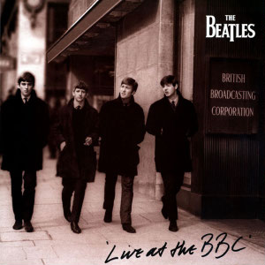

# Live at the BBC

By **The Beatles**

## Album Data

- **Catalog:** Beets
- **Format:** Digital, Album
- **Album:** Live at the BBC
- **Artist:** The Beatles
- **Albumartist:** The Beatles
- **Genre:** Rock And Roll
- **MusicBrainz Album Artist ID:** [b10bbbfc-cf9e-42e0-be17-e2c3e1d2600d](https://musicbrainz.org/artist/b10bbbfc-cf9e-42e0-be17-e2c3e1d2600d)
- **MusicBrainz Album ID:** [a535cff1-f3f2-3e3a-b2d2-c5bf78b64076](https://musicbrainz.org/release/a535cff1-f3f2-3e3a-b2d2-c5bf78b64076)
- **MusicBrainz Release Group ID:** [867e16bf-0405-38ce-a9ec-fa44d0d3fa33](https://musicbrainz.org/release-group/867e16bf-0405-38ce-a9ec-fa44d0d3fa33)
- **Year:** 1994
- **Catalog #:** 
- **Label:** Parlophone
- **Total Tracks:** 33

## Album Tracks

### Track 01 - Love Me Do

- **Artist:** The Beatles
- **Format:** MP3
- **Genre:** Rock And Roll
- **Length:** 2:26
- **MusicBrainz Track ID:** [f87eb4dd-7e3c-4365-a3c8-f144696f5952](https://musicbrainz.org/recording/f87eb4dd-7e3c-4365-a3c8-f144696f5952)
- **Title:** Love Me Do
- **Track:** 01
- **Year:** 2009

### Track 02 - From Me to You

- **Artist:** The Beatles
- **Format:** MP3
- **Genre:** Rock
- **Length:** 1:58
- **MusicBrainz Track ID:** [9b859667-7c04-4d4a-99c4-3f3321882c4d](https://musicbrainz.org/recording/9b859667-7c04-4d4a-99c4-3f3321882c4d)
- **Title:** From Me to You
- **Track:** 02
- **Year:** 2009

### Track 03 - Thank You Girl

- **Artist:** The Beatles
- **Format:** MP3
- **Genre:** Rock And Roll
- **Length:** 2:03
- **MusicBrainz Track ID:** [72e496b3-73e5-482a-99f8-5a0f9a844391](https://musicbrainz.org/recording/72e496b3-73e5-482a-99f8-5a0f9a844391)
- **Title:** Thank You Girl
- **Track:** 03
- **Year:** 2009

### Track 04 - She Loves You

- **Artist:** The Beatles
- **Format:** MP3
- **Genre:** Rock And Roll
- **Length:** 2:21
- **MusicBrainz Track ID:** [21047249-7b3f-4651-acca-246669c081fd](https://musicbrainz.org/recording/21047249-7b3f-4651-acca-246669c081fd)
- **Title:** She Loves You
- **Track:** 04
- **Year:** 2009

### Track 05 - I’ll Get You

- **Artist:** The Beatles
- **Format:** MP3
- **Genre:** Psychedelic Rock
- **Length:** 2:06
- **MusicBrainz Track ID:** [5de0bb62-d0aa-47f1-9d04-e7911a7ffdc5](https://musicbrainz.org/recording/5de0bb62-d0aa-47f1-9d04-e7911a7ffdc5)
- **Title:** I’ll Get You
- **Track:** 05
- **Year:** 2009

### Track 06 - I Want to Hold Your Hand

- **Artist:** The Beatles
- **Format:** MP3
- **Genre:** Rock And Roll
- **Length:** 2:27
- **MusicBrainz Track ID:** [fa811bd6-1886-4768-b09c-b67a05504f64](https://musicbrainz.org/recording/fa811bd6-1886-4768-b09c-b67a05504f64)
- **Title:** I Want to Hold Your Hand
- **Track:** 06
- **Year:** 2009

### Track 07 - This Boy

- **Artist:** The Beatles
- **Format:** MP3
- **Genre:** Rock And Roll
- **Length:** 2:16
- **MusicBrainz Track ID:** [ce13b4c5-e414-4f87-ad1b-c69c558268ee](https://musicbrainz.org/recording/ce13b4c5-e414-4f87-ad1b-c69c558268ee)
- **Title:** This Boy
- **Track:** 07
- **Year:** 2009

### Track 08 - Komm, gib mir deine Hand

- **Artist:** The Beatles
- **Format:** MP3
- **Genre:** Rock
- **Length:** 2:25
- **MusicBrainz Track ID:** [c201822e-282a-4aa4-8eb5-5bf57bb5d7d0](https://musicbrainz.org/recording/c201822e-282a-4aa4-8eb5-5bf57bb5d7d0)
- **Title:** Komm, gib mir deine Hand
- **Track:** 08
- **Year:** 2009

### Track 09 - Sie liebt dich

- **Artist:** The Beatles
- **Format:** MP3
- **Genre:** Rock
- **Length:** 2:20
- **MusicBrainz Track ID:** [2ed4368b-04c0-4405-9fa2-edf07a94f9e8](https://musicbrainz.org/recording/2ed4368b-04c0-4405-9fa2-edf07a94f9e8)
- **Title:** Sie liebt dich
- **Track:** 09
- **Year:** 2009

### Track 10 - Long Tall Sally

- **Artist:** The Beatles
- **Format:** MP3
- **Genre:** Rock And Roll
- **Length:** 2:04
- **MusicBrainz Track ID:** [2030cb11-b9d3-45a5-ad9a-4eefee87826f](https://musicbrainz.org/recording/2030cb11-b9d3-45a5-ad9a-4eefee87826f)
- **Title:** Long Tall Sally
- **Track:** 10
- **Year:** 2009

### Track 11 - I Call Your Name

- **Artist:** The Beatles
- **Format:** MP3
- **Genre:** Rock And Roll
- **Length:** 2:08
- **MusicBrainz Track ID:** [5015bd3a-aa39-451b-a903-1e6f6ec9e9e1](https://musicbrainz.org/recording/5015bd3a-aa39-451b-a903-1e6f6ec9e9e1)
- **Title:** I Call Your Name
- **Track:** 11
- **Year:** 2009

### Track 12 - Slow Down

- **Artist:** The Beatles
- **Format:** MP3
- **Genre:** Rock And Roll
- **Length:** 2:57
- **MusicBrainz Track ID:** [b2b50082-0bd1-4702-9a95-3499a4e5781b](https://musicbrainz.org/recording/b2b50082-0bd1-4702-9a95-3499a4e5781b)
- **Title:** Slow Down
- **Track:** 12
- **Year:** 2009

### Track 13 - Matchbox

- **Artist:** The Beatles
- **Format:** MP3
- **Genre:** Rock
- **Length:** 1:59
- **MusicBrainz Track ID:** [ced07174-0d21-4ff3-93e7-aabd4a7e895d](https://musicbrainz.org/recording/ced07174-0d21-4ff3-93e7-aabd4a7e895d)
- **Title:** Matchbox
- **Track:** 13
- **Year:** 2009

### Track 14 - I Feel Fine

- **Artist:** The Beatles
- **Format:** MP3
- **Genre:** Rock And Roll
- **Length:** 2:18
- **MusicBrainz Track ID:** [c4676f4b-0557-4fd8-8ad9-29047b6043f3](https://musicbrainz.org/recording/c4676f4b-0557-4fd8-8ad9-29047b6043f3)
- **Title:** I Feel Fine
- **Track:** 14
- **Year:** 2009

### Track 15 - She’s a Woman

- **Artist:** The Beatles
- **Format:** MP3
- **Genre:** Psychedelic Rock
- **Length:** 3:04
- **MusicBrainz Track ID:** [761416ab-8c5e-4f57-acce-700932c3f1ed](https://musicbrainz.org/recording/761416ab-8c5e-4f57-acce-700932c3f1ed)
- **Title:** She’s a Woman
- **Track:** 15
- **Year:** 2009

### Track 16 - Bad Boy

- **Artist:** The Beatles
- **Format:** MP3
- **Genre:** Rock And Roll
- **Length:** 2:21
- **MusicBrainz Track ID:** [a53cb822-f655-4acc-a55b-3bf8243bcb7a](https://musicbrainz.org/recording/a53cb822-f655-4acc-a55b-3bf8243bcb7a)
- **Title:** Bad Boy
- **Track:** 16
- **Year:** 2009

### Track 17 - Yes It Is

- **Artist:** The Beatles
- **Format:** MP3
- **Genre:** Rock
- **Length:** 2:43
- **MusicBrainz Track ID:** [89afd434-afe1-4a4c-9ec3-d7c50c3363ec](https://musicbrainz.org/recording/89afd434-afe1-4a4c-9ec3-d7c50c3363ec)
- **Title:** Yes It Is
- **Track:** 17
- **Year:** 2009

### Track 18 - I’m Down

- **Artist:** The Beatles
- **Format:** MP3
- **Genre:** Psychedelic Rock
- **Length:** 2:29
- **MusicBrainz Track ID:** [ee898790-133f-445a-874f-d996abd843af](https://musicbrainz.org/recording/ee898790-133f-445a-874f-d996abd843af)
- **Title:** I’m Down
- **Track:** 18
- **Year:** 2009

### Track 19 - Day Tripper

- **Artist:** The Beatles
- **Format:** MP3
- **Genre:** Rock
- **Length:** 2:49
- **MusicBrainz Track ID:** [83d4608f-5999-47cb-a90d-acfd824f8565](https://musicbrainz.org/recording/83d4608f-5999-47cb-a90d-acfd824f8565)
- **Title:** Day Tripper
- **Track:** 19
- **Year:** 2009

### Track 20 - We Can Work It Out

- **Artist:** The Beatles
- **Format:** MP3
- **Genre:** Rock
- **Length:** 2:16
- **MusicBrainz Track ID:** [e432f23f-4fad-4780-ba3d-9b33240dfd10](https://musicbrainz.org/recording/e432f23f-4fad-4780-ba3d-9b33240dfd10)
- **Title:** We Can Work It Out
- **Track:** 20
- **Year:** 2009

### Track 21 - Paperback Writer

- **Artist:** The Beatles
- **Format:** MP3
- **Genre:** Rock
- **Length:** 2:18
- **MusicBrainz Track ID:** [f28b465d-7adb-479d-a363-0c49368e59d3](https://musicbrainz.org/recording/f28b465d-7adb-479d-a363-0c49368e59d3)
- **Title:** Paperback Writer
- **Track:** 21
- **Year:** 2009

### Track 22 - Rain

- **Artist:** The Beatles
- **Format:** MP3
- **Genre:** Psychedelic Rock
- **Length:** 3:01
- **MusicBrainz Track ID:** [3053c12e-7426-414f-b8b5-fd553c593cd6](https://musicbrainz.org/recording/3053c12e-7426-414f-b8b5-fd553c593cd6)
- **Title:** Rain
- **Track:** 22
- **Year:** 2009

### Track 23 - Lady Madonna

- **Artist:** The Beatles
- **Format:** MP3
- **Genre:** Rock And Roll
- **Length:** 2:18
- **MusicBrainz Track ID:** [3f5bdf50-dea7-428d-917f-3b212f15ade6](https://musicbrainz.org/recording/3f5bdf50-dea7-428d-917f-3b212f15ade6)
- **Title:** Lady Madonna
- **Track:** 23
- **Year:** 2009

### Track 24 - The Inner Light

- **Artist:** The Beatles
- **Format:** MP3
- **Genre:** Raga Rock
- **Length:** 2:36
- **MusicBrainz Track ID:** [44c619b7-ba15-444e-ac3b-aa9d8af09395](https://musicbrainz.org/recording/44c619b7-ba15-444e-ac3b-aa9d8af09395)
- **Title:** The Inner Light
- **Track:** 24
- **Year:** 2009

### Track 25 - Hey Jude

- **Artist:** The Beatles
- **Format:** MP3
- **Genre:** Rock
- **Length:** 7:09
- **MusicBrainz Track ID:** [0acc282b-c4db-44b2-a6ae-3c037fa3255a](https://musicbrainz.org/recording/0acc282b-c4db-44b2-a6ae-3c037fa3255a)
- **Title:** Hey Jude
- **Track:** 25
- **Year:** 2009

### Track 26 - Revolution

- **Artist:** The Beatles
- **Format:** MP3
- **Genre:** Rock And Roll
- **Length:** 3:25
- **MusicBrainz Track ID:** [d893c112-8dc3-4a46-8e11-3744d628917a](https://musicbrainz.org/recording/d893c112-8dc3-4a46-8e11-3744d628917a)
- **Title:** Revolution
- **Track:** 26
- **Year:** 2009

### Track 27 - Get Back

- **Artist:** The Beatles
- **Format:** MP3
- **Genre:** Rock
- **Length:** 3:11
- **MusicBrainz Track ID:** [b2d2881c-d968-4926-82de-de874d37eea7](https://musicbrainz.org/recording/b2d2881c-d968-4926-82de-de874d37eea7)
- **Title:** Get Back
- **Track:** 27
- **Year:** 2009

### Track 28 - Don’t Let Me Down

- **Artist:** The Beatles
- **Format:** MP3
- **Genre:** Psychedelic Rock
- **Length:** 3:36
- **MusicBrainz Track ID:** [bbc38449-9954-4f70-b28a-f2bcea9c393a](https://musicbrainz.org/recording/bbc38449-9954-4f70-b28a-f2bcea9c393a)
- **Title:** Don’t Let Me Down
- **Track:** 28
- **Year:** 2009

### Track 29 - The Ballad of John and Yoko

- **Artist:** The Beatles
- **Format:** MP3
- **Genre:** Rock
- **Length:** 3:00
- **MusicBrainz Track ID:** [02690387-dbd9-4d24-bbf5-1d2d7ca103ac](https://musicbrainz.org/recording/02690387-dbd9-4d24-bbf5-1d2d7ca103ac)
- **Title:** The Ballad of John and Yoko
- **Track:** 29
- **Year:** 2009

### Track 30 - Old Brown Shoe

- **Artist:** The Beatles
- **Format:** MP3
- **Genre:** Rock
- **Length:** 3:20
- **MusicBrainz Track ID:** [5199acad-fac9-4fd8-8bd2-948ff8ca7b41](https://musicbrainz.org/recording/5199acad-fac9-4fd8-8bd2-948ff8ca7b41)
- **Title:** Old Brown Shoe
- **Track:** 30
- **Year:** 2009

### Track 31 - Across the Universe

- **Artist:** The Beatles
- **Format:** MP3
- **Genre:** Psychedelic Rock
- **Length:** 3:48
- **MusicBrainz Track ID:** [5471572c-143c-482f-842d-5e0bf76de773](https://musicbrainz.org/recording/5471572c-143c-482f-842d-5e0bf76de773)
- **Title:** Across the Universe
- **Track:** 31
- **Year:** 2009

### Track 32 - Let It Be

- **Artist:** The Beatles
- **Format:** MP3
- **Genre:** Rock
- **Length:** 3:52
- **MusicBrainz Track ID:** [c3ab18e7-e17a-4064-a352-834b67513f33](https://musicbrainz.org/recording/c3ab18e7-e17a-4064-a352-834b67513f33)
- **Title:** Let It Be
- **Track:** 32
- **Year:** 2009

### Track 33 - You Know My Name (Look Up the Number)

- **Artist:** The Beatles
- **Format:** MP3
- **Genre:** Rock
- **Length:** 4:20
- **MusicBrainz Track ID:** [283be7ab-9783-4676-b673-5a151b0c56c8](https://musicbrainz.org/recording/283be7ab-9783-4676-b673-5a151b0c56c8)
- **Title:** You Know My Name (Look Up the Number)
- **Track:** 33
- **Year:** 2009

## See also

- [1 [2015 Version]](1_[2015_Version].md)
- [1](1.md)
- [Abbey Road](Abbey_Road.md)
- [Anthology 1 [Disc 1]](Anthology_1_[Disc_1].md)
- [Anthology 1 [Disc 2]](Anthology_1_[Disc_2].md)
- [Anthology 2 [Disc 2]](Anthology_2_[Disc_2].md)
- [Australia And Japan](Australia_And_Japan.md)
- [Beatles for Sale](Beatles_for_Sale.md)
- [Blackpool And Paris 1964-`65](Blackpool_And_Paris_1964-`65.md)
- [Help](Help.md)
- [Let It Be](Let_It_Be.md)
- [Love](Love.md)
- [New York, Miami And Philadelphia - The First And Second U.S. Tours](New_York__Miami_And_Philadelphia_-_The_First_And_Second_US_Tours.md)
- [Past Masters](Past_Masters.md)
- [Past Masters, Vol. 1](Past_Masters__Vol_1.md)
- [Past Masters Volume One](Past_Masters_Volume_One.md)
- [Please Please Me](Please_Please_Me.md)
- [Real Love [US Single]](Real_Love_[US_Single].md)
- [Revolver](Revolver.md)
- [Rubber Soul](Rubber_Soul.md)
- [Sgt. Pepper’s Lonely Hearts Club Band](Sgt_Pepper’s_Lonely_Hearts_Club_Band.md)
- [The Beatles 1](The_Beatles_1.md)
- [The Beatles (White Album)](The_Beatles_White_Album.md)
- [The Lost Abbey Road Tapes 1962-'64](The_Lost_Abbey_Road_Tapes_1962-64.md)
- [The Lost BBC Tapes and Much More...](The_Lost_BBC_Tapes_and_Much_More.md)
- [The Lost Decca Audition Tapes](The_Lost_Decca_Audition_Tapes.md)
- [With The Beatles [2009 Stereo Remaster]](With_The_Beatles_[2009_Stereo_Remaster].md)
- [With The Beatles](With_The_Beatles.md)
- [CD: 1 (Cd & 2 Bluray Edition) (Disc 1)](../../CD/The_Beatles/1_Cd_and_2_Bluray_Edition_Disc_1.md)
- [CD: ](../../CD/The_Beatles/The_Beatles.md)
- [Roon: 1 (Remastered)](../../Roon/The_Beatles/1_Remastered.md)
- [Roon: Abbey Road (Super Deluxe Edition)](../../Roon/The_Beatles/Abbey_Road_Super_Deluxe_Edition.md)
- [Roon: A Hard Day's Night](../../Roon/The_Beatles/A_Hard_Days_Night.md)
- [Roon: Anthology 1](../../Roon/The_Beatles/Anthology_1.md)
- [Roon: Anthology 2](../../Roon/The_Beatles/Anthology_2.md)
- [Roon: Anthology 3](../../Roon/The_Beatles/Anthology_3.md)
- [Roon: Beatles for Sale](../../Roon/The_Beatles/Beatles_for_Sale.md)
- [Roon: Help!](../../Roon/The_Beatles/Help!.md)
- [Roon: Let It Be (Super Deluxe)](../../Roon/The_Beatles/Let_It_Be_Super_Deluxe.md)
- [Roon: Love](../../Roon/The_Beatles/Love.md)
- [Roon: Magical Mystery Tour (Remastered)](../../Roon/The_Beatles/Magical_Mystery_Tour_Remastered.md)
- [Roon: Past Masters](../../Roon/The_Beatles/Past_Masters.md)
- [Roon: Please Please Me](../../Roon/The_Beatles/Please_Please_Me.md)
- [Roon: Revolver (Remastered)](../../Roon/The_Beatles/Revolver_Remastered.md)
- [Roon: Revolver (Super Deluxe)](../../Roon/The_Beatles/Revolver_Super_Deluxe.md)
- [Roon: Rubber Soul (Remastered)](../../Roon/The_Beatles/Rubber_Soul_Remastered.md)
- [Roon: Sgt. Pepper's Lonely Hearts Club Band (Deluxe Anniversary Edition)](../../Roon/The_Beatles/Sgt_Peppers_Lonely_Hearts_Club_Band_Deluxe_Anniversary_Edition.md)
- [Roon: Sgt. Pepper's Lonely Hearts Club Band (Super Deluxe Edition)](../../Roon/The_Beatles/Sgt_Peppers_Lonely_Hearts_Club_Band_Super_Deluxe_Edition.md)
- [Roon: The Beatles 1962 - 1966 (Remastered)](../../Roon/The_Beatles/The_Beatles_1962_-_1966_Remastered.md)
- [Roon: The Beatles 1967 - 1970 (Remastered)](../../Roon/The_Beatles/The_Beatles_1967_-_1970_Remastered.md)
- [Roon: The Beatles (White Album) [Super Deluxe] (White Album / Super Deluxe)](../../Roon/The_Beatles/The_Beatles_White_Album_[Super_Deluxe]_White_Album_-_Super_Deluxe.md)
- [Roon: With The Beatles (Remastered)](../../Roon/The_Beatles/With_The_Beatles_Remastered.md)
- [Vinyl: Beatles '65](../../Vinyl/The_Beatles/Beatles_65.md)
- [Vinyl: Help! In Concert](../../Vinyl/The_Beatles/Help!_In_Concert.md)
- [Vinyl: Help! (Original Motion Picture Soundtrack)](../../Vinyl/The_Beatles/Help!_Original_Motion_Picture_Soundtrack.md)
- [Vinyl: Hey Jude](../../Vinyl/The_Beatles/Hey_Jude.md)
- [Vinyl: Introducing... The Beatles](../../Vinyl/The_Beatles/Introducing_The_Beatles.md)
- [Vinyl: Let It Be](../../Vinyl/The_Beatles/Let_It_Be.md)
- [Vinyl: Live In Paris '65](../../Vinyl/The_Beatles/Live_In_Paris_65.md)
- [Vinyl: Magical Mystery Tour](../../Vinyl/The_Beatles/Magical_Mystery_Tour.md)
- [Vinyl: Something New](../../Vinyl/The_Beatles/Something_New.md)
- [Vinyl: ](../../Vinyl/The_Beatles/The_Beatles_index.md)
- [Vinyl: The Beatles](../../Vinyl/The_Beatles/The_Beatles.md)
- [Vinyl: The Beatles' Second Album](../../Vinyl/The_Beatles/The_Beatles_Second_Album.md)
