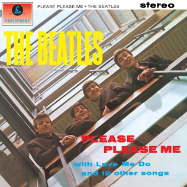

# Please Please Me

By **The Beatles**

## Album Data

- **Catalog:** Beets
- **Format:** Digital, Album
- **Album:** Please Please Me
- **Artist:** The Beatles
- **Albumartist:** The Beatles
- **Genre:** Rock And Roll
- **MusicBrainz Album Artist ID:** [b10bbbfc-cf9e-42e0-be17-e2c3e1d2600d](https://musicbrainz.org/artist/b10bbbfc-cf9e-42e0-be17-e2c3e1d2600d)
- **MusicBrainz Album ID:** [4a833aa5-0052-4997-b8fc-3db410e73914](https://musicbrainz.org/release/4a833aa5-0052-4997-b8fc-3db410e73914)
- **MusicBrainz Release Group ID:** [de208292-8db5-3aed-a14a-b37a84d8c521](https://musicbrainz.org/release-group/de208292-8db5-3aed-a14a-b37a84d8c521)
- **Year:** 2012
- **Catalog #:** PMC 7009
- **Label:** Parlophone
- **Total Tracks:** 14

## Album Tracks

### Track 01 - Taxman

- **Artist:** The Beatles
- **Format:** ALAC
- **Genre:** Psychedelic Rock
- **Length:** 2:39
- **MusicBrainz Track ID:** [3f8ea4a1-ecba-427f-b734-ef32ad7797be](https://musicbrainz.org/recording/3f8ea4a1-ecba-427f-b734-ef32ad7797be)
- **Title:** Taxman
- **Track:** 01
- **Year:** 1966

### Track 02 - Eleanor Rigby

- **Artist:** The Beatles
- **Format:** ALAC
- **Genre:** Rock
- **Length:** 2:07
- **MusicBrainz Track ID:** [59786ee1-e102-44f2-8fb0-83fc4f695eea](https://musicbrainz.org/recording/59786ee1-e102-44f2-8fb0-83fc4f695eea)
- **Title:** Eleanor Rigby
- **Track:** 02
- **Year:** 1966

### Track 03 - I’m Only Sleeping

- **Artist:** The Beatles
- **Format:** ALAC
- **Genre:** Psychedelic Rock
- **Length:** 3:01
- **MusicBrainz Track ID:** [596fb2f1-afef-4cb3-af5d-0bc6ff54e9c6](https://musicbrainz.org/recording/596fb2f1-afef-4cb3-af5d-0bc6ff54e9c6)
- **Title:** I’m Only Sleeping
- **Track:** 03
- **Year:** 1966

### Track 04 - Love You To

- **Artist:** The Beatles
- **Format:** ALAC
- **Genre:** Raga Rock
- **Length:** 3:01
- **MusicBrainz Track ID:** [70ad83b7-a623-44e5-b136-c9744e7f362d](https://musicbrainz.org/recording/70ad83b7-a623-44e5-b136-c9744e7f362d)
- **Title:** Love You To
- **Track:** 04
- **Year:** 1966

### Track 05 - Here, There and Everywhere

- **Artist:** The Beatles
- **Format:** ALAC
- **Genre:** Rock
- **Length:** 2:25
- **MusicBrainz Track ID:** [7924b407-872a-4a4a-a794-6606c52bf617](https://musicbrainz.org/recording/7924b407-872a-4a4a-a794-6606c52bf617)
- **Title:** Here, There and Everywhere
- **Track:** 05
- **Year:** 1966

### Track 06 - Yellow Submarine

- **Artist:** The Beatles
- **Format:** ALAC
- **Genre:** Psychedelic Rock
- **Length:** 2:40
- **MusicBrainz Track ID:** [4ef368ec-1715-488b-9724-1913e01edbae](https://musicbrainz.org/recording/4ef368ec-1715-488b-9724-1913e01edbae)
- **Title:** Yellow Submarine
- **Track:** 06
- **Year:** 1966

### Track 07 - She Said She Said

- **Artist:** The Beatles
- **Format:** ALAC
- **Genre:** Psychedelic Rock
- **Length:** 2:37
- **MusicBrainz Track ID:** [9d6ed009-9a63-4076-9053-6ae615a464a2](https://musicbrainz.org/recording/9d6ed009-9a63-4076-9053-6ae615a464a2)
- **Title:** She Said She Said
- **Track:** 07
- **Year:** 1966

### Track 08 - Good Day Sunshine

- **Artist:** The Beatles
- **Format:** ALAC
- **Genre:** Psychedelic Rock
- **Length:** 2:09
- **MusicBrainz Track ID:** [fb9abe2b-e216-41e6-a465-1a939197c8a5](https://musicbrainz.org/recording/fb9abe2b-e216-41e6-a465-1a939197c8a5)
- **Title:** Good Day Sunshine
- **Track:** 08
- **Year:** 1966

### Track 09 - And Your Bird Can Sing

- **Artist:** The Beatles
- **Format:** ALAC
- **Genre:** Psychedelic Rock
- **Length:** 2:01
- **MusicBrainz Track ID:** [aa0561dd-620c-4ee1-bc59-3e78f61f9526](https://musicbrainz.org/recording/aa0561dd-620c-4ee1-bc59-3e78f61f9526)
- **Title:** And Your Bird Can Sing
- **Track:** 09
- **Year:** 1966

### Track 10 - For No One

- **Artist:** The Beatles
- **Format:** ALAC
- **Genre:** Baroque Pop
- **Length:** 2:01
- **MusicBrainz Track ID:** [7e0caa7b-67c0-4ea8-a0e1-73208c28e598](https://musicbrainz.org/recording/7e0caa7b-67c0-4ea8-a0e1-73208c28e598)
- **Title:** For No One
- **Track:** 10
- **Year:** 1966

### Track 11 - Doctor Robert

- **Artist:** The Beatles
- **Format:** ALAC
- **Genre:** Rock And Roll
- **Length:** 2:15
- **MusicBrainz Track ID:** [9de5674f-db98-49d0-bc7a-d5ce048b0966](https://musicbrainz.org/recording/9de5674f-db98-49d0-bc7a-d5ce048b0966)
- **Title:** Doctor Robert
- **Track:** 11
- **Year:** 1966

### Track 12 - I Want to Tell You

- **Artist:** The Beatles
- **Format:** ALAC
- **Genre:** Rock And Roll
- **Length:** 2:29
- **MusicBrainz Track ID:** [44cc8631-dc55-43c2-a9c0-f987a06dd3c1](https://musicbrainz.org/recording/44cc8631-dc55-43c2-a9c0-f987a06dd3c1)
- **Title:** I Want to Tell You
- **Track:** 12
- **Year:** 1966

### Track 13 - Got to Get You Into My Life

- **Artist:** The Beatles
- **Format:** ALAC
- **Genre:** Pop Rock
- **Length:** 2:30
- **MusicBrainz Track ID:** [2e942ee0-8191-4a04-a789-2d559a08f886](https://musicbrainz.org/recording/2e942ee0-8191-4a04-a789-2d559a08f886)
- **Title:** Got to Get You Into My Life
- **Track:** 13
- **Year:** 1966

### Track 14 - Tomorrow Never Knows

- **Artist:** The Beatles
- **Format:** ALAC
- **Genre:** Psychedelic Rock
- **Length:** 2:57
- **MusicBrainz Track ID:** [3db1ed20-fff9-491f-a7b1-0ea2f76ff9cd](https://musicbrainz.org/recording/3db1ed20-fff9-491f-a7b1-0ea2f76ff9cd)
- **Title:** Tomorrow Never Knows
- **Track:** 14
- **Year:** 1966

## See also

- [1 [2015 Version]](1_[2015_Version].md)
- [1](1.md)
- [Abbey Road](Abbey_Road.md)
- [Anthology 1 [Disc 1]](Anthology_1_[Disc_1].md)
- [Anthology 1 [Disc 2]](Anthology_1_[Disc_2].md)
- [Anthology 2 [Disc 2]](Anthology_2_[Disc_2].md)
- [Australia And Japan](Australia_And_Japan.md)
- [Beatles for Sale](Beatles_for_Sale.md)
- [Blackpool And Paris 1964-`65](Blackpool_And_Paris_1964-`65.md)
- [Help](Help.md)
- [Let It Be](Let_It_Be.md)
- [Live at the BBC](Live_at_the_BBC.md)
- [Love](Love.md)
- [New York, Miami And Philadelphia - The First And Second U.S. Tours](New_York__Miami_And_Philadelphia_-_The_First_And_Second_US_Tours.md)
- [Past Masters](Past_Masters.md)
- [Past Masters, Vol. 1](Past_Masters__Vol_1.md)
- [Past Masters Volume One](Past_Masters_Volume_One.md)
- [Real Love [US Single]](Real_Love_[US_Single].md)
- [Revolver](Revolver.md)
- [Rubber Soul](Rubber_Soul.md)
- [Sgt. Pepper’s Lonely Hearts Club Band](Sgt_Pepper’s_Lonely_Hearts_Club_Band.md)
- [The Beatles 1](The_Beatles_1.md)
- [The Beatles (White Album)](The_Beatles_White_Album.md)
- [The Lost Abbey Road Tapes 1962-'64](The_Lost_Abbey_Road_Tapes_1962-64.md)
- [The Lost BBC Tapes and Much More...](The_Lost_BBC_Tapes_and_Much_More.md)
- [The Lost Decca Audition Tapes](The_Lost_Decca_Audition_Tapes.md)
- [With The Beatles [2009 Stereo Remaster]](With_The_Beatles_[2009_Stereo_Remaster].md)
- [With The Beatles](With_The_Beatles.md)
- [CD: 1 (Cd & 2 Bluray Edition) (Disc 1)](../../CD/The_Beatles/1_Cd_and_2_Bluray_Edition_Disc_1.md)
- [CD: ](../../CD/The_Beatles/The_Beatles.md)
- [Roon: 1 (Remastered)](../../Roon/The_Beatles/1_Remastered.md)
- [Roon: Abbey Road (Super Deluxe Edition)](../../Roon/The_Beatles/Abbey_Road_Super_Deluxe_Edition.md)
- [Roon: A Hard Day's Night](../../Roon/The_Beatles/A_Hard_Days_Night.md)
- [Roon: Anthology 1](../../Roon/The_Beatles/Anthology_1.md)
- [Roon: Anthology 2](../../Roon/The_Beatles/Anthology_2.md)
- [Roon: Anthology 3](../../Roon/The_Beatles/Anthology_3.md)
- [Roon: Beatles for Sale](../../Roon/The_Beatles/Beatles_for_Sale.md)
- [Roon: Help!](../../Roon/The_Beatles/Help!.md)
- [Roon: Let It Be (Super Deluxe)](../../Roon/The_Beatles/Let_It_Be_Super_Deluxe.md)
- [Roon: Love](../../Roon/The_Beatles/Love.md)
- [Roon: Magical Mystery Tour (Remastered)](../../Roon/The_Beatles/Magical_Mystery_Tour_Remastered.md)
- [Roon: Past Masters](../../Roon/The_Beatles/Past_Masters.md)
- [Roon: Please Please Me](../../Roon/The_Beatles/Please_Please_Me.md)
- [Roon: Revolver (Remastered)](../../Roon/The_Beatles/Revolver_Remastered.md)
- [Roon: Revolver (Super Deluxe)](../../Roon/The_Beatles/Revolver_Super_Deluxe.md)
- [Roon: Rubber Soul (Remastered)](../../Roon/The_Beatles/Rubber_Soul_Remastered.md)
- [Roon: Sgt. Pepper's Lonely Hearts Club Band (Deluxe Anniversary Edition)](../../Roon/The_Beatles/Sgt_Peppers_Lonely_Hearts_Club_Band_Deluxe_Anniversary_Edition.md)
- [Roon: Sgt. Pepper's Lonely Hearts Club Band (Super Deluxe Edition)](../../Roon/The_Beatles/Sgt_Peppers_Lonely_Hearts_Club_Band_Super_Deluxe_Edition.md)
- [Roon: The Beatles 1962 - 1966 (Remastered)](../../Roon/The_Beatles/The_Beatles_1962_-_1966_Remastered.md)
- [Roon: The Beatles 1967 - 1970 (Remastered)](../../Roon/The_Beatles/The_Beatles_1967_-_1970_Remastered.md)
- [Roon: The Beatles (White Album) [Super Deluxe] (White Album / Super Deluxe)](../../Roon/The_Beatles/The_Beatles_White_Album_[Super_Deluxe]_White_Album_-_Super_Deluxe.md)
- [Roon: With The Beatles (Remastered)](../../Roon/The_Beatles/With_The_Beatles_Remastered.md)
- [Vinyl: Beatles '65](../../Vinyl/The_Beatles/Beatles_65.md)
- [Vinyl: Help! In Concert](../../Vinyl/The_Beatles/Help!_In_Concert.md)
- [Vinyl: Help! (Original Motion Picture Soundtrack)](../../Vinyl/The_Beatles/Help!_Original_Motion_Picture_Soundtrack.md)
- [Vinyl: Hey Jude](../../Vinyl/The_Beatles/Hey_Jude.md)
- [Vinyl: Introducing... The Beatles](../../Vinyl/The_Beatles/Introducing_The_Beatles.md)
- [Vinyl: Let It Be](../../Vinyl/The_Beatles/Let_It_Be.md)
- [Vinyl: Live In Paris '65](../../Vinyl/The_Beatles/Live_In_Paris_65.md)
- [Vinyl: Magical Mystery Tour](../../Vinyl/The_Beatles/Magical_Mystery_Tour.md)
- [Vinyl: Something New](../../Vinyl/The_Beatles/Something_New.md)
- [Vinyl: ](../../Vinyl/The_Beatles/The_Beatles_index.md)
- [Vinyl: The Beatles](../../Vinyl/The_Beatles/The_Beatles.md)
- [Vinyl: The Beatles' Second Album](../../Vinyl/The_Beatles/The_Beatles_Second_Album.md)
