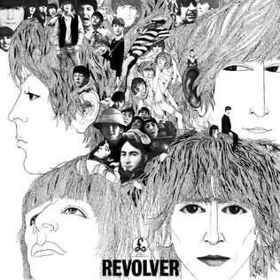

# Revolver

By **The Beatles**

## Album Data

- **Catalog:** Beets
- **Format:** Digital, Album
- **Album:** Revolver
- **Artist:** The Beatles
- **Albumartist:** The Beatles
- **Genre:** Psychedelic Rock
- **MusicBrainz Album Artist ID:** [b10bbbfc-cf9e-42e0-be17-e2c3e1d2600d](https://musicbrainz.org/artist/b10bbbfc-cf9e-42e0-be17-e2c3e1d2600d)
- **MusicBrainz Album ID:** [2b5a87b8-186f-4185-b8e5-566333e3058e](https://musicbrainz.org/release/2b5a87b8-186f-4185-b8e5-566333e3058e)
- **MusicBrainz Release Group ID:** [72d15666-99a7-321e-b1f3-a3f8c09dff9f](https://musicbrainz.org/release-group/72d15666-99a7-321e-b1f3-a3f8c09dff9f)
- **Year:** 1966
- **Catalog #:** PMC 1267
- **Label:** Parlophone
- **Total Tracks:** 14

## Album Tracks

### Track 01 - Drive My Car

- **Artist:** The Beatles
- **Format:** ALAC
- **Genre:** Rock And Roll
- **Length:** 2:30
- **MusicBrainz Track ID:** [d4424e10-8780-4848-8d34-51777902eb6d](https://musicbrainz.org/recording/d4424e10-8780-4848-8d34-51777902eb6d)
- **Title:** Drive My Car
- **Track:** 01
- **Year:** 1965

### Track 02 - Norwegian Wood (This Bird Has Flown)

- **Artist:** The Beatles
- **Format:** ALAC
- **Genre:** Psychedelic Rock
- **Length:** 2:05
- **MusicBrainz Track ID:** [72d50aa4-f537-4bbe-80bc-478ea8671cc1](https://musicbrainz.org/recording/72d50aa4-f537-4bbe-80bc-478ea8671cc1)
- **Title:** Norwegian Wood (This Bird Has Flown)
- **Track:** 02
- **Year:** 1965

### Track 03 - You Won’t See Me

- **Artist:** The Beatles
- **Format:** ALAC
- **Genre:** Pop Rock
- **Length:** 3:22
- **MusicBrainz Track ID:** [208a0b57-f858-4778-886b-2e8d1938bcb5](https://musicbrainz.org/recording/208a0b57-f858-4778-886b-2e8d1938bcb5)
- **Title:** You Won’t See Me
- **Track:** 03
- **Year:** 1965

### Track 04 - Nowhere Man

- **Artist:** The Beatles
- **Format:** ALAC
- **Genre:** Folk Rock
- **Length:** 2:44
- **MusicBrainz Track ID:** [684252b0-f52f-4e09-b81e-65aa84dfc20f](https://musicbrainz.org/recording/684252b0-f52f-4e09-b81e-65aa84dfc20f)
- **Title:** Nowhere Man
- **Track:** 04
- **Year:** 1965

### Track 05 - Think for Yourself

- **Artist:** The Beatles
- **Format:** ALAC
- **Genre:** Rock And Roll
- **Length:** 2:19
- **MusicBrainz Track ID:** [a76f7ab9-47f9-4df8-8bed-fc3895e26dba](https://musicbrainz.org/recording/a76f7ab9-47f9-4df8-8bed-fc3895e26dba)
- **Title:** Think for Yourself
- **Track:** 05
- **Year:** 1965

### Track 06 - The Word

- **Artist:** The Beatles
- **Format:** ALAC
- **Genre:** Rock And Roll
- **Length:** 2:43
- **MusicBrainz Track ID:** [d108d506-2c23-494a-b2dd-6608a8f8ef37](https://musicbrainz.org/recording/d108d506-2c23-494a-b2dd-6608a8f8ef37)
- **Title:** The Word
- **Track:** 06
- **Year:** 1965

### Track 07 - Michelle

- **Artist:** The Beatles
- **Format:** ALAC
- **Genre:** Rock
- **Length:** 2:42
- **MusicBrainz Track ID:** [7d240e37-7ef6-4d1f-a014-144836c16c17](https://musicbrainz.org/recording/7d240e37-7ef6-4d1f-a014-144836c16c17)
- **Title:** Michelle
- **Track:** 07
- **Year:** 1965

### Track 08 - What Goes On

- **Artist:** The Beatles
- **Format:** ALAC
- **Genre:** Folk Rock
- **Length:** 2:50
- **MusicBrainz Track ID:** [8a04074c-0022-4bb5-8017-e9d3654a7721](https://musicbrainz.org/recording/8a04074c-0022-4bb5-8017-e9d3654a7721)
- **Title:** What Goes On
- **Track:** 08
- **Year:** 1965

### Track 09 - Girl

- **Artist:** The Beatles
- **Format:** ALAC
- **Genre:** Folk Rock
- **Length:** 2:33
- **MusicBrainz Track ID:** [283b8e7f-3570-4d20-97b7-5e8a762bc661](https://musicbrainz.org/recording/283b8e7f-3570-4d20-97b7-5e8a762bc661)
- **Title:** Girl
- **Track:** 09
- **Year:** 1965

### Track 10 - I’m Looking Through You

- **Artist:** The Beatles
- **Format:** ALAC
- **Genre:** Pop Rock
- **Length:** 2:27
- **MusicBrainz Track ID:** [85becf82-9888-41fe-b1c7-e5c3bba04158](https://musicbrainz.org/recording/85becf82-9888-41fe-b1c7-e5c3bba04158)
- **Title:** I’m Looking Through You
- **Track:** 10
- **Year:** 1965

### Track 11 - In My Life

- **Artist:** The Beatles
- **Format:** ALAC
- **Genre:** Rock
- **Length:** 2:27
- **MusicBrainz Track ID:** [08a5cc77-ce79-4875-859e-8c3d172a6d17](https://musicbrainz.org/recording/08a5cc77-ce79-4875-859e-8c3d172a6d17)
- **Title:** In My Life
- **Track:** 11
- **Year:** 1965

### Track 12 - Wait

- **Artist:** The Beatles
- **Format:** ALAC
- **Genre:** Pop Rock
- **Length:** 2:16
- **MusicBrainz Track ID:** [a211669d-a34f-4313-b1e9-a9cc21a4be27](https://musicbrainz.org/recording/a211669d-a34f-4313-b1e9-a9cc21a4be27)
- **Title:** Wait
- **Track:** 12
- **Year:** 1965

### Track 13 - If I Needed Someone

- **Artist:** The Beatles
- **Format:** ALAC
- **Genre:** Rock And Roll
- **Length:** 2:23
- **MusicBrainz Track ID:** [dc768ac9-2254-48d6-a66b-0b3d768f7d32](https://musicbrainz.org/recording/dc768ac9-2254-48d6-a66b-0b3d768f7d32)
- **Title:** If I Needed Someone
- **Track:** 13
- **Year:** 1965

### Track 14 - Run for Your Life

- **Artist:** The Beatles
- **Format:** ALAC
- **Genre:** Pop Rock
- **Length:** 2:18
- **MusicBrainz Track ID:** [22490513-92db-439d-80ba-5aaeb1ba9f17](https://musicbrainz.org/recording/22490513-92db-439d-80ba-5aaeb1ba9f17)
- **Title:** Run for Your Life
- **Track:** 14
- **Year:** 1965

## See also

- [1 [2015 Version]](1_[2015_Version].md)
- [1](1.md)
- [Abbey Road](Abbey_Road.md)
- [Anthology 1 [Disc 1]](Anthology_1_[Disc_1].md)
- [Anthology 1 [Disc 2]](Anthology_1_[Disc_2].md)
- [Anthology 2 [Disc 2]](Anthology_2_[Disc_2].md)
- [Australia And Japan](Australia_And_Japan.md)
- [Beatles for Sale](Beatles_for_Sale.md)
- [Blackpool And Paris 1964-`65](Blackpool_And_Paris_1964-`65.md)
- [Help](Help.md)
- [Let It Be](Let_It_Be.md)
- [Live at the BBC](Live_at_the_BBC.md)
- [Love](Love.md)
- [New York, Miami And Philadelphia - The First And Second U.S. Tours](New_York__Miami_And_Philadelphia_-_The_First_And_Second_US_Tours.md)
- [Past Masters](Past_Masters.md)
- [Past Masters, Vol. 1](Past_Masters__Vol_1.md)
- [Past Masters Volume One](Past_Masters_Volume_One.md)
- [Please Please Me](Please_Please_Me.md)
- [Real Love [US Single]](Real_Love_[US_Single].md)
- [Rubber Soul](Rubber_Soul.md)
- [Sgt. Pepper’s Lonely Hearts Club Band](Sgt_Pepper’s_Lonely_Hearts_Club_Band.md)
- [The Beatles 1](The_Beatles_1.md)
- [The Beatles (White Album)](The_Beatles_White_Album.md)
- [The Lost Abbey Road Tapes 1962-'64](The_Lost_Abbey_Road_Tapes_1962-64.md)
- [The Lost BBC Tapes and Much More...](The_Lost_BBC_Tapes_and_Much_More.md)
- [The Lost Decca Audition Tapes](The_Lost_Decca_Audition_Tapes.md)
- [With The Beatles [2009 Stereo Remaster]](With_The_Beatles_[2009_Stereo_Remaster].md)
- [With The Beatles](With_The_Beatles.md)
- [CD: 1 (Cd & 2 Bluray Edition) (Disc 1)](../../CD/The_Beatles/1_Cd_and_2_Bluray_Edition_Disc_1.md)
- [CD: ](../../CD/The_Beatles/The_Beatles.md)
- [Roon: 1 (Remastered)](../../Roon/The_Beatles/1_Remastered.md)
- [Roon: Abbey Road (Super Deluxe Edition)](../../Roon/The_Beatles/Abbey_Road_Super_Deluxe_Edition.md)
- [Roon: A Hard Day's Night](../../Roon/The_Beatles/A_Hard_Days_Night.md)
- [Roon: Anthology 1](../../Roon/The_Beatles/Anthology_1.md)
- [Roon: Anthology 2](../../Roon/The_Beatles/Anthology_2.md)
- [Roon: Anthology 3](../../Roon/The_Beatles/Anthology_3.md)
- [Roon: Beatles for Sale](../../Roon/The_Beatles/Beatles_for_Sale.md)
- [Roon: Help!](../../Roon/The_Beatles/Help!.md)
- [Roon: Let It Be (Super Deluxe)](../../Roon/The_Beatles/Let_It_Be_Super_Deluxe.md)
- [Roon: Love](../../Roon/The_Beatles/Love.md)
- [Roon: Magical Mystery Tour (Remastered)](../../Roon/The_Beatles/Magical_Mystery_Tour_Remastered.md)
- [Roon: Past Masters](../../Roon/The_Beatles/Past_Masters.md)
- [Roon: Please Please Me](../../Roon/The_Beatles/Please_Please_Me.md)
- [Roon: Revolver (Remastered)](../../Roon/The_Beatles/Revolver_Remastered.md)
- [Roon: Revolver (Super Deluxe)](../../Roon/The_Beatles/Revolver_Super_Deluxe.md)
- [Roon: Rubber Soul (Remastered)](../../Roon/The_Beatles/Rubber_Soul_Remastered.md)
- [Roon: Sgt. Pepper's Lonely Hearts Club Band (Deluxe Anniversary Edition)](../../Roon/The_Beatles/Sgt_Peppers_Lonely_Hearts_Club_Band_Deluxe_Anniversary_Edition.md)
- [Roon: Sgt. Pepper's Lonely Hearts Club Band (Super Deluxe Edition)](../../Roon/The_Beatles/Sgt_Peppers_Lonely_Hearts_Club_Band_Super_Deluxe_Edition.md)
- [Roon: The Beatles 1962 - 1966 (Remastered)](../../Roon/The_Beatles/The_Beatles_1962_-_1966_Remastered.md)
- [Roon: The Beatles 1967 - 1970 (Remastered)](../../Roon/The_Beatles/The_Beatles_1967_-_1970_Remastered.md)
- [Roon: The Beatles (White Album) [Super Deluxe] (White Album / Super Deluxe)](../../Roon/The_Beatles/The_Beatles_White_Album_[Super_Deluxe]_White_Album_-_Super_Deluxe.md)
- [Roon: With The Beatles (Remastered)](../../Roon/The_Beatles/With_The_Beatles_Remastered.md)
- [Vinyl: Beatles '65](../../Vinyl/The_Beatles/Beatles_65.md)
- [Vinyl: Help! In Concert](../../Vinyl/The_Beatles/Help!_In_Concert.md)
- [Vinyl: Help! (Original Motion Picture Soundtrack)](../../Vinyl/The_Beatles/Help!_Original_Motion_Picture_Soundtrack.md)
- [Vinyl: Hey Jude](../../Vinyl/The_Beatles/Hey_Jude.md)
- [Vinyl: Introducing... The Beatles](../../Vinyl/The_Beatles/Introducing_The_Beatles.md)
- [Vinyl: Let It Be](../../Vinyl/The_Beatles/Let_It_Be.md)
- [Vinyl: Live In Paris '65](../../Vinyl/The_Beatles/Live_In_Paris_65.md)
- [Vinyl: Magical Mystery Tour](../../Vinyl/The_Beatles/Magical_Mystery_Tour.md)
- [Vinyl: Something New](../../Vinyl/The_Beatles/Something_New.md)
- [Vinyl: ](../../Vinyl/The_Beatles/The_Beatles_index.md)
- [Vinyl: The Beatles](../../Vinyl/The_Beatles/The_Beatles.md)
- [Vinyl: The Beatles' Second Album](../../Vinyl/The_Beatles/The_Beatles_Second_Album.md)
