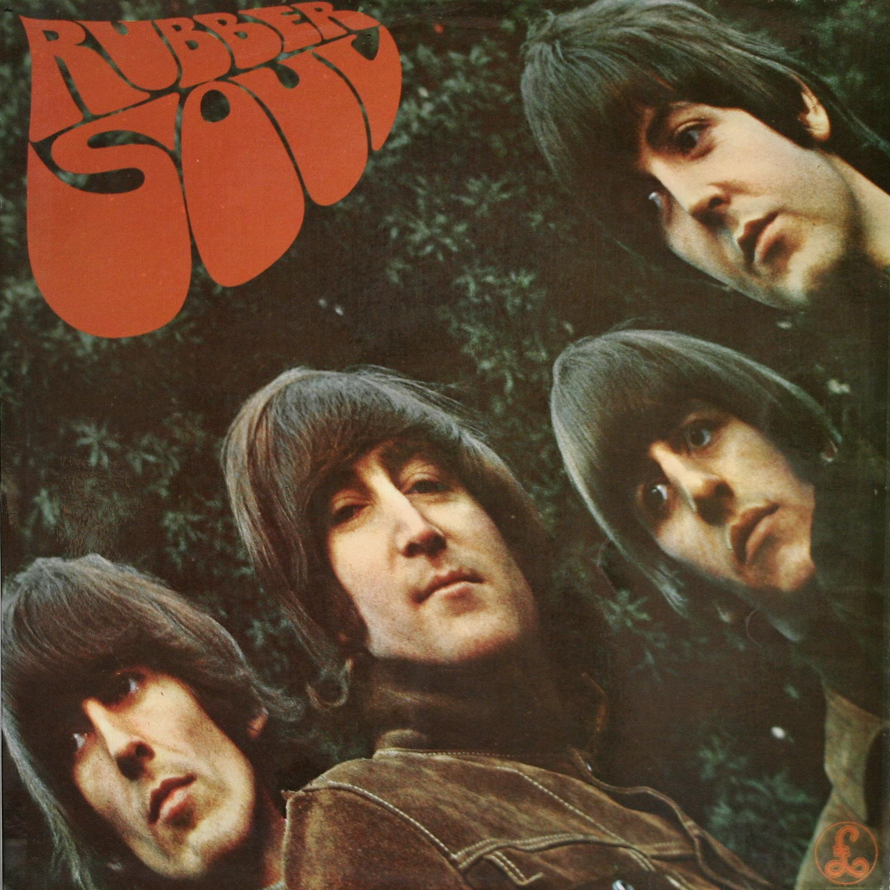

# Rubber Soul

By **The Beatles**

## Album Data

- **Catalog:** Beets
- **Format:** Digital, Album
- **Album:** Rubber Soul
- **Artist:** The Beatles
- **Albumartist:** The Beatles
- **Genre:** Pop Rock
- **MusicBrainz Album Artist ID:** [b10bbbfc-cf9e-42e0-be17-e2c3e1d2600d](https://musicbrainz.org/artist/b10bbbfc-cf9e-42e0-be17-e2c3e1d2600d)
- **MusicBrainz Album ID:** [288cd84a-a357-461c-98d6-745077837816](https://musicbrainz.org/release/288cd84a-a357-461c-98d6-745077837816)
- **MusicBrainz Release Group ID:** [dca03435-8adb-30a5-ba82-5a162267ff38](https://musicbrainz.org/release-group/dca03435-8adb-30a5-ba82-5a162267ff38)
- **Year:** 1965
- **Catalog #:** PCS 7027
- **Label:** Parlophone
- **Total Tracks:** 13

## Album Tracks

### Track 01 - Sgt. Pepper’s Lonely Hearts Club Band

- **Artist:** The Beatles
- **Format:** ALAC
- **Genre:** Psychedelic Rock
- **Length:** 2:02
- **MusicBrainz Track ID:** [3208833a-be90-4bc2-a9be-7fee4334f1cb](https://musicbrainz.org/recording/3208833a-be90-4bc2-a9be-7fee4334f1cb)
- **Title:** Sgt. Pepper’s Lonely Hearts Club Band
- **Track:** 01
- **Year:** 1967

### Track 02 - With a Little Help From My Friends

- **Artist:** The Beatles
- **Format:** ALAC
- **Genre:** Rock And Roll
- **Length:** 2:44
- **MusicBrainz Track ID:** [efe365d3-a1d8-42dc-a63d-0b4cc6ecfaed](https://musicbrainz.org/recording/efe365d3-a1d8-42dc-a63d-0b4cc6ecfaed)
- **Title:** With a Little Help From My Friends
- **Track:** 02
- **Year:** 1967

### Track 03 - Lucy in the Sky With Diamonds

- **Artist:** The Beatles
- **Format:** ALAC
- **Genre:** Psychedelic Rock
- **Length:** 3:28
- **MusicBrainz Track ID:** [23b342d3-1f0b-4a0b-a419-d873cec3b259](https://musicbrainz.org/recording/23b342d3-1f0b-4a0b-a419-d873cec3b259)
- **Title:** Lucy in the Sky With Diamonds
- **Track:** 03
- **Year:** 1967

### Track 04 - Getting Better

- **Artist:** The Beatles
- **Format:** ALAC
- **Genre:** Psychedelic Rock
- **Length:** 2:47
- **MusicBrainz Track ID:** [09cc4a63-7b90-4fda-aec4-b3d34cea4fdc](https://musicbrainz.org/recording/09cc4a63-7b90-4fda-aec4-b3d34cea4fdc)
- **Title:** Getting Better
- **Track:** 04
- **Year:** 1967

### Track 05 - Fixing a Hole

- **Artist:** The Beatles
- **Format:** ALAC
- **Genre:** Psychedelic Rock
- **Length:** 2:36
- **MusicBrainz Track ID:** [a2df7ff8-dbc0-4afa-9987-5379856ef37b](https://musicbrainz.org/recording/a2df7ff8-dbc0-4afa-9987-5379856ef37b)
- **Title:** Fixing a Hole
- **Track:** 05
- **Year:** 1967

### Track 06 - She’s Leaving Home

- **Artist:** The Beatles
- **Format:** ALAC
- **Genre:** Rock
- **Length:** 3:35
- **MusicBrainz Track ID:** [379ff193-71be-4675-87cf-28ed354f70e9](https://musicbrainz.org/recording/379ff193-71be-4675-87cf-28ed354f70e9)
- **Title:** She’s Leaving Home
- **Track:** 06
- **Year:** 1967

### Track 07 - Being for the Benefit of Mr. Kite!

- **Artist:** The Beatles
- **Format:** ALAC
- **Genre:** Psychedelic Rock
- **Length:** 2:37
- **MusicBrainz Track ID:** [dcaa123b-3510-4109-9646-4764bfb4f87e](https://musicbrainz.org/recording/dcaa123b-3510-4109-9646-4764bfb4f87e)
- **Title:** Being for the Benefit of Mr. Kite!
- **Track:** 07
- **Year:** 1967

### Track 08 - Within You Without You

- **Artist:** The Beatles
- **Format:** ALAC
- **Genre:** Psychedelic Rock
- **Length:** 5:05
- **MusicBrainz Track ID:** [baf24999-4f60-4512-895c-dd27b0b06e39](https://musicbrainz.org/recording/baf24999-4f60-4512-895c-dd27b0b06e39)
- **Title:** Within You Without You
- **Track:** 08
- **Year:** 1967

### Track 09 - When I’m Sixty‐Four

- **Artist:** The Beatles
- **Format:** ALAC
- **Genre:** Rock
- **Length:** 2:37
- **MusicBrainz Track ID:** [ead437b8-ea12-494a-a9db-fb7b92b0367d](https://musicbrainz.org/recording/ead437b8-ea12-494a-a9db-fb7b92b0367d)
- **Title:** When I’m Sixty‐Four
- **Track:** 09
- **Year:** 1967

### Track 10 - Lovely Rita

- **Artist:** The Beatles
- **Format:** ALAC
- **Genre:** Psychedelic Rock
- **Length:** 2:42
- **MusicBrainz Track ID:** [057db5ae-ce60-4233-a43f-bc5707c922bf](https://musicbrainz.org/recording/057db5ae-ce60-4233-a43f-bc5707c922bf)
- **Title:** Lovely Rita
- **Track:** 10
- **Year:** 1967

### Track 11 - Good Morning Good Morning

- **Artist:** The Beatles
- **Format:** ALAC
- **Genre:** Psychedelic Rock
- **Length:** 2:41
- **MusicBrainz Track ID:** [ca332845-e989-4a7a-a04d-1d803b94d34c](https://musicbrainz.org/recording/ca332845-e989-4a7a-a04d-1d803b94d34c)
- **Title:** Good Morning Good Morning
- **Track:** 11
- **Year:** 1967

### Track 12 - Sgt. Pepper’s Lonely Hearts Club Band (reprise)

- **Artist:** The Beatles
- **Format:** ALAC
- **Genre:** Rock
- **Length:** 1:18
- **MusicBrainz Track ID:** [f424e666-a02e-4e52-9257-93574f6f67a0](https://musicbrainz.org/recording/f424e666-a02e-4e52-9257-93574f6f67a0)
- **Title:** Sgt. Pepper’s Lonely Hearts Club Band (reprise)
- **Track:** 12
- **Year:** 1967

### Track 13 - A Day in the Life

- **Artist:** The Beatles
- **Format:** ALAC
- **Genre:** Psychedelic Rock
- **Length:** 5:33
- **MusicBrainz Track ID:** [17c75743-6fc2-4c72-8152-25c5b45dfea7](https://musicbrainz.org/recording/17c75743-6fc2-4c72-8152-25c5b45dfea7)
- **Title:** A Day in the Life
- **Track:** 13
- **Year:** 1967

## See also

- [1 [2015 Version]](1_[2015_Version].md)
- [1](1.md)
- [Abbey Road](Abbey_Road.md)
- [Anthology 1 [Disc 1]](Anthology_1_[Disc_1].md)
- [Anthology 1 [Disc 2]](Anthology_1_[Disc_2].md)
- [Anthology 2 [Disc 2]](Anthology_2_[Disc_2].md)
- [Australia And Japan](Australia_And_Japan.md)
- [Beatles for Sale](Beatles_for_Sale.md)
- [Blackpool And Paris 1964-`65](Blackpool_And_Paris_1964-`65.md)
- [Help](Help.md)
- [Let It Be](Let_It_Be.md)
- [Live at the BBC](Live_at_the_BBC.md)
- [Love](Love.md)
- [New York, Miami And Philadelphia - The First And Second U.S. Tours](New_York__Miami_And_Philadelphia_-_The_First_And_Second_US_Tours.md)
- [Past Masters](Past_Masters.md)
- [Past Masters, Vol. 1](Past_Masters__Vol_1.md)
- [Past Masters Volume One](Past_Masters_Volume_One.md)
- [Please Please Me](Please_Please_Me.md)
- [Real Love [US Single]](Real_Love_[US_Single].md)
- [Revolver](Revolver.md)
- [Sgt. Pepper’s Lonely Hearts Club Band](Sgt_Pepper’s_Lonely_Hearts_Club_Band.md)
- [The Beatles 1](The_Beatles_1.md)
- [The Beatles (White Album)](The_Beatles_White_Album.md)
- [The Lost Abbey Road Tapes 1962-'64](The_Lost_Abbey_Road_Tapes_1962-64.md)
- [The Lost BBC Tapes and Much More...](The_Lost_BBC_Tapes_and_Much_More.md)
- [The Lost Decca Audition Tapes](The_Lost_Decca_Audition_Tapes.md)
- [With The Beatles [2009 Stereo Remaster]](With_The_Beatles_[2009_Stereo_Remaster].md)
- [With The Beatles](With_The_Beatles.md)
- [CD: 1 (Cd & 2 Bluray Edition) (Disc 1)](../../CD/The_Beatles/1_Cd_and_2_Bluray_Edition_Disc_1.md)
- [CD: ](../../CD/The_Beatles/The_Beatles.md)
- [Roon: 1 (Remastered)](../../Roon/The_Beatles/1_Remastered.md)
- [Roon: Abbey Road (Super Deluxe Edition)](../../Roon/The_Beatles/Abbey_Road_Super_Deluxe_Edition.md)
- [Roon: A Hard Day's Night](../../Roon/The_Beatles/A_Hard_Days_Night.md)
- [Roon: Anthology 1](../../Roon/The_Beatles/Anthology_1.md)
- [Roon: Anthology 2](../../Roon/The_Beatles/Anthology_2.md)
- [Roon: Anthology 3](../../Roon/The_Beatles/Anthology_3.md)
- [Roon: Beatles for Sale](../../Roon/The_Beatles/Beatles_for_Sale.md)
- [Roon: Help!](../../Roon/The_Beatles/Help!.md)
- [Roon: Let It Be (Super Deluxe)](../../Roon/The_Beatles/Let_It_Be_Super_Deluxe.md)
- [Roon: Love](../../Roon/The_Beatles/Love.md)
- [Roon: Magical Mystery Tour (Remastered)](../../Roon/The_Beatles/Magical_Mystery_Tour_Remastered.md)
- [Roon: Past Masters](../../Roon/The_Beatles/Past_Masters.md)
- [Roon: Please Please Me](../../Roon/The_Beatles/Please_Please_Me.md)
- [Roon: Revolver (Remastered)](../../Roon/The_Beatles/Revolver_Remastered.md)
- [Roon: Revolver (Super Deluxe)](../../Roon/The_Beatles/Revolver_Super_Deluxe.md)
- [Roon: Rubber Soul (Remastered)](../../Roon/The_Beatles/Rubber_Soul_Remastered.md)
- [Roon: Sgt. Pepper's Lonely Hearts Club Band (Deluxe Anniversary Edition)](../../Roon/The_Beatles/Sgt_Peppers_Lonely_Hearts_Club_Band_Deluxe_Anniversary_Edition.md)
- [Roon: Sgt. Pepper's Lonely Hearts Club Band (Super Deluxe Edition)](../../Roon/The_Beatles/Sgt_Peppers_Lonely_Hearts_Club_Band_Super_Deluxe_Edition.md)
- [Roon: The Beatles 1962 - 1966 (Remastered)](../../Roon/The_Beatles/The_Beatles_1962_-_1966_Remastered.md)
- [Roon: The Beatles 1967 - 1970 (Remastered)](../../Roon/The_Beatles/The_Beatles_1967_-_1970_Remastered.md)
- [Roon: The Beatles (White Album) [Super Deluxe] (White Album / Super Deluxe)](../../Roon/The_Beatles/The_Beatles_White_Album_[Super_Deluxe]_White_Album_-_Super_Deluxe.md)
- [Roon: With The Beatles (Remastered)](../../Roon/The_Beatles/With_The_Beatles_Remastered.md)
- [Vinyl: Beatles '65](../../Vinyl/The_Beatles/Beatles_65.md)
- [Vinyl: Help! In Concert](../../Vinyl/The_Beatles/Help!_In_Concert.md)
- [Vinyl: Help! (Original Motion Picture Soundtrack)](../../Vinyl/The_Beatles/Help!_Original_Motion_Picture_Soundtrack.md)
- [Vinyl: Hey Jude](../../Vinyl/The_Beatles/Hey_Jude.md)
- [Vinyl: Introducing... The Beatles](../../Vinyl/The_Beatles/Introducing_The_Beatles.md)
- [Vinyl: Let It Be](../../Vinyl/The_Beatles/Let_It_Be.md)
- [Vinyl: Live In Paris '65](../../Vinyl/The_Beatles/Live_In_Paris_65.md)
- [Vinyl: Magical Mystery Tour](../../Vinyl/The_Beatles/Magical_Mystery_Tour.md)
- [Vinyl: Something New](../../Vinyl/The_Beatles/Something_New.md)
- [Vinyl: ](../../Vinyl/The_Beatles/The_Beatles_index.md)
- [Vinyl: The Beatles](../../Vinyl/The_Beatles/The_Beatles.md)
- [Vinyl: The Beatles' Second Album](../../Vinyl/The_Beatles/The_Beatles_Second_Album.md)
