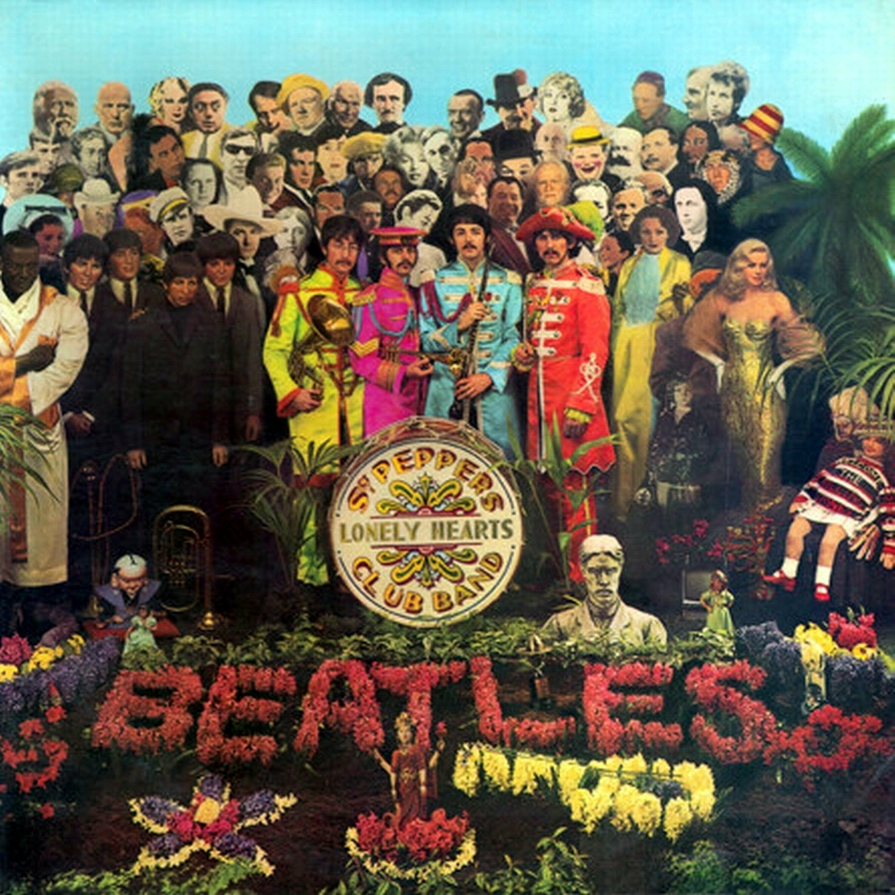

# Sgt. Pepper’s Lonely Hearts Club Band

By **The Beatles**

## Album Data

- **Catalog:** Beets
- **Format:** Digital, Album
- **Album:** Sgt. Pepper’s Lonely Hearts Club Band
- **Artist:** The Beatles
- **Albumartist:** The Beatles
- **Genre:** Rock
- **MusicBrainz Album Artist ID:** [b10bbbfc-cf9e-42e0-be17-e2c3e1d2600d](https://musicbrainz.org/artist/b10bbbfc-cf9e-42e0-be17-e2c3e1d2600d)
- **MusicBrainz Album ID:** [aa86fb96-d1cc-3ce9-b916-166e9a689f22](https://musicbrainz.org/release/aa86fb96-d1cc-3ce9-b916-166e9a689f22)
- **MusicBrainz Release Group ID:** [9f7a4c28-8fa2-3113-929c-c47a9f7982c3](https://musicbrainz.org/release-group/9f7a4c28-8fa2-3113-929c-c47a9f7982c3)
- **Year:** 1967
- **Catalog #:** 
- **Label:** EMI Catalogue
- **Total Tracks:** 14

## Album Tracks

### Track 01 - It Won’t Be Long

- **Artist:** The Beatles
- **Format:** MP3
- **Genre:** Rock And Roll
- **Length:** 2:13
- **MusicBrainz Track ID:** [d51d3d1f-7f92-4a8b-91df-f37c3a93d145](https://musicbrainz.org/recording/d51d3d1f-7f92-4a8b-91df-f37c3a93d145)
- **Title:** It Won’t Be Long
- **Track:** 01
- **Year:** 2015

### Track 02 - All I’ve Got to Do

- **Artist:** The Beatles
- **Format:** MP3
- **Genre:** Rock And Roll
- **Length:** 2:02
- **MusicBrainz Track ID:** [3129b2ee-03fe-477c-92f7-e275b96f5071](https://musicbrainz.org/recording/3129b2ee-03fe-477c-92f7-e275b96f5071)
- **Title:** All I’ve Got to Do
- **Track:** 02
- **Year:** 2015

### Track 03 - All My Loving

- **Artist:** The Beatles
- **Format:** MP3
- **Genre:** Rock
- **Length:** 2:07
- **MusicBrainz Track ID:** [a7a373f1-b996-4017-81f8-9e3276522f25](https://musicbrainz.org/recording/a7a373f1-b996-4017-81f8-9e3276522f25)
- **Title:** All My Loving
- **Track:** 03
- **Year:** 2015

### Track 04 - Don’t Bother Me

- **Artist:** The Beatles
- **Format:** MP3
- **Genre:** Rock And Roll
- **Length:** 2:28
- **MusicBrainz Track ID:** [ae2c5d82-1295-4f2a-8680-8bd42e61281a](https://musicbrainz.org/recording/ae2c5d82-1295-4f2a-8680-8bd42e61281a)
- **Title:** Don’t Bother Me
- **Track:** 04
- **Year:** 2015

### Track 05 - Little Child

- **Artist:** The Beatles
- **Format:** MP3
- **Genre:** Rock And Roll
- **Length:** 1:46
- **MusicBrainz Track ID:** [542e40c8-f83c-430b-bd44-d0c20e9b8c92](https://musicbrainz.org/recording/542e40c8-f83c-430b-bd44-d0c20e9b8c92)
- **Title:** Little Child
- **Track:** 05
- **Year:** 2015

### Track 06 - Till There Was You

- **Artist:** The Beatles
- **Format:** MP3
- **Genre:** Rock And Roll
- **Length:** 2:13
- **MusicBrainz Track ID:** [7d61f681-36ea-44cf-9de1-84c0241de96d](https://musicbrainz.org/recording/7d61f681-36ea-44cf-9de1-84c0241de96d)
- **Title:** Till There Was You
- **Track:** 06
- **Year:** 2015

### Track 07 - Please Mister Postman

- **Artist:** The Beatles
- **Format:** MP3
- **Genre:** Rock And Roll
- **Length:** 2:34
- **MusicBrainz Track ID:** [62ebf874-f6ba-4df9-9a4a-944aebf1f07b](https://musicbrainz.org/recording/62ebf874-f6ba-4df9-9a4a-944aebf1f07b)
- **Title:** Please Mister Postman
- **Track:** 07
- **Year:** 2015

### Track 08 - Roll Over Beethoven

- **Artist:** The Beatles
- **Format:** MP3
- **Genre:** Rock And Roll
- **Length:** 2:45
- **MusicBrainz Track ID:** [e44e7ccd-3297-48ed-8611-0beb6087d92d](https://musicbrainz.org/recording/e44e7ccd-3297-48ed-8611-0beb6087d92d)
- **Title:** Roll Over Beethoven
- **Track:** 08
- **Year:** 2015

### Track 09 - Hold Me Tight

- **Artist:** The Beatles
- **Format:** MP3
- **Genre:** Rock And Roll
- **Length:** 2:31
- **MusicBrainz Track ID:** [47c5356f-b40f-4369-82d4-b0238eb78f6a](https://musicbrainz.org/recording/47c5356f-b40f-4369-82d4-b0238eb78f6a)
- **Title:** Hold Me Tight
- **Track:** 09
- **Year:** 2015

### Track 10 - You Really Got a Hold on Me

- **Artist:** The Beatles
- **Format:** MP3
- **Genre:** Rock
- **Length:** 3:01
- **MusicBrainz Track ID:** [4dc2450f-4353-441f-baa4-e3b0d31562fa](https://musicbrainz.org/recording/4dc2450f-4353-441f-baa4-e3b0d31562fa)
- **Title:** You Really Got a Hold on Me
- **Track:** 10
- **Year:** 2015

### Track 11 - I Wanna Be Your Man

- **Artist:** The Beatles
- **Format:** MP3
- **Genre:** Pop Rock
- **Length:** 1:59
- **MusicBrainz Track ID:** [573b70bd-9ac3-4600-8092-00e483046d3e](https://musicbrainz.org/recording/573b70bd-9ac3-4600-8092-00e483046d3e)
- **Title:** I Wanna Be Your Man
- **Track:** 11
- **Year:** 2015

### Track 12 - Devil in Her Heart

- **Artist:** The Beatles
- **Format:** MP3
- **Genre:** Rock And Roll
- **Length:** 2:26
- **MusicBrainz Track ID:** [8b090b49-76a0-4ef0-8270-22ccc60b272f](https://musicbrainz.org/recording/8b090b49-76a0-4ef0-8270-22ccc60b272f)
- **Title:** Devil in Her Heart
- **Track:** 12
- **Year:** 2015

### Track 13 - Not a Second Time

- **Artist:** The Beatles
- **Format:** MP3
- **Genre:** Pop Rock
- **Length:** 2:06
- **MusicBrainz Track ID:** [02e355fc-e422-4aa3-acfa-089c35ecc128](https://musicbrainz.org/recording/02e355fc-e422-4aa3-acfa-089c35ecc128)
- **Title:** Not a Second Time
- **Track:** 13
- **Year:** 2015

### Track 14 - Money (That’s What I Want)

- **Artist:** The Beatles
- **Format:** MP3
- **Genre:** Rock And Roll
- **Length:** 2:49
- **MusicBrainz Track ID:** [efc73dc2-b2a5-451b-95a8-1712009005a4](https://musicbrainz.org/recording/efc73dc2-b2a5-451b-95a8-1712009005a4)
- **Title:** Money (That’s What I Want)
- **Track:** 14
- **Year:** 2015

## See also

- [1 [2015 Version]](1_[2015_Version].md)
- [1](1.md)
- [Abbey Road](Abbey_Road.md)
- [Anthology 1 [Disc 1]](Anthology_1_[Disc_1].md)
- [Anthology 1 [Disc 2]](Anthology_1_[Disc_2].md)
- [Anthology 2 [Disc 2]](Anthology_2_[Disc_2].md)
- [Australia And Japan](Australia_And_Japan.md)
- [Beatles for Sale](Beatles_for_Sale.md)
- [Blackpool And Paris 1964-`65](Blackpool_And_Paris_1964-`65.md)
- [Help](Help.md)
- [Let It Be](Let_It_Be.md)
- [Live at the BBC](Live_at_the_BBC.md)
- [Love](Love.md)
- [New York, Miami And Philadelphia - The First And Second U.S. Tours](New_York__Miami_And_Philadelphia_-_The_First_And_Second_US_Tours.md)
- [Past Masters](Past_Masters.md)
- [Past Masters, Vol. 1](Past_Masters__Vol_1.md)
- [Past Masters Volume One](Past_Masters_Volume_One.md)
- [Please Please Me](Please_Please_Me.md)
- [Real Love [US Single]](Real_Love_[US_Single].md)
- [Revolver](Revolver.md)
- [Rubber Soul](Rubber_Soul.md)
- [The Beatles 1](The_Beatles_1.md)
- [The Beatles (White Album)](The_Beatles_White_Album.md)
- [The Lost Abbey Road Tapes 1962-'64](The_Lost_Abbey_Road_Tapes_1962-64.md)
- [The Lost BBC Tapes and Much More...](The_Lost_BBC_Tapes_and_Much_More.md)
- [The Lost Decca Audition Tapes](The_Lost_Decca_Audition_Tapes.md)
- [With The Beatles [2009 Stereo Remaster]](With_The_Beatles_[2009_Stereo_Remaster].md)
- [With The Beatles](With_The_Beatles.md)
- [CD: 1 (Cd & 2 Bluray Edition) (Disc 1)](../../CD/The_Beatles/1_Cd_and_2_Bluray_Edition_Disc_1.md)
- [CD: ](../../CD/The_Beatles/The_Beatles.md)
- [Roon: 1 (Remastered)](../../Roon/The_Beatles/1_Remastered.md)
- [Roon: Abbey Road (Super Deluxe Edition)](../../Roon/The_Beatles/Abbey_Road_Super_Deluxe_Edition.md)
- [Roon: A Hard Day's Night](../../Roon/The_Beatles/A_Hard_Days_Night.md)
- [Roon: Anthology 1](../../Roon/The_Beatles/Anthology_1.md)
- [Roon: Anthology 2](../../Roon/The_Beatles/Anthology_2.md)
- [Roon: Anthology 3](../../Roon/The_Beatles/Anthology_3.md)
- [Roon: Beatles for Sale](../../Roon/The_Beatles/Beatles_for_Sale.md)
- [Roon: Help!](../../Roon/The_Beatles/Help!.md)
- [Roon: Let It Be (Super Deluxe)](../../Roon/The_Beatles/Let_It_Be_Super_Deluxe.md)
- [Roon: Love](../../Roon/The_Beatles/Love.md)
- [Roon: Magical Mystery Tour (Remastered)](../../Roon/The_Beatles/Magical_Mystery_Tour_Remastered.md)
- [Roon: Past Masters](../../Roon/The_Beatles/Past_Masters.md)
- [Roon: Please Please Me](../../Roon/The_Beatles/Please_Please_Me.md)
- [Roon: Revolver (Remastered)](../../Roon/The_Beatles/Revolver_Remastered.md)
- [Roon: Revolver (Super Deluxe)](../../Roon/The_Beatles/Revolver_Super_Deluxe.md)
- [Roon: Rubber Soul (Remastered)](../../Roon/The_Beatles/Rubber_Soul_Remastered.md)
- [Roon: Sgt. Pepper's Lonely Hearts Club Band (Deluxe Anniversary Edition)](../../Roon/The_Beatles/Sgt_Peppers_Lonely_Hearts_Club_Band_Deluxe_Anniversary_Edition.md)
- [Roon: Sgt. Pepper's Lonely Hearts Club Band (Super Deluxe Edition)](../../Roon/The_Beatles/Sgt_Peppers_Lonely_Hearts_Club_Band_Super_Deluxe_Edition.md)
- [Roon: The Beatles 1962 - 1966 (Remastered)](../../Roon/The_Beatles/The_Beatles_1962_-_1966_Remastered.md)
- [Roon: The Beatles 1967 - 1970 (Remastered)](../../Roon/The_Beatles/The_Beatles_1967_-_1970_Remastered.md)
- [Roon: The Beatles (White Album) [Super Deluxe] (White Album / Super Deluxe)](../../Roon/The_Beatles/The_Beatles_White_Album_[Super_Deluxe]_White_Album_-_Super_Deluxe.md)
- [Roon: With The Beatles (Remastered)](../../Roon/The_Beatles/With_The_Beatles_Remastered.md)
- [Vinyl: Beatles '65](../../Vinyl/The_Beatles/Beatles_65.md)
- [Vinyl: Help! In Concert](../../Vinyl/The_Beatles/Help!_In_Concert.md)
- [Vinyl: Help! (Original Motion Picture Soundtrack)](../../Vinyl/The_Beatles/Help!_Original_Motion_Picture_Soundtrack.md)
- [Vinyl: Hey Jude](../../Vinyl/The_Beatles/Hey_Jude.md)
- [Vinyl: Introducing... The Beatles](../../Vinyl/The_Beatles/Introducing_The_Beatles.md)
- [Vinyl: Let It Be](../../Vinyl/The_Beatles/Let_It_Be.md)
- [Vinyl: Live In Paris '65](../../Vinyl/The_Beatles/Live_In_Paris_65.md)
- [Vinyl: Magical Mystery Tour](../../Vinyl/The_Beatles/Magical_Mystery_Tour.md)
- [Vinyl: Something New](../../Vinyl/The_Beatles/Something_New.md)
- [Vinyl: ](../../Vinyl/The_Beatles/The_Beatles_index.md)
- [Vinyl: The Beatles](../../Vinyl/The_Beatles/The_Beatles.md)
- [Vinyl: The Beatles' Second Album](../../Vinyl/The_Beatles/The_Beatles_Second_Album.md)
