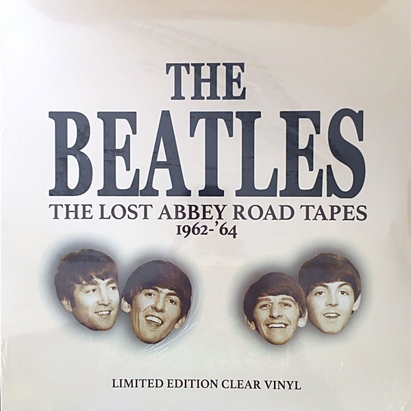

# The Lost Abbey Road Tapes 1962-'64

By **The Beatles**

## Album Data

- **Catalog:** Beets
- **Format:** Digital, Album
- **Album:** The Lost Abbey Road Tapes 1962-'64
- **Artist:** The Beatles
- **Albumartist:** The Beatles
- **Genre:** Rock
- **MusicBrainz Album Artist ID:** 
- **MusicBrainz Album ID:** 
- **MusicBrainz Release Group ID:** 
- **Year:** 2016
- **Catalog #:** 
- **Label:** 
- **Total Tracks:** 22

## Album Tracks

### Track 01 - I Saw Her Standing There (BBC Saturday Club; 15 March 1963)

- **Artist:** The Beatles
- **Format:** ALAC
- **Genre:** Rock
- **Length:** 2:36
- **MusicBrainz Track ID:** 
- **Title:** I Saw Her Standing There (BBC Saturday Club; 15 March 1963)
- **Track:** 01
- **Year:** 2016

### Track 02 - Misery (BBC Saturday Club; 15 March 1963)

- **Artist:** The Beatles
- **Format:** ALAC
- **Genre:** Rock
- **Length:** 1:45
- **MusicBrainz Track ID:** 
- **Title:** Misery (BBC Saturday Club; 15 March 1963)
- **Track:** 02
- **Year:** 2016

### Track 03 - Too Much Monkey Business (BBC Saturday Club; 15 March 1963)

- **Artist:** The Beatles
- **Format:** ALAC
- **Genre:** Rock
- **Length:** 1:52
- **MusicBrainz Track ID:** 
- **Title:** Too Much Monkey Business (BBC Saturday Club; 15 March 1963)
- **Track:** 03
- **Year:** 2016

### Track 04 - I'm Talking About You (BBC Saturday Club; 15 March 1963)

- **Artist:** The Beatles
- **Format:** ALAC
- **Genre:** Rock
- **Length:** 1:51
- **MusicBrainz Track ID:** 
- **Title:** I'm Talking About You (BBC Saturday Club; 15 March 1963)
- **Track:** 04
- **Year:** 2016

### Track 05 - Please Please Me (BBC Saturday Club; 15 March 1963)

- **Artist:** The Beatles
- **Format:** ALAC
- **Genre:** Rock
- **Length:** 1:52
- **MusicBrainz Track ID:** 
- **Title:** Please Please Me (BBC Saturday Club; 15 March 1963)
- **Track:** 05
- **Year:** 2016

### Track 06 - Hippy Hippy Shake (BBC Saturday Club; 15 March 1963)

- **Artist:** The Beatles
- **Format:** ALAC
- **Genre:** Rock
- **Length:** 1:42
- **MusicBrainz Track ID:** 
- **Title:** Hippy Hippy Shake (BBC Saturday Club; 15 March 1963)
- **Track:** 06
- **Year:** 2016

### Track 07 - She Loves You (Stockholm; 1964)

- **Artist:** The Beatles
- **Format:** ALAC
- **Genre:** Rock
- **Length:** 2:30
- **MusicBrainz Track ID:** 
- **Title:** She Loves You (Stockholm; 1964)
- **Track:** 07
- **Year:** 2016

### Track 08 - Twist and Shout (Stockholm; 1964)

- **Artist:** The Beatles
- **Format:** ALAC
- **Genre:** Rock
- **Length:** 2:47
- **MusicBrainz Track ID:** 
- **Title:** Twist and Shout (Stockholm; 1964)
- **Track:** 08
- **Year:** 2016

### Track 09 - From Me To You (Stockholm; 1964)

- **Artist:** The Beatles
- **Format:** ALAC
- **Genre:** Rock
- **Length:** 2:22
- **MusicBrainz Track ID:** 
- **Title:** From Me To You (Stockholm; 1964)
- **Track:** 09
- **Year:** 2016

### Track 10 - I'll Get You (London Palladium; 13 Oct 1963)

- **Artist:** The Beatles
- **Format:** ALAC
- **Genre:** Rock
- **Length:** 2:23
- **MusicBrainz Track ID:** 
- **Title:** I'll Get You (London Palladium; 13 Oct 1963)
- **Track:** 10
- **Year:** 2016

### Track 11 - She Loves You (London Palladium; 13 Oct 1963)

- **Artist:** The Beatles
- **Format:** ALAC
- **Genre:** Rock
- **Length:** 3:33
- **MusicBrainz Track ID:** 
- **Title:** She Loves You (London Palladium; 13 Oct 1963)
- **Track:** 11
- **Year:** 2016

### Track 12 - Twist and Shout (London Palladium; 13 Oct 1963)

- **Artist:** The Beatles
- **Format:** ALAC
- **Genre:** Rock
- **Length:** 3:17
- **MusicBrainz Track ID:** 
- **Title:** Twist and Shout (London Palladium; 13 Oct 1963)
- **Track:** 12
- **Year:** 2016

### Track 13 - I Want To Hold Your Hand (London Palladium; 12 Jan 1964)

- **Artist:** The Beatles
- **Format:** ALAC
- **Genre:** Rock
- **Length:** 2:25
- **MusicBrainz Track ID:** 
- **Title:** I Want To Hold Your Hand (London Palladium; 12 Jan 1964)
- **Track:** 13
- **Year:** 2016

### Track 14 - This Boy (London Palladium; 12 Jan 1964)

- **Artist:** The Beatles
- **Format:** ALAC
- **Genre:** Rock
- **Length:** 3:19
- **MusicBrainz Track ID:** 
- **Title:** This Boy (London Palladium; 12 Jan 1964)
- **Track:** 14
- **Year:** 2016

### Track 15 - All My Loving [London Palladium; 12 Jan 1964)

- **Artist:** The Beatles
- **Format:** ALAC
- **Genre:** Rock
- **Length:** 2:09
- **MusicBrainz Track ID:** 
- **Title:** All My Loving [London Palladium; 12 Jan 1964)
- **Track:** 15
- **Year:** 2016

### Track 16 - I Saw Her Standing There (Harmonica Version; Cavern Rehearsal Tape)

- **Artist:** The Beatles
- **Format:** ALAC
- **Genre:** Rock
- **Length:** 3:08
- **MusicBrainz Track ID:** 
- **Title:** I Saw Her Standing There (Harmonica Version; Cavern Rehearsal Tape)
- **Track:** 16
- **Year:** 2016

### Track 17 - The One After 909 (Take 1; Cavern Rehearsal Tape)

- **Artist:** The Beatles
- **Format:** ALAC
- **Genre:** Rock
- **Length:** 3:09
- **MusicBrainz Track ID:** 
- **Title:** The One After 909 (Take 1; Cavern Rehearsal Tape)
- **Track:** 17
- **Year:** 2016

### Track 18 - Catswalk (Take 1; Cavern Rehearsal Tape)

- **Artist:** The Beatles
- **Format:** ALAC
- **Genre:** Rock
- **Length:** 1:22
- **MusicBrainz Track ID:** 
- **Title:** Catswalk (Take 1; Cavern Rehearsal Tape)
- **Track:** 18
- **Year:** 2016

### Track 19 - Twist and Shout (Hollywood Bowl; 1964)

- **Artist:** The Beatles
- **Format:** ALAC
- **Genre:** Rock
- **Length:** 1:17
- **MusicBrainz Track ID:** 
- **Title:** Twist and Shout (Hollywood Bowl; 1964)
- **Track:** 19
- **Year:** 2016

### Track 20 - Can't Buy Me Love (Hollywood Bowl; 1964)

- **Artist:** The Beatles
- **Format:** ALAC
- **Genre:** Rock
- **Length:** 2:28
- **MusicBrainz Track ID:** 
- **Title:** Can't Buy Me Love (Hollywood Bowl; 1964)
- **Track:** 20
- **Year:** 2016

### Track 21 - If I Fell (Hollywood Bowl; 1964)

- **Artist:** The Beatles
- **Format:** ALAC
- **Genre:** Rock
- **Length:** 2:08
- **MusicBrainz Track ID:** 
- **Title:** If I Fell (Hollywood Bowl; 1964)
- **Track:** 21
- **Year:** 2016

### Track 22 - A Hard Day's Night (Hollywood Bowl; 1964)

- **Artist:** The Beatles
- **Format:** ALAC
- **Genre:** Rock
- **Length:** 2:19
- **MusicBrainz Track ID:** 
- **Title:** A Hard Day's Night (Hollywood Bowl; 1964)
- **Track:** 22
- **Year:** 2016

