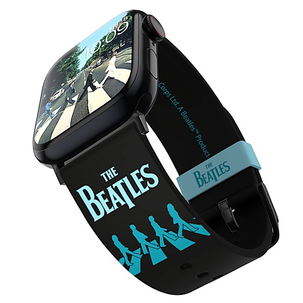

# The Lost Decca Audition Tapes

By **The Beatles**

## Album Data

- **Catalog:** Beets
- **Format:** Digital, Album
- **Album:** The Lost Decca Audition Tapes
- **Artist:** The Beatles
- **Albumartist:** The Beatles
- **Genre:** Rock
- **MusicBrainz Album Artist ID:** 
- **MusicBrainz Album ID:** 
- **MusicBrainz Release Group ID:** 
- **Year:** 2016
- **Catalog #:** 
- **Label:** 
- **Total Tracks:** 14

## Album Tracks

### Track 02 - All I've Got To Do

- **Artist:** The Beatles
- **Format:** ALAC
- **Genre:** Rock
- **Length:** 2:02
- **MusicBrainz Track ID:** [385bab1b-6c77-40f9-83b1-58b964f6c335](https://musicbrainz.org/recording/385bab1b-6c77-40f9-83b1-58b964f6c335)
- **Title:** All I've Got To Do
- **Track:** 02
- **Year:** 1963

### Track 08 - Roll Over Beethoven (It's The Beatles)

- **Artist:** The Beatles
- **Format:** ALAC
- **Genre:** Pop Rock
- **Length:** 2:45
- **MusicBrainz Track ID:** [59fae7a0-3cbc-454c-b7f3-b14687589cbb](https://musicbrainz.org/recording/59fae7a0-3cbc-454c-b7f3-b14687589cbb)
- **Title:** Roll Over Beethoven (It's The Beatles)
- **Track:** 08
- **Year:** 1963

### Track 12 - Devil In Her Heart

- **Artist:** The Beatles
- **Format:** ALAC
- **Genre:** Rock And Roll
- **Length:** 2:26
- **MusicBrainz Track ID:** [c63da831-a3e7-47fc-b605-e162499e8d5e](https://musicbrainz.org/recording/c63da831-a3e7-47fc-b605-e162499e8d5e)
- **Title:** Devil In Her Heart
- **Track:** 12
- **Year:** 1963

### Track 13 - Not A Second Time

- **Artist:** The Beatles
- **Format:** ALAC
- **Genre:** Pop Rock
- **Length:** 2:06
- **MusicBrainz Track ID:** [0785d239-ecf8-4d9d-afa6-fe136163a8f9](https://musicbrainz.org/recording/0785d239-ecf8-4d9d-afa6-fe136163a8f9)
- **Title:** Not A Second Time
- **Track:** 13
- **Year:** 1963

