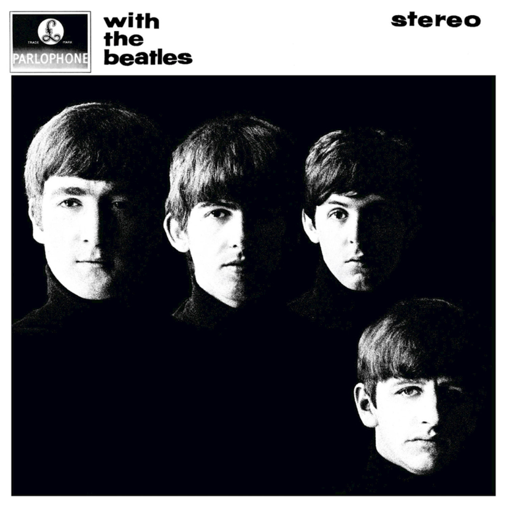

# With The Beatles

By **The Beatles**

## Album Data

- **Catalog:** Beets
- **Format:** Digital, Album
- **Album:** With The Beatles
- **Artist:** The Beatles
- **Albumartist:** The Beatles
- **Genre:** Rock And Roll
- **MusicBrainz Album Artist ID:** [b10bbbfc-cf9e-42e0-be17-e2c3e1d2600d](https://musicbrainz.org/artist/b10bbbfc-cf9e-42e0-be17-e2c3e1d2600d)
- **MusicBrainz Album ID:** [8f08277d-61fb-496b-b5cd-78ec3467e0fb](https://musicbrainz.org/release/8f08277d-61fb-496b-b5cd-78ec3467e0fb)
- **MusicBrainz Release Group ID:** [a63dc65f-09f2-359b-a10e-648f00ecd96c](https://musicbrainz.org/release-group/a63dc65f-09f2-359b-a10e-648f00ecd96c)
- **Year:** 2015
- **Catalog #:** 
- **Label:** 
- **Total Tracks:** 27

## Album Tracks

### Track 22 - Get Back

- **Artist:** Billy Preston and The Beatles
- **Format:** MP3
- **Genre:** Rock
- **Length:** 3:11
- **MusicBrainz Track ID:** 
- **Title:** Get Back
- **Track:** 22
- **Year:** 2015

### Track 12 - Day Tripper

- **Artist:** The Beatles
- **Format:** MP3
- **Genre:** Rock
- **Length:** 2:49
- **MusicBrainz Track ID:** 
- **Title:** Day Tripper
- **Track:** 12
- **Year:** 2015

### Track 13 - We Can Work It Out

- **Artist:** The Beatles
- **Format:** MP3
- **Genre:** Rock
- **Length:** 2:15
- **MusicBrainz Track ID:** 
- **Title:** We Can Work It Out
- **Track:** 13
- **Year:** 2015

### Track 14 - Paperback Writer

- **Artist:** The Beatles
- **Format:** MP3
- **Genre:** Rock
- **Length:** 2:18
- **MusicBrainz Track ID:** 
- **Title:** Paperback Writer
- **Track:** 14
- **Year:** 2015

### Track 15 - Yellow Submarine

- **Artist:** The Beatles
- **Format:** MP3
- **Genre:** Psychedelic Rock
- **Length:** 2:38
- **MusicBrainz Track ID:** 
- **Title:** Yellow Submarine
- **Track:** 15
- **Year:** 2015

### Track 16 - Eleanor Rigby

- **Artist:** The Beatles
- **Format:** MP3
- **Genre:** Rock
- **Length:** 2:05
- **MusicBrainz Track ID:** 
- **Title:** Eleanor Rigby
- **Track:** 16
- **Year:** 2015

### Track 17 - Penny Lane

- **Artist:** The Beatles
- **Format:** MP3
- **Genre:** Rock
- **Length:** 3:00
- **MusicBrainz Track ID:** 
- **Title:** Penny Lane
- **Track:** 17
- **Year:** 2015

### Track 18 - All You Need Is Love

- **Artist:** The Beatles
- **Format:** MP3
- **Genre:** Rock
- **Length:** 3:47
- **MusicBrainz Track ID:** 
- **Title:** All You Need Is Love
- **Track:** 18
- **Year:** 2015

### Track 19 - Hello, Goodbye

- **Artist:** The Beatles
- **Format:** MP3
- **Genre:** Rock
- **Length:** 3:27
- **MusicBrainz Track ID:** 
- **Title:** Hello, Goodbye
- **Track:** 19
- **Year:** 2015

### Track 20 - Lady Madonna

- **Artist:** The Beatles
- **Format:** MP3
- **Genre:** Rock And Roll
- **Length:** 2:16
- **MusicBrainz Track ID:** 
- **Title:** Lady Madonna
- **Track:** 20
- **Year:** 2015

### Track 21 - Hey Jude

- **Artist:** The Beatles
- **Format:** MP3
- **Genre:** Rock
- **Length:** 7:05
- **MusicBrainz Track ID:** 
- **Title:** Hey Jude
- **Track:** 21
- **Year:** 2015

### Track 23 - The Ballad Of John And Yoko

- **Artist:** The Beatles
- **Format:** MP3
- **Genre:** Rock
- **Length:** 2:59
- **MusicBrainz Track ID:** 
- **Title:** The Ballad Of John And Yoko
- **Track:** 23
- **Year:** 2015

### Track 24 - Something

- **Artist:** The Beatles
- **Format:** MP3
- **Genre:** Rock
- **Length:** 3:01
- **MusicBrainz Track ID:** 
- **Title:** Something
- **Track:** 24
- **Year:** 2015

### Track 25 - Come Together

- **Artist:** The Beatles
- **Format:** MP3
- **Genre:** Rock
- **Length:** 4:18
- **MusicBrainz Track ID:** 
- **Title:** Come Together
- **Track:** 25
- **Year:** 2015

### Track 26 - Let It Be

- **Artist:** The Beatles
- **Format:** MP3
- **Genre:** Rock
- **Length:** 3:50
- **MusicBrainz Track ID:** 
- **Title:** Let It Be
- **Track:** 26
- **Year:** 2015

### Track 27 - The Long And Winding Road

- **Artist:** The Beatles
- **Format:** MP3
- **Genre:** Pop Rock
- **Length:** 3:39
- **MusicBrainz Track ID:** 
- **Title:** The Long And Winding Road
- **Track:** 27
- **Year:** 2015

## See also

- [1 [2015 Version]](1_[2015_Version].md)
- [1](1.md)
- [Abbey Road](Abbey_Road.md)
- [Anthology 1 [Disc 1]](Anthology_1_[Disc_1].md)
- [Anthology 1 [Disc 2]](Anthology_1_[Disc_2].md)
- [Anthology 2 [Disc 2]](Anthology_2_[Disc_2].md)
- [Australia And Japan](Australia_And_Japan.md)
- [Beatles for Sale](Beatles_for_Sale.md)
- [Blackpool And Paris 1964-`65](Blackpool_And_Paris_1964-`65.md)
- [Help](Help.md)
- [Let It Be](Let_It_Be.md)
- [Live at the BBC](Live_at_the_BBC.md)
- [Love](Love.md)
- [New York, Miami And Philadelphia - The First And Second U.S. Tours](New_York__Miami_And_Philadelphia_-_The_First_And_Second_US_Tours.md)
- [Past Masters](Past_Masters.md)
- [Past Masters, Vol. 1](Past_Masters__Vol_1.md)
- [Past Masters Volume One](Past_Masters_Volume_One.md)
- [Please Please Me](Please_Please_Me.md)
- [Real Love [US Single]](Real_Love_[US_Single].md)
- [Revolver](Revolver.md)
- [Rubber Soul](Rubber_Soul.md)
- [Sgt. Pepper’s Lonely Hearts Club Band](Sgt_Pepper’s_Lonely_Hearts_Club_Band.md)
- [The Beatles 1](The_Beatles_1.md)
- [The Beatles (White Album)](The_Beatles_White_Album.md)
- [The Lost Abbey Road Tapes 1962-'64](The_Lost_Abbey_Road_Tapes_1962-64.md)
- [The Lost BBC Tapes and Much More...](The_Lost_BBC_Tapes_and_Much_More.md)
- [The Lost Decca Audition Tapes](The_Lost_Decca_Audition_Tapes.md)
- [With The Beatles [2009 Stereo Remaster]](With_The_Beatles_[2009_Stereo_Remaster].md)
- [CD: 1 (Cd & 2 Bluray Edition) (Disc 1)](../../CD/The_Beatles/1_Cd_and_2_Bluray_Edition_Disc_1.md)
- [CD: ](../../CD/The_Beatles/The_Beatles.md)
- [Roon: 1 (Remastered)](../../Roon/The_Beatles/1_Remastered.md)
- [Roon: Abbey Road (Super Deluxe Edition)](../../Roon/The_Beatles/Abbey_Road_Super_Deluxe_Edition.md)
- [Roon: A Hard Day's Night](../../Roon/The_Beatles/A_Hard_Days_Night.md)
- [Roon: Anthology 1](../../Roon/The_Beatles/Anthology_1.md)
- [Roon: Anthology 2](../../Roon/The_Beatles/Anthology_2.md)
- [Roon: Anthology 3](../../Roon/The_Beatles/Anthology_3.md)
- [Roon: Beatles for Sale](../../Roon/The_Beatles/Beatles_for_Sale.md)
- [Roon: Help!](../../Roon/The_Beatles/Help!.md)
- [Roon: Let It Be (Super Deluxe)](../../Roon/The_Beatles/Let_It_Be_Super_Deluxe.md)
- [Roon: Love](../../Roon/The_Beatles/Love.md)
- [Roon: Magical Mystery Tour (Remastered)](../../Roon/The_Beatles/Magical_Mystery_Tour_Remastered.md)
- [Roon: Past Masters](../../Roon/The_Beatles/Past_Masters.md)
- [Roon: Please Please Me](../../Roon/The_Beatles/Please_Please_Me.md)
- [Roon: Revolver (Remastered)](../../Roon/The_Beatles/Revolver_Remastered.md)
- [Roon: Revolver (Super Deluxe)](../../Roon/The_Beatles/Revolver_Super_Deluxe.md)
- [Roon: Rubber Soul (Remastered)](../../Roon/The_Beatles/Rubber_Soul_Remastered.md)
- [Roon: Sgt. Pepper's Lonely Hearts Club Band (Deluxe Anniversary Edition)](../../Roon/The_Beatles/Sgt_Peppers_Lonely_Hearts_Club_Band_Deluxe_Anniversary_Edition.md)
- [Roon: Sgt. Pepper's Lonely Hearts Club Band (Super Deluxe Edition)](../../Roon/The_Beatles/Sgt_Peppers_Lonely_Hearts_Club_Band_Super_Deluxe_Edition.md)
- [Roon: The Beatles 1962 - 1966 (Remastered)](../../Roon/The_Beatles/The_Beatles_1962_-_1966_Remastered.md)
- [Roon: The Beatles 1967 - 1970 (Remastered)](../../Roon/The_Beatles/The_Beatles_1967_-_1970_Remastered.md)
- [Roon: The Beatles (White Album) [Super Deluxe] (White Album / Super Deluxe)](../../Roon/The_Beatles/The_Beatles_White_Album_[Super_Deluxe]_White_Album_-_Super_Deluxe.md)
- [Roon: With The Beatles (Remastered)](../../Roon/The_Beatles/With_The_Beatles_Remastered.md)
- [Vinyl: Beatles '65](../../Vinyl/The_Beatles/Beatles_65.md)
- [Vinyl: Help! In Concert](../../Vinyl/The_Beatles/Help!_In_Concert.md)
- [Vinyl: Help! (Original Motion Picture Soundtrack)](../../Vinyl/The_Beatles/Help!_Original_Motion_Picture_Soundtrack.md)
- [Vinyl: Hey Jude](../../Vinyl/The_Beatles/Hey_Jude.md)
- [Vinyl: Introducing... The Beatles](../../Vinyl/The_Beatles/Introducing_The_Beatles.md)
- [Vinyl: Let It Be](../../Vinyl/The_Beatles/Let_It_Be.md)
- [Vinyl: Live In Paris '65](../../Vinyl/The_Beatles/Live_In_Paris_65.md)
- [Vinyl: Magical Mystery Tour](../../Vinyl/The_Beatles/Magical_Mystery_Tour.md)
- [Vinyl: Something New](../../Vinyl/The_Beatles/Something_New.md)
- [Vinyl: ](../../Vinyl/The_Beatles/The_Beatles_index.md)
- [Vinyl: The Beatles](../../Vinyl/The_Beatles/The_Beatles.md)
- [Vinyl: The Beatles' Second Album](../../Vinyl/The_Beatles/The_Beatles_Second_Album.md)
