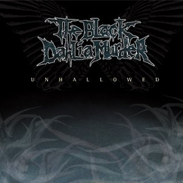

# Unhallowed

By **The Black Dahlia Murder**

## Album Data

- **Catalog:** Beets
- **Format:** Digital, Album
- **Album:** Unhallowed
- **Artist:** The Black Dahlia Murder
- **Albumartist:** The Black Dahlia Murder
- **Genre:** melodic death metal
- **MusicBrainz Album Artist ID:** [https](https://musicbrainz.org/artist/https)
- **MusicBrainz Album ID:** [https](https://musicbrainz.org/release/https)
- **MusicBrainz Release Group ID:** 
- **Year:** 2003
- **Catalog #:** 
- **Label:** Metal Blade Records
- **Total Tracks:** 10

## Album Tracks

### Track 01 - Unhallowed

- **Artist:** The Black Dahlia Murder
- **Format:** AAC
- **Genre:** melodic death metal
- **Length:** 1:59
- **MusicBrainz Track ID:** [https](https://musicbrainz.org/recording/https)
- **Title:** Unhallowed
- **Track:** 01
- **Year:** 2003

### Track 02 - Funeral Thirst

- **Artist:** The Black Dahlia Murder
- **Format:** AAC
- **Genre:** melodic death metal
- **Length:** 3:55
- **MusicBrainz Track ID:** [https](https://musicbrainz.org/recording/https)
- **Title:** Funeral Thirst
- **Track:** 02
- **Year:** 2003

### Track 03 - Elder Misanthropy

- **Artist:** The Black Dahlia Murder
- **Format:** AAC
- **Genre:** melodic death metal
- **Length:** 2:34
- **MusicBrainz Track ID:** [https](https://musicbrainz.org/recording/https)
- **Title:** Elder Misanthropy
- **Track:** 03
- **Year:** 2003

### Track 04 - Contagion

- **Artist:** The Black Dahlia Murder
- **Format:** AAC
- **Genre:** melodic death metal
- **Length:** 3:23
- **MusicBrainz Track ID:** [https](https://musicbrainz.org/recording/https)
- **Title:** Contagion
- **Track:** 04
- **Year:** 2003

### Track 05 - When the Last Grave Has Emptied

- **Artist:** The Black Dahlia Murder
- **Format:** AAC
- **Genre:** melodic death metal
- **Length:** 3:11
- **MusicBrainz Track ID:** [https](https://musicbrainz.org/recording/https)
- **Title:** When the Last Grave Has Emptied
- **Track:** 05
- **Year:** 2003

### Track 06 - Thy Horror Cosmic

- **Artist:** The Black Dahlia Murder
- **Format:** AAC
- **Genre:** melodic death metal
- **Length:** 2:55
- **MusicBrainz Track ID:** [https](https://musicbrainz.org/recording/https)
- **Title:** Thy Horror Cosmic
- **Track:** 06
- **Year:** 2003

### Track 07 - The Blackest Incarnation

- **Artist:** The Black Dahlia Murder
- **Format:** AAC
- **Genre:** melodic death metal
- **Length:** 4:43
- **MusicBrainz Track ID:** [https](https://musicbrainz.org/recording/https)
- **Title:** The Blackest Incarnation
- **Track:** 07
- **Year:** 2003

### Track 08 - Hymn for the Wretched

- **Artist:** The Black Dahlia Murder
- **Format:** AAC
- **Genre:** melodic death metal
- **Length:** 4:18
- **MusicBrainz Track ID:** [https](https://musicbrainz.org/recording/https)
- **Title:** Hymn for the Wretched
- **Track:** 08
- **Year:** 2003

### Track 09 - Closed Casket Requiem

- **Artist:** The Black Dahlia Murder
- **Format:** AAC
- **Genre:** melodic death metal
- **Length:** 4:25
- **MusicBrainz Track ID:** [https](https://musicbrainz.org/recording/https)
- **Title:** Closed Casket Requiem
- **Track:** 09
- **Year:** 2003

### Track 10 - Apex

- **Artist:** The Black Dahlia Murder
- **Format:** AAC
- **Genre:** melodic death metal
- **Length:** 5:05
- **MusicBrainz Track ID:** [https](https://musicbrainz.org/recording/https)
- **Title:** Apex
- **Track:** 10
- **Year:** 2003

