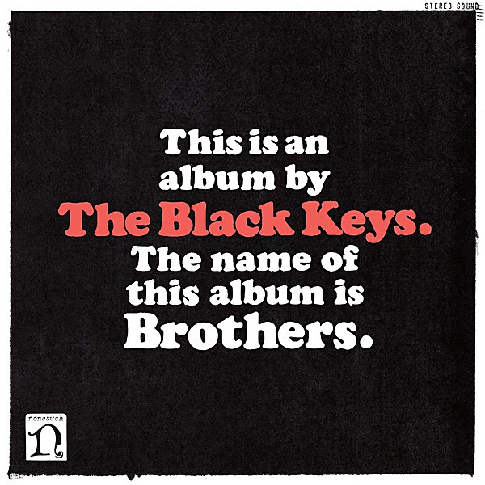

# Brothers

By **The Black Keys**

## Album Data

- **Catalog:** Beets
- **Format:** Digital, Album
- **Album:** Brothers
- **Artist:** The Black Keys
- **Albumartist:** The Black Keys
- **Genre:** Indie Rock
- **MusicBrainz Album Artist ID:** [d15721d8-56b4-453d-b506-fc915b14cba2](https://musicbrainz.org/artist/d15721d8-56b4-453d-b506-fc915b14cba2)
- **MusicBrainz Album ID:** [710a1e4f-7207-4b06-82e1-96f926c9076f](https://musicbrainz.org/release/710a1e4f-7207-4b06-82e1-96f926c9076f)
- **MusicBrainz Release Group ID:** [2a2b851c-bba6-4584-80c0-19af4a55e286](https://musicbrainz.org/release-group/2a2b851c-bba6-4584-80c0-19af4a55e286)
- **Year:** 2010
- **Catalog #:** 520266-2
- **Label:** Nonesuch
- **Total Tracks:** 15

## Album Tracks

### Track 01 - Everlasting Light

- **Artist:** The Black Keys
- **Format:** MP3
- **Genre:** Indie Rock
- **Length:** 3:23
- **MusicBrainz Track ID:** [0afdf0bb-cf31-456b-814e-afc42b26da4b](https://musicbrainz.org/recording/0afdf0bb-cf31-456b-814e-afc42b26da4b)
- **Title:** Everlasting Light
- **Track:** 01
- **Year:** 2010

### Track 02 - Next Girl

- **Artist:** The Black Keys
- **Format:** MP3
- **Genre:** Indie Rock
- **Length:** 3:18
- **MusicBrainz Track ID:** [9a97edb0-a53a-4475-9e67-a5861ea85ba0](https://musicbrainz.org/recording/9a97edb0-a53a-4475-9e67-a5861ea85ba0)
- **Title:** Next Girl
- **Track:** 02
- **Year:** 2010

### Track 03 - Tighten Up

- **Artist:** The Black Keys
- **Format:** MP3
- **Genre:** Indie Rock
- **Length:** 3:31
- **MusicBrainz Track ID:** [f5e8287e-e3e0-4f18-8d89-837e0dbc1bb4](https://musicbrainz.org/recording/f5e8287e-e3e0-4f18-8d89-837e0dbc1bb4)
- **Title:** Tighten Up
- **Track:** 03
- **Year:** 2010

### Track 04 - Howlin’ for You

- **Artist:** The Black Keys
- **Format:** MP3
- **Genre:** Indie Rock
- **Length:** 3:11
- **MusicBrainz Track ID:** [1e22b22b-92fd-4879-b4d9-28ca0fc27f94](https://musicbrainz.org/recording/1e22b22b-92fd-4879-b4d9-28ca0fc27f94)
- **Title:** Howlin’ for You
- **Track:** 04
- **Year:** 2010

### Track 05 - She’s Long Gone

- **Artist:** The Black Keys
- **Format:** MP3
- **Genre:** Goregrind
- **Length:** 3:06
- **MusicBrainz Track ID:** [70b83cd0-f756-4370-ab3d-75da026bb86e](https://musicbrainz.org/recording/70b83cd0-f756-4370-ab3d-75da026bb86e)
- **Title:** She’s Long Gone
- **Track:** 05
- **Year:** 2010

### Track 06 - Black Mud

- **Artist:** The Black Keys
- **Format:** MP3
- **Genre:** Indie Rock
- **Length:** 2:09
- **MusicBrainz Track ID:** [040f8510-89ce-4607-906d-3424b08cbf8e](https://musicbrainz.org/recording/040f8510-89ce-4607-906d-3424b08cbf8e)
- **Title:** Black Mud
- **Track:** 06
- **Year:** 2010

### Track 07 - The Only One

- **Artist:** The Black Keys
- **Format:** MP3
- **Genre:** Indie Rock
- **Length:** 5:00
- **MusicBrainz Track ID:** [a3acb043-d53f-4f6b-b0bc-0263edc69243](https://musicbrainz.org/recording/a3acb043-d53f-4f6b-b0bc-0263edc69243)
- **Title:** The Only One
- **Track:** 07
- **Year:** 2010

### Track 08 - Too Afraid to Love You

- **Artist:** The Black Keys
- **Format:** MP3
- **Genre:** Indie Rock
- **Length:** 3:24
- **MusicBrainz Track ID:** [b4c05099-5776-42b7-9151-f33eceb71c88](https://musicbrainz.org/recording/b4c05099-5776-42b7-9151-f33eceb71c88)
- **Title:** Too Afraid to Love You
- **Track:** 08
- **Year:** 2010

### Track 09 - Ten Cent Pistol

- **Artist:** The Black Keys
- **Format:** MP3
- **Genre:** Indie Rock
- **Length:** 4:29
- **MusicBrainz Track ID:** [bf60aa7a-906f-473d-8c71-5f97a9526dc0](https://musicbrainz.org/recording/bf60aa7a-906f-473d-8c71-5f97a9526dc0)
- **Title:** Ten Cent Pistol
- **Track:** 09
- **Year:** 2010

### Track 10 - Sinister Kid

- **Artist:** The Black Keys
- **Format:** MP3
- **Genre:** Psychedelic Rock
- **Length:** 3:44
- **MusicBrainz Track ID:** [667c30cf-09c2-4ae3-8c3c-a3afc9edfc69](https://musicbrainz.org/recording/667c30cf-09c2-4ae3-8c3c-a3afc9edfc69)
- **Title:** Sinister Kid
- **Track:** 10
- **Year:** 2010

### Track 11 - The Go Getter

- **Artist:** The Black Keys
- **Format:** MP3
- **Genre:** Stoner Rock
- **Length:** 3:36
- **MusicBrainz Track ID:** [2ce6b348-9a3c-4dbe-83d4-b8b9e55d1b0b](https://musicbrainz.org/recording/2ce6b348-9a3c-4dbe-83d4-b8b9e55d1b0b)
- **Title:** The Go Getter
- **Track:** 11
- **Year:** 2010

### Track 12 - I’m Not the One

- **Artist:** The Black Keys
- **Format:** MP3
- **Genre:** Goregrind
- **Length:** 3:49
- **MusicBrainz Track ID:** [ecf13da3-38f0-4d1a-87b5-029386e66731](https://musicbrainz.org/recording/ecf13da3-38f0-4d1a-87b5-029386e66731)
- **Title:** I’m Not the One
- **Track:** 12
- **Year:** 2010

### Track 13 - Unknown Brother

- **Artist:** The Black Keys
- **Format:** MP3
- **Genre:** Indie Rock
- **Length:** 3:59
- **MusicBrainz Track ID:** [0fcbbdf4-e976-4a42-9974-a53f77fbb15b](https://musicbrainz.org/recording/0fcbbdf4-e976-4a42-9974-a53f77fbb15b)
- **Title:** Unknown Brother
- **Track:** 13
- **Year:** 2010

### Track 14 - Never Gonna Give You Up

- **Artist:** The Black Keys
- **Format:** MP3
- **Genre:** Indie Rock
- **Length:** 3:38
- **MusicBrainz Track ID:** [db9d07c4-af44-4eff-8e35-56afc300242c](https://musicbrainz.org/recording/db9d07c4-af44-4eff-8e35-56afc300242c)
- **Title:** Never Gonna Give You Up
- **Track:** 14
- **Year:** 2010

### Track 15 - These Days

- **Artist:** The Black Keys
- **Format:** MP3
- **Genre:** Indie Rock
- **Length:** 5:11
- **MusicBrainz Track ID:** [c879e57a-d068-4c27-a509-0663cc528425](https://musicbrainz.org/recording/c879e57a-d068-4c27-a509-0663cc528425)
- **Title:** These Days
- **Track:** 15
- **Year:** 2010

## See also

- [Roon: Brothers (Deluxe Remastered Anniversary Edition)](../../Roon/The_Black_Keys/Brothers_Deluxe_Remastered_Anniversary_Edition.md)
- [Roon: Dropout Boogie](../../Roon/The_Black_Keys/Dropout_Boogie.md)
- [Roon: El Camino](../../Roon/The_Black_Keys/El_Camino.md)
- [Roon: Let's Rock](../../Roon/The_Black_Keys/Lets_Rock.md)
